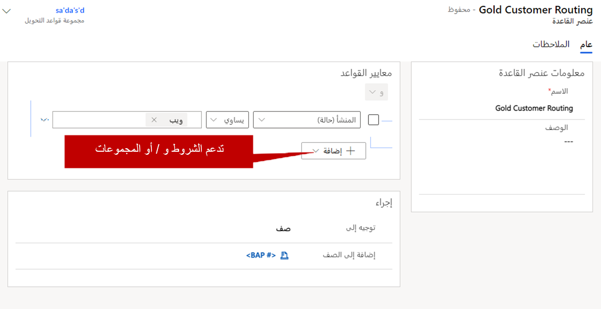

على الرغم من أنه يمكن تعيين عناصر قائمة الانتظار يدويًا إلى قوائم الانتظار، إلا أنه غالبًا ما يكون استخدام المنطق المحدد مسبقًا أكثر فاعلية لوضع العناصر في قوائم الانتظار. على سبيل المثال، إذا قام المندوب بوضع علامة على حالة التصعيد، يجب توجيه الحالة إلى قائمة انتظار التصعيد المناسبة.

يتيح لك Microsoft Dynamics 365 إمكانية إنشاء مجموعات قواعد توجيه محددة مسبقًا توجه الحالات إلى صفوف انتظار مختلفة، استنادًا إلى المنطق المحدد في مجموعة القواعد. لتحديد مجموعات قواعد التوجيه، افتح منطقة "إدارة الخدمة" ثم حدد **مجموعات قواعد التوجيه**.

تقترن مجموعات قواعد التحويل بجدول الحالة. على الرغم من أنه يمكنك إعداد نفس نوع السلوك للجداول الأخرى التي تم إعدادها لاستخدام صفوف الانتظار، إلا أن هذا المنطق يتطلب استخدام بعض سيناريوهات الأتمتة الأخرى، مثل مهام سير العمل أو Power Automate.

عند إنشاء قاعدة لأول مرة، يكون تحديد اسم للقاعدة. بعد تحديد اسم للقاعدة وحفظها، يمكن إضافة أصناف إلى القاعدة. تحدد أصناف القاعدة "ماذا" و"أين" لمجموعة القواعد. تحتوي مجموعة قواعد التوجيه عادة على أصناف قاعدة متعددة تقوم بتقييم سجلات الحالة وتوجيهها في النظام.

على سبيل المثال، قد تحتوي مجموعة قواعد التحويل المسماة *توجيه الحالة* على أصناف من القاعدة التالية:

-   **المسار الذهبي:** يمكنك توجيه أي حالة تتميز بمستوى خدمة ذهبي إلى صف الانتظار الذهبية.

-   **المسار الفضي:** يمكنك توجيه أي حالة تتميز بمستوى خدمة فضي إلى صف الانتظار الذهبية.

-   **المسار الفضي:** يمكنك توجيه أي حالة تتميز بمستوى خدمة فضي إلى صف الانتظار الفضية.

يحتوي كل صنف قاعدة على قسمين: **الحالات الشريطة If** **والحالات الشرطية Then**.

-   **الحالات الشريطة If:** حدد الحالات معينة تستخدم لتحديد ما إذا كان صنف القاعدة ينطبق أم لا. يمكن للحالات تقييم الحقول من سجل الحالة، أو من السجلات ذات الصلة مثل الحساب المرتبط. يمكن استخدام حالات "و" أو "أو" متعددة في صنف قاعدة واحد. (بشكل افتراضي، تكون الحالات هي حالات "و".)

-   **الحالات التالية:** حدد المكان الذي يجب توجيه الصنف إليه:

    -   **صف الانتظار:** يمكنك توجيه الصنف إلى صف انتظار معينة (عامة أو خاصة).

    -   **المستخدم/الفريق:** يمكنك توجيه الصنف إلى مستخدم معين أو فريق.

يتم تطبيق أصناف القاعدة بالترتيب المحدد في مجموعة القواعد. يتم تطبيق أصناف قاعدة المطابقة الأول التي تم العثور عليها ضمن الحالة. لا تقوم مجموعة القواعد بتقييم أصناف القاعدة المتبقية لمحاولة إيجاد تطابق أفضل. نوصي بشدة بوضع عناصر قاعدة أكثر تحديدًا بمستوى أعلى ضمن مجموعة القواعد، بحيث يتم التحقق منها أولاً.

على سبيل المثال، في الصورة التالية، تشير أصناف قاعدة "التصعيد" و"الذهبية" إلى مستوى الخدمة الذهبية. نظرًا لأن أصناف قاعدة التصعيد ذات أولوية عالية، يجب تقييمها قبل القاعدة الذهبية. وإلا، لن يتم التحقق من صنف قاعدة التصعيد.

يمكنك التحكم في الترتيب الذي يتم فيه إيداع أصناف القاعدة باستخدام السهمين لأعلى ولأسفل ضمن الشبكة الفرعية لأصناف القاعدة. بعد تحديد كافة أصناف القاعدة لمجموعة قواعد معينة، يمكنك تنشيط القاعدة. بعد تنشيط القاعدة، لا يمكنك تغييرها إلا إذا قمت بإلغاء تنشيطها أولاً.

> [!IMPORTANT]
> على الرغم من أنه يمكنك تحديد مجموعات قواعد متعددة في Dynamics 365، إلا أن مجموعة قواعد واحدة فقط يمكن أن تكون نشطة في كل مرة. تأكد من تحديد أصناف كافية للقاعدة في مجموعة القواعد لتغطية جميع سيناريوهات التوجيه المحتملة التي تحتاج إلى دعم.

بعد أن يتم تحديد مجموعة قواعد التوجيه وتنشيطها، يمكن تطبيقها على حالة بإحدى طريقتين:

-   **يدويًا، باستخدام الزر "حفظ وتوجيه":** عندما يحدد المندوب الزر **حفظ وتوجيه** على شريط الأوامر، يتم تطبيق مجموعة قواعد التوجيه، ثم يتم توجيه الحالة إلى صف الانتظار الأكثر ملاءمة.

-   **عند إنشاء السجلات تلقائيا:** عندما يتم إنشاء حالة تلقائيًا (على سبيل المثال، من خلال سير العمل أو قاعدة إنشاء سجل أو Power Automate)، يقوم Dynamics 365 تلقائيًا بتطبيق مجموعة قاعدة التوجيه، ثم يتم توجيه الحالة إلى صف الانتظار الأكثر ملاءمة.

