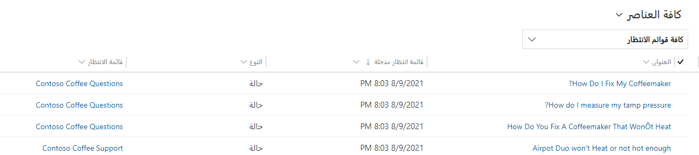

في الآونة الأخيرة، كان هناك تدفق للحالات التي كانت هناك فيها مشكلات تتعلق بحالات محددة تحتاج إلى تصعيد. إنك تقرر زيادة الفعالية إذا أمكن توجيه الحالات إلى الصفوف الذهبية أو الفضية أو البرونزية استنادًا إلى مستوى الخدمة في الحالة.

## الأهداف التعليمية

في نهاية هذه التمارين، ستتمكن من تحقيق الأهداف التالية:

-   إنشاء قاعدة التحويل
-   جعل تخصيصات الكيان الضرورية مطلوبة
-   استهلاك قاعدة التحويل في التطبيق.

الوقت المقدر لإكمال هذا التمرين العملي: 15 إلى 20 دقيقة

### الخطوات عالية المستوى:

-   إنشاء قاعدة تحويل للحالة.
-   إنشاء أصناف لقاعدة التحويل عن طريق تحديد معايير لـ:
    -   توجيه الحالات الذهبية إلى الصف الذهبي
    -   توجيه الحالات الفضية إلى الصف الفضي
    -   توجيه الحالات البرونزية إلى الصف البرونزي
-   تحقق من أن قاعدة التحويل تعمل بشكل صحيح.

### الخطوات التفصيلية:

#### إنشاء قاعدة تحويل للحالة:

1. إذا لزم الأمر، على شريط تنقل التطبيق الرئيس، انقر فوق محدد القائمة المنسدلة بجانب Dynamics 365، ثم انقر فوق Dynamics 365 - تخصيص.
2. من خيار الإعدادات، انقر على إدارة الخدمة.
3. حدد مجموعات قواعد التحويل من قسم إعدادات الحالة مع إنشاء السجل وتحديث القواعد.
4. من شريط الأوامر، انقر على جديد لإنشاء مجموعة قواعد تحويل جديدة.
5. أدخل اسم مجموعة قواعد التحويل الجديدة لتوجيه مستوى الخدمة.
6. انقر على زر حفظ.
7.  ضمن الشبكة الفرعية عناصر القواعد، انقر فوق الزر [+] لإضافة عنصر جديد.
8.  في حقل الاسم، اكتب توجيه الحالات الذهبية.
9.  ضمن قسم معايير القاعدة، أضف ما إذا كانت معايير الشروط:
    -   حدد كيان الحالة.
    -   اختر حقل مستوى الخدمة.
    -   قم بتعيين العامل إلى يساوي.
    -   قم بتعيين القيمة إلى ذهب.
10. ضمن قسم معايير القاعدة، أضف معايير الشروط الآتية:
    -   في حقل تحويل إلى، انقر فوق صف.
    -   بالنسبة إلى حقل إضافة إلى صف، حدد الصف الذهبي.

يجب أن يشبه عنصر القاعدة المكتمل الصورة أدناه:

11. انقر فوق حفظ وإغلاق لإكمال عنصر القاعدة.
12. ضمن الشبكة الفرعية عناصر القواعد، انقر فوق الزر [+] لإضافة عنصر جديد.
13. في حقل الاسم، اكتب توجيه الحالات الفضية.
14. ضمن قسم معايير القاعدة، أضف ما إذا كانت معايير الشروط:
    -   حدد كيان الحالة.
    -   اختر حقل مستوى الخدمة.
    -   قم بتعيين العامل إلى يساوي.
    -   قم بتعيين القيمة إلى فضة.
15. ضمن قسم معايير القاعدة، أضف معايير الشروط الآتية:
    -   في حقل تحويل إلى، انقر فوق صف.
    -   بالنسبة إلى حقل إضافة إلى صف، حدد الصف الفضي.

يجب أن يشبه عنصر القاعدة المكتمل الصورة أدناه:

16. انقر فوق حفظ وإغلاق لإكمال عنصر القاعدة.
17. ضمن الشبكة الفرعية عناصر القواعد، انقر فوق الزر [+] لإضافة عنصر جديد.
18. في حقل الاسم، اكتب توجيه الحالات البرونزية. 
19. ضمن قسم معايير القاعدة، أضف ما إذا كانت معايير الشروط:
    -   حدد كيان الحالة.
    -   اختر حقل مستوى الخدمة.
    -   قم بتعيين العامل إلى يساوي.
    -   قم بتعيين القيمة إلى برونز.
20. ضمن قسم معايير القاعدة، أضف معايير الشروط الآتية:
    -   في حقل تحويل إلى، انقر فوق صف.
    -   بالنسبة إلى حقل إضافة إلى صف، حدد الصف البرونزي.

يجب أن يشبه عنصر القاعدة المكتمل الصورة أدناه:

21. انقر فوق حفظ وإغلاق لإكمال عنصر القاعدة.
22. انقر فوق تنشيط لتأكيد التنشيط.

#### تخصيص حالة لنموذج العرض التفاعلي لعرض مستوى خدمة الحالات.

1. انتقل إلى الإعدادات \> التخصيصات \> تخصيص النظام
2. في الحل الافتراضي، قم بتوسيع الكيانات.
3. قم بتوسيع كيان الحالة، وانقر فوق النماذج
4. افتح نموذج الحالة للتجربة التفاعلية

5. في مستكشف الحقول، حدد موقع حقل مستوى الخدمة، واسحبه لوضعه أسفل حقل الاستحقاق في النموذج.

6. انقر فوق رمز الحفظ لحفظ التغييرات في النموذج.
7. انقر فوق رمز النشر لنشر التغييرات في النموذج.
8. أغلق الروبوت ونموذج حالة التجربة التفاعلية والحل الافتراضي.

#### تحقق من أن قاعدة التحويل تعمل بشكل صحيح

1.  إذا لزم الأمر، على شريط تنقل التطبيق الرئيس، انقر فوق محدد القائمة المنسدلة بجانب Dynamics 365، ثم انقر فوق مركز خدمة العملاء
2.  باستخدام خريطة الموقع، حدد رمز مفتاح الربط للانتقال إلى الحالات.
3.  في شريط الأوامر، انقر فوق زر حالة جديدة.
4.  أكمل الحالة على النحو الآتي:
    -   عنوان الحالة: مشكلة تسليم محلي
    -   العميل: A. Datum Corporation (عينة)
    -   الموضوع: التسليم
    -   نوع الحالة: مشكلة
    -   الأصل: الهاتف
    -   مستوى الخدمة: ذهبي

5.  انقر فوق "حفظ".
6.  انقر على زر حفظ وتوجيه في شريط الأوامر.
7.  انقر على توجيه لتأكيد رغبتك في تطبيق قاعدة التوجيه الجديدة على هذه الحالة.
8.  باستخدام خريطة الموقع، انتقل إلى الصفوف.
9.  بالنسبة إلى حقل الصف، غير الصف إلى ذهبي.
10. في محدد طريقة العرض، تحقق من عرض الحالات بوصفها متاحة لـ "العمل على" بالنسبة إلى كافة الحالات التي يمكن تحديدها من الصف.
11. يجب أن تشاهد مشكلة التسليم المحلي. الحالة التي قمت بإنشائها للتو في هذا الصف.

