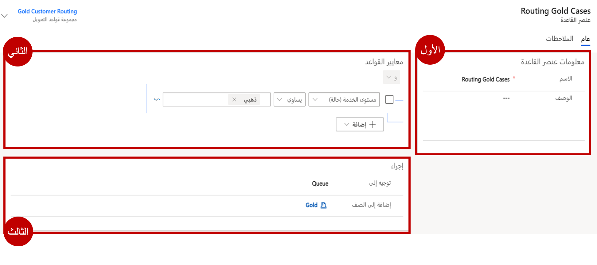
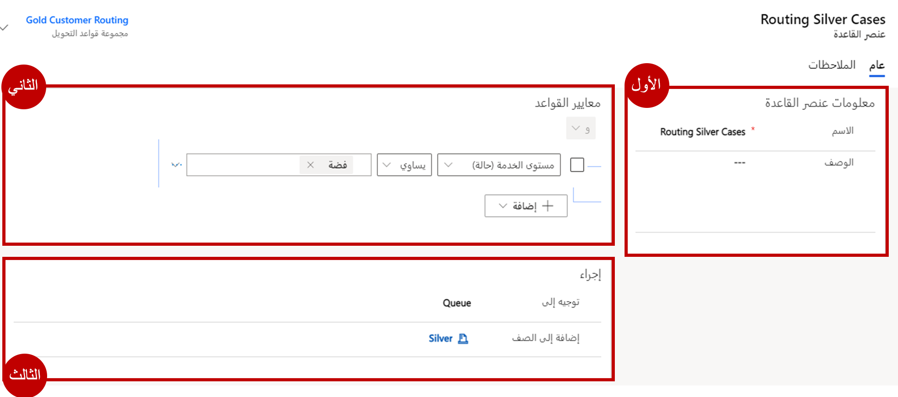

في الآونة الأخيرة، كان هناك تدفق للحالات التي كانت هناك فيها مشكلات تتعلق بحالات محددة تحتاج إلى تصعيد. إنك تقرر زيادة الفعالية إذا أمكن توجيه الحالات إلى الصفوف الذهبية أو الفضية أو البرونزية استنادًا إلى مستوى الخدمة في الحالة.

## الأهداف التعليمية

في نهاية هذه التمارين، ستتمكن من تحقيق الأهداف التالية:

-   إنشاء قاعدة التحويل

-   جعل تخصيصات الجدول الضرورية مطلوبة

-   استهلاك قاعدة التحويل في التطبيق

الوقت المقدر لإكمال هذا التمرين العملي: 15 إلى 20 دقيقة

## ‏‫الخطوات عالية المستوى

-   إنشاء قاعدة تحويل للحالة

-   إنشاء أصناف لقاعدة التحويل عن طريق تحديد معايير لـ:

    -   توجيه الحالات الذهبية إلى الصف الذهبي

    -   توجيه الحالات الفضية إلى الصف الفضي

    -   توجيه الحالات البرونزية إلى الصف البرونزي

-   تحقق من أن قاعدة التحويل تعمل بشكل صحيح

## إنشاء قاعدة تحويل للحالة

1.  استخدم التنقل على اليسار لفتح منطقة إدارة الخدمة مع فتح "مركز Dynamics 365 Customer Service".

1.  حدد مجموعات قواعد التوجيه تحت عنوان "إعدادات الحالة".

1.  من شريط الأوامر، انقر على جديد لإنشاء مجموعة قواعد تحويل جديدة.

1.  أدخل اسم مجموعة قواعد التحويل الجديدة لتوجيه مستوى الخدمة.

1.  انقر على زر حفظ.

1.  ضمن الشبكة الفرعية عناصر القواعد، انقر فوق الزر + لإضافة عنصر جديد.

1.  في حقل الاسم، اكتب توجيه الحالات الذهبية.

1.  ضمن قسم معايير القاعدة، أضف ما إذا كانت معايير الشروط:

    -   حدد جدول الحالة.

    -   اختر حقل مستوى الخدمة.

    -   قم بتعيين العامل إلى يساوي.

    -   قم بتعيين القيمة إلى ذهب.

1.  ضمن قسم معايير القاعدة، أضف معايير الشروط الآتية:

    -   في حقل تحويل إلى، انقر فوق صف.

    -   بالنسبة إلى حقل إضافة إلى صف، حدد الصف الذهبي.

    يجب أن يشبه عنصر القاعدة المكتمل الصورة أدناه:

    

1. انقر فوق حفظ وإغلاق لإكمال عنصر القاعدة.

1. ضمن الشبكة الفرعية عناصر القواعد، انقر فوق الزر + لإضافة عنصر جديد.

1. في حقل الاسم، اكتب توجيه الحالات الفضية.

1. ضمن قسم معايير القاعدة، أضف ما إذا كانت معايير الشروط:

    -   حدد جدول الحالة.

    -   اختر حقل مستوى الخدمة.

    -   قم بتعيين العامل إلى يساوي.

    -   قم بتعيين القيمة إلى فضة.

1. ضمن قسم معايير القاعدة، أضف معايير الشروط الآتية:

    -   في حقل تحويل إلى، انقر فوق صف.

    -   بالنسبة إلى حقل إضافة إلى صف، حدد الصف الفضي.

        يجب أن يشبه عنصر القاعدة المكتمل الصورة أدناه:

        

1. انقر فوق حفظ وإغلاق لإكمال عنصر القاعدة.

1. ضمن الشبكة الفرعية عناصر القواعد، انقر فوق الزر + لإضافة عنصر جديد.

1. في حقل الاسم، اكتب توجيه الحالات البرونزية.

1. ضمن قسم معايير القاعدة، أضف ما إذا كانت معايير الشروط:

    -   حدد جدول الحالة.

    -   اختر حقل مستوى الخدمة.

    -   قم بتعيين العامل إلى يساوي.

    -   قم بتعيين القيمة إلى برونز.

20. ضمن قسم معايير القاعدة، أضف معايير الشروط الآتية:

    -   في حقل تحويل إلى، انقر فوق صف.

    -   بالنسبة إلى حقل إضافة إلى صف، حدد الصف البرونزي.

    يجب أن يشبه عنصر القاعدة المكتمل الصورة أدناه:

    

1. انقر فوق حفظ وإغلاق لإكمال عنصر القاعدة.

1. انقر فوق تنشيط لتأكيد التنشيط.

## قم بتخصيص حالة نموذج العرض التفاعلي لعرض مستوى خدمة الحالات

1.  افتح علامة تبويب جديدة في جلسة المستعرض الحالية.

1.  الانتقال إلى [Power Apps](https://make.preview.powerapps.com/?azure-portal=true).

1.  تأكد أنك تعمل في البيئة التي تريد تعديل نموذج الحالة فيها.

1.  باستخدام التنقل على اليسار، قم بتوسيع البيانات وحدد الجداول.

1.  حدد موقع جدول الحالة وافتحه.

1.  مع فتح جدول الحالة، حدد النماذج.

1.  افتح نموذج الحالة للتجربة التفاعلية.

1.  حدد زر أعمدة الجدول لعرض قائمة الأعمدة المتاحة للجدول على الجانب الأيسر من الشاشة.

1.  حدد موقع عمود مستوى الخدمة.

1.  انقر عمود مستوى الخدمة واسحبه وضعه أسفل "حقل الاستحقاق".

1.  انقر فوق رمز الحفظ لحفظ التغييرات في النموذج.

1.  انقر فوق رمز النشر لنشر التغييرات في النموذج.

## تحقق من أن قاعدة التحويل تعمل بشكل صحيح

1.  إذا لزم الأمر، في شريط تنقل التطبيق الرئيسي، انقر فوق محدد القائمة المنسدلة بجانب Dynamics 365، ثم انقر فوق "مركز خدمة العملاء".

1.  باستخدام خريطة الموقع، حدد رمز مفتاح الربط للانتقال إلى الحالات.

1.  في شريط الأوامر، انقر فوق زر حالة جديدة.

1.  أكمل الحالة على النحو الآتي:

    -   عنوان الحالة: مشكلة تسليم محلي

    -   العميل: A. Datum Corporation (عينة)

    -   الموضوع: التسليم

    -   نوع الحالة: مشكلة

    -   الأصل: الهاتف

    -   مستوى الخدمة: ذهبي

1.  انقر فوق "حفظ".

1.  انقر على زر حفظ وتوجيه في شريط الأوامر.

1.  انقر على توجيه لتأكيد رغبتك في تطبيق قاعدة التوجيه الجديدة على هذه الحالة.

1.  باستخدام خريطة الموقع، انتقل إلى الصفوف.

1.  بالنسبة إلى حقل الصف، غير الصف إلى ذهبي.

1. في محدد طريقة العرض، تحقق من عرض الحالات بوصفها متاحة لـ "العمل على" بالنسبة إلى كافة الحالات التي يمكن تحديدها من الصف.

1. يجب أن تشاهد حالة التوصيل المحلي التي أنشأتها في صف الانتظار هذه.

