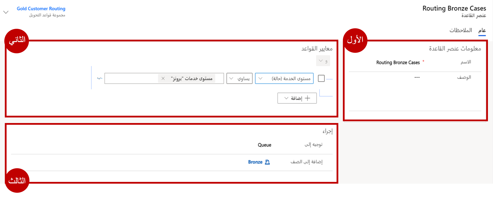

في الآونة الأخيرة، كان هناك تدفق للحالات التي كانت هناك فيها مشكلات تتعلق بحالات محددة تحتاج إلى تصعيد. إنك تقرر زيادة الفعالية إذا أمكن توجيه الحالات إلى قوائم الانتظار الذهبية أو الفضية أو البرونزية استناداً إلى مستوى الخدمة في الحالة.

## الأهداف التعليمية

ستتمكن في نهاية هذه التمارين من تحقيق الأهداف التالية:

- إنشاء قاعدة التحويل

- جعل تخصيصات الجدول الضرورية مطلوبة

- استهلاك قاعدة التحويل في التطبيق

الوقت المقدر لإكمال هذا التمرين العملي: 15 إلى 20 دقيقة

## ‏‫الخطوات عالية المستوى

- إنشاء قاعدة تحويل للحالة

- إنشاء أصناف لقاعدة التحويل عن طريق تحديد معايير لـ:

    - توجيه الحالات الذهبية إلى الصف الذهبي

    - توجيه الحالات الفضية إلى الصف الفضي

    - توجيه الحالات البرونزية إلى الصف البرونزي

-   تحقق من أن قاعدة التحويل تعمل بشكل صحيح

## إنشاء قاعدة تحويل للحالة

1. افتح تطبيق **مركز مسؤولي Customer Service**.
  
2. باستخدام منطقة التنقل إلى اليمين، حدد **التحويل**.  

3. حدد موقع **مجموعات قواعد التحويل الأساسية** وحدد **إدارة**.
 
4. من شريط الأوامر، حدد **جديد** لإنشاء مجموعة قواعد تحويل جديدة.

5. قم بتعيين حقل **الاسم** إلى **تحويل على مستوى الخدمة**.

6. حدد **حفظ**. 

7. ضمن الشبكة الفرعية **أصناف القواعد**، حدد **+ عنصر قاعدة جديد**.

8. في حقل **الاسم**، اكتب **توجيه الحالات الذهبية**.

9. ضمن القسم **معايير القاعدة**، حدد الزر **إضافة** وحدد **إضافة صف**.

1. وفيما يلي تكوين الشرط:

    - حدد جدول **الحالة**.

    - اختر حقل **مستوى الخدمة**.

    - قم بتعيين عامل التشغيل إلى **يساوي**.

    - قم بتعيين القيمة إلى **ذهبي**.

1.  ضمن قسم **معايير القاعدة**، أضف المعايير إلى الحالات الشرطية Then:

    - في حقل **تحويل إلى**، حدد **صف**.

    - بالنسبة إلى حقل **إضافة إلى صف**، حدد الصف **الذهبي**.

    يجب أن يشبه عنصر القاعدة المكتمل الصورة أدناه:

    > [!div class="mx-imgBorder"]
    > 

1. حدد **حفظ** و **إغلاق** لإكمال عنصر القاعدة.

1. ضمن الشبكة الفرعية **أصناف القواعد**، حدد **+ عنصر قاعدة جديد**.

1. في حقل **الاسم**، اكتب **توجيه الحالات الفضية.**

1. ضمن القسم **معايير القاعدة**، حدد **إضافة** وحدد **إضافة صف**.

1. وفيما يلي تكوين الشرط:

    - حدد جدول **الحالة**.

    - اختر حقل **مستوى الخدمة**.

    - قم بتعيين عامل التشغيل إلى **يساوي**.

    - قم بتعيين القيمة إلى **فضي**.

1. ضمن قسم **معايير القاعدة**، أضف المعايير إلى الحالات الشرطية Then:

    - في حقل **تحويل إلى**، حدد **صف.**

    - بالنسبة إلى حقل **إضافة إلى صف**، حدد الصف **الفضي**.

        يجب أن يشبه عنصر القاعدة المكتمل الصورة أدناه:

        > [!div class="mx-imgBorder"]
        >     

1. حدد **حفظ** و **إغلاق** لإكمال عنصر القاعدة.

1. ضمن الشبكة الفرعية **أصناف القواعد**، حدد **+ عنصر قاعدة جديد.**

1. في حقل **الاسم**، اكتب **توجيه الحالات البرونزية.**

1. ضمن القسم **معايير القاعدة**، حدد **إضافة** واختر **إضافة صف.**

1. وفيما يلي تكوين الشرط:

    - حدد جدول **الحالة**.

    - اختر حقل **مستوى الخدمة**.

    - قم بتعيين عامل التشغيل إلى **يساوي.**

    - قم بتعيين القيمة إلى **برونزي.**

20. ضمن قسم **معايير القاعدة**، أضف المعايير إلى الحالات الشرطية Then:

    - في حقل **تحويل إلى**، حدد **صف.**

    - بالنسبة إلى حقل **إضافة إلى صف**، حدد **الصف البرونزي.**

    يجب أن يشبه عنصر القاعدة المكتمل الصورة أدناه:

    > [!div class="mx-imgBorder"]
    >     

1. حدد **حفظ** و **إغلاق** لإكمال عنصر القاعدة.

1. حدد **تنشيط** لتأكيد التنشيط.

## قم بتخصيص حالة نموذج العرض التفاعلي لعرض مستوى خدمة الحالات

ستقوم في هذا التمرين بتعديل حالة نموذج التجربة التفاعلية لعرض الحالات في تطبيق مركز خدمة العملاء.  إذا كنت ستعمل مع تطبيق Customer Service workspace، فيمكنك استخدام نفس الخطوات التالية لتخصيص حالة نموذج التجربة متعددة جلسات العمل.    

1. افتح علامة تبويب جديدة في جلسة المستعرض الحالية.

1. الانتقال إلى [Power Apps](https://make.preview.powerapps.com/?azure-portal=true).

1. تأكد أنك تعمل في البيئة التي تريد تعديل نموذج الحالة فيها.

1. باستخدام التنقل على اليسار، قم بتوسيع **Dataverse** وحدد **الجداول.**

1. حدد موقع **جدول الحالة** وافتحه.

1. مع فتح **جدول الحالات**، ضمن **تجارب البيانات**، حدد **النماذج.**

1. افتح نموذج **الحالة للتجربة التفاعلية**.

1. حدد زر أعمدة الجدول لعرض قائمة الأعمدة المتاحة للجدول على الجانب الأيسر من الشاشة.

1. حدد موقع عمود **مستوى الخدمة**.

1. حدد عمود **مستوى الخدمة** واسحبه وضعه أسفل حقل **الاستحقاق**.

1. حدد رمز **الحفظ** لحفظ التغييرات في النموذج.

1. حدد رمز **النشر** لنشر التغييرات في النموذج.

## تحقق من أن قاعدة التحويل تعمل بشكل صحيح

1. إذا لزم الأمر، افتح تطبيق **مركز خدمة العملاء** على متصفح جديد.

1. باستخدام **مخطط الموقع**، حدد رمز مفتاح الربط للانتقال إلى الحالات.

1. من شريط الأوامر، حدد **حالة جديدة**.

1. أكمل الحالة على النحو الآتي:

    - **عنوان الحالة**: مشكلة تسليم محلي

    - **العميل**: A. Datum Corporation (عينة)

    - **الموضوع**: التسليم

    - **نوع الحالة**: مشكلة

    - **الأصل**: الهاتف

    - **مستوى الخدمة**: ذهبي

1.  حدد **حفظ**.

1.  حدد زر **حفظ وتوجيه** في شريط الأوامر.

1.  حدد **توجيه** لتأكيد رغبتك في تطبيق قاعدة التوجيه الجديدة على هذه الحالة.

1.  باستخدام **مخطط الموقع**، انتقل إلى **الصفوف.**

1.  بالنسبة إلى حقل **الصف**، غيّر الصف إلى **ذهبي.**

1. في محدد طريقة العرض، تحقق من عرض **الحالات المتاحة للعمل عليها** بالنسبة إلى كافة الحالات التي يمكن تحديدها من الصف.

1. يجب أن تشاهد حالة **مشكلة تسليم محلي** التي أنشأتها في هذا الصف.