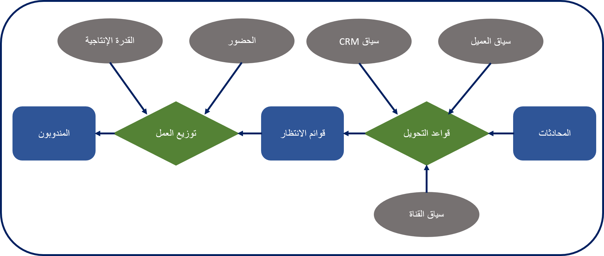
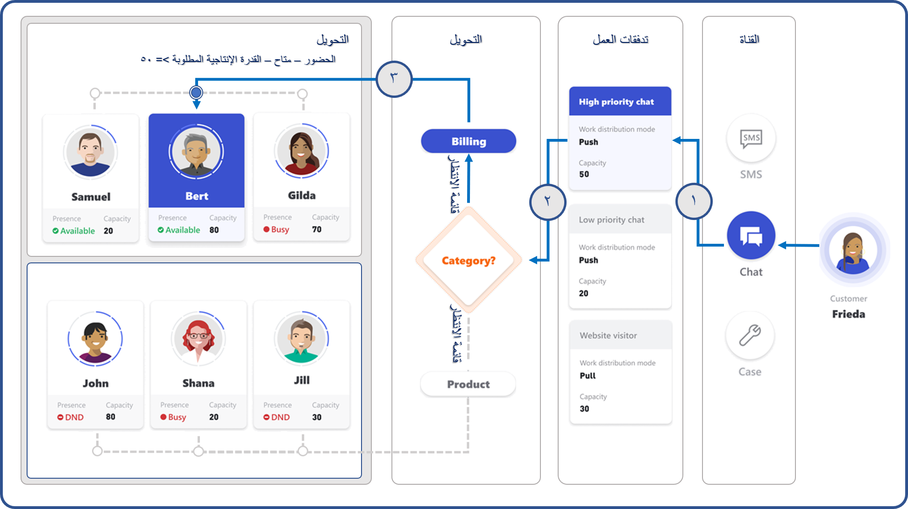

قبل تصميم حلول التوجيه حول القناة متعددة الاتجاهات لـ Customer Service، يجب أن تفهم كيف يوجه الحل المحادثات ويوزع العمل على المندوبين. للمساعدة في التأكد من توجيه المحادثات إلى المناطق المناسبة وتوزيعها على المندوب الأنسب، يتضمن حل القناة متعددة الاتجاهات لـ Customer Service نظام توجيه وتوزيع عمل موحداً.

مزايا نظام موحد للتوجيه وتوزيع العمل:

-   يمكن للمؤسسات أتمتة مهام العمل عبر قنوات مختلفة.

-   ويمكن توزيع العمل على أفضل المندوبين المتاحين على أساس قدراتهم وحضورهم.

-   يمكن تحليل إنتاجية المندوب وإدارتها عبر القنوات.

يتكون نظام التوجيه الموحد وتوزيع العمل المضمن في القناة متعددة الاتجاهات لـ Customer Service من خطوتين:

1.  يرسل مشغل التوجيه المحادثات إلى قائمة انتظار القناة متعددة الاتجاهات الأكثر ملاءمة استناداً إلى قواعد التوجيه التي تم تكوينها للمؤسسة.

1.  توزيع العمل يعطي المحادثات في قائمة انتظار للمندوبين في الوقت الحقيقي، استناداً إلى قدرة المندوب المتاحة ووجودها الحالي.

## سيناريو موحد للتوجيه وتوزيع العمل

لفهم كيفية عمل التوجيه الموحد وتوزيع العمل وكيفية تعيين المحادثات للمندوبين بشكل أفضل، ضع في اعتبارك السيناريو التالي الذي يرغب العميل في التحدث فيه عن سؤال الفوترة.

في هذه الحالة، يبدأ العميل محادثة من قناة محادثة مباشرة مرتبطة بالفوترة. سيساعد التوجيه الموحد وتوزيع العمل في توجيه المحادثة إلى قائمة انتظار الفوترة وسيعين المحادثة إلى مندوب عضو في قائمة انتظار الفوترة ولديه الحضور الصحيح والقدرة الضرورية المتاحة.

توضح الصورة التالية كيف يبدو هذا السيناريو على مستوى عال.

1.  عندما تبدأ فريدا محادثة دردشة، يحدد النظام أولاً القناة التي تتواصل من خلالها. يتم تطبيق تفاصيل تكوين توزيع التوجيه والعمل على المحادثة. يتم تعريف تفاصيل التكوين هذه في تدفقات العمل.
    
    في هذه الحالة، يعرف النظام دفق العمل على أنه محادثة مباشرة للمنتج والفوترة. يطبق النظام تفاصيل التكوين الخاصة بتدفق العمل على المحادثة الواردة. بالنسبة لتيار العمل هذا، تتطلب المحادثة قدرة 50 وحدة. افتراضياً، يتم تعيين كل عامل قدرة 100؛ هذا الرقم يتناقص عند تعيين العناصر إلى المندوب. وسينظر النظام في المندوبين الذين تبلغ سعتهم المتاحة 50 أو أكثر فقط. عند تعيين هذه المحادثة إلى عامل، سيقوم النظام بحظر (إزالة) 50 وحدة من قدرة المندوب.

1.  بعد ذلك، يبدأ منطق التوزيع التوجيه والعمل. بمساعدة متغيرات السياق (التي تساعد على تخزين المعلومات السياقية التي يمكن استخدامها بواسطة مشغل التوجيه)، يمكن لقواعد توجيه دفق العمل تحديد أن هذه المحادثة مرتبطة بالفوترة ثم إرسال المحادثة إلى قائمة انتظار الفوترة.

1.  عندما تصل المحادثة إلى قائمة انتظار الفوترة، يخصص النظام المحادثة لأحد المندوبين الأعضاء في قائمة انتظار الفوترة والذين يستوفون المعايير التالية:

    -   لديهم قدرة 50 وحدة أو أكثر.

    -   حالة الحضور الحالية متوفرة.

من بين الأعضاء الثلاثة الذين تم تعيينهم في قائمة انتظار الفوترة، فقط Bert لديه القدرة والحضور المطلوبين. لذلك، سيقوم النظام بتعيين المحادثة إلى Bert. بعد أن بدأ Bert العمل على المحادثة، يغير النظام حالة حضوره إلى مشغول، ويتم تقليل قدرته المتبقية بمقدار 50 وحدة وسيتم تحديثها إلى 30 وحدة.

## ضبط قدرة المندوب

يتم ضبط قدرة العامل مع تخصيص المحادثات لهم وعند إغلاق المحادثات المخصصة من قِبل المندوب. توفر المقاطع التالية تفاصيل إضافية حول كيفية ضبط العناصر لكل خيار.

### عندما يتم تعيين محادثة:

-   تتم إضافة المحادثة إلى قائمة  **العناصر الخاصة بي**  للمندوب.

-   قم بتغيير حالة حضور المندوب إلى **مشغول** أو **مشغول عدم الإزعاج**.

-   تزداد القدرة المستخدمة للمندوب بعدد الوحدات المعينة للمحادثة.

-   تقل القدرة المتاحة للمندوب بعدد الوحدات المعينة للمحادثة.

### عند إغلاق المحادثة المخصصة:

-   تتم إزالة المحادثة من قائمة  **العناصر الخاصة بي**  للمندوب.

-   تتغير حالة حضور المندوب إلى  **متاح**.

-   تقل القدرة المستخدمة للمندوب بعدد الوحدات المعينة للمحادثة.

-   وتزداد قدرة المندوب المتاحة إلى حد القدرة الحرة.

إذا كانت المحادثات موجودة في النظام وتنتظر أن يتم تعيينها، يتم تخصيصها للمندوب بمجرد توفر المندوب، إذا كانت لديهم القدرة المتاحة اللازمة.

