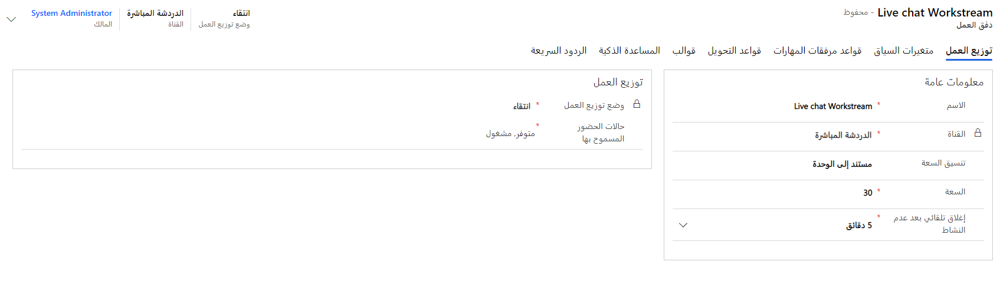
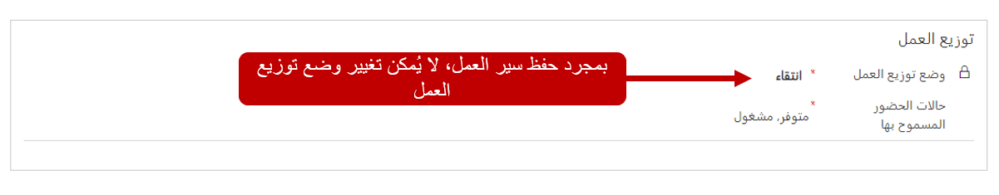

عندما تأتي محادثة من قناة، يجب تقييمها بحيث يمكن تسليمها إلى المندوب الأنسب. الصنف الأول الذي يجب تحديده هو قائمة الانتظار التي يجب توجيه المحادثة إليها. يمكن أن تعتمد كيفية توجيه المحادثة إلى قائمة انتظار محددة على ما تتعلق به المحادثة. على سبيل المثال، إذا تم تحديد أن المحادثة مرتبطة بنزاع حول الفوترة، فمن المحتمل أن يتم إرسالها إلى قائمة انتظار مرتبطة بمشكلات الفوترة. إذا كانت المحادثة متعلقة بسؤال حول صنف يتطلع العميل إلى شرائه، فمن المحتمل أن يتم إرساله إلى قائمة انتظار المبيعات حيث يمكن لمندوب دعم المبيعات المؤهل مساعدة العميل. 

بعد توجيه الصنف إلى قائمة الانتظار الأنسب، سيتم توزيعه على أحد أعضاء قائمة الانتظار هذه للعمل عليه. يمكن أن تحتوي كل قائمة انتظار على أولوية معينة إليها. قد يتم تعيين المندوبين كأعضاء في كلٍّ من قائمتي الانتظار. إذا تم تعيين أولوية أعلى لقائمة انتظار الفوترة من قائمة انتظار المبيعات، فسيتم تسليم الأصناف الموجودة في قائمة انتظار الفوترة إلى مندوب متاح قبل الأصناف الموجودة في قائمة انتظار المبيعات.

اعتماداً على احتياجات وإجراءات مؤسسة الدعم، هناك اعتبار آخر هو تحديد ما إذا كان يجب توزيع المحادثات تلقائياً على المندوبين من خلال إعلام فوري، أو ما إذا كانت الأصناف ستبقى في قائمة الانتظار حتى يحدد المندوب الصنف المراد العمل عليه. 

تتحكم عمليات دفق العمل في شكل هذه العملية وكيف يتم تنفيذها. دفق العمل هو في الأساس مجموعة من الإرشادات التي تحدد كيفية توجيه المحادثات وتوزيعها من قنوات مختلفة. 

يمكن ربط عمليات دفق العمل بأنواع القنوات التالية: 

-   دردشة 

-   الرسائل القصيرة 

-   Facebook

-   الكيان 

> [!IMPORTANT]
> لا يمكن إنشاء عمليات دفق العمل إلا للقنوات التي تم تمكينها عندما تم نشر القناة متعددة الاتجاهات لـ Customer Service في المؤسسة. على سبيل المثال، إذا لم يتم نشر Facebook كقناة، فلن تتمكن من إنشاء دفق عمل لها. 

## إنشاء عمليات دفق العمل

يتم إنشاء عمليات دفق العمل من منطقة **إدارة توزيع العمل** في تطبيق إدارة القناة متعددة الاتجاهات. اعتماداً على نوع القناة، ستحتوي بعض عمليات دفق العمل على إعدادات إضافية خاصة بتلك القناة. على سبيل المثال، يحتوي دفق عمل SMS أيضاً على عناصر أكثر قابلية للتكوين ترتبط بإعدادات SMS معينة وتكوينات أرقام الهواتف. 

بغض النظر عن نوع القناة، سيحتاج كل دفق عمل إلى الاحتواء على المعلومات التالية: 

-   **إعدادات التوزيع** - تحديد كيفية توزيع صنف العمل على المندوبين.

-   **متغيرات السياق** - تحتوي على بيانات السياق مثل بيانات ما قبل المحادثة أو معلومات القناة التي يمكن استخدامها للمساعدة في توجيه المحادثات إلى المكان المناسب. 

-   **قواعد التوجيه** - الشروط التي يتم تقييمها والتي تتحكم في المكان الذي يتم توجيه الأصناف إليه. 

-   **قواعد مرفقات المهارات‬** - بناءً على المهارات المرتبطة بالمحادثة، سيتم توجيهها إلى المندوب الذي يطابق تلك المهارات بشكل أفضل. 

-   **القوالب** - تحدد جلسة العمل المحددة مسبقاً وقوالب الإخطارات التي يجب استخدامها عند إنشاء جلسات العمل وتسليم الإخطارات إلى المندوبين للمحادثات المتعلقة بدفق العمل هذا. 

سيحتاج كل نوع قناة يتم استخدامه إلى دفق عمل واحد على الأقل مقترن به. في بعض الحالات، قد يحتوي نوع القناة على عمليات دفق عمل متعددة تم تكوينها لأن المؤسسة قد ترغب في التعامل مع أنواع مختلفة من الاتصالات من تلك القناة بشكل مختلف. على سبيل المثال، قد يكون لدى المؤسسة عملية دفق عمل محادثة لسيناريوهات المبيعات مقابل دفق عمل من أجل سيناريوهات الدعم الحقيقية. 

عند إنشاء دفق عمل في البداية، ستحتاج إلى تحديد المعلمات التالية:

-   **الاسم** - الاسم البسيط الذي سيتم استخدامه لتحديد دفق العمل.

-   **القناة** - نوع قناة الاتصال الذي سيعالج دفق العمل هذا البيانات له. 

-   **القدرة الإنتاجية** - تحديد مقدار القدرة الإنتاجية الإجمالية المطلوبة للمندوب والتي سيتم استهلاكها عندما يتم توجيه محادثة من الدفق إليه. (لا يمكن تغيير القدرة الإنتاجية بعد حفظ دفق العمل.)

-   **الإغلاق التلقائي بعد عدم النشاط‬** - تحديد مقدار الوقت الذي يجب انتظاره قبل نقل محادثة من حالة الانتظار إلى الحالة المغلقة بسبب عدم النشاط.

## توزيع العمل

يمكن تكوين كل دفق عمل لتوزيع العمل بإحدى طريقتين: 

-   **إرسال** - سيتم إرسال المحادثات إلى المندوبين تلقائياً عن طريق نافذة منبثقة على الشاشة.

-   **الانتقاء** - سيتم إرسال المحادثات إلى المندوبين عند تحديد محادثة من أصناف العمل المفتوحة في لوحة معلومات المندوب.

عند تحديد الخيار الذي يجب استخدامه، ضع في اعتبارك ما يدعمه الدفق. في معظم الحالات، من المحتمل أن يتم تعيين دفق العمل لإرسال الأصناف تلقائياً، ولكن في حالات أخرى حيث يعتمد دفق العمل على كيان، قد يكون من المنطقي تعيينه إلى **انتقاء** حتى يتمكن المندوبون من اختيار الحالة التي يريدون العمل عليها ثم معاودة الاتصال بالعميل. يمكن استخدام هذا الأسلوب في السيناريوهات حيث تسمح المؤسسة للعملاء بإنشاء طلبات حالة من إحدى المداخل. بعد إنشاء الحالة بواسطة العميل، سيتم إرسالها إلى قائمة انتظار حيث يمكن لأي مندوب عضو في قائمة الانتظار تحديدها ثم الاتصال بالعميل مرة أخرى للعمل على الصنف. 

لا يمكن تعيين **وضع توزيع العمل** إلا عند إنشاء دفق العمل في البداية. بعد حفظ وضع التوزيع، لا يمكن تغييره. إذا كان يلزم تغييره، فسيلزم إنشاء دفق عمل جديد مع تحديد وضع التوزيع المعين. 

## حالات الحضور المسموح بها

يجب ألا يتم إرسال المحادثات دائماً إلى كل مندوب تلقائياً. قد تمنع بعض العوامل المندوب من إجراء محادثة معينة له، مثل تعيين حضوره إلى **عدم الإزعاج**. ومع ذلك، إذا تم تعيين حضور مندوب إلى **مشغول**، فقد يكون لا يزال لديه القدرة الإنتاجية المتوفرة الكافية للعمل على صنف.

ضمن دفق العمل، يحدد حقل **حالات الحضور المسموح بها‬** حالات الحضور التي يمكن إرسال محادثة من دفق عمل إليها. يمكن تحديد حالات حضور متعددة. على سبيل المثال، في معظم الحالات، قد يتم تعيين دفق عمل لإرسال الأصناف إذا تم تعيين حضور المندوب إلى إما **متاح** أو **مشغول**. عند محاولة دفق العمل إرسال الصنف إلى شخص مشغول، فسيتحقق من أن المندوب لديه قدرة إنتاجية كافية متوفرة قبل أن يقوم بتعيين الصنف إليه. 

يمكن للمؤسسات إنشاء حالات حضور مخصصة استناداً إلى احتياجاتها الفريدة. 

## متغيرات السياق

تُستخدم متغيرات السياق لإثراء المحادثات ببيانات ما قبل المحادثة وبيانات القناة وبيانات السياق المخصصة. يمكن استخدام هذه المعلومات لتوفير سياق إضافي حول المحادثة لمساعدة دفق العمل على تحديد كيفية توجيه المحادثة إلى قوائم انتظار مختلفة في التطبيق.

على سبيل المثال، قد تنشئ مؤسسة متغير سياق يتضمن عدد الأصناف في سلة التسوق الخاصة بالمستخدم. كما أنها قد تنشئ بعض متغيرات السياق لتحديد نوع المحادثة بشكل أفضل. يمكن أن يحتوي كل دفق عمل على متغيرات سياق متعددة محددة له. 

سيحتوي متغير السياق على المعلومات التالية:

-   **اسم العرض** - اسم المتغير الذي سيتم عرضه.

-   **الاسم** - الاسم المستخدم بواسطة التطبيق عند استخدامه.

-   **النوع** - تحديد نوع البيانات التي يتضمنها متغير السياق.

يمكن إرسال متغير السياق إلى إما سلسلة نصية أو قيمة رقمية. 

