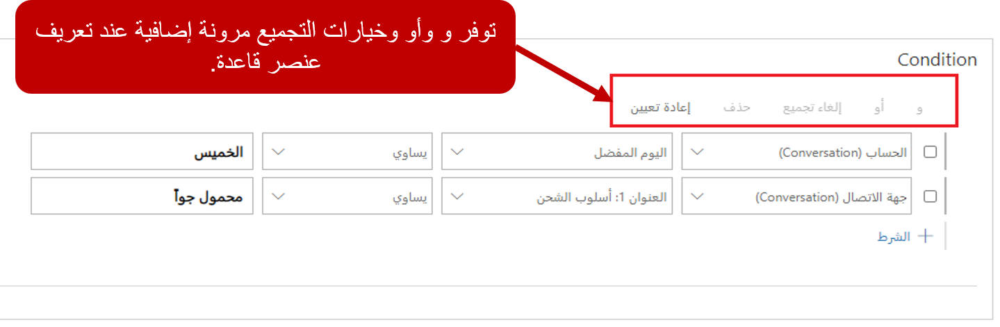
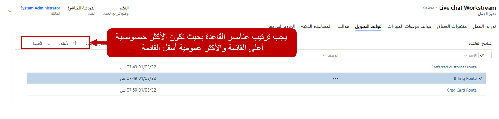

يمكن اعتبار قواعد التوجيه بمثابة خرائط الطريق التي يستخدمها مسار العمل لتحديد كيفية توجيه المحادثات إلى قوائم انتظار مختلفة. 

يحتوي كل صنف قاعدة على جزأين: **الحالات** و **قائمة انتظار الوجهة**.

-   **الحالات** - تحديد حالة (حالات) معينة تستخدم لتحديد ما إذا كان صنف القاعدة ينطبق أم لا.

    يمكن للحالات تقييم سجلات كيان الحقل المرتبطة بالمحادثة، مثل الحساب أو جهة الاتصال التي أرسلت الطلب.

    يمكن استخدام حالات **و/أو** متعددة في صنف قاعدة واحد. بشكل افتراضي، تمثل جميع أصناف القاعدة الجديدة حالات **و**.

-   **قائمة انتظار الوجهة** - تحديد قائمة الانتظار التي سيتم توجيه الصنف إليها.

عند تطبيق قاعدة التوجيه، سيتم تقييم الحالة المحددة في القاعدة. إذا تم تقييم حالة القاعدة باعتبارها "صحيحة"، فسيتم توجيه المحادثة إلى قائمة انتظار الوجهة المحددة في القاعدة.

يمكن أن تستند حالات قاعدة التوجيه إلى سياق القناة أو سياق ما قبل المحادثة، بالإضافة إلى جهة الاتصال أو الحساب أو سياق الحالة. على سبيل المثال، يمكنك تعريف قاعدة التوجيه بحيث يمكن توجيه الدردشات الواردة من العملاء ذوي الأولوية العالية الذين لديهم استعلامات محددة حول الاستثمارات إلى قائمة انتظار معينة.

> [!IMPORTANT]
> إذا تم تقييم جميع حالات القاعدة لمحادثة على أنها "خطأ"، فستنتقل إلى قائمة الانتظار الافتراضية للمؤسسة.

عند تعريف صنف قاعدة التوجيه، يجب أيضًا تعريف قائمة الانتظار التي ستقوم القاعدة بتوجيه الأصناف إليها. سيكون لكل صنف قاعدة حالة يحدد ما هي المتطلبات الأساسية التي يجب الوفاء بها لتطبيق القاعدة. استنادا إلى الحالات المحددة، يتم توجيه المحادثات إلى قوائم الانتظار الصحيحة. بالنسبة إلى كيان ما، يمكنك الاختيار من بين مجموعة من السمات والعوامل والقيم المرتبطة بالكيان.

على سبيل المثال، إذا كانت قاعدة التوجيه ستوجه الدردشات من العملاء المفضلين إلى قائمة انتظار مفضلة أو أولية، فسيكون لقاعدة التوجيه حالة تشير إلى سجل الحساب من العميل الذي تجرى المحادثة معه. إذا تم تصنيف الحساب كعميل مفضل، فسترسل القاعدة المحادثة إلى قائمة الانتظار المفضلة.

## قواعد توجيه متعددة

يمكن أن يكون لمسار عمل واحد قواعد توجيه متعددة. يتم تطبيق أصناف القاعدة بالترتيب المحدد في مجموعة القواعد. على سبيل المثال، إذا كان مسار العمل المسمى محادثة يحتوي على خمس قواعد توجيه، فسيتم تقييم محادثة المحادثة الواردة مقابل جميع قواعد التوجيه الخمسة بالترتيب المحدد. يتم تقييم القواعد من الأعلى إلى الأسفل.

إذا تم تقييم حالة القاعدة باعتبارها "صحيحة"، فسيتم توجيه المحادثة إلى قائمة انتظار الوجهة وسوف تتخطى التقييم الإضافي. إذا تم تقييم حالة القاعدة باعتبارها "خطأ"، فسيتم تقييم المزيد من القواعد. بعد العثور على صنف قاعدة مطابق، فسيتم استخدامه. نوصيك بوضع أصناف قاعدة أكثر تحديدًا بمستوى أعلى ضمن مجموعة القواعد بحيث يتم التحقق منها أولاً.

