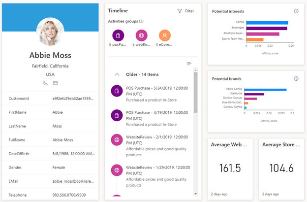
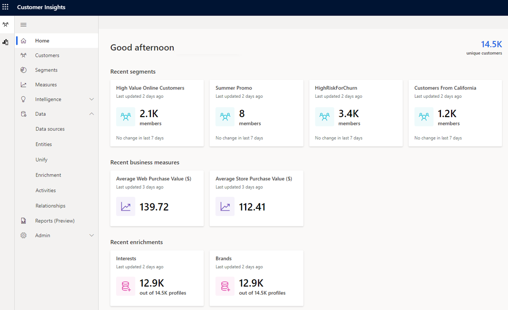

تمثل تجربة العملاء جوهر طموحات التحول الرقمي لكل مؤسسة. للمنافسة في سوق اليوم، تحتاج إلى بناء علاقات ذات مغزى مع عملائك على المستوى الشخصي. كلما تمكّنت من تكوين فهم أفضل لعملائك، ستتمكن من توفير تجربة عملاء أكثر تخصيصاً بطريقة أسهل. ولتحقيق ذلك، تحتاج إلى طريقة عرض كاملة وعميقة وموحدة لهوية ذلك العميل عبر جميع النواحي التي يتفاعل فيها مع مؤسستك. يصبح هذا صعباً عندما تفكر في أن معظم المؤسسات تعتمد على تطبيقات برمجية متعددة لتشغيل أعمالها.
قد تكون بيانات العميل موجودة في برنامج التجارة الإلكترونية الذي يدعم متجر موقعك على الويب، وبرامج نقطة البيع المستخدمة في متاجر البيع بالتجزئة وبرامج التسويق والمزيد.

إن Dynamics 365 Customer Insights عبارة عن نظام أساسي لبيانات العملاء (CDP) بديهي ومرن يساعد مؤسستك على الكشف عن الرؤى، وتكوين فهم أعمق لعملائك، وتعزيز تجارب العملاء الشخصية هذه من خلال توحيد جميع بيانات العملاء عبر مؤسساتك المختلفة، بما في ذلك مصادر بيانات الحركات والسلوكيات والمراقبة، في عرض واحد شامل للعميل.‬

> [!div class="mx-imgBorder"]
> 

يسهّل Customer Insights على مؤسستك توحيد بيانات العملاء وفهمها والاستفادة منها للحصول على رؤى وإجراءات ذكية

## كيفية عمل Customer Insights

يستوعب Customer Insights البيانات من جميع مصادر البيانات المختلفة ويوحدها في ملف تعريف عميل واحد. ومن ملف تعريف العميل، يمكنك تعقب البيانات عبر مختلف المجموعات السكانية وتحديد الاتجاهات بالاستناد إلى البيانات الأساسية التي تريد تعقبها.

عند شروع المؤسسة في استخدام Customer Insights للمرة الأولى، عليها تعريف مصدر بياناتها والبيانات التي ترغب في تعقبها.

تُظهر القائمة التالية كيف ستبدو هذه العملية على مستوى عالٍ.

-   **استيعاب البيانات** - تحديد مصادر البيانات التي تأتي منها بياناتك.
    يمكن استيعاب البيانات من مجموعة كبيرة من مصادر البيانات من خلال الموصلات المضمنة التي تتصل بالعديد من موفري البيانات المختلفين.

-   **إنشاء ملفات تعريف العملاء** - يتم إنشاء ملفات تعريف العملاء من خلال توحيد البيانات التي يتم استيعابها من مصادر بياناتك المختلفة في ملف تعريف واحد.

    تتكون عملية التوحيد من ثلاث خطوات:

-   **الحقول المصدر** - تحدد الكيانات والحقول التي سيتم دمجها لإنشاء ملف تعريف عميل موحد.

-   **السجلات المكررة** - تحدد كيفية التعامل مع أي سجلات مكررة في مجموعات البيانات الخاصة بك.

-   **شروط المطابقة** - تحدد القواعد التي سيتم استخدامها للمساعدة في دمج مجموعات البيانات الخاصة بك في ملف تعريف عميل موحد.

-   **توحيد حقول العملاء** - يحدد المعلومات النهائية مثل الأصناف التي يجب استبعادها وترتيب السمات والتفاصيل الأخرى التي قد تؤثر في عملية الدمج.

-   **تعريف الأنشطة‬** - تساعد الأنشطة في دمج أنشطة العملاء عبر مصادر البيانات ووضعها في طريقة عرض المخطط الزمني. قد تمثل هذه الأنشطة تفاعلات أو عمليات شراء.

-   **تحديد العلاقات** - العلاقات تربط كياناتك ببعضها البعض وتقوم بإنشاء رسم بياني لبياناتك.

-   **الإثراء‬** - يساعدك الإثراء‬ على تعقب الانتماء للعلامة التجارية والولاء لها بشكل أفضل عبر المئات من العلامات التجارية المختلفة وفئات اهتمامات متعددة.

-   **تعريف القياسات** - مؤشرات الأداء الأساسية التي تعكس أداء أعمالك وسلامتها على أفضل وجه. قد تمثل هذه القياسات مستويات الرضا أو أهداف الإيرادات أو مستويات الأداء.

-   **إنشاء شرائح** - باستخدام الشرائح، يمكنك تجميع عملائك بسهولة بالاستناد إلى سمات العملاء السكانية أو المتعلقة بالحركات أو السلوك.

> [!IMPORTANT] 
> قبل أن تتمكن من استخدام الميزات التي تم تعريفها في هذه الوحدة النمطية، ستحتاج أولاً إلى ملف تعريف عميل موحد. تتم عملية إنشاء ملف تعريف العميل الموحد عبر استيعاب البيانات من مصادر بيانات متعددة ودمجها في ملف تعريف عميل موحد. عند إعداد Customer Insights للمرة الأولى، يتم إنشاء عينة مجموعة بيانات للسماح لك بالتعرف على التطبيق، ولكنك سترغب في التنقل عبر عملية التوحيد لتحليل البيانات ذات الصلة بأعمالك.

## الشروع في العمل

بعد تكوين Customer Insights، سيتمكن أي مستخدم لديه ترخيص Customer Insights من الوصول إلى التطبيق من خلال الانتقال إلى [رؤى الجمهور](https://home.ci.ai.dynamics.com/?azure-portal=true). سيؤدي هذا إلى فتح صفحة Customer Insights الرئيسية، مما يوفر طريقة عرض شاملة لقاعدة عملائك تعرض المقاييس التي تساعدك على تعقب سلامة أعمالك بشكل عام.

تظهر أنواع الرؤى التي يمكنك أن تتوقع رؤيتها على الصفحة الرئيسية في الصورة التالية.

> [!div class="mx-imgBorder"] 
> 

من القائمة الرئيسية في Customer Insights، سيتوفر لديك حق الوصول إلى كافة ميزات التطبيق المختلفة، وفقاً لاحتياجاتك.

توفر لك القائمة الرئيسية حق الوصول إلى الإمكانات التالية:

-   **الصفحة الرئيسية** - توفر نظرة عامة مركزية حول بيانات الرؤى والتقسيم المتوفرة التي تم تعريفها لمؤسستك.

-   **العملاء** - توفر حق الوصول إلى بطاقات عملاء فريدة بالاستناد إلى ملفات تعريف العملاء.

-   **الشرائح** - تسمح لك بتعريف كيفية تجميع العملاء وتصنيفهم بالاستناد إلى سمات سكانية أو سمات حركات أو سلوك مماثلة.

-   **القياسات** - تعرّف الأعمال الرئيسية مؤشرات الأداء الأساسية (KPI) الخاصة بالعميل مثل القيمة العمرية للعميل، ومتوسط قيمة الشراء وتكرار الشراء، ومستوى رضا العميل (CSAT)، وتعرّف العملاء ذوي القيمة العالية.

-   **البيانات** - تُستخدم لاستيعاب البيانات من مصادر بيانات مختلفة لإنشاء ملف تعريف عميل موحد. ويسمح لك أيضاً قسم البيانات بتعريف المعلمات التالية:

    -   **الأنشطة** - تسمح لك بأخذ أنشطة من مصادر مختلفة وجعها متاحة معاً بترتيب زمني.

    -   **العلاقات** - تربط الكيانات ببعضها للمساعدة في تعريف القياسات والشرائح من جميع مصادر البيانات المضمنة بشكل أفضل.

    -   **الإثراء** - يكشف عن بيانات حول التجاذب للمئات من العلامات التجارية والعشرات من فئات الاهتمامات. مع العلم بأن هذه الصلات تُستخرج لملفات التعريف التي قد تكون مشابهة لعملائك.

-   **المسؤول** - إدارة الأدوار والأذونات ووجهات التصدير لشرائح العملاء.

## العمل مع العملاء

بعد تعريف جميع الأنشطة والعلاقات والقياسات والشرائح المستخدمة لتعقب البيانات واستخدامها، ستتمكن من استخدام هذه البيانات لاكتساب رؤية أعمق لعملائك من خلال صفحة **العملاء**. تمثل صفحة **العملاء** طريقة عرض مدمجة لكل عميل بالاستناد إلى بيانات ملف التعريف التي قمت بجمعها من جميع مصادر بياناتك. بإمكان العملاء أن يكونوا أفراداً أو مؤسسات. من داخل صفحة **العملاء**، يمكنك البحث عن العملاء وتحديد موقعهم.

> [!div class="mx-imgBorder"] 
> 

يتم تمثيل كل ملف تعريف عميل بواسطة إطار متجانب لبطاقة العميل. وستعرض بطاقة العميل معلومات مختلفة بعض الشيء، وهذا يتوقف على ما إذا كان العميل فرداً أم مؤسسة. يمكنك استخدام الأزرار الموجودة في الجانب الأيسر السفلي من صفحة **العملاء** للتنقل عبر صفحات جميع ملفات تعريف العملاء المتوفرة.

> [!IMPORTANT] 
> لن تتمكن من الوصول إلى صفحة **العملاء** إلا عندما يقوم مسؤول مؤسستك بتعريف سمة واحدة على الأقل قابلة للبحث على شاشة **فهرس البحث والتصفية**. إذا لم يتم تنفيذ هذه الخطوة، فسينقلك التطبيق إلى شاشة **فهرس البحث والتصفية**‬. عند تعريف سمة واحدة على الأقل كقابلة للبحث، ستتمكن من رؤية صفحة **العملاء‏‎**.
