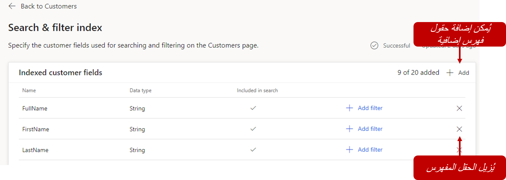
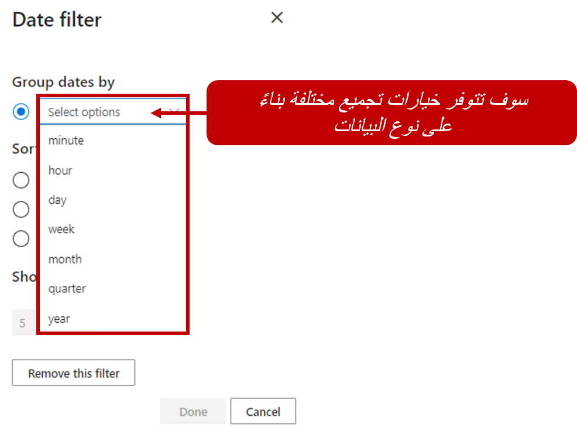
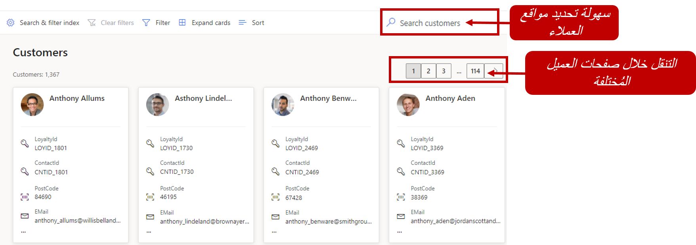

يُستخدم ملف تعريف العميل في Customer Insights لتوفير طريقة عرض موحدة لقاعدة العملاء الإجمالية. كما هو مذكور في الوحدة السابقة، يمكنك عرض تفاصيل ملف تعريف العميل من بطاقات العملاء في صفحة **العملاء**.
تحتاج إلى تحديد فهارس البحث والتصفية لملف تعريف العميل الخاص بك، قبل الوصول إلى صفحة **العملاء** لأول مرة. يوفر تعريف الفهارس وظائف أعمق ويساعد في تسهيل تحديد موقع المعلومات لعميل معين أو مجموعة من العملاء. يتم البحث والتصفية في التكوين من صفحة **العملاء** عن طريق تحديد الزر **بحث وتصفية**.

سيُطلب منك تحديد الحقول المفهرسة عند تحديد السمات القابلة للبحث لأول مرة. عند تحديد حقول الفهرس، ننصحك باختيار جميع السمات التي يمكن للمستخدمين من خلالها البحث عن العملاء وتصفيتهم في صفحة **العملاء**. تتوفر السمات الموجودة في كيان **ملف تعريف العميل** فقط. يمكنك إضافة حقول مفهرسة عن طريق تحديد الزر **إضافة**. يمكنك إضافة ما يصل إلى 20 سمة فهرس. بعد تحديد الحقل كحقل مفهرس، سيتم عرضه في صفحة قائمة **حقول العميل المفهرسة**.

> [!div class="mx-imgBorder"]
> 

ستُظهر قائمة **حقول العملاء المفهرسة** التفاصيل التالية:

-   **الاسم** - يمثل اسم السمة كما يظهر في كيان ملف تعريف العميل.

-   **نوع البيانات** - يحدد ما إذا كان نوع البيانات عبارة عن سلسلة أم رقم أم تاريخ.

-   **مضمن في البحث** - يحدد هذا الخيار ما إذا كان يمكن استخدام هذه السمة للبحث عن العملاء في صفحة **العملاء** باستخدام حقل البحث.

-   **+ إضافة عامل تصفية** - عنصر تحكم لتحديد كيفية استخدام هذه السمة لإجراء التصفية في صفحة **العملاء**.

يمكن إزالة السمات التي لم تعد تريد استخدامها كحقول مفهرسة باستخدام أيقونة الحذف (**X**).

## تحرير خيارات التصفية لسمة معينة

عن طريق إضافة المزيد من عوامل التصفية، قد ترغب كل مؤسسة في تنقيح المعلومات التي يتم عرضها. يمكنك إضافة عوامل تصفية، مثل الفئات العمرية المختلفة، عن طريق تحديد الزر **+ إضافة عامل تصفية** للسمة التي تريد تطبيق التصفية عليها. يمكنك تحديد عدد النتائج التي يتم عرضها والترتيب الذي سيتم تنظيمها به من خلال عامل التصفية.

بناءً على نوع بيانات السمة، قد تتوفر المزيد من الخيارات:

-   **سمات من نوع السلسلة** - حدد عدد النتائج التي تريدها في لوحة التصفية وسياسة الترتيب التي سيتم من خلالها ترتيبها.

-   **سمات من النوع العددي** - حدد الفواصل الزمنية المضمنة في لوحة التصفية وسياسة الترتيب التي سيتم من خلالها ترتيبها.

-   **سمات من نوع التاريخ** - حدد الفواصل الزمنية المضمنة في لوحة التصفية وسياسة الترتيب التي سيتم من خلالها ترتيبها.

    > [!div class="mx-imgBorder"]
    > 

بعد تحديد جميع خيارات التصفية والبحث، حدد الزر **تشغيل** لتطبيق إعداداتك. ستكون إعداداتك الجديدة متاحة عند وصول المستخدمين إلى صفحة **العملاء**.

## البحث عن المستخدمين

بإدخال نص البحث، مثل اسم العميل، في مربع البحث، يمكنك تحديد موقع العملاء. يجب تحديد السمات التي يتم البحث عنها بواسطة شخص لديه حقوق إدارية باستخدام الشاشة **فهرس البحث والتصفية**.

> [!IMPORTANT] 
> يتم تنفيذ عمليات البحث فقط من كيان ملف تعريف العميل الذي تم إنشاؤه أثناء عملية توحيد البيانات. تأكد من إكمال عملية توحيد البيانات لإطلاق وجهات نظر أكثر ثراءً لعملائك.

يمكنك أيضًا البحث عن سمة معينة ضمن معلومات هذا العميل بعد تحديد أحد مربعات العميل.

## تصفية العملاء

من خلال قائمة تتضمن حقول كيان ملف تعريف العميل كمرشحات، يمكن إجراء تصفية للعملاء. كما هو الحال مع البحث، سيحتاج المسؤول أولاً إلى تحديد الحقول التي سيتم اعتبارها قابلة للتصفية باستخدام صفحة **فهرس البحث والتصفية**.

بعد تحديد عوامل التصفية، يمكنك تحديد أيقونة **عامل التصفية** في الزاوية العلوية اليمنى من صفحة **العملاء**. ستساعدك المربعات الموجودة بجوار السمات المتاحة على تحديد كيفية تصفية عملائك. على غرار وظيفة البحث، يمكنك التصفية فقط من خلال السمات الموجودة في كيان ملف تعريف العميل والتي تم تحديدها بواسطة المسؤول في صفحة **فهرس البحث والتصفية**.

> [!div class="mx-imgBorder"] 
> 

لإزالة عوامل التصفية المحفوظة، حدد **مسح عوامل التصفية** في الزاوية العلوية اليمنى من صفحة **العملاء‏‎**.

تتوفر معلومات مثل أنشطة العملاء وانتماءات العلامة التجارية ومؤشرات الأداء الرئيسية للعملاء المهمة، بمجرد تحديد العميل الذي تريد العمل معه وفتح ملف التعريف الخاص به. سنقوم بفحص طريقة تكوين التطبيق لعرض تلك الأصناف في الوحدات المتبقية.
