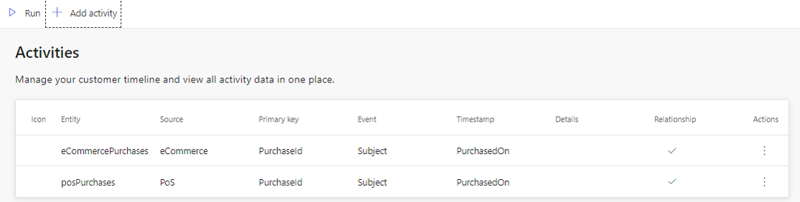
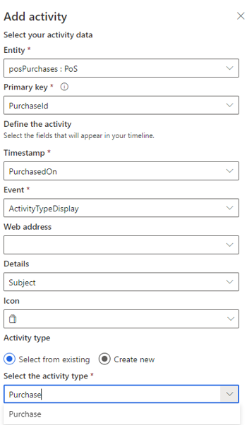
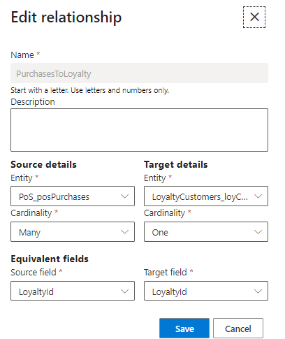
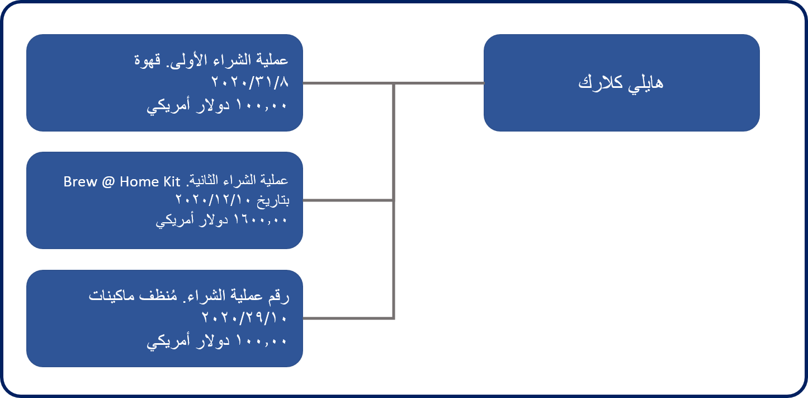

عندما تتحدث المؤسسات عن الحصول على عرض شامل للعميل، فإنهم يشيرون إلى فهم ما يفعله العميل عبر جميع مصادر البيانات المختلفة للشركة.

## الأنشطة

في Customer Insights، يشار إليها باعتبارها أنشطة. تتيح لك إمكانية الأنشطة في Customer Insights دمج أنشطة العملاء هذه من مصادر بياناتك المختلفة وربطها بـ unified customer profile للعملاء. تظهر هذه الأنشطة على شاشة "ملف تعريف العميل" بطريقة عرض المخطط الزمني.

تشمل إمكانية أنشطة Customer Insights مكوّنين:

-   **صفحة الأنشطة**: تُستخدم لتحديد الأنشطة وعرض الأنشطة الجاري إنشاؤها حالياً.

-   **شبكة المخطط الزمني**: قائمة الأنشطة الموحّدة لعميل واحد بترتيب زمني.

لا يكون عرض المخطط الزمني مرئياً على لوحة معلومات ملف تعريف العميل فحسب، بل يمكن أيضاً تضمينه وعرضه إما داخل التطبيقات المستندة إلى النماذج مثل Dynamics 365 Sales أو Dynamics 365 Customer Service، من الوظيفة الإضافية لبطاقة العميل، أو داخل لوحة معلومات Power BI.

### تعريف الأنشطة

عادةً ما تحتوي مصادر البيانات التي يتم نقلها إلى Customer Insights ككيانات إما على بيانات ملف تعريف العميل أو بيانات الحركات. تُستخدم الكيانات التي تحتوي على بيانات ملف التعريف عادةً لتحديد الحقول والبيانات التي سيتم تضمينها في ملف التعريف الموحّد للعميل لكل عميل. تعبر بيانات الحركات في الطبيعي عن الأنشطة التي يجب أن ترتبط بالعميل. فمثلاً، سيتم تمثيل أصناف مثل عمليات الشراء أو الزيارات إلى موقع ويب أو حالة فتحها أحد العملاء من خلال الأنشطة في Customer Insights. من المحتمل أن يحتوي مصدر بيانات واحد على كيانات متعددة للحركات أو كيان "نشاط" يمكنك العمل به. يجب على الكيان، لاستخدامه كنشاط، تضمين حقل تاريخ واحد على الأقل مثل تاريخ الشراء أو تاريخ المراجعة أو تاريخ الفتح. بعد تحديد الأنشطة، يتم عرضها على شبكة المخطط الزمني للعميل بترتيب زمني. سيجري ضم كل نوع نشاط في مجموعة واحدة لعرض إجمالي الأنشطة المرتبطة بهذا النوع.

يتم إنشاء الأنشطة من المنطقة **الأنشطة** ضمن الرأس **البيانات**.
يمكنك إنشاء نشاط عن طريق تحديد الزر **إضافة نشاط** بالأعلى. ستتوفر الكيانات التي تضم حقل تاريخ فقط بهدف إنشاء أنشطة له. إذا لم يتمكن النظام من تحديد أي كيانات بحقول التاريخ، فسيتم تعطيل عنصر التحكم في **إضافة النشاط**.

> [!div class="mx-imgBorder"] 
> 

لتحديد نشاط، يلزمك تقديم قيم للحقول التالية:

-   **اسم النشاط:** الاسم الذي سيتم استخدامه لتحديد النشاط بشكل فريد.

-   **كيان النشاط**: حدد كياناً يتضمن بيانات الحركات أو النشاط.

-   **المفتاح الأساسي**: الحقل الذي يحدد أحد السجلات بشكل فريد. يجب ألا يحتوي هذا الحقل على أي قيم مكررة أو قيم فارغة أو قيم مفقودة.

    > [!div class="mx-imgBorder"] 
    > 

يجب إنشاء علاقة بين كيان الحركة وكيان العميل الذي يجب أن يرتبط النشاط به، وذلك لضمان ارتباط النشاط بالعميل المقابل له. في قسم إعداد العلاقة، ستكون بحاجة لتكوين التفاصيل التي سيتم استخدامها لتوصيل بيانات نشاطك بالعميل المقابل له.

-   **المفتاح الخارجي من كيان النشاط:** يحدد الحقل من كيان النشاط الذي سيتم استخدامه في العلاقة.

-   **كيان الهدف:** حدد الكيان الذي سيكون كيان النشاط الخاص بك مرتبطاً به.

-   **اسم العلاقة:** الاسم الذي سيتم استخدامه لتعريف قاعدة الكيان. يجب أن يبدأ الاسم بحرف ويمكن أن يتكون فقط من أحرف وأرقام.

    > [!div class="mx-imgBorder"] 
    > 

بمجرد تحديد أي علاقات مطلوبة للعنصر، يمكنك تعيين بيانات نشاطك إلى الحقول الموجودة في سجل النشاط. ستحتاج إلى تحديد ما يلي:

-   **نشاط الحدث**: الحقل الذي يمثل وقت بدء نشاطك.

-   **الطابع الزمني**: الحقل الذي يضم وقت بدء نشاطك.

-   **تفاصيل إضافية** (اختياري): الحقل الذي يحتوي على مزيد من التفاصيل حول النشاط.

-   **الأيقونة** (اختياري): الحقل الذي يضم الأيقونة التي تمثل هذا النشاط.

-   **عنوان الويب** (اختياري): الحقل الذي يحتوي على عنوان URL للويب.

إذا كنت ترغب في التأكد من أن النشاط سيتم عرضه في طريقة عرض المخطط الزمني على ملف تعريف العميل الذي يتم تعيين هذا الخيار له على **نعم**. إذا قمت بتعيينه على لا، فسوف تتمكن من تصدير بيانات النشاط عبر كيان النشاط الموحد إلى منصات أو خدمات أخرى.

الخطوة النهائية لإنشاء نشاط هي تحديد نوع النشاط الذي تقوم بإنشائه. يمكنك اختيار إنشاء أنواع أنشطة جديدة من البداية، أو يمكنك التحديد من قائمة محددة مسبقاً.

بعد إنشاء أنشطتك، يمكنك عرضها من **صفحة الأنشطة**. سيسمح لك تحديد النشاط إما بتحرير النشاط أو إزالته إذا لم تكن هناك حاجة إليه.

لن يتم عرض الأنشطة على شاشة ملف تعريف العميل حتى يتم تحديثها. سيؤدي تحديد الزر "تشغيل" إلى تحديث جميع الأنشطة وستظهر معلومات النشاط المحدّثة لكل عميل في "المخطط الزمني" الخاص بالعميل.

## العلاقات

تساعدك العلاقات على ربط الكيانات وإنشاء رسم بياني لبياناتك.
يتم استخدام العلاقات عندما تشترك الكيانات في معرّف عام يمكن الرجوع إليه من كيان إلى آخر. تمكّنك الكيانات المتصلة من تحديد الشرائح والمقاييس بناءً على مصادر بيانات متعددة.

نوعا العلاقات هما:

-   **علاقات النظام** - يتم إنشاء تلك الأنواع تلقائياً بواسطة النظام ولا يمكن تحريرها.

-   **العلاقات المخصصة** - يتم إنشاء هذه الأنواع من قِبل المستخدم أثناء التكوين ويمكن تحريرها.

### علاقات النظام

خلال عمليتي التطابق والدمج، يتم إنشاء علاقات النظام خلف الكواليس بناءً على التطابق الذكي. تساعد هذه العلاقات في ربط سجلات ملفات تعريف العميل بسجلات الكيانات المقابلة الأخرى.

### العلاقات المخصصة

يمكنك تحديد العلاقات المخصصة من الصفحة **العلاقات**.

> [!div class="mx-imgBorder"] 
> 

فمثلاً، يمكنك تحديد العلاقة "واحد إلى متعدد" بين العميل (نظام الولاء) وكيانات "المشتريات في نقاط البيع"، كما هو موضح في الصورة السابقة.

> [!div class="mx-imgBorder"]
> 

سيمثل هذا النوع من العلاقات أن عميل واحد له ولاء (Hailey Clark) يمكنه إجراء عمليات شراء متعددة.

يجب أن تتكون كل علاقة يتم تحديدها من جزأين أساسيين:

-   **الكيان المصدر** - يمثل الكيان الذي يحتفظ بالمفتاح الخارجي.

-   **الكيان الهدف** - يمثل الكيان الذي يشير إليه المفتاح الخارجي للكيان المصدر.

بعد تحديد الكيانات المصدر والهدف، يمكنك إنشاء علاقات بتحديد الزر **إضافة علاقة**. أضف إلى ذلك، ستكون بحاجة إلى تقديم المعلومات التالية في جزء "العلاقة".

-   **اسم العلاقة** - أدخل اسماً ذا مغزى يعكس الهدف من العلاقة، مثل PurchasesToLoyalty.

-   **الوصف** - هو الوصف الودي للعلاقة.

-   **الكيان المصدر** - الكيان الذي سيتم استخدامه كمصدر في العلاقة، مثل posPurchases.

-   **العلاقة الأساسية‬** - يحدد ما إذا كان سجل واحد أو أكثر من الكيان المصدر مرتبطاً بالكيان الهدف. فمثلاً، تعني *متعدد* أن سجلات نقاط البيع المتعددة مرتبطة بـ LoyCustomers واحد.

    يمكن تعيين الحقل **العلاقة الأساسية للمصدر** إما إلى **واحد** أو **متعدد**.

-   **البحث عن المصدر / حقل الارتباط** - يمثل الحقل الذي سيتم استخدامه لتحديد السجل المطابق في الهدف. على سبيل المثال، يحتوي PosPurchases على حقل المفتاح الخارجي LoyaltyId.

-   **الكيان الهدف** - الكيان الذي سيتم استخدامه كهدف في العلاقة، مثل LoyCustomers.

-   **العلاقة الأساسية للهدف** - يحدد العلاقة الأساسية للكيان الهدف. فمثلاً، تعني متعدد أن سجلات posPurchases المتعددة مرتبطة بـ loyCustomer واحد.

    سيتم تعيين **العلاقة الأساسية للهدف** دائماً إلى **واحد**.

-   **حقل المفتاح الهدف** - يعبر هذا الحقل عن الحقل الرئيسي للكيان الهدف. على سبيل المثال، يحتوي LoyCustomer على حقل مفتاح LoyaltyId.

    > [!div class="mx-imgBorder"]
    > 

يتم حالياً دعم العلاقات "متعدد إلى واحد" والعلاقات "واحد إلى واحد" فقط. يجب أن يكون الكيان المصدر هو الكيان العديدة في العلاقة دائماً. يمكنك عند الضرورة إنشاء علاقة "متعدد بمتعدد" عن طريق إنشاء علاقتين "متعدد إلى واحد" ثم إنشاء كيان ارتباط يربط الكيان المصدر بالكيان الهدف.

إذا وجدتَ أنك بحاجة إلى حذف علاقة، فيمكنك تحديد العلاقة (العلاقات) التي تريد حذفها في صفحة **العلاقات** ثم تحديد الحذف من أعلى جدول "العلاقات".
