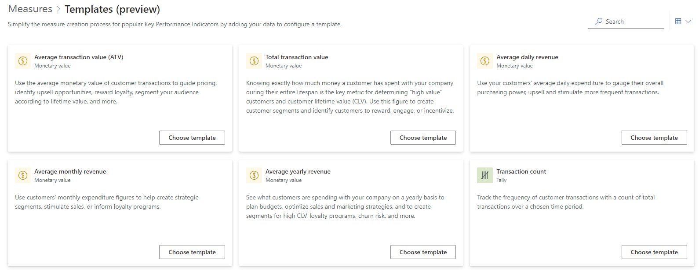
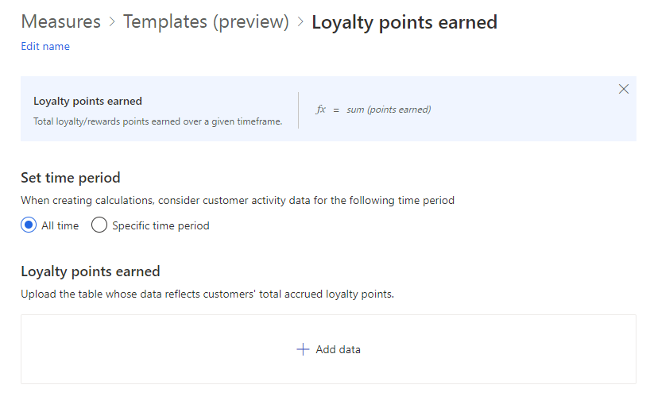
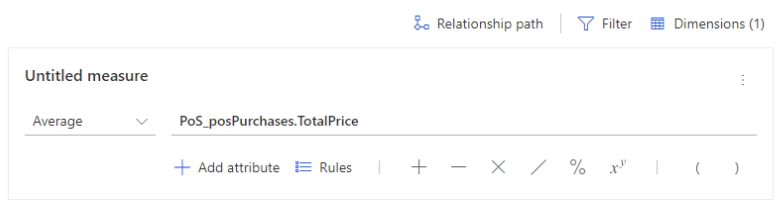
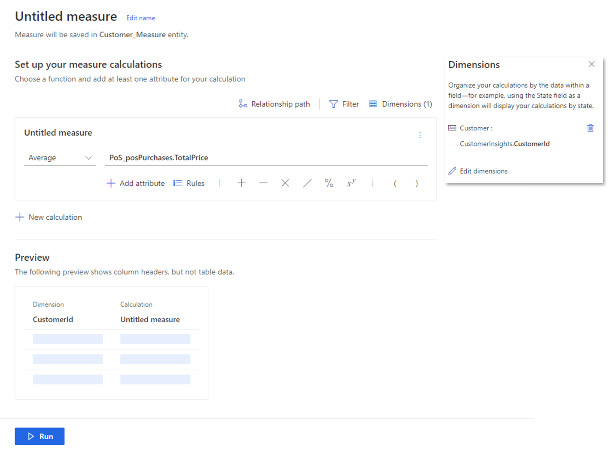
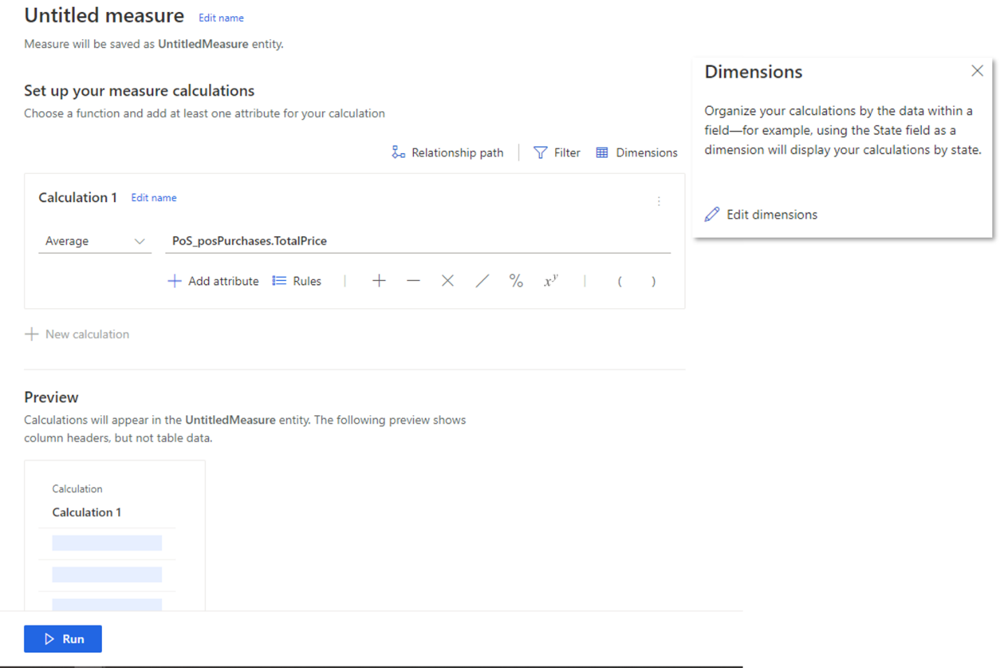
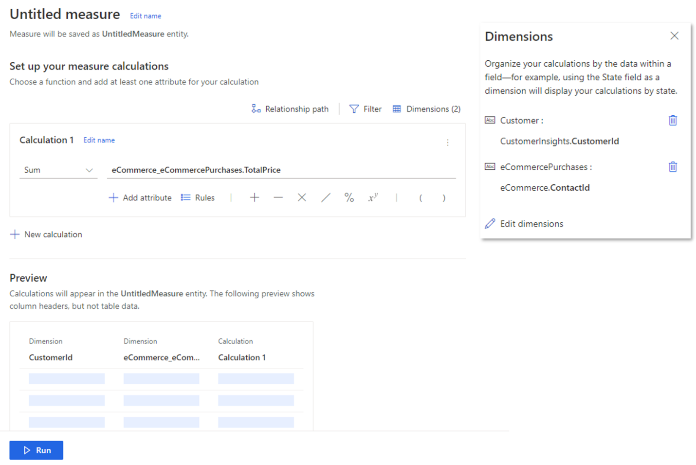
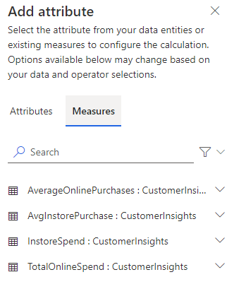
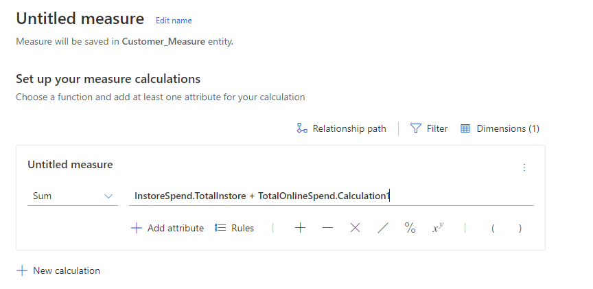
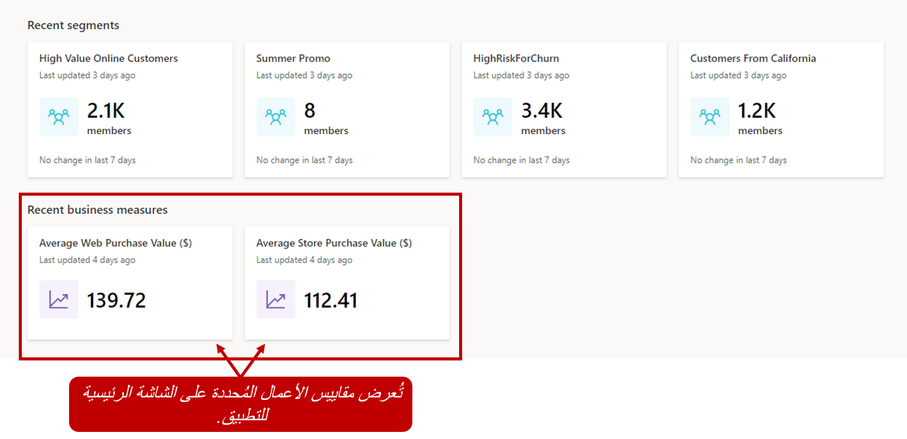
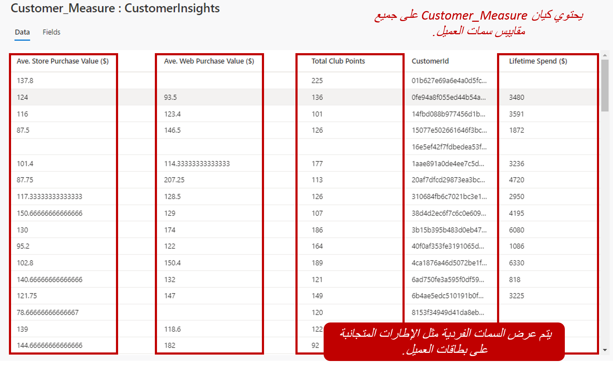

كي تتمكن فعلاً من الحصول على منظور من 360 درجة لعملائك، تحتاج إلى تعقب مؤشرات الأداء الأساسية (KPI) عبر جميع مصادر البيانات التي تعمل على استيعابها. ومن خلال تحديد مؤشرات الأداء الأساسية (KPI) عبر جميع المصادر، يمكنك الحصول على صورة أوضح للعميل بشكل عام. تستخدم Customer Insights **القياسات** لتعريف مؤشرات الأداء الأساسية (KPI) التي تعكس أداء أعمالك وسلامتها على أفضل وجه. وباستخدام القياسات، يمكنك تحديد القياسات المتعلقة بالعميل مثل قيمته العمرية. يمكنك أيضاً تعريف القياسات المتعلقة بسلامة الأعمال المجمعة، مثل المستخدمون النشطاء شهرياً. توفر Customer Insights تجربة بديهية تساعدك على تسهيل عملية إنشاء أنواع مختلفة من القياسات. وهي تتضمن معالج منشئ الاستعلام الذي لا يتطلب منك كتابة تعليمات برمجية أو التحقق من صحة استعلام يدوياً.

يمكن إنشاء ثلاثة أنواع مختلفة من القياسات في Customer Insights. وبحسب نوع القياس الذي تعرّفه، يمكن استخدامها في أجزاء مختلفة من التطبيق.

أنواع القياسات الثلاثة هي كالتالي:

- **سمة العميل** - تمثل هذه القياسات حقلاً واحداً لكل عميل.
  وهي تعكس عادةً نتيجة أو قيمة أو حالة مثل القيمة العمرية للعميل أو إجمالي المبيعات أو متوسط قيمة الشراء.

- **قياس العميل** - يوفر إدخالاً يتعلق بسلوك عميل فردي مع تصنيف تفصيلي حسب الأبعاد. على سبيل المثال، قياس إجمالي عدد الزيارات التي قام بها كل عميل لكل قناة أو إجمالي مبيعات العميل كل يوم.

- **قياس الأعمال‬** - يتعقب العناصر ذات الصلة بأداء أعمالك وسلامتها. وقد تشتمل هذه العناصر على عناصر مثل متوسط المبيعات لكل عميل والمستخدمون النشطاء شهرياً (MAU).

توفر القياسات التي تريد تعقبها، بعد تعريفها، مزايا متعددة:

- عرض قياسات الأعمال في الصفحة الرئيسية لمؤسستك.

- عرض قياسات خاصة بالعميل كجزء من بطاقة العميل.

- استخدام القياسات كمعايير لتعريف شرائح العملاء باستخدام صفحة **منشئ الاستعلام** .

يمكن حساب القياسات في حقول ملف التعريف، على سبيل المثال، استخدام قياس أعمال للعثور على متوسط تاريخ الميلاد عبر جميع العملاء.
علاوةً على ذلك، يمكن حساب القياسات من خلال تفاعلات مؤسستك مع أحد العملاء. تمثّل التفاعلات أي نقاط تواصل مع العميل عبر مصادر البيانات مثل عمليات الشراء أو حالات خدمة العملاء أو رسائل البريد الإلكتروني أو المكالمات الهاتفية أو زيارات الفروع. وبإمكان التفاعلات أن تمثّل أيضاً البيانات التي يتم جمعها من الأجهزة المتصلة أو عمليات السحب أو الإيداع في البنوك أو عمليات الدخول إلى/الخروج من موقع أو منطقة، وما إلى ذلك.

> [!IMPORTANT]
> ولأن مقاييس كثيرة تشتمل على كيانات مرتبطة، عليك تعريف العلاقات التي قد تكون مطلوبة لقياس ما قبل إنشاء القياسات. لمزيد من المعلومات حول العلاقات، راجع [تعريف العلاقات](/dynamics365/ai/customer-insights/pm-relationships/?azure-portal=true).

لأن نوع القياس الذي تعرّفه سيؤثر على المكان حيث سيُعرض في التطبيق وعلى كيفية عرضه، يجب عليك تخصيص بعض الوقت الإضافي لتحديد أنواع القياسات التي ستحتاج إليها. على سبيل المثال، إذا أردت مقارنة متوسط ​​قيمة جميع عمليات الشراء التي تمت في متاجرك في مقابل عمليات الشراء التي تمت عبر الإنترنت، فستحتاج إلى تحديد قياسين للأعمال.

إذا أردت معرفة المبلغ الذي أنفقه عميل فردي مدى الحياة أو متوسط ​​قيم عمليات الشراء التي قام بها في المتجر في مقابل عمليات الشراء التي قام بها عبر الويب، فعليك تعريف سمات العميل. يؤدي تعريف هذه القيم كسمات عميل إلى ضمان معاملة البيانات كحقول عند عرضها على بطاقات العملاء لكل عميل.

يمكنك إنشاء القياسات من صفحة **القياسات** عن طريق تحديد الزر **قياس جديد‬**. ويمكنك أن تختار إنشاء قياس يستند إلى قالب أو تحديد إنشاء قياس خاص بك من الصفر.

## قوالب القياسات

تتضمن Customer Insights قوالب قياسات متعددة يمكن استخدامها لتقليل الوقت المطلوب لإنشاء قياس خاص بك.

قوالب القياسات المتوفرة:

- متوسط قيمة الحركة (ATV)

- إجمالي قيمة الحركة

- متوسط الإيراد اليومي

- متوسط الإيراد السنوي

- عدد الحركات

- نقاط الولاء المُكتسبة

- نقاط الولاء المُستردة

- رصيد نقاط الولاء

- فترة حياة العميل النشط

- مدة عضوية الولاء

- الوقت منذ آخر عملية شراء

> [!div class="mx-imgBorder"]
> 

بالاستناد إلى القالب المحدد، سيتعين عليك أن تتأكد من أن البيانات المطلوبة لدعمه قد تم استيعابها في Customer Insights كنشاط.  على سبيل المثال، إذا حددت قالب "نقاط الولاء المُكتسبة‬"، فعليك أن تتأكد من أن النشاط الجاري استخدامه، مثل عمليات الشراء، يتضمن حقلاً يحدد عدد نقاط الولاء المُكتسبة لهذه الحركة.

> [!div class="mx-imgBorder"]
> 

### إنشاء من الصفر

إذا أشرت إلى رغبتك في إنشاء قياس من الصفر، فسيتم نقلك إلى منشئ القياس‬.  يسمح لك منشئ القياس بتصفية البيانات وتجميع النتائج والكشف عن مسارات العلاقات بين الكيانات ومعاينة إخراج القياس.

عندما تنشئ قياساً للمرة الأولى، عليك أن تحدد الكيان الذي سيستند إليه القياس.  يمكن إقران قياس بكيان واحد أو كيانات متعددة بحسب القياس. على سبيل المثال، قد يحتاج القياس الذي يحسب المبلغ الإجمالي لعمليات الشراء في المتجر إلى كيان واحد فقط. ومع ذلك، قد يحتاج القياس الذي يحسب القيمة مدى الحياة لجميع عمليات الشراء إلى بيانات لكل مصدر بيانات يحتوي على معلومات الشراء.

يتضمن كل قياس أبعاداً تساعد في تجميع البيانات في القياس.  بشكل افتراضي، يحتوي كل قياس جديد تقوم بإنشائه على ملف تعريف العميل كبُعد بشكل تلقائي.  ويمكن إضافة المزيد من الكيانات إلى القياس وفقاً لاحتياجاتك.  سنقوم لاحقاً بمناقشة الأبعاد في هذه الوحدة بشكل أكثر تفصيلاً.  

### العمليات الحسابية

سيكون لكل قياس عمليات حسابية تحصل على القيم الضرورية التي يحتاج إليها القياس، مثل العثور على متوسط ​​مبلغ الشراء.  في منطقة تكوين القياس، ستحدد دالة التجميع التي سيتم استخدامها في الحساب.  يمكنك استخدام القائمة المنسدلة **تحديد دالة** لتحديد الدالة التي تريد استخدامها.

تتضمن دالات التجميع المتاحة:

- **Sum**
- **Average**
- **Count**
- **Count Unique**
- **Max**
- **Min**
- **First**: تأخذ القيمة الأولى لسجل البيانات
- **Last**: تأخذ القيمة الأخيرة التي تمت إضافتها إلى سجل البيانات

بعد تحديد التجميع الذي تريد استخدامه للقياس، عليك تحديد البيانات التي سيستند إليها القياس.  على سبيل المثال، إذا أردت العثور على متوسط ​​سعر الشراء لعمليات الشراء عبر الإنترنت، فستحتاج إلى تحديد سمة السعر الإجمالي على كيان الشراء.   في الشاشة "إضافة سمة"، عليك أولاً توسيع كيان البيانات الذي يتضمن السمة التي تريد قياسها.  وستكون أي سمة يمكن استخدامها للقياس متاحة للتحديد.  حدد السمة التي تريد استخدامها في دالة التجميع. يمكنك تحديد سمة واحدة فقط في المرة الواحدة.

> [!div class="mx-imgBorder"]
> 

### الأبعاد

كما ذكرنا سابقاً، فإن أبعاد القياس هي أحد العناصر الرئيسية التي عليك تعريفها على القياس.  تعمل الأبعاد كوظيفة *تجميع حسب*.  وهي تساعد في تعريف كيفية تجميع قيم القياس.  سيتم تجميع البيانات الموجودة في كيان أو سمة القياس حسب جميع الأبعاد المعرّفة.  على سبيل المثال، إذا أردت تجميع القياسات حسب المدينة، فيمكنك إضافة حقل المدينة من ملف تعريف العميل إلى قياسك كعنصر بُعد.

بشكل افتراضي، عند إنشاء قياس جديد، يكون البُعد على مستوى ملف تعريف العميل.  وهذا يعني أنه سيتم تجميع القياس حسب عميل واحد.  تظهر هذه العناصر عادةً في التطبيق كقياس سمة العميل.  يتم تمثيل هذه القياسات كأعمدة جديدة على كيان ملف تعريف العميل وسيتم عرضها على شاشة ملف تعريف العميل.

> [!div class="mx-imgBorder"]
> 

إذا أزلت بُعد ملف تعريف العميل من القياس بحيث لا توجد أي أبعاد مضمنة، فيتم حساب القياس على مستوى العمل بدلاً من مستوى العميل.  تظهر هذه العناصر عادةً في واجهة المستخدم كقياسات أعمال.

> [!div class="mx-imgBorder"]
> 

### استخدام المتغيرات

في كثير من الأحيان، ستحتاج إلى إجراء حسابات للمتغيرات لكل سجل عميل للحصول على قيمة القياس.  على سبيل المثال، إذا أردت الحصول على القيمة العمرية للعميل، فستحتاج إلى تعريف قياس سيكون عبارة عن القيمة الإجمالية لعمليات الشراء في نقطة البيع إلى القيمة الإجمالية لعمليات الشراء عبر الإنترنت، لكل سجل من سجلات عملائك.

ولتحقيق ذلك، ستحتاج إلى قياسات متعددة تتضمن أبعاداً متعددة. على سبيل المثال، للحصول على القيمة الإجمالية لعمليات الشراء عبر الإنترنت لأحد العملاء، ستحتاج إلى إنشاء قياس يتضمن سمة معرف العميل من ملف تعريف العميل، وسمة معرف جهة الاتصال من كيان عمليات الشراء عبر الإنترنت.  يضمن هذا الأمر تجميع البيانات حسب المعرف نفسه لملف تعريف العميل. يُشار إلى أنواع القياسات هذه على أنها قياسات العميل.  لا تظهر قياسات العميل في واجهة المستخدم.  ويتم استخدامها عند إنشاء الشرائح أو لإنشاء قياسات سمات العميل.

> [!div class="mx-imgBorder"]
> 

كما ذكرنا سابقاً، يمكن استخدام القياسات بسهولة كمتغيرات في قياسات أخرى.  وعندما تقوم بتعريف السمات لحساب القياس، ستظهر أي قياسات يمكن استخدامها.

> [!div class="mx-imgBorder"]
> 

يمكن استخدام العمليات الحسابية من القياس في التعبير الإجمالي.  في الصورة أدناه، يتم استخدام قياسات إجمالي الإنفاق في المتجر وإجمالي الإنفاق عبر الإنترنت لحساب قيمة الإنفاق مدى الحياة.

> [!div class="mx-imgBorder"]
> 

### مسار العلاقة

في أحيان كثيرة، وبالاستناد إلى السمات التي حددتها للحساب، قد توجد مسارات متعددة بين كيان البيانات الذي قمت بتعيينه وكيان **العميل**.   على سبيل المثال، عندما قمت بتكوين Customer Insights، من المحتمل أن تكون قد أنشأت ارتباطاً بين كيان عمليات الشراء وكيانات عملاء متعددة.  وقد يكون مرتبطاً بجدول بيانات ولاء العميل وملف تعريف العميل الموحد.  في الصورة أدناه، تم تعيين بُعد القياس إلى معرف العميل في ملف تعريف العميل، والحساب عبارة عن متوسط يستند إلى حقل السعر الإجمالي في الجدول PosPurchases.

بما أن الجدول Pos_Purchases يرتبط بعميل في كل من الكيان LoyCustomers وملف تعريف العميل، عليك تحديد الكيان الذي يجب استخدامه لتحديده. يُعد هذا الأمر مهماً لأن النتائج قد تتغيّر وفقاً لما تحدده.

## عرض القياسات

ستظهر أي قياسات تقوم بإنشائها في صفحة **القياسات**. ستزوّدك القائمة بتفاصيل عالية المستوى مثل نوع القياس ومالك الإنشاء وتاريخ ووقت الإنشاء ومالك التحرير وتاريخ ووقت التحرير الأخير وتاريخ ووقت التحديث الأخير. عندما تحدد قياساً، سيعرض معاينة لإخراج القياس. يوجد عمود "الإجراءات" في الجانب الأيسر من القائمة. سيكون لكل قياس إجراءات مختلفة يمكنك تنفيذها عليه عن طريق تحديد علامة القطع ضمن "الإجراءات" الخاصة بهذا القياس. وعندما تحدد الإجراءات، يمكنك تحرير القياس أو عرض الإخراج أو إعادة تسميته أو حذفه.

بحسب نوع القياس الذي قمت بتعريفه، سيتم أيضاً عرض القياسات بالطرق التالية عبر التطبيق:

> [!div class="mx-imgBorder"]
> 

- **قياس العميل** - يمكن الوصول إلى هذا الخيار من كيان القياس الذي تم إنشاؤه للقياس من صفحة **الكيانات**.

- **سمة العميل** - يمكن الوصول إلى هذا الخيار من كيان Customer_Measure في صفحة **الكيانات**.

- **قياس الأعمال**:

  - **بدون أبعاد** - يمكن الوصول إلى هذا الخيار من الصفحة الرئيسية تحت قسم **الرؤى**.

  - **بُعد واحد أو أكثر** - يمكن الوصول إلى هذا الخيار من كيان القياس الذي تم إنشاؤه للقياس من صفحة **الكيانات**.

> [!div class="mx-imgBorder"]
> 

&nbsp;
> [!VIDEO https://www.microsoft.com/videoplayer/embed/RWFVrT]
