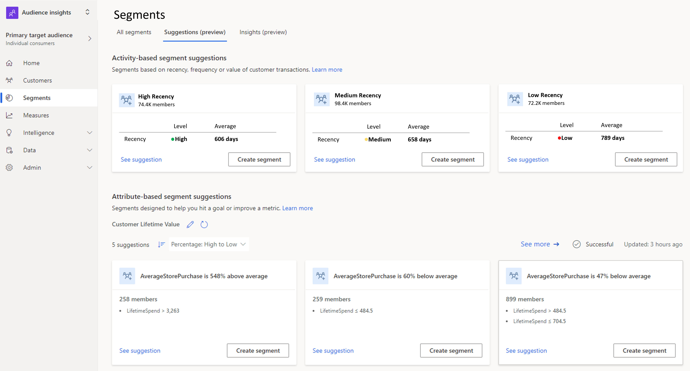

حتى الآن، كنا نبني الشرائح يدوياً بالاستناد إلى معايير نحددها أثناء قيامنا ببناء الشرائح. في أغلب الأحيان، لا يمكنك الذهاب إلى أبعد من ذلك. في أحيان كثيرة، بإمكان المؤسسات تفويت فرص استهداف العملاء المناسبين لأنها غير قادرة على أن تحدد بسهولة العملاء الذين يجب أن تستهدفهم. ومع تطور عملائك، قد تجد أنه عليك التركيز على عملاء ناشئين، لم يكونوا على هذا القدر من الوضوح في بادئ الأمر.

تساعدك Customer Insights على اكتشاف شرائح من عملائك مثيرة للاهتمام بمساعدة نموذج الذكاء الاصطناعي. بإمكان هذه الميزة التي يدعمها التعلم الآلي اقتراح الشرائح بالاستناد إلى القياسات أو سمات العميل. ويمكنها أن تساعد على تحسين مؤشرات الأداء الأساسية‬ (KPI) وعلى تكوين فهم أفضل لتأثير السمات في سياق السمات الأخرى.

على سبيل المثال، يمكنك استخدام اقتراحات الشرائح لتحديد ما إذا كان العملاء في شرائح معينة لديهم وقت مفضل خلال اليوم يرغبون فيه في التفاعل. باستخدام اقتراحات الشرائح، يمكنك تحديد العملاء الذين لديهم تفضيل لوقت معين خلال اليوم وجعل النظام يساعدك في إنشاء شرائح بالاستناد إلى تلك البيانات. تسمح لك Customer Insights بتكوين إمكانيات الشرائح المقترحة بالاستناد إلى القياسات أو الأنشطة.

> [!div class="mx-imgBorder"]
> 

## إنشاء شرائح مقترحة

يمكن إنشاء اقتراحات الشرائح بالاستناد إلى القياس بالانتقال إلى **الشرائح** وتحديد علامة تبويب "الاقتراحات (معاينة)". يؤدي تحديد "الحصول على اقتراحات جديدة" إلى بدء تجربة إرشادية‬ جديدة.

يمكنك إنشاء اقتراحات الشرائح بالاستناد إلى:

- قياس

- أو سمة عميل

ستحتاج أيضاً إلى تحديد السمات التي يجب اعتبارها كسمات مؤثرة. بالاستناد إلى احتياجاتك، يمكنك تحديد سمة واحدة أو سمات متعددة. سيؤدي تحديد سمات متعددة إلى تحسين فرص تقييم كيفية تأثيرها على السمة الأساسية.

> [!div class="mx-imgBorder"]
> 

## الشرائح المقترحة بالاستناد إلى القياسات

كونك مستخدم Customer Insights، ستحصل على سلسلة من [القياسات المُنشأة](/dynamics365/customer-insights/audience-insights/measures/?azure-portal=true) التي تساعدك على تعقب مؤشرات الأداء الأساسية (KPI). من الضروري أن تفهم كيف تؤثر سمات معينة على مؤشر الأداء الأساسي (KPI) هذا لمساعدتك في إنشاء شرائح أفضل وتشغيل حملات أكثر استهدافاً. على سبيل المثال، لنفترض أنك تتعقب قياساً يسمى **TotalSpendPerCustomer**. كونك صاحب نشاط تجاري، تريد أن يشهد هذا الرقم نمواً.

عندما تنشئ اقتراح شريحة يستند إلى قياس، يمكنك تحديد السمات التي تريد تقييم تأثيرها. ربما تقول **مستوى العضوية** و **فترة الاشتراك** و **الوظيفة**.

باستخدام هذه المعلومات، بإمكان Customer Insights أن يقترح عندئذٍ شريحة تخبرك عمن لديه التأثير الأكبر على هذا القياس. على سبيل المثال، قد يخبرك أن **المحاسبين** من أعضاء الفئة **الذهبية**، الذين يتعاملون مع شركتك مند **خمس سنوات على الأقل** هم من أكبر المؤثرين على **TotalSpendPerCustomer**.

## الشرائح المقترحة بالاستناد إلى سمات العميل

بدلاً من القياس، يمكنك اختيار سمة عميل. بالاستناد إلى اختيارك للسمات المؤثرة، يُنشئ نموذج الذكاء الاصطناعي سلسلة من الاقتراحات التي تبين كيفية تأثير السمات المحددة على السمة الأساسية. على سبيل المثال، لنفترض أنك اخترت **العضو الذي حصل على مكافآت (نعم/لا)** كسمة أساسية. تستخدم بعد ذلك **فترة تولي الوظيفة** و **الوظيفة** و **عدد تذاكر الدعم** المعينة كسمات مؤثرة أخرى. قد يقترح نموذج الذكاء الاصطناعي شرائح تشير في الغالب إلى أن محترفي تكنولوجيا المعلومات الذين تزيد فترة توليهم الوظيفة عن سنتين هم من الأعضاء الذين حصلوا على مكافآت. قد يسلّط اقتراح آخر الضوء على أن المحاسبين الذين تزيد فترة توليهم الوظيفة عن سنة واحدة ولديهم أقل من ثلاث تذاكر دعم هم من الأعضاء الذين حصلوا على مكافآت.

عندما تحدد قياساً أو سمة عميل للاقتراح، وبعد قيام نموذج الذكاء الاصطناعي بإنشاء الاقتراحات، ستجدها مدرجة في القائمة **الشرائح** > **الاقتراحات (معاينة)**. يمكنك تحديد شريحة مقترحة لمراجعة تفاصيل هذا الاقتراح. يمكنك أيضاً مراجعة قيم السمات أو القواعد التي تعلمها نموذج الذكاء الاصطناعي لاقتراح الشريحة المحددة.

إذا أردت حفظ الاقتراح كشريحة، فيمكنك تحديد الشريحة التي تريد حفظها واختيار **حفظ كشريحة**. ستظهر الشريحة، بعد حفظها، في قائمة الشرائح على علامة التبويب **جميع الشرائح‬**. يمكن الآن [تحديثها أو تحريرها أو حذفها كأي شريحة أخرى](/dynamics365/customer-insights/audience-insights/segments/?azure-portal=true).

## الشرائح المقترحة بالاستناد إلى النشاط

إلى جانب اكتشاف الشرائح بالاستناد إلى القياسات التي حددتها، يمكنك أيضاً اكتشاف شرائح مثيرة للاهتمام بالاستناد إلى بيانات نشاط العميل التي يتم استيعابها في Customer Insights. من الأمثلة عن بيانات النشاط الحركات أو مدة مكالمة الدعم أو عمليات الشراء أو المرتجعات. لاقتراح شرائح، يتم تحليل بيانات النشاط من حيث الحداثة والتكرار والقيمة النقدية (أو المدة). بدلاً من ذلك، يمكنك إنشاء [شرائح مقترحة لتحسين قياس أو تكوين فهم أفضل للعناصر التي تؤثر على السمة](/dynamics365/customer-insights/audience-insights/suggested-segments/?azure-portal=true).

> [!div class="mx-imgBorder"]
> 

باستخدام [بيانات النشاط](/dynamics365/customer-insights/audience-insights/activities/?azure-portal=true) المتوفرة في Customer Insights، يمكننا إنشاء اقتراحات تمثل مجموعات من العملاء.

- العملاء الأكثر نشاطاً

- العملاء الذين نفذوا أكبر عدد من عمليات الشراء

- العملاء الذين حققوا أكبر قدر من الإيرادات

- العملاء الذين لم ينفذوا أي نشاط مؤخراً

- العملاء الذين يتفاعلون مع أعمالك بشكل متكرر

إذا كان لديك شركة بيع بالتجزئة، فيمكنك معرفة العملاء الذين يحققون أكبر قدر من الإيرادات ومكافأتهم بقسيمة. أو يمكنك تحديد العملاء العرضيين والاقتراح عليهم الانضمام إلى برنامج المكافآت حتى تتكرر زياراتهم لشركتك. إذا كنت تعمل في مجال الرعاية الصحية وتقدم رعاية صحية عامة وهدفك هو تقليل النفقات لمرضى فرديين، فيمكنك القيام بذلك من خلال تقليل عدد الزيارات المتكررة عن طريق توفير أفضل رعاية ممكنة بأقل عدد ممكن من الزيارات. وفي هذه الحالة، هدفك هو إبقاء معدل تكرار الزيارات منخفضاً وتقليل التكلفة المتكررة التي يتكبدها المرضى. أو يمكنك تحديد شرائح المرضى الذين لديهم مواعيد متكررة وتكاليف متكررة عالية وتحليل هذه الحالات لتحسين علاج الفرد.

يتم إنشاء الاقتراحات بالاستناد إلى بيانات الإدخال المحددة.

- **ملفات تعريف العملاء:** جميع العملاء أو الأعضاء في شريحة معينة.

- **الفترة الزمنية**: الشهر الماضي أو السنة الماضية أو أي إطار زمني مخصص.

- **نوع النشاط**: عمليات شراء وحركات بيع بالتجزئة وحركات عبر الإنترنت وحالات دعم العملاء واشتراكات وما إلى ذلك.

- **كيان في Customer Insights يحتوي على بيانات النشاط:** كيان النشاط الموحد أو الكيان الخاص بنشاط معين.

- **الأبعاد التي يجب تضمينها:** بُعد الحداثة أو التكرار أو البُعد النقدي، حسب متطلبات عملك.

يمكن إنشاء اقتراحات الشرائح بالاستناد إلى النشاط بالانتقال إلى **الشرائح،** وتحديد **البحث عن اقتراحات جديدة،** وتحديد **شاهد سلوك العميل أو توقعه‬.** عند تكوين اقتراحات النشاط، ستحتاج إلى تعيين الخيارات التالية:

- **العملاء:** تعريف العملاء الذين ترغب في تضمينهم. يمكنك تحديد جميع العملاء الذين تختارهم من شريحة معينة.

- **النشاط:** حدد نوع النشاط الذي تريد استخدامه إلى جانب الكيانات التي تصف النشاط.

- **التفضيلات:** حدد الفترة الزمنية التي يجب مراعاتها والعوامل الخاصة بالاقتراحات، ثم قم بتعيين السمات.

    > [!div class="mx-imgBorder"]
    > 

بعد قيام نموذج الذكاء الاصطناعي بإنشاء الاقتراحات، ستجدها مدرجة في القائمة **الشرائح** > **الاقتراحات (معاينة) في قسم الاقتراحات التي تستند إلى النشاط**. حدد شريحة مقترحة لمراجعة تفاصيل هذا الاقتراح. يمكنك أيضاً مراجعة قيم السمات أو القواعد التي تعلمها نموذج الذكاء الاصطناعي لاقتراح الشريحة المحددة.

> [!div class="mx-imgBorder"]
> 

إذا أردت حفظ الاقتراح كشريحة، فيمكنك تحديد الشريحة التي تريد حفظها وتحديد "حفظ كشريحة" في الجزء الجانبي. ستظهر الشريحة، بعد حفظها، في قائمة الشرائح على علامة التبويب **جميع الشرائح‬**. يمكن الآن [تحديثها أو تحريرها أو حذفها كأي شريحة أخرى](/dynamics365/customer-insights/audience-insights/segments/?azure-portal=true).

حدد **راجع الاقتراح** على شريحة مقترحة لرؤية تفاصيل هذه الشريحة. يوفر الجزء الجانبي تفاصيل مثل مدى كل بُعد مقارنة بالمجموعة المستهدفة. وهو يسلط الضوء أيضاً على عدد الأعضاء المحتملين في الشريحة والنسبة المئوية المناظرة لإجمالي عدد العملاء. إذا أردت الاحتفاظ بالاقتراح كشريحة، فحدد **إنشاء شريحة**.
