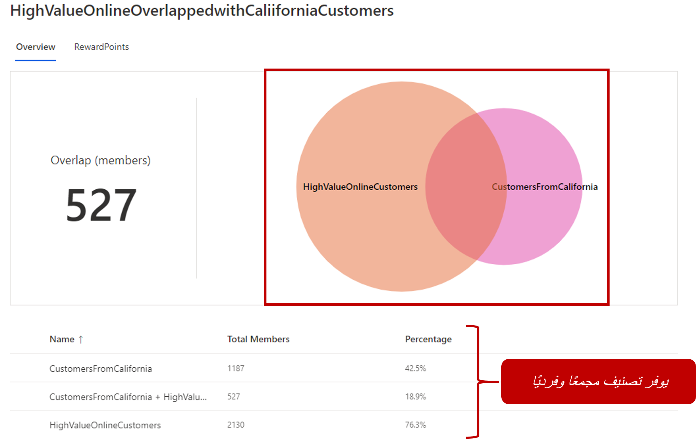
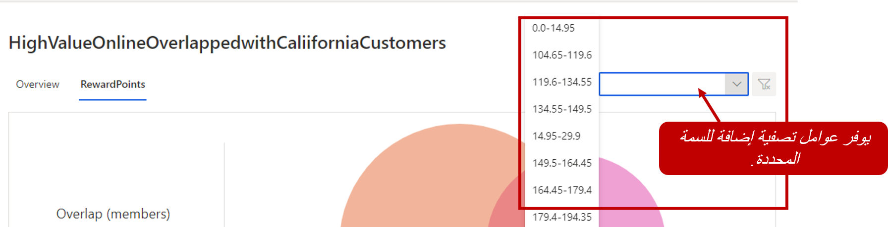
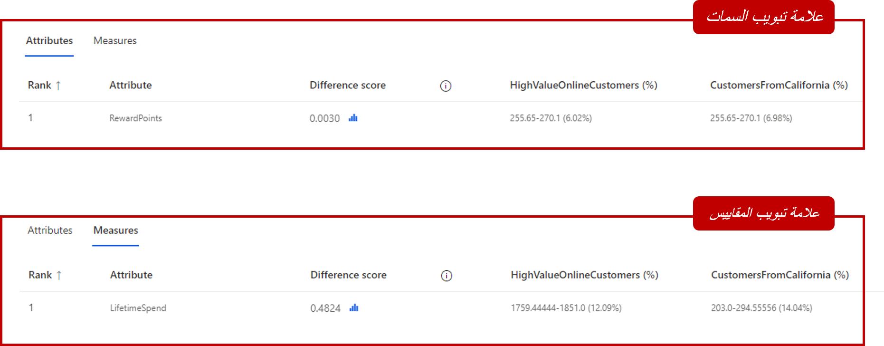
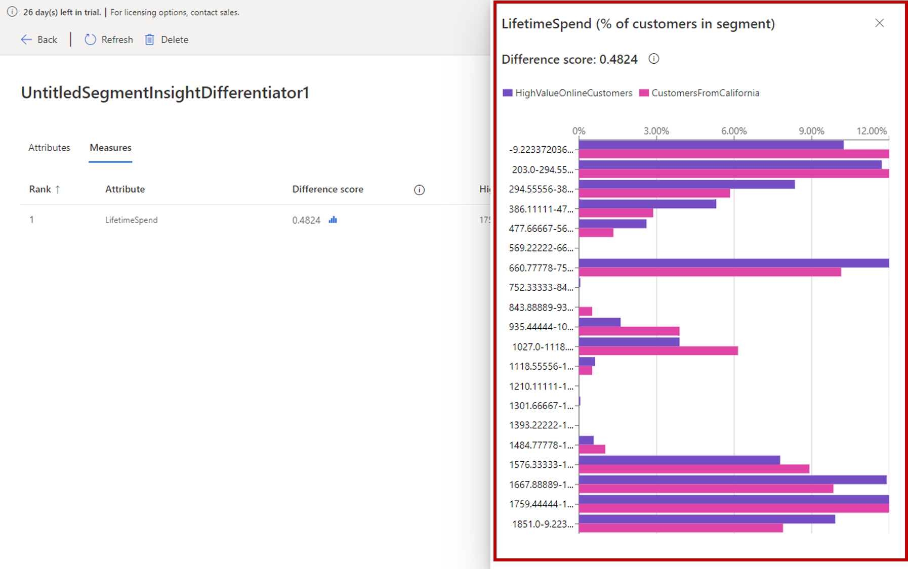
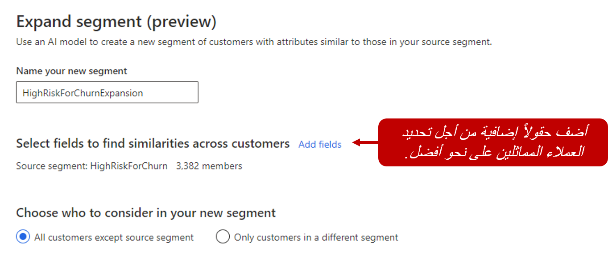
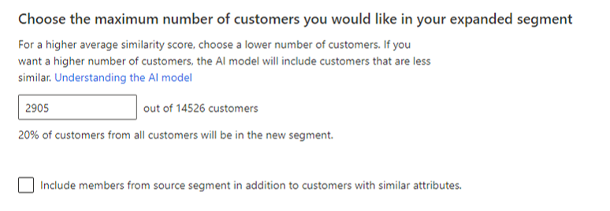

لا تُستخدم الشرائح لعناصر مثل القياسات، ولكن يمكن أيضاً تصديرها واستخدامها في إعدادات أخرى. على سبيل المثال، يمكن تصدير شريحة إلى Dynamics 365 Marketing، حيث يمكن استخدامها في رحلات العميل. مع تكرار استخدام الشرائح، قد ترغب في فهم كيفية ارتباط مختلف الشرائح ببعضها البعض. وقد يشمل ذلك فهم أوجه اختلافها والعناصر المشتركة بينها. بإمكان ذلك أن يساعد في اتخاذ قرارات أفضل تتعلق بالشرائح التي يجب أن تستهدفها عبر مختلف العروض الترويجية والحملات وأنشطة العملاء وما إلى ذلك. على سبيل المثال، بينما تخطط لاستراتيجيتك التسويقية للأشهر الستة القادمة، قد ترغب في تحديد مقدار تداخل العملاء بين الشرائح التي سيتم استهدافها في الحملات. من خلال تحديد هذه المعلومات، بإمكان المؤسسات أن تخطط بشكل أكثر فاعلية لطريقة عملها مع العملاء.

وللمساعدة في ذلك، تتضمن Customer Insights ميزات متعددة لفحص الشرائح وتوسيعها. هناك ميزة تسمى رؤى الشرائح.

الأدوات الثلاث الرئيسية المتوفرة للرؤى والتوسيع هي:

- **تداخل العملاء:** تسمح لك بعرض الأعضاء المشتركين بين الشرائح بشكل بياني.

- **عوامل تمييز الشرائح‬:** شاهد ما يميز الشرائح عن بعضها البعض، أو عن بقية عملائك.

- **البحث عن العملاء المتشابهين‬:** يسمح لك هذا الخيار بإنشاء شريحة بالاستناد إلى شريحة تتضمن عملاء لديهم ملف تعريف مماثل لملف تعريف العملاء في الشريحة المحددة.

يمكن بدء "البحث عن العملاء المتشابهين" من شريحة موجودة. تُعد رؤى التداخل وعامل التمييز جزءاً من رؤى الشرائح التي يمكن الوصول اليها من علامة تبويب الرؤى (إصدار أولي).

## تداخل الشرائح

من خلال تحليل تداخل الشرائح، يمكنك معرفة عدد العملاء المشتركين في شريحتين أو أكثر. على سبيل المثال، قد تتداخل شريحة من العملاء الذين يتم الاتصال بهم بشكل متكرر مع شريحة تحتوي على عملاء راضين عن خدمتك أو منتجك. ضمن التحليل، يمكنك إجراء المزيد من التصنيف لعوامل التصفية على مستوى السمة لتصنيف الأرقام على مستوى الحقل.

بإمكان تحليل التداخل أن يحتوي بين شريحتين إلى 3 شرائح للمساعدة في عرض العملاء المشتركين بينها بشكل بياني. علاوةً على ذلك، يمكن استخدام ما يصل إلى خمسة مجالات اهتمام لتحليل التداخلات بشكل أفضل على المستوى الميداني. بعد إنشاء التحليل، يمكنك تعديله حسب الحاجة عن طريق ضبط الحقول المحددة لمعرفة كيفية تأثير التغييرات على النتائج. وبعد كل تغيير في معايير التحليل، يتم تحديث البيانات تلقائياً حتى تتمكن من عرض النتائج.

يحتوي كل تحليل على تقرير رسوم مرئية يعرض عدد العملاء المتداخلين بالاستناد إلى الشرائح المضمنة في التحليل. يحدد الجدول الموجود في الأسفل إجمالي الأعضاء لكل قائمة بالإضافة إلى النسبة المئوية لإجمالي النتائج. في الصورة أدناه، يمكنك أن ترى أن لدينا 527 عميلاً متداخلاً بين الشريحتين المضمنتين في التحليل، ما يمثل 18.9% فقط من إجمالي العملاء المجمعين من الشريحتين.

> [!div class="mx-imgBorder"]
> 

سيتم تمثيل أي حقول قمت بتضمينها أثناء التكوين بواسطة علامات تبويب مناظرة في أعلى التقرير. ويحتوي كل حقل على قائمة منسدلة تسمح لك بتصفية البيانات إلى مناطق أكثر استهدافاً.

> [!div class="mx-imgBorder"]
> 

## عوامل تمييز الشرائح

تساعد عوامل تمييز الشرائح في تحديد ما يميز شريحة معينة من العملاء عن باقي عملائك أو عن شريحة أخرى. أنت تحدد الشرائح التي تريد مقارنتها مع أي حقول يجب استخدامها كعامل تمييز. ومن الممكن أيضاً تحديد ما إذا كان يجب أيضاً تضمين أي قياسات موجودة. بعد حفظ التحليل، سيقوم بتحديث نفسه وعند اكتمال التحديث، ستتمكن من استخدامه.

يحتوي تحليل عامل التمييز على علامتي تبويب.

- **علامة تبويب السمات**: تسرد سمات ملف التعريف التي تُعتبر عوامل تمييز.

- **علامة تبويب القياسات**: تسرد عوامل التمييز.

    > [!div class="mx-imgBorder"]
    > 

تعرض كل علامة تبويب قائمة مرتبة تتضمن جميع عوامل التمييز وقد تم فرزها حسب درجة الاختلاف‬. تتعلق درجة الاختلاف بدرجة اختلاف إحدى السمات بين شريحتين. وبقدر ما تكون درجة الاختلاف عالية، يزداد اختلاف السمات بين الشريحتين. يؤدي تحديد درجة إلى فتح جزء درجة الاختلاف الذي ستوفر توزيعات القيم لتلك السمة.

> [!div class="mx-imgBorder"]
> 

## البحث عن العملاء المتشابهين

تستخدم ميزة "البحث عن العملاء المتشابهين‬" في Customer Insights الذكاء الاصطناعي للتعرّف على عملاء متشابهين عبر قاعدة عملائك أو في شرائح أخرى. قد يكون هذا الأمر مفيداً للمساعدة على توسيع عملية التقسيم إلى شرائح عملاء ناجحة إلى مناطق أخرى. على سبيل المثال، ربما قامت شركتك بتشغيل عملية إطلاق ناجحة لأحد المنتجات في منطقة معينة وتريد استنساخ تلك التجربة الناجحة في منطقة أخرى. تسمح لك ميزة "البحث عن العملاء المتشابهين‬" بالتعرّف على العملاء الذين من المحتمل أن يكون لديهم ملف التعريف نفسه في المنطقة التالية التي تريد استهدافها.

للتعرّف على العملاء المتشابهين، يجب إنشاء شريحة واحدة على الأقل. بعد ذلك، يمكنك تحديد الشريحة التي تريد استخدامها واختيار **البحث عن العملاء المتشابهين**. سيتم إنشاء شريحة جديدة بالاستناد إلى ملف التعريف المعرّف في شريحة العميل المحددة. ويمكنك مراجعة الحقول الموجودة أو إضافة أي حقول جديدة تريد استخدامها لتعريف شريحتك الجديدة. إنها تعرّف الأساس الذي سيستخدمه النظام للعثور على عملاء متشابهين للشريحة المصدر التي حددتها. وسيحاول النظام تحديد بعض الحقول المستحسنة بشكل افتراضي وسيستبعد تلقائياً أي حقول يمكنها تقليل أداء النموذج.

تتضمن هذه الحقول المستبعدة عادةً:

- الحقول التي تتضمن أنواع البيانات التالية: StringType وBooleanType وCharType وLongType وIntType وDoubleType وFloatType وShortType

- حقول ذات علاقة أساسية (عدد العناصر في حقل) أقل من 2 أو أكثر من 30

الجزء الأساسي من عملية التعرّف عل عملاء متشابهين هو تحديد العملاء الذين يجب تضمينهم في الشريحة الجديدة. ويمكنك تضمين جميع العملاء، باستثناء العملاء من الشريحة المصدر، أو فقط العملاء من شريحة موجودة معينة. بشكل افتراضي، لن يتم تضمين العملاء من الشريحة المصدر. يمكنك تضمين هؤلاء العملاء عن طريق تحديد خانة الاختيار **تضمين أعضاء من الشريحة المصدر بالإضافة إلى العملاء ذوي السمات المتشابهة**.

> [!div class="mx-imgBorder"]
> 

عندما تنشئ شريحة جديدة، يمكنك تعريف عدد العملاء المتشابهين الذين تريد تضمينهم من خلال تحديد نسبة مئوية للعملاء المطلوب تضمينهم. بشكل افتراضي، يتم تحديد 20% فقط من الجمهور المستهدف. وبينما يتم ضبط النسبة المئوية للدقة، يتم توسيع أعضاء الشرائح أو تقليلهم. تتأثر أيضاً درجة تشابه العملاء في الشريحة الجديدة مع العملاء في الشريحة الأصلية. على سبيل المثال، يؤدي تقليل عدد السجلات التي يجب تضمينها إلى تقليل عدد العملاء المضمنين، ولكن العملاء سيشبهون قاعدة العملاء المصدر. وتؤدي زيادة العدد إلى تضمين المزيد من العملاء، ولكنهم قد لا يكونوا بنفس درجة التشابه مع قاعدة العملاء الأصلية. بعد تعديل الإعدادات، حدد **تشغيل** في أسفل الصفحة لتحليل مجموعة البيانات.

> [!div class="mx-imgBorder"]
> 

يُستخدم التصنيف الثنائي لتسجيل درجة العملاء الذين تم إرجاعهم في الشريحة المماثلة. تستند الدرجة إلى تشابه العملاء في الشريحة المصدر.

فيما يلي تصنيف لكيفية تعريف تسجيل الدرجة:

- **أقل 0.55:** العملاء *غير متشابهين* مع العملاء في الشريحة المصدر

- **بين 0.55--0.7:** العملاء *متشابهون*

- **بين 0.7--0.85:** العملاء *متشابهون*

- **بين 0.85--1:** العملاء *متشابهون‏‎*

بعد إنشاء الشريحة الجديدة، استخدمها كما تستخدم أي شريحة أخرى. على سبيل المثال، يمكنك تصدير الشريحة لاستخدامها في تطبيق آخر أو إنشاء قياس منها.
