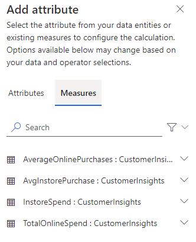

تسمح لك إمكانية التقسيم في "رؤى الجمهور" بتجميع عملائك بالاستناد إلى السمات الديموغرافية أو سمات الحركات أو السمات أو السلوكية. ويمكنك استخدام التقسيم لاستهداف الحملات الترويجية وأنشطة المبيعات وإجراءات دعم العملاء لتحقيق أهداف عملك.

يمكنك تعريف عوامل تصفية معقدة حول كيان ملف تعريف العميل ورسمه البياني للكيانات ذات الصلة. تعرض كل شريحة، بعد معالجتها، مجموعة من سجلات كيانات العميل التي يمكنك تصديرها والعمل عليها.

هناك نوعان من الشرائح:

- **ثابتة**: شريحة تتم معالجتها مرة واحدة فقط—إما عند إنشاء أحد عوامل التصفية الخاصة بها أو عند تحديثه. تُعد هذا الشرائح مفيدة على وجه التحديد عندما لا تتغيّر الخصائص بمرور الوقت أو عند استخدامها مرة واحدة فقط. مثال عن حالة استخدام: العملاء الذين حضروا حدث معرض.

- **ديناميكية**: شريحة تتم معالجتها وفقاً لجدول مكرر. تُعد هذه الشرائح مفيدة على وجه التحديد عندما تتغيّر سمات العميل بمرور الوقت. على سبيل المثال، العملاء الذين قاموا بشراء منتجات تزيد قيمتها عن 500 دولار أمريكي خلال الأشهر الثلاثة الأخيرة. يتم تحديث الشرائح الديناميكية كل 12 ساعة.

يتم إنشاء الشرائح من صفحة **الشرائح**، حيث يمكنك عرض جميع الشرائح المحفوظة وتنفيذ إجراءات معينة. تظهر أي شرائح ديناميكية إلى اليمين. وتظهر الشرائح الثابتة إلى اليسار. تتمثّل كل شريحة بواسطة إطار متجانب يتضمن اسم الشريحة ووصفها والتاريخ الأخير لتحديث البيانات والاتجاه السابق (إن وجد).

بشكل مبدئي، عندما تنشئ شريحة، عليك تعريف المعلمات التالية:

- **النوع** *(مطلوب)* - يحدد ما إذا كانت الشريحة ستكون شريحة ديناميكية أو شريحة ثابتة.

- **الاسم** *(مطلوب)* - الاسم الذي يظهر للشريحة في صفحة **الشرائح**.

  يجب أن تبدأ الأسماء بحرف ويمكنها أن تحتوي على أرقام وأحرف فقط. لا يُسمح باستخدام المسافات أو الأحرف الخاصة.

- **اسم العرض** *(اختياري)* - اسم العرض هو اسم الشريحة الذي سيظهر في التطبيق بكامله ويتميز بسهولة قراءته.

  بإمكان اسم العرض أن يحتوي على أحرف وأرقام ومسافات وأحرف خاصة.

> [!div class="mx-imgBorder"]
> 

## تعريف مجموعة

عند إنشاء الشرائح، أول مهمة عليك القيام بها هي تعريف كيفية تجميع البيانات في شريحتك. تحتوي كل مجموعة على عامل تصفية يعرّف السجلات التي يجب تضمينها في المجموعة، مثل جميع العملاء الذين يبلغ متوسط ​​قيمة الشراء عبر الويب لديهم أكثر من 139.00 دولاراً أمريكياً. يحتوي تعبير عامل التصفية على أربعة أجزاء:

- **الكيان** - تعريف الكيان الذي يتضمن السمة المحددة التي ترغب في استخدامها للتقسيم. قد يكون هذا العنصر كيان ملف تعريف العميل أو قياساً تم إنشاؤه، أو إذا قمت باستيعاب أحد الكيانات.

- **السمة** - تعريف الحقل الذي تريد استخدامه كشريحة.

- **العامل** - تعريف عامل المقارنة الذي سيتم استخدامه في مقابل قيمة.

- **القيمة** - تعريف القيمة التي يستخدمها العامل للمقارنة.

يجب أن ينتهي كل عامل تصفية تقوم بتعريفه بكيان ملف تعريف العميل. والسبب هو أن كيان ملف تعريف العميل هو المكان الذي سيتم سحب السجلات منه. يمكنك إضافة العدد الذي تريده من الكيانات ذات الصلة التي تحتاج إليها لتحسين النتائج. ولكن يجب أن تكون معايير التصفية الأخيرة في كيان ملف تعريف العميل. يمكنك أيضاً استخدام العامل "جميع السجلات" إذا لم تكن بحاجة إلى تقسيم بياناتك بواسطة أي من حقول كيان ملف تعريف العميل.

يمكن استخدام العاملين المنطقيين التاليين عندما تريد تضمين بيانات ذات صلة:

- **AND** - يجب استيفاء الشرطين كجزء من عمليه التقسيم. يكون هذا الخيار مفيداً جداً عندما تقوم بتعريف الشروط عبر كيانات مختلفة.

- **OR** - في هذه الحالة، لا يجب استيفاء أي شرط من الشرطين كجزء من عملية التقسيم. يكون هذا الخيار مفيداً جداً عندما تقوم بتعريف شروط متعددة للكيان نفسه.

في الوقت الحالي، يمكن احتواء العامل **OR** تحت العامل **AND** ولكن ليس العكس.

> [!div class="mx-imgBorder"]
> 

> [!IMPORTANT]
> ستحتاج إلى تعريف جميع العلاقات قبل استخدامها في شريحة.

في بعض الأحيان، قد ترغب في إضافة المزيد من المجموعات للمساعدة في تحسين كيفية تقسيم العملاء إلى شرائح. سيكون لكل مجموعة تقوم بتعريفها سجلات ناتجة خاصة بها.

على سبيل المثال، لنأخذ في الاعتبار سيناريو حيث قمت بتعريف المجموعتين التاليتين لإحدى الشرائح:

- **المجموعة 1** - تتضمن العملاء الذين يزيد متوسط ​​مشترياتهم عبر الويب عن 139.00 دولاراً أمريكيا (50 سجلاً).

- **المجموعة 2** - تتضمن العملاء الذين يقيمون في نيويورك ويزيد إنفاقهم مدى الحياة عن 3000.00 دولار أمريكي (40 سجلاً).

وبينما تعمل على إضافة المزيد من المجموعات، يمكنك تعريف كيفية المحافظة على البيانات المشتركة بين المجموعتين. يمكنك الاختيار من ضمن ثلاثة خيارات وهي:

- **اتحاد** - توحيد المجموعتين معاً كمجموعة واحدة، مما يؤدي إلى إنشاء مجموعة أكبر بشكل إجمالي.

  في المثال السابق، سيتم دمج المجموعتين 1 و2 وستحتوي الشريحة على إجمالي من 90 سجلاً.

- **تقاطع** - يؤدي إلى تداخل المجموعتين. يتم الحفاظ فقط على البيانات *المشتركة* بين المجموعتين في المجموعة الموحدة.

  في المثال السابق، ستتم تصفية 50 سجلاً من المجموعة 1. وبالتالي، يتم تضمين السجلات التي تفي بشروط المجموعة 1 والمجموعة 2 فقط. سيتم تضمين فقط عملاء نيويورك الذين يزيد متوسط ​​مشترياتهم عبر الويب عن 139.00 دولاراً أمريكياً ويزيد إنفاقهم مدى الحياة عن 3000.00 دولار أمريكي.‬

- **استثناء** - دمج المجموعتين. يتم الحفاظ فقط على البيانات *غير المشتركة* بين المجموعتين في المجموعة الموحدة.

  في المثال السابق، قد تُزال أي سجلات تتطابق مع معايير المجموعة 1 والمجموعة 2. سيتم عرض فقط العملاء خارج نيويورك الذين يقل متوسط ​​مشترياتهم عبر الويب عن 139.00 دولاراً أمريكياً ويقل إنفاقهم مدى الحياة عن 3000.00 دولار أمريكي.

> [!div class="mx-imgBorder"]
> 

عندما تحفظ شريحتك، يتم اختبارها للتأكد من أنها صالحة. إذا لم يتم استيفاء المتطلبات، فيتم حفظها كمسودة.
تُعد الشرائح في وضع المسودة شرائح غير نشطة غير متاحة للاستخدام. يمكن إلغاء تنشيط الشرائح يدوياً إذا كنت تريد إجراء عمليات تحرير أو ببساطة لا تريدها أن تكون متاحة للتشغيل.

إذا كانت الشريحة في وضع المسودة لأنها تحتوي على وسيطات غير صالحة، فلن تتمكن من تشغيل الشريحة أو تنشيطها حتى تقوم بتصحيح الوسائط غير الصالحة ويتم اعتبارها شريحة صالحة.

## إدارة الشرائح

سيكون لكل شريحة تم تعريفها خيارات مختلفة يمكن تنفيذها عليها مثل إلغاء تنشيطها، عند الحاجة، أو إدخال تغييرات على القائمة. يمكنك الوصول إلى الخيارات المتاحة عن طريق تحديد علامة القطع على الإطار المتجانب للشريحة. يمكنك التحديد من ضمن الخيارات التالية:

- تحرير الشريحة

- عرض أعضاء الشريحة

- تصدير الشريحة إلى ملف CSV أو إلى موقع Dynamics 365 Sales

- تغيير شريحة ديناميكية إلى غير نشطة أو نشطة (بحسب حالتها الأساسية)

- تشغيل شريحة ثابتة

- حذف الشريحة

> [!div class="mx-imgBorder"]
> 

## عرض محفوظات المعالجة وأعضاء الشرائح

لأن أعضاء الشريحة الديناميكية سيتغيرون، فقد ترغب في تتبع الطريقة التي يتغير بها أعضاء القائمة بمرور الوقت. يمكن فتح كل شريحة لعرض صفحة **الشريحة**. وتدمج صفحة **الشريحة** البيانات على مستوى الشريحة. يتضمن الجزء العلوي من الصفحة رسماً بيانياً للاتجاه يحدد التغييرات في عدد أعضاء هذه الشريحة. كذلك الأمر، إذا قمت بالمرور بالماوس فوق كل نقطة بيانات، فستعرض عدد الأعضاء لتلك النقطة.
في أعلى الرسم البياني، يمكنك العثور على عدد الأعضاء الحاليين ونمو الأسبوع الماضي.

يتضمن الجزء السفلي من الصفحة جدولاً يحتوي على جميع أعضاء الشريحة.

تستند الحقول المحددة التي تظهر في هذا الجدول إلى سمات كيانات شريحتك. يعرض هذا الجدول فقط معاينة لسجلاتك. وهو يقدم أول 100 سجل من شريحتك بحيث يمكنك تقييم شريحتك بسرعة والعودة إلى صفحة محرر الشريحة لتغيير تعريفاتها.

> [!div class="mx-imgBorder"]
> 

## الشرائح الموصى بها

إلى جانب منشئ الشرائح، هناك طريقة أخرى يمكنك من خلالها إنشاء الشرائح وهي من خلال منشئ الشرائح الموصى بها. الشرائح الموصى بها هي خيار إنشاء سريع يتيح لك إنشاء شرائح بسيطة بعامل واحد.
يمكن إنشاء الشرائح من:

- **ملفات التعريف** - إنشاء شريحة بالاستناد إلى كيان العميل الموحد.

- **القياسات** - إنشاء شريحة حول كل نوع من أنواع قياسات سمات العميل التي تم إنشاؤها سابقاً.

سيرشدك مربع الحوار **شريحة سريعة جديدة** عبر عملية إنشاء شريحتك. يحتوي مربع الحوار على ثلاثة خيارات:

- **الحقل** - تعريف السمة التي تريد استخدامها كأساس لشريحتك.

- **العامل** - تعريف العامل الذي تريد استخدامه.

- **القيمة** - القيمة الأساسية التي ستُستخدم لمقارنة العامل.

بحسب نوع السمة التي تحددها في البداية، سيوفر النظام بعض الرؤى الأخرى التي تساعدك في إنشاء شرائح أفضل لعملائك. على سبيل المثال، إذا حددت حقلاً فئوياً، فسيعرض التطبيق أول 10 أعداد للعملاء. لن يتم تزويدك بعامل، ما عليك سوى تحديد قيمة. بالنسبة إلى سمة رقمية، سيعرض النظام قيمة السمة التي تقع تحت القيمة المئوية لكل عميل. وفي هذه الحالة، ستحتاج إلى اختيار "عامل" و"قيمة".

بعد حفظ شريحتك، سيقوم النظام بمعالجة الأعضاء. بعد أن تكتمل المعالجة التي يجريها النظام، يمكنك عرض شريحتك كأي شريحة أخرى أنشأتها.

> [!div class="mx-imgBorder"]
> 

&nbsp;
> [!VIDEO https://www.microsoft.com/videoplayer/embed/RWFQGp]
