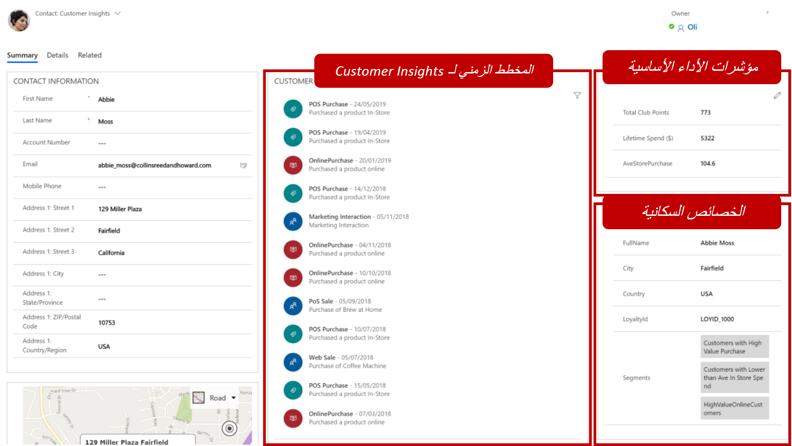
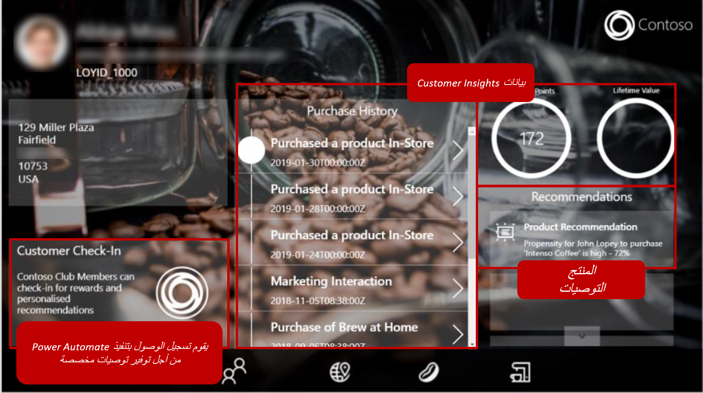
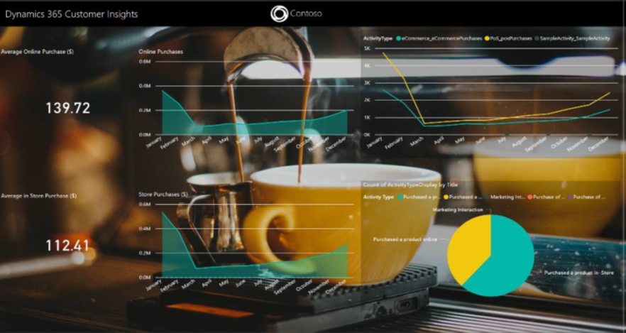

يبسط رؤى الجمهور قدرة مؤسستك على توحيد بيانات العملاء وفهمها عبر مصادر البيانات المختلفة.
بالإضافة إلى ذلك، يمكن توسيعه ليشمل تطبيقات أخرى لإنشاء حل كامل. تتيح هذه الإمكانية للمستخدمين في مؤسستك الاستفادة من بيانات رؤى الجمهور في سياق دورهم في المؤسسة وفي تفاعلاتهم مع العميل.

بعد تكوين المكونات الضرورية، يمكنك استخدام رؤى الجمهور لتحسين التطبيقات التالية:

- **التطبيقات المستندة إلى النموذج** - يمكن للجمهور استيعاب البيانات من التطبيقات المستندة إلى النموذج مثل Dynamics 365 Sales أو Dynamics 365 Customer Service. بالإضافة إلى ذلك، يمكن أن تظهر الرؤى التي تم التقاطها في التطبيق مباشرةً في سجلات العملاء في التطبيقات المستندة إلى النموذج.

- **Power Apps** - يمكن توصيل التطبيقات التي تم إنشاؤها في Power Apps بـ Dynamics 365 Customer Insights كمصدر بيانات فقط. تتيح لك هذه الإمكانية استخدام البيانات من ملف تعريف العميل الموحد والبيانات من التطبيقات الأخرى في وقت واحد.

- **Power Automate** - باستخدام Power Automate، يمكنك تشغيل الإجراءات في تطبيقات خط الأعمال الأخرى استنادًا إلى البيانات التي تظهر من رؤى الجمهور أو إلى الإجراءات التي يتم تشغيلها في التطبيقات المتصلة بـ رؤى الجمهور.

- **Power BI** - يمكّنك موصل رؤى الجمهور Power BI من استخدام ملف تعريف العميل الموحد داخل Microsoft Power BI لمزيد من التحليل واكتشاف الرؤية.

المثال التالي هو الشكل الذي قد يبدو عليه سيناريو العالم الحقيقي.

تنتج Contoso Coffeeآلات القهوة والقهوة عالية الجودة، والتي يبيعونها بالتجزئة من خلال القنوات التي تشمل متاجر Contoso الجديدة للبيع بالتجزئة في المواقع المتميزة، وبائعي المواد الغذائية المتميزين، وعلى موقع ويب Contoso Coffee.

تخطط Contoso لزيادة العروض الخاصة بها من خلال Contoso Cafésوماكينة قهوة متصلة جديدة يمكنها تشغيل أوامر إعادة الملء وتنبيه خدمة Contoso بأي مشكلات. هذا العرض الجديد سيساعد الشركة على بناء علاقات مباشرة مع عملائها ومعرفة المزيد حول كيفية استهلاك العملاء لمنتجاتها

## هدف الأعمال

نموذج الأعمال الحالي لدى Contoso لا يوفر لها بناء علاقات مباشرة مع العملاء. لهذا السبب، لا يمكنها تقديم تجارب مخصصة للعملاء. ترغب Contoso في بناء علاقة مباشرة ومفيدة مع جميع المستهلكين لتقديم تجربة عملاء استثنائية ومخصصة‬ من خلال الاتصالات ذات الصلة والتوصيات والخدمات المخصصة‬.

استوعبت Contoso جميع بياناتها في ملف تعريف عميل موحد يوفر لها جميع البيانات ذات الصلة بعملائها.
إنها تريد أخذ البيانات التي لديها الآن واستخدامها في العملية بأكملها.

حددت الشركة ثلاثة مجالات رئيسية للتركيز عليها:

- توفير بيانات رؤى الجمهور (مثل الأنشطة والمقاييس ومعلومات ملف تعريف العميل) للموظفين أثناء عملهم في Dynamics 365 Sales أو Customer Service.

- إنشاء "تطبيق ترحيب" يساعد موظفي البيع بالتجزئة في تقديم تجارب عملاء أكثر تخصيصًا وتقديم توصيات بناءً على البيانات التاريخية.

- اكتساب فهم أعمق لأعمالها من خلال الكشف عن رؤى للوظائف المختلفة لأعمالها.

توضح الأقسام التالية كل هدف من أهدافها لتحديد كيفية تحقيقه.

## إظهار بيانات رؤى الجمهور في التطبيقات المستندة إلى النموذج

من خلال ‏‫الوظيفة الإضافية لبطاقة عميل رؤى الجمهور المتوفرة في AppSource، يمكن إظهار البيانات التي يلتقطها Customer Insights في كل سجل جهة اتصال في تطبيقات Service أو Dynamics 365 Sales لدى Contoso. عندما يفتح الموظفون سجل عميل، يمكنهم الحصول على رؤى أعمق من خلال ثلاثة مكونات في رؤى الجمهور:

- **المخطط الزمني لرؤى الجمهور** - يمكن عرض الأنشطة التي تمثل عمليات الشراء التي قام بها العملاء على موقع الشركة على الويب أو أثناء تواجدهم في متاجر البيع بالتجزئة في عنصر تحكم المخطط الزمني لرؤى الجمهور على البطاقة في التطبيق.

- **مؤشرات الأداء الرئيسية** - يتمتع الموظفون بإمكانية الوصول إلى مقاييس رؤى الجمهور المهمة مثل متوسط المشتريات عبر الويب، والإنفاق مدى الحياة، وما إلى ذلك، مباشرةً من داخل تطبيقهم المستند إلى النموذج.

- **‏‫الخصائص السكانية‬** - يمكن أن يعرض عنصر التحكم القابل للتكوين هذا معلومات مهمة من ملف تعريف العميل الموحد.

> [!div class="mx-imgBorder"]
> 

بالإضافة إلى ذلك، يمكن استيعاب البيانات من Dynamics 365 Sales أو Customer Service واستخدامها في ملف تعريف العميل. فمثلاً، يمكن استيعاب الأنشطة مثل المكالمات الهاتفية أو الاجتماعات أو المهام حسب الحاجة.

## أنشئ تطبيق ترحيب لتقديم خدمة مخصصة

باستخدام Power Apps، يمكن أن تنشئ Contoso تطبيق ترحيب وتربطه مباشرةً بملف تعريف العميل الموحد في رؤى الجمهور. من التطبيق، يمكن للمرحبين في متاجر البيع بالتجزئة تسجيل الوصول للعميل أثناء انتظار مساعد مبيعات لمساعدتهم، والوصول إلى جميع المعلومات الموجودة في ملف تعريف هذا العميل. بعد أن يتم تسجيل وصول العميل وتوجيهه إلى أحد مساعدي المبيعات، يمكن تقديم توصيات الخطوة التالية للمساعد بناءً على المعلومات التي تم التقاطها في Dynamics
365.

> [!div class="mx-imgBorder"]
> 

قد يشبه تطبيق الترحيب الصورة السابقة ويمكن:

- استخدام Customer Insights باعتباره مصدر البيانات الرئيسي.

- استخدم Power Automate لـ:

  - إنشاء نشاط تسجيل وصول في Dynamics 365.

    ستتم تعبئة بيانات نشاط تسجيل الوصول من معلومات ملف تعريف العميل التي تظهر في تطبيق Power.

  - إنشاء بطاقة توصية منتج من Dynamics 365 Sales Insights.

    يمكن أن توفر هذه البطاقة توصيات المنتج أو الخطوات التالية.

- ساعد المرحب في تقديم التوصيات للمساعد في تطبيق Power.

## كشف الرؤى مع Power BI

سيقوم موصل Power BI في رؤى الجمهور بتوصيل رؤى الجمهور كمصدر بيانات. يمكن إنشاء المرئيات الغنية في Power BI واستخدامها لتوفير مزيد من الرؤى.

> [!div class="mx-imgBorder"]
> 
