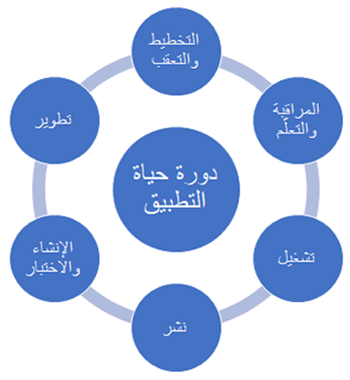

يجب جدولة ورشة عمل إدارة دورة حياة التطبيق (ALM) وإكمالها أثناء مرحلة تنفيذ المشروع.

توجد قوالب لكل ورشة عمل من ورش عمل Success by Design، ويمكنك تنزيل أمثلة [للقوالب](https://github.com/MicrosoftDocs/mslearn-developer-tools-power-platform/tree/master/fasttrack/?azure-portal=true) لورشة العمل هذه وأي ورش عمل أخرى تريد مراجعتها.

## لماذا إدارة دورة حياة التطبيق (ALM) مهمة

إدارة دورة حياة التطبيق (ALM) هو موضوع واسع يغطي إدارة الحل الذي تقوم ببنائه. يغطي أيضاً العمليات والأدوات التي تضعها لبناء الحل ونشره وصيانته بشكل موثوق.

> [!div class="mx-imgBorder"]
> 

من المهم التخطيط لكيفية إدارة الحلول لتطبيقات Power Platform وDynamics 365. يشمل هذا:

- البناء
- الاختبار
- التحقق من الصحة
- النشر

تطرح ورشة العمل هذه سلسلة من الأسئلة، مجمعة في مناطق منطقية (الإنشاء والاختبار والإصدار والنشر وتشغيل النموذج وما بعد التنفيذ والتخزين) للتأكد من أنك تنظر في جميع الجوانب ويمكن أن توفر التوجيه الأكثر إرشاداً.

باستخدام المعلومات التي تجمعها، يمكنك تقديم توصيات مستهدفة في كل منطقة بناءً على تجربة التنفيذ السابقة وأفضل الممارسات المتاحة بشكل عام وتحديد مجالات الاهتمام المحتملة في التنفيذ.

يمكن للمشروعات التي لا تحتوي على استراتيجية ALM قوية أن تواجه تأخيرات وعمليات غير متوقعة وتتجاوز بسهولة المواعيد والميزانيات المستهدفة بسبب الافتقار إلى الحوكمة والانضباط.

يمكن العثور على نقطة بداية جيدة لفهم إدارة دورة حياة التطبيق (ALM) مع Dynamics 365 وMicrosoft Power Platform عن طريق قراءة ومراجعة صفحة مستندات [إدارة دورة حياة التطبيق (ALM) مع Microsoft Power Platform](/power-platform/alm/?azure-portal=true).

## تمت تغطية مكونات إدارة دورة حياة التطبيق (ALM)

نظراً لأن إدارة دورة حياة التطبيق (ALM) موضوع واسع، تركز ورشة عمل إدارة دورة حياة التطبيق (ALM) على المجالات الرئيسية التي يمكن أن تحقق أكبر فائدة وتقليل معظم المشكلات في المشروع. فيما يلي الموضوعات التي تم تناولها في ورشة عمل إدارة دورة حياة التطبيق (ALM).

### الاستراتيجية العامة

فهم عام لنهج التطوير والنشر الخاص بك لكل من التنفيذ وما بعد العرض المباشر. يتضمن ذلك تطوير إستراتيجيتك لإدارة التغييرات باستخدام الحلول.

استخدم هذا لتأطير الموضوعات الأخرى في هذه المراجعة والنظر إليها والتأكد من أن التفاصيل ستدعم استراتيجية التطوير التي تقدمها، وتحديد أي تحديات أو مخاطر على طول الطريق. 

### خطة الإنشاء

هذا الموضوع هو المكان الذي نستكشف فيه مكون البنية التحتية لكيفية تخطيطك لإدارة إنشاء الحلول باستخدام بيئات متعددة (DEV وQA وUAT وINT وPROD وما إلى ذلك).

إذا كان لديك عدة مطورين يعملون في البيئة، فما هو النهج الذي ستتخذه لدعم هذا التصميم؟ بيئات تطوير متعددة؟ كيف ستتم المزامنة؟ 

### استراتيجية الاختبار

هذا الموضوع هو المكان الذي نستكشف فيه نوع الاختبار المخطط له وكيف سيتم دمجه في عملية ALM الشاملة.

### الإصدار والنشر

في مجال الموضوع هذا، ننظر في كيفية تعبئة الأصول ونقلها من بيئة إلى أخرى. يجب أيضاً مراعاة تعقيد عملية النشر هنا، وأي شيء يمكن القيام به لزيادة التبسيط. كما يتم تضمين مراجعة الاستعدادات للنشر مثل الاختبار وتحسين الأداء. 

### نموذج التشغيل

هذا الموضوع هو المكان الذي ننظر فيه إلى عمليتك لنشر إصلاحات الأخطاء وخدمة ما قمت بنشره. نظراً لأن هذا يتضمن أيضاً منظوراً طويل المدى، فإننا ننظر في كيفية التعامل مع اختبار التحديثات الأسبوعية والترقيات الأكبر مرتين في السنة.

### إدارة القدرات

في مجال الموضوع هذا، ننظر إلى استخدام سعة التخزين وطلبات API. على وجه التحديد، أنت تتطلع إلى التأكد من أنك تقوم بتحسين أفضل استخدام للقدرة لديك والتخطيط لمراقبة استهلاك السعة بشكل مستمر.
