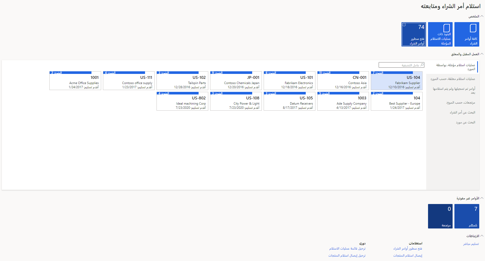
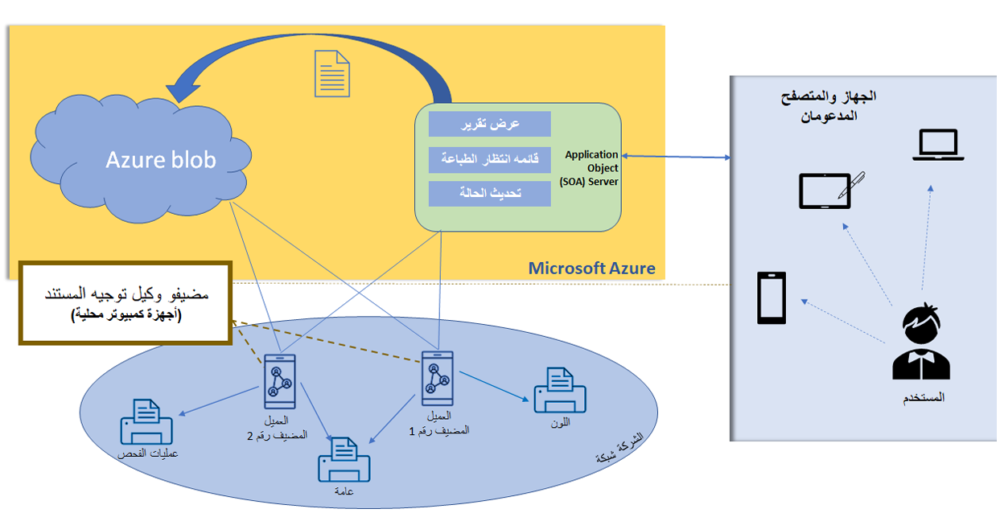

تقدم هذه الوحدة سيناريوهات تقارير العمليات.

## السيناريو - يحتاج العديد من المستخدمين إلى تحليل أوامر الشراء المفتوحة 

يحتاج كل مستخدم إلى عوامل تصفية وأعمدة مختلفة فِي تقاريره لتحليلها والعمل عليها.

### النمط - استخدم مساحات العمل التشغيلية وصفحات القوائم
تم تصميم [مساحة العمل التشغيلية](/dynamics365/fin-ops-core/dev-itpro/user-interface/build-workspaces/?azure-portal=true) لتكون آلية التنقل الأساسية لدعم نشاط تجاري معين. يمكنك إضافة صفحة القائمة إلى مساحة عمل تشغيلية عن طريق [إضفاء الطابع الشخصي](/dynamics365/fin-ops-core/fin-ops/get-started/personalize-user-experience/?azure-portal=true) عَلى هيئة تجانب أو قائمة أو ارتباط.

> [!div class="mx-imgBorder"]
> 

صفحة القائمة بها تكاليف تطوير أقل من تقرير SSRS وهي أكثر سهولة فِي الاستخدام من كيان البيانات. باستخدام ميزة التخصيص [والعرض المحفوظ](/dynamics365/fin-ops-core/fin-ops/get-started/saved-views/?azure-portal=true)، يمكنك إنشاء صفحات خاصة بالسيناريو ثم النشر للمستخدمين أو الأدوار. يمكنك تصدير محتويات شبكة صفحة القائمة إلى Excel لمزيد من التحليل. 

### الأنماط المضادة
عندما يحتاج العديد من المستخدمين إلى تحليل أوامر الشراء المفتوحة، ضع فِي اعتبارك الأنماط المضادة (المزالق) التالية:
- لا تقم بإنشاء تقرير SSRS مخصص.
- لا تستخدم تقرير SSRS لتصدير البيانات إلى Excel فقط.

## السيناريو - يحتاج مندوبين التحصيل إلى طريقة لتصور الأرصدة القديمة للكيانات القانونية والعملاء 

يحتاج مندوبين التحصيل إلى طريقة مباشرة وبديهية لتصور الأرصدة القديمة لجميع الكيانات القانونية والعملاء. يحتاجون أيضاً إلى القدرة عَلى تطبيق عوامل التصفية والبحث لأسفل للحصول عَلى مزيد من التفاصيل للمتابعة مع العملاء الذين لديهم فواتير غير مدفوعة أو مدفوعات متأخرة.

### النمط - استخدم مساحة عمل تشغيلية خارج النطاق مع مساحة عمل تحليلية 

النمط الجيد (أفضل الممارسات) هو استخدام مساحة عمل تشغيلية خارج النطاق إلى جانب مساحة عمل تحليلية. تحتوي بعض مساحات العمل التشغيلية على علامة تبويب **تحليلات** تتضمن تقرير Power BI تفاعلي يمكنك استخدامه لتحليل البيانات التشغيلية بفعالية ثم الانتقال لأسفل إلى تطبيقات التمويل والعمليات.

في هذا المثال، يمكن لمندوب التجميع البدء بتقرير **الرصيد القديم** في Power BI، وتصفية الشركة المناسبة، والتنقل لأسفل في تطبيقات التمويل والعمليات للحصول على مزيد من التفاصيل أو إكمال نشاط التجميع. 

يمكن للعملاء والشركاء توسيع تقارير Power BI تحليلية تفاعلية جديدة أو إنشائها وفقاً لمتطلباتها الفريدة.

تتميز مساحة عمل **ائتمان العميل ومجموعاته** بالخصائص التالية:
- علامة التبويب **تحليلات** مضمنة فِي مساحة عمل تشغيلية
- إنه مدرك للسياق ويطبق أمان تطبيقات التمويل والعمليات 
- تقرير تفاعلي حديث لخدمة سيناريوهات متعددة
- يمكن لمستخدمي Power BI تعديل تقارير OOB أو استبدالها
- يوفر إمكانية التنقل لأسفل إلى صفحة التطبيق 

### الأنماط المضادة

ضع فِي اعتبارك الأنماط المضادة (المزالق) التالية عند تزويد مندوبين التحصيل بطريقة مباشرة وبديهية لتصور الأرصدة القديمة لجميع الكيانات القانونية والعملاء.
- لا تقم بإنشاء تقارير SSRS مخصصة بدلاً من مساحات العمل التحليلية من OOB.
- لا تحضر بيانات تطبيقات التمويل والعمليات محلياً لإنشاء لوحة معلومات.

## السيناريو - يحتاج العميل إلى إنشاء قائمة بالتقارير 

يحتاج العميل إلى إنشاء قائمة بالتقارير، أثناء عملية نهاية الشهر. يستخرج مستخدمو الأعمال البيانات من هذه التقارير فِي جدول بيانات. بعد ذلك، سيقومون بإعداد التقرير النهائي لتحديد قيود الاستحقاق التي حجزوها كجزء من إقفال نهاية الشهر. 

### النمط - استخدام Power BI لتبسيط العمليات

بدلاً من إنشاء تقارير SSRS متعددة وصفحات القوائم لاستخراج البيانات، قم ببناء لوحة معلومات Power BI لدمج نقاط البيانات المتعددة المطلوبة لإنتاج المخرجات المطلوبة التي يتوقعها مستخدمو الأعمال فِي تقرير Excel. 

يمكن لهذا النهج تبسيط العمليات وجعل عملية نهاية الشهر أكثر كفاءة. 

### الأنماط المضادة

عند مساعدة عميلك فِي إنشاء قائمة تقارير لعملية نهاية الشهر، ضع فِي اعتبارك الأنماط المضادة التالية.
- لا تقم بإنشاء تقارير SSRS متعددة وصفحات القوائم لاستخراج البيانات.
- لا تدمج تقارير متعددة باستخدام Excel.

## السيناريو - يريد العميل تحسين عملية التجميع عن طريق التنبؤ

في هذا السيناريو، يريد عميلك تحسين عملية التحصيل من خلال التنبؤ بكيفية دفع العملاء بناءً عَلى بياناتهم واتجاهاتهم التاريخية حتى يتمكنوا من اتخاذ تدابير استباقية.

### النمط - استفد من إمكانات التعلم الآلي والذكاء الاصطناعي من خلال Finance Insights 

تستخدم ميزة Finance Insights من Microsoft Dynamics 365 Finance AI Builder لنقل التقارير التشغيلية إلى المستوى التالي من خلال غرس التنبؤ والتعلم الآلي. راجع [تحسين العمليات المالية باستخدام العمليات المشبعة بالذكاء الاصطناعي](https://info.microsoft.com/ww-Landing-Optimize-Financial-Operations-with-AI-Infused-Processes.html?) لمعرفة المزيد حول العمليات المشبعة بالذكاء الاصطناعي. راجع [إعداد Finance Insights والعمل معها فِي Dynamics 365 Financ](/training/paths/setup-work-finance-insights/?azure-portal=true) لمعرفة المزيد حول Finance Insights. 

### الأنماط المضادة
عندما يريد العميل تحسين عملية الجمع عن طريق التنبؤ، ضع فِي اعتبارك الأنماط المضادة (المزالق) التالية:
- لا تقم فقط بإنشاء تقارير SSRS أو Excel. 
- لا تجلب الحلول المخصصة الخاصة بك لإمكانيات OOB المتاحة.

## السيناريو - يحتاج العمل إلى الطباعة مباشرة إلى طابعة شبكة

في هذا السيناريو، تحتاج الشركة إلى طباعة ملصقات لوحات الترخيص وملصقات الشحن ومستندات العمل وتقارير SSRS الأخرى من تطبيقات التمويل والعمليات مباشرة إلى طابعة شبكة. 

### النمط

استخدم [Document Routing Agent](/training/paths/setup-work-finance-insights/?azure-portal=true) (DRA)‎ للطباعة غير التفاعلية، مثل ملصقات المستودعات والتقارير المطبوعة على دفعات وتقارير إدارة الطباعة. استخدم ميزة [PDF](/dynamics365/fin-ops-core/dev-itpro/analytics/preview-pdf-documents/?azure-portal=true) لطباعة تقارير SSRS التفاعلية.

تمكن DRA تطبيقات التمويل والعمليات من طباعة المستندات باستخدام طابعة محلية أو جهاز متصل بالشبكة في سيناريوهات غير تفاعلية أو تفاعلية.

 

SSRS هي ميزة PDF ممكّنة وستقدم تقريراً مباشرةً بتنسيق PDF، والذي يمكنك تنزيله محلياً أو طباعته مباشرةً باستخدام الطابعة المحلية / الشبكة التي أضفتها إلى جهازك.

### النمط المضاد

لا تستخدم DRA لسيناريوهات الطباعة التفاعلية (وفر الوقت لإعداد الطابعة وصيانتها باستخدام DRA).

## السيناريو - لدى العميل كميات كبيرة من الملصقات لطباعتها لعمليات المستودعات

في هذا السيناريو، يمتلك العميل كميات كبيرة من الملصقات التي تحتاج إلى طباعتها لعمليات المستودعات، مثل الانتقاء والاستلام.

### النمط
النمط الجيد (أفضل الممارسات) هو استخدام وظيفة [طباعة ملصق لوحة الترخيص](/dynamics365/supply-chain/warehousing/tasks/license-plate-label-printing/?azure-portal=true) مع طابعات ملصقات لغة برمجة Zebra ([ZPL](/dynamics365/supply-chain/warehousing/document-routing-layout-for-license-plates/?azure-portal=true)). 

بالإضافة إلى ذلك، يجب عليك استخدام أدوات خارجية، مثل BarTender، لتصميم الملصقات المتقدم وسيناريوهات الطباعة بكميات كبيرة. 

### النمط المضاد

عند مساعدة عميل يحتاج إلى طباعة كميات كبيرة من الملصقات لعمليات المستودعات، لا تستخدم تقارير SSRS.
