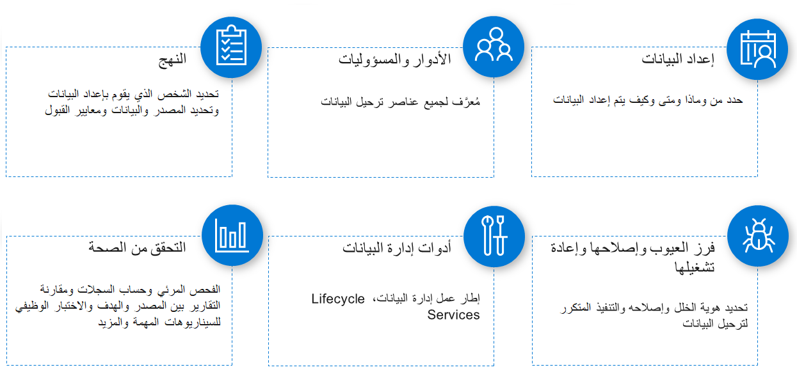

عادةً ما يتم إجراء ورشة عمل استراتيجية ترحيل البيانات عن بُعد وتتضمن العديد من مجالات المناقشة الهامة. تسرد الأقسام التالية بعض المجالات المهمة، لكن هذه القوائم ليست شاملة. سيكون لكل مشروع اعتبارات مختلفة قليلاً.

 
## استراتيجية إدارة البيانات
في قسم استراتيجية إدارة البيانات بورشة العمل، ستقوم بمراجعة استراتيجية إدارة البيانات وتحديد الأدوار ومسؤولياتهم. بعد ذلك، ستحدد كيفية إعداد البيانات والتحقق من صحتها لاحقاً والأدوات التي يجب استخدامها. في الأساس، يعد هذا الجزء من ورشة العمل محادثة أولية للمساعدة في فهم الاستراتيجية بأكملها حول ترحيل البيانات.

## التخطيط والاستراتيجية
يغطي قسم التخطيط والاستراتيجية الجداول الزمنية للمشروع، ومن يملك البيانات، ومن سيكون مسؤولاً عن جميع المهام من حوله (الاستخراج، والتوفير، والتطهير، والاستيراد). من المهم مراجعة نوع البيانات لإدخالها في الحل وتحديد ما إذا كانت هناك حاجة إلى كل هذه البيانات.
البيئات والأدوات ضرورية في هذه المحادثة. تأكد من أنك تعرف عدد البيئات وأيها تم تضمينها في الإستراتيجية والأدوات المستخدمة.

يركز هذا الموضوع على الإجابة على أسئلة، مثل:

- هل سيتم إجراء اختبار قبول المستخدم (UAT) على البيانات التي تم ترحيلها؟
- كم عدد دورات ترحيل البيانات أو العمليات التجريبية التي سيتم إجراؤها؟
- هل تم تحديد بنيات البيانات والعلاقات الخاصة بحل الوجهة؟
- ما أنواع البيئات التي ستتم فيها أنشطة ترحيل البيانات؟ 

## وحدة تخزين البيانات
في قسم وحدة تخزين البيانات، يجب أن تتحقق من أن وحدة تخزين البيانات التي تتم ترحيلها قد تم تقييمها. لترحيل البيانات بنجاح، من الضروري الحصول على صورة واضحة لعدد السجلات التي يتم ترحيلها من الأنظمة القديمة إلى البيئة الجديدة. في السيناريوهات التي تقوم فيها بترحيل كميات كبيرة من البيانات، فإن معرفة عدد السجلات المعنية مسبقاً وفهم كيفية عمل الأداة، سيوفر لك الوقت.

يركز هذا الموضوع على الإجابة على أسئلة، مثل:

- ما الجداول التي تحتوي على أكبر عدد من السجلات؟
- كيف ستتم مزامنة كميات كبيرة من البيانات مبدئياً من أجل تكامل الكتابة المزدوجة؟

## الأدوات
يدور قسم الأدوات حول الأدوات المستخدمة وفهم خطة استخدامها. تتوفر طرق مختلفة ومراحل مختلفة للاستخدام، مثل نسخ/مزامنة البيانات بين الكيانات القانونية ونسخ البيانات بين البيئات. تأكد من مناقشة كيفية استخراج البيانات وتحويلها وإعادة تحميلها في النظام.

يركز هذا الموضوع على الإجابة على أسئلة، مثل:

- ما الأدوات التي سيتم استخدامها لنقل/نسخ/مزامنة البيانات بين الكيانات القانونية؟
- هل لدى الجميع فهم جيد للأدوات التي سيتم استخدامها أثناء ترحيل البيانات؟
- ما الأداة التي سيتم استخدامها لترحيل البيانات؟

## الأداء
يرتبط جزء الأداء من عملية ترحيل البيانات بجودة أفضل للبيانات، ودورات أسرع، وتوقيت تكوين مرحلي قابل للتحقيق. على هذا النحو، من المهم تحديد أفضل إعداد، تقني ووظيفي، لتحسين الأداء وإجراء جولات متعددة من الاختبارات للتحقق من صحة هذا الإعداد.

يركز هذا الموضوع على الإجابة على أسئلة، مثل:

- ما خصائص البيئة المخططة لترحيل البيانات؟
- هل تتضمن خطة ترحيل البيانات متطلبات غير وظيفية؟
- هل تم النظر في الإعداد المتعلق بالأداء والتخطيط له؟

## التحقق من صحة البيانات
يعد التحقق من صحة البيانات خطوة إلزامية لضمان اكتمال البيانات التي تم ترحيلها ومواءمتها لمتطلبات العمل. يجب أن تكون عملية التحقق من صحة البيانات موثقة جيداً، مع تحديد جميع المعايير اللازمة.

يركز هذا الموضوع على الإجابة عن الأسئلة، مثل: ما خطة التحقق من صحة البيانات بعد الترحيل (جودة البيانات وتنسيق البيانات وما إلى ذلك)؟

## الاختبار
يعد اختبار البيانات التي تم ترحيلها أمراً ضرورياً لعملية ترحيل البيانات بأكملها. الهدف هو التأكد من أن الاختبار موثق بدقة، وأن اختبارات الوحدة موجودة، وأن النتائج يتم حسابها ونقلها إلى دورات ترحيل البيانات التالية.  

يركز هذا الموضوع على الإجابة على أسئلة، مثل:

- هل تم تحديد اختبارات الوحدة لاختبار البيانات التي تم ترحيلها؟
- كيف سيتم توثيق نتائج الاختبار؟
- هل معالجة الأخطاء تم التخطيط لها ومحاسبتها؟
