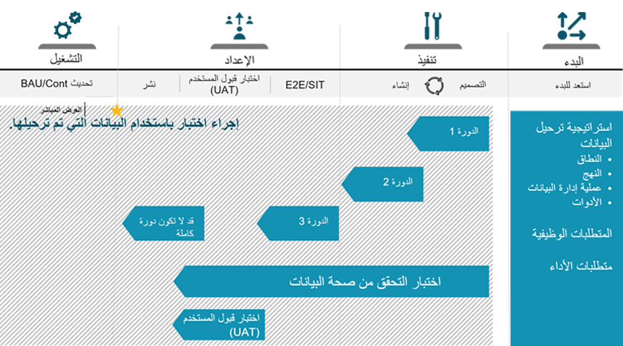

سيتم تسهيل ورشة عمل استراتيجية ترحيل البيانات بواسطة مهندس الحلول الذي سيضع إطاراً للمناقشات، ولكن من المتوقع أن يقدم فريق التنفيذ معلومات ترحيل البيانات.

يجب تعيين مالك لكل قسم من جدول الأعمال ضمن فريق التنفيذ.

سيسمح تحضير واستكمال نموذج العرض التقديمي لورشة العمل بإجراء مناقشات أكثر ثراءً والتي غالباً ما تؤدي إلى إجراءات تعديل واضحة يجب اتخاذها. يتمثل الهدف الرئيسي لورشة عمل استراتيجية ترحيل البيانات في التفكير في الاستراتيجية بأكملها ثم تحديد التعديلات اللازمة التي يجب إجراؤها لتجنب المشكلات أو المخاطر المحددة. من المهم الوصول إلى الجلسات بعقلية متنامية، مما يشجع التبادلات الصريحة والبناءة والصادقة.

## مخرجات ورشة عمل استراتيجية ترحيل البيانات
المخرج الرئيسي لورشة عمل إستراتيجية ترحيل البيانات هو ملخص ورشة العمل الذي يسلط الضوء على النتائج والتوصيات الرئيسية التي تم تقديمها خلال الجلسة. 

خلال الجلسات، نوصي بتدوين الإجراءات المحددة باستخدام شريحة العرض التقديمي PowerPoint المخصصة (على سبيل المثال). سيسمح هذا النهج لفريق التنفيذ بالمتابعة مع الحاضر (الحضور) ذي الصلة والرد بأكثر الطرق فعالية، بناءً على الموضوع ذي الصلة.

يجب توزيع العرض النهائي، بما في ذلك الإجراءات التي تم سردها خلال الجلسة، على جميع الأطراف التي شاركت في ورشة العمل، بما في ذلك قيادة التنفيذ والجهات الراعية التنفيذية في كلتا المنظمتين. سيضمن هذا النهج أن يكون الجميع في حالة انسجام مع العناصر التي تمت مناقشتها وحول إجراءات التعديل التالية التي يجب اتخاذها. 

ترحيل البيانات هو موضوع سيتم مناقشته في عده مراحل مختلفة للمشروع. من المحتمل أن تتقلب الخطط كلما تعلمت المزيد عن خصوصيات البيانات المختلفة للمشروع.
 

