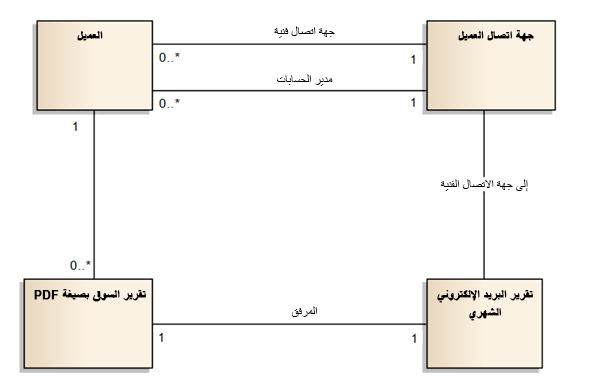
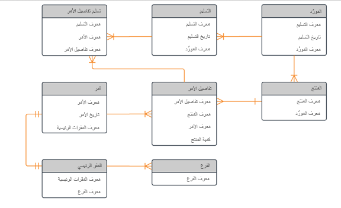

تصف هذه الوحدة إستراتيجية نمذجة البيانات في Microsoft Dynamics ‏365 وMicrosoft Dataverse، ثم تشرح كيف ستساعد ورشة عمل نموذج البيانات في التحقق من اكتمال نموذج البيانات موجود قبل بدء التكوين.
توفر لك الأقسام التالية نظرة عامة أساسية حول أفضل ممارسات نمذجة البيانات وكيفية ارتباطها بمشروع Dynamics 365.

## نظرة عامة على نمذجة البيانات

نموذج البيانات هو نموذج مرئي يوضح كيفية تدفق البيانات عبر نظامك وكيف ترتبط الكيانات المختلفة ببعضها البعض. تحدد نماذج البيانات أنواع العلاقة بين الجداول وتلخص قاعدة البيانات لتمثيل مرئي مباشر.

نمذجة البيانات لها أنواع ومعايير متعددة، بما في ذلك لغة النمذجة الموحدة (UML) وIDEF1X وغيرها. تقع معايير نماذج البيانات المحددة خارج نطاق هذه الوحدة النمطية، ولكن نماذج البيانات لهياكل بيانات Dynamics 365 تنقسم عموماً إلى فئتين عامتين: منطقية ومادية.

### نماذج البيانات المنطقية

نماذج البيانات المنطقية عبارة عن رسوم بيانية عالية المستوى توضح الطريقة التي تتدفق بها البيانات عبر النظام. يتم تجميع نماذج البيانات هذه بشكل متكرر في بداية المشروع أثناء الاكتشاف وقبل تحديد جميع الأعمدة. بشكل عام، يستخدم مخطط نموذج البيانات المنطقي أسماء الأعمال للجداول، وليس اسم المخطط/قاعدة البيانات.

> [!div class="mx-imgBorder"]
> 

### نماذج البيانات المادية

نماذج البيانات المادية هي أقل مستوى من نماذج البيانات المنطقية. وهي تتضمن بشكل عام تفاصيل على مستوى العمود وعلاقات مصممة بدقة أكبر. يتم إنشاء نموذج البيانات المادية عند ترجمة التصميم المنطقي عالي المستوى إلى جداول فعلية. نوع شائع من نموذج البيانات المادية هو مخطط علاقة الكيان (ERD).

> [!div class="mx-imgBorder"]
> 

## أفضل ممارسات نمذجة البيانات

نمذجة البيانات هي علم، ويوجد متخصصون في نمذجة البيانات ومعايير راسخة لنمذجة البيانات. لكي تكون فعالاً مع تصميم بيانات Dynamics 365، لا يتعين عليك أن تكون مصمم بيانات محترفاً أو تستخدم أدوات خاصة. يمكن استخدام الأدوات الشائعة مثل Microsoft Visio لإنشاء ERD أساسي سريعاً يصور العلاقات وتدفق البيانات بين الجداول. يفحص هذا الموضوع بعض أفضل الممارسات العامة لنمذجة البيانات لعمليات توزيع Dynamics 365. 

أفضل الممارسات التي يجب اتباعها هي:

-   يجب تحديث نماذج البيانات بشكل مستمر أثناء النشر.
عادةً ما يتم تصميم نموذج البيانات في بداية المشروع، ولكن من المهم ألا تتوقف التحديثات عند هذه النقطة. أثناء تقدمك في عملية النشر، ستتم إضافة أعمدة وجداول جديدة. لذلك، تحتاج إلى التقاط هذه الأعمدة والجداول الجديدة في نموذج البيانات لجعله نموذج بيانات حي. نوصي العملاء بمواصلة تحديث نموذج البيانات أثناء قيامهم بتحسين النظام.

-   أدوات المجتمع المتوفرة مع [XrmToolBox](https://www.xrmtoolbox.com/?azure-portal=true) تساعد في تسهيل إنشاء مخططات علاقات الكيانات (ERDs) بسرعة لتكوين Dynamics 365 وDataverse. تتضمن هذه الأدوات منشئ UML ومنشئ مخطط علاقة الكيان (ERD).
بعد إكمال تحديثات التكوين، قم بإنشاء ERD محدث.

-   لا تقم بتضمين كل جدول. ترتبط بعض الجداول الأساسية، مثل الأنشطة والملاحظات والمستخدمين (مالكو السجلات)، بكل جدول تقريباً في Dynamics 365. إذا قمت بتضمين كل علاقة بهذه الجداول في نموذج البيانات الخاص بك، ستكون النتيجة غير قابلة للقراءة. من أفضل الممارسات تضمين الجداول الأساسية المستخدمة في التكوين في الرسم التخطيطي لنموذج البيانات الخاص بك فقط وتضمين العلاقات المخصصة مع المستخدم وجداول النشاط لزيادة إمكانية القراءة.

-   يجب أن تتضمن نماذج البيانات جداول خارج Dataverse.
إذا كنت تتكامل مع أنظمة أخرى باستخدام موصلات بيانات Dataverse أو جداول افتراضية، أو إذا كانت البيانات تتدفق خارج Dataverse باستخدام تكامل، يجب أيضاً تمثيل هذه البيانات في مخطط نموذج البيانات الخاص بك.

-   ابدأ ببساطة باستخدام الجداول القياسية، ثم أضف علاقات الجداول المخصصة إلى نموذج البيانات الخاص بك.

-   يجب أن تؤثر تجربة المستخدم على نموذج البيانات الخاص بك. في بعض الأحيان، من السهل تطبيع بياناتك بشكل مفرط ؛ ومع ذلك، في هذه العملية، يمكنك جعل استخدام التطبيق أكثر تعقيداً.

-   ابدأ بما تحتاجه الآن ولكن صمم نموذج البيانات بطريقة تدعم ما تخطط للقيام به في المستقبل. على سبيل المثال، إذا كنت تعلم أنك ستحتاج في النهاية إلى تخزين المزيد من التفاصيل حول مناطق المبيعات، فإن استخدام حقل نصي للإقليم الآن سيجعل الأمر أكثر صعوبة في التنفيذ مما لو كنت تستخدم علاقة كيان المنطقة. خطط للمستقبل لما هو قادم.

## ورشة عمل نموذج البيانات

يجب أن تقتصر ورشة عمل نموذج البيانات على ساعة واحدة تقريباً، وغالباً ما يتم إجراؤها كجزء من اجتماع Microsoft Teams إذا لم يكن الجميع معاً في الموقع.
يجب أن يشمل الحضور أصحاب المصلحة الرئيسيين من العملاء وفرق الشركاء. عادةً ما يكون مهندسو الحلول والخبراء الوظيفيون والمراجعون الفنيون إلزاميون. يجب أن تعقد ورشة العمل هذه بينما لا يزال لديك الوقت والفرصة لإجراء تصحيحات على المسار إذا لزم الأمر. بالإضافة إلى ذلك، يمكنك [تنزيل القوالب](https://github.com/MicrosoftDocs/mslearn-developer-tools-power-platform/tree/master/fasttrack/?azure-portal=true) لورشة العمل هذه وورش العمل الأخرى.

ستصف الوحدات التالية الموضوعات الموصى بتغطيتها عند إجراء ورشة عمل نموذج البيانات.
