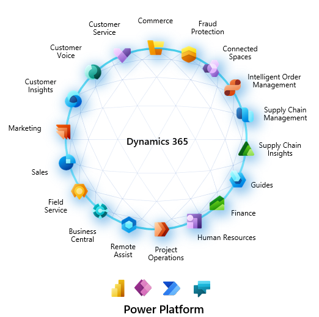

Dynamics 365 هو مجموعه من تطبيقات الاعمال التي تغطي مجموعه واسعة من مناطق العمل. تسمى هذه الحلول أحياناً تطبيقات خط الأعمال أو حلول LOB. من وجهة تاريخية، تم فصل تطبيقات Dynamics 365 إلى فئتين: تطبيقات التفاوض علي العميل وتخطيط موارد المؤسسة (ERP). ومع ذلك، وكما تطورت تطبيقات Microsoft Business Applications، وDynamics 365، وMicrosoft Power Platform، أصبحت هذه الخطوط غير واضحة في خيارات أكثر شمولية. تتضمن هذه الخيارات أيضًا تكامل Dynamics 365 مع منتجات Microsoft Modern Workplace (Microsoft 365) ، LinkedIn، Microsoft Power BI، Microsoft Dynamics 365 Business Central، وتطبيقات Microsoft الأخرى.

> [!div class="mx-imgBorder"]
> 

## تطبيقات Customer Engagement

هناك طريقه واحده للتمييز بين تطبيقات التفاوض والتطبيق ERP وهي أن تتذكر أنه تم بناء تطبيقات تفاوض العميل على الرغم من Microsoft Dataverse عدم وجود تطبيقات ERP. هدف تطبيقات Microsoft Dynamics ‏365 customer engagement هو المشاركة الفعالة مع العملاء. فهي مسؤولة عن تتبع المقاييس والأدوات لدعم إنشاء عملاء جدد والاحتفاظ بهم.

-   **Dynamics 365 Sales** - يمكّنك من بناء علاقات قوية مع عملائك، واتخاذ الإجراءات بناءً على الرؤى، وإبرام المبيعات بشكل أسرع. استخدم المبيعات لتتبع حساباتك وجهات الاتصال الخاصة بك، ولتعزيز مبيعاتك من العميل المتوقع إلى الطلب، وإنشاء ضمانات المبيعات، وإنشاء قوائم التسويق والحملات من خلال هذا التطبيق المستند إلى النموذج. وأيضا يمكنك حتى متابعة حالات الخدمة المرتبطة بحسابات أو فرص معينة.

-   **Dynamics 365 Customer Service** - تتيح لك كسب العملاء مدى الحياة. قم ببناء علاقات عملاء رائعة من خلال التركيز على رضا العملاء الممتاز من خلال تطبيق Customer Service. توفر Customer Service العديد من الميزات والأدوات التي تساعدك على إدارة الخدمات التي تقدمها للعملاء. تشتمل Customer Service أيضًا على القناة متعددة الاتجاهات، وهي مجموعة من الإمكانات التي تمكن المؤسسات من الاتصال والتفاعل مع عملائها على الفور عبر قنوات المراسلة الرقمية.

-   **Dynamics 365 Field Service** - تساعدك على تقديم الخدمة في الموقع لمواقع العملاء. يجمع التطبيق بين أتمتة سير العمل وخوارزميات الجدولة والتنقل لمساعدتك في إعداد العمال المتنقلين للنجاح عندما يكونون في الموقع مع العملاء الذين يقومون بإصلاح المشكلات.

-   **Dynamics 365 Marketing** - تطبيق أتمتة التسويق يساعد على تحويل العملاء المحتملين إلى علاقات تجارية. التطبيق سهل الاستخدام، ويعمل بسلاسة مع Dynamics 365 Sales، ويحتوي على معلومات عمل مضمنة. استخدم Marketing لإنشاء رسائل بريد إلكتروني رسومية ومشاركة المعلومات عبر فرق المبيعات والتسويق والمزيد.

## تطبيقات التمويل والعمليات

تطبيقات Microsoft Dynamics 365التالية مشتقة من تخطيط موارد المؤسسة وتستخدم لعمليات يومية متعددة داخل المؤسسة. هذه التطبيقات مسؤولة عن مهام مثل التعامل مع المخزون وشراء البضائع وبيعها وتعقُّب كل شيء مالي. بينما تركز تطبيقات تفاعل العملاء على التعامل مع تفاعل العملاء، تغطي التطبيقات الأربعة التالية العمليات اليومية للأعمال التجارية. هذه القائمة ليست شاملة. ومع ذلك، فهي تمثيل للتطبيقات الأكثر استخدامًا.

-   **Dynamics 365 Finance** - يساعدك على أتمتة عملياتك المالية العالمية وتحديثها. يمكنك مراقبة الأداء في الوقت الحقيقي وتوقع النتائج المستقبلية واتخاذ قرارات تعتمد على البيانات لدفع نمو الأعمال. استخدم Finance لتوجيه القرارات المالية الإستراتيجية باستخدام الذكاء الاصطناعي، وتوحيد العمليات المالية وأتمتتها، وتقليل النفقات التشغيلية، وتقليل التعقيد المالي العالمي والمخاطر.

-   **Dynamics 365 Supply Chain Management** - تساعدك على تحويل عمليات التصنيع وسلسلة التوريد الخاصة بك. استخدم الرؤى التنبؤية والذكاء من الذكاء الاصطناعي وإنترنت الأشياء (IoT) عبر التخطيط والإنتاج والمخزون والمستودعات وإدارة النقل. يمكن لإدارة Supply Chain Management زيادة الكفاءة التشغيلية وجودة المنتج والربحية. استخدم Supply Chain Management للابتكار من خلال عمليات التصنيع الذكية، وتحديث إدارة المستودعات، وتحسين أداء الإنتاج، وزيادة عمر أصولك إلَى أقصى حد، وأتمتة سلسلة التوريد الخاصة بك وتبسيطها.

-   **Dynamics 365 Human Resources** - يبسِّط العديد من مهام حفظ الدفاتر وأتمتة العديد من عمليات التوظيف. تشمل هذه العمليات الاحتفاظ بالموظفين، وإدارة المزايا، والتدريب، ومراجعات الأداء، وإدارة التغيير. توفر Human Resources أيضاً إطاراً لموظفي الموارد البشرية لإدارة مجالات الرقابة.

-   **Dynamics 365 Commerce** - يقدم حلاً شاملاً متعدد القنوات يوحد المكاتب الخلفية والمتاجر ومركز الاتصال والتجارب الرقمية. تُمكّنك Commerce من بناء ولاء للعلامة التجارية من خلال مشاركات العملاء الشخصية، وزيادة الإيرادات من خلال تحسين إنتاجية الموظفين، وتحسين العمليات لتقليل التكاليف، وزيادة كفاءة سلسلة التوريد.

## Business Central

يعد Microsoft Dynamics 365 Business Central أحد حلول إدارة الأعمال للمؤسسات الصغيرة والمتوسطة الحجم الذي يعمل على أتمتة عمليات الأعمال وتبسيطها ويساعدك على إدارة أعمالك. يساعدك Business Central، القابل للتكيف والغني بالميزات، على إدارة عمليات عملك، بما في ذلك التمويل والتصنيع والمبيعات والشحن وإدارة المشاريع والخدمات والمزيد.
