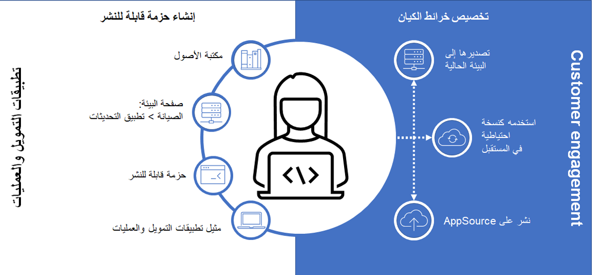

أحد الجوانب الرئيسية لتعيينات الجداول وتخصيصها هو إدارة التغييرات. من المهم معرفة كيفية إدارة تعيينات الجداول المختلفة هذه. علاوة على ذلك، فإن معرفة كيفية إدارة إصدار هذه التعيينات والتغييرات المختلفة التي يتم إجراؤها خلال فترة تكامل الكتابة المزدوجة أمر ضروري أيضاً. 

في Dataverse، تتم مفاهيم التحكم في الإصدار وإدارة دورة حياة التطبيق (ALM) من خلال الحلول. لذلك، من المنطقي أن تتم إدارة تعيينات الكتابة المزدوجة كحلول Microsoft Power Apps. هذه الآلية مخصصة لتغيير الحزم والحفاظ على المكونات المختلفة لـ Dataverse. تعد تعيينات الكيانات والإضافات والتخصيصات على دراية بالحلول، وتتم إدارتها بشكل مشابه لـ Dataverse. تعني العبارة المدركة للحلول أن المكون هو جزء من النظام يمكن تعبئته وبالتالي استيراده وتصديره بين البيئات والأنظمة. 

## خيارات قابلية التوسعة
تتمثل الخطوة الأولى في تخصيص التعيينات القياسية الجاهزة من حل الكتابة المزدوجة. في وحدة [استخدام المفاهيم الأساسية والإعداد لدمج تطبيقات التمويل والعمليات باستخدام Microsoft Power Platform](/training/modules/key-concepts-integrate-finance-operations-power-platform/?azure-portal=true)، تعلمت كيفية تثبيت حل التزامن والحل الأساسي. يحتوي كلا الحلين على تعيينات جاهزة يمكنك تخصيصها. 

### تعيينات الجداول
من المحتمل أن تقوم الشركات بتحرير تعيينات الجداول وتغييرها. أثناء قيامها بذلك، ستتغير أيضاً بعض خصائص التعيين. يحتوي كل تعيين جدول على ناشر وإصدار، وكلاهما يمكنك تغييرهما أثناء تخصيص تعيينات الجداول. بالإضافة إلى ذلك، يمكنك زيادة كل تعيين جدول في الإصدار. ومع ذلك، ضع في اعتبارك أن الكتابة المزدوجة تدعم تعيينات الجداول فقط بين الجداول المشتركة بين الشركات أو الجداول الخاصة بالشركة من كلا الجانبين. لا يمكنك تعيين جدول عبر الشركات لجدول خاص بالشركة؛ سيخبرك التفكير في مفهوم مفتاح التكامل عندما تقوم بتخصيص هذه التعيينات. يمكن أن يحتوي كل حل كتابة مزدوجة على واحد أو أكثر من تعيينات جداول الكتابة المزدوجة. 

### تعيين العمود
ضمن تعيينات جداول الكتابة المزدوجة، يمكنك أيضاً تحرير الأعمدة وإعدادها. يمكنك إضافة عمود جديد عن طريق تحديد **إضافة تعيين**، ثم تحديد عمود موجود أو مخصص في القائمة. يمكنك إضافة عمودي **النظام** و **العميل** أيضاً. يمكنك تخصيص اتجاه المزامنة (أحادي الاتجاه أو ثنائي الاتجاه) وإضافة تحويلات عن طريق تحديد نوع التعيين. 

  
نوعان من التحويلات التي يمكنك تحديدها هما: 
- **افتراضي** - القيم الافتراضية هي القيم التي يتم تطبيقها على أعمدة الوجهة عند عدم توفر قيمة عمود المصدر.
- **تعيين القيمة** - يحدد كيف يجب تعيين القيم الموجودة في أحد الجداول إلى قيم في الجدول الآخر. 

لمزيد من المعلومات، راجع [‏‫تخصيص تعيينات الجداول والأعمدة‬](/dynamics365/fin-ops-core/dev-itpro/data-entities/dual-write/customizing-mappings/?azure-portal=true).

يتم حفظ هذه التغييرات على تعيينات الجدول القياسية أو الجديدة كجزء من الحل الأساسي للكتابة المزدوجة، خاصةً مستودع **تعيين كيان الكتابة المزدوجة** كجزء من إدارة دورة حياة التطبيقات (ALM). بالإضافة إلى ذلك، يمكنك إنشاء حلول مخصصة لمزيد من التحكم في إدارة الإصدار ودورة الحياة. 

> [!div class="mx-imgBorder"]
> 

### تصفية
من الأسئلة الشائعة التي يتم طرحها أثناء تنفيذ الكتابة المزدوجة يكون حول إمكانات التصفية وكيفية تغييرها في تطبيقات التمويل والعمليات وتطبيقات مشاركة العملاء. يمكن أن تؤثر إمكانات التصفية على تكامل الكتابة المزدوجة، لذا من المهم معرفة الخيارات المتاحة لك.

تتوفر عوامل تصفية الكتابة المزدوجة في تطبيقات التمويل والعمليات لأنواع البيانات الأولية والاستعلامات البسيطة. لا تدعم عوامل التصفية هذه أنواع بيانات التاريخ والوقت أو السلاسل الطويلة أو الحاويات والأعمدة المعقدة الأخرى التي قد تكون لديك. 

يتم تقييم تعبيرات عامل التصفية في الكتابة المزدوجة لتطبيقات التمويل والعمليات وتحويلها إلى جملة SQL، حيث يُتوقع عادةً القيم الخالية. ومع ذلك، لا يتم دعم عوامل التصفية الفارغة بسبب قيود النظام الأساسي لتطبيقات التمويل والعمليات؛ القيمة الفارغة تساوي البيانات، وهي ليست مفقودة ببساطة. على سبيل المثال، قد يتم تعيين عامل تصفية في كيان بيانات على سلسلة فارغة " ". إذا انتهى التقييم بسلسلة فارغة، فسيتم تقييمها على أنها صحيحة. ومع ذلك، إذا كان التقييم **فارغاً**، وكانت القيمة التي تم إرجاعها هي **فارغ**، فلن يتم تقييمها على أنها صحيحة. 

بالنسبة لهذه الحالات، وحالات التصفية الأكثر تعقيداً، نوصيك بما يلي:

- حاول استخدام عمود محسوب أو حقل منطقي أو معيار تصفية مبسط آخر سيعيد مجموعة بيانات أكثر بساطة. يمكن للأعمدة المحسوبة التعامل بشكل خاص مع نطاقات التواريخ أو سيناريوهات أخرى أكثر تعقيداً على مستوى الكيان. 
- تأكد من تعيين البيانات التي تمت تصفيتها إلى الحقول والأعمدة الصحيحة، إذا كانت البيانات التي تمت تصفيتها مهمة للنقل. هذا المفهوم مهم. على سبيل المثال، ضع في اعتبارك سيناريو حيث يكون لديك شخص جهة اتصال يتم استخدامه لتعيين الكتابة المزدوجة، ولديك عامل تصفية على رقم جهة الاتصال المقترن ولكن ليس لديك تعيين فعلي في عمود رقم جهة الاتصال. في هذه الحالة، لن يتم انتقاء عمليات التحرير على عامل التصفية هذا من خلال تكامل الكتابة المزدوجة لأن الكتابة المزدوجة تتعقب فقط الحقول التي تم تعيينها مباشرةً. نتيجة لذلك، ستحتاج إلى التأكد من أن العمود الذي تمت تصفيته هو جزء من التعيين. تأكد من تقييم عمليات الأعمال للتأكد من تعيين الأعمدة المصفاة التي تعد جزءاً من إضافة البيانات أو إزالتها أو تحديثها. 

تختلف عوامل التصفية في Dataverse لأنها تستخدم تعبيرات عوامل تصفية OData وهي أكثر بساطة من عوامل التصفية المتوفرة في تطبيقات التمويل والعمليات. يتم دعم عوامل التصفية القياسية فقط التي تعمل مباشرةً مقابل أعمدة **الجدول** في تطبيقات التمويل والعمليات. 

لمزيد من المعلومات، راجع [تصفية النتائج - عوامل التصفية القياسية](/power-apps/developer/data-platform/webapi/query-data-web-api#filter-results/?azure-portal=true).

## إدارة دورة حياة البيئة 
عندما يكون لديك حل، سواء كان حلاً مخصصاً أو قياسياً موسعاً، يمكنك نشره واستيراده في بيئة أخرى. يوجد هذا الخيار نظراً لوجود نسبة 1: 1 من البيئات لتطبيقات التمويل والعمليات وDataverse. 

على سبيل المثال، في تطبيقات التمويل والعمليات، قد يكون لديك العديد من بيئات التطوير وبيئة الاختبار وبيئة المرحلة وبيئة الإنتاج. أثناء قيامك بتطوير وظائف جديدة لتطبيقات التمويل والعمليات، سيتم نشر الحل من خلال حزم لكل بيئة لأغراض مختلفة. في بيئة الاختبار، قد تطلب من جميع المستخدمين اختبار الوظائف والميزات الجديدة التي تم تطويرها. عندما تتم ترقية الحل إلى بيئة المرحلة، قد يكون لديك القليل من التحقق من الصحة قبل دفع التغييرات إلى الإنتاج، حيث سيستخدم الأشخاص الميزة الجديدة أو التخصيص. 

توجد عملية مماثلة لـ Dataverse. تعد عملية نقل التطوير والتغيير من بيئة إلى أخرى جزءاً من ELM وALM. 

يتمثل جانب آخر من ELM في تحديث إصدار تطبيقات التمويل والعمليات أو Dataverse، وحتى الحل الأساسي للكتابة المزدوجة، للحصول على المزيد من الميزات والوظائف التي تم إصدارها من Microsoft لتحسين الاستخدام اليومي للتطبيقات. 

تُعرف ترقية أو نقل التطوير من بيئة إلى أخرى، وعملية تحديث كل بيئة لتطبيقات التمويل والعمليات وDataverse، باسم إدارة دورة حياة البيئة (ELM). 

في Dataverse، تشبه هذه العملية عملية نشر إصدارات أحدث من الحلول، بينما في تطبيقات التمويل والعمليات، تشبه هذه العملية عملية الترقية لحزم التعليمات البرمجية المخصصة وتطبيقها على البيئات. بالنسبة للكتابة المزدوجة، تشبه هذه العملية عملية تحديث تعيينات الجداول بناءً على الحلول الجديدة ومنطق الأعمال التي يتم تطبيقها على كلا النظامين. كل عملية مطلوبة للتأكد من أن البيئات المتصلة عن طريق الكتابة المزدوجة محدثة، ولديها أحدث وأفضل المعلومات لمستخدمي الأعمال، وإظهار إصدارات محدثة من التعيينات للتكامل. 
 
> 

لمزيد من المعلومات حول الكتابة المزدوجة، وتعزيز الحلول، وإدارة دورة حياة الكتابة المزدوجة، راجع [إدارة دورة حياة التطبيقات](/dynamics365/fin-ops-core/dev-itpro/data-entities/dual-write/app-lifecycle-management/?azure-portal=true). 

لمزيد من المعلومات حول أحدث الحلول وتعيينات الجداول التي تم إصدارها من Microsoft للكتابة المزدوجة، راجع [المستجدات أو المتغيرات في الكتابة المزدوجة](/dynamics365/fin-ops-core/dev-itpro/data-entities/dual-write/whats-new-dual-write/?azure-portal=true). 
