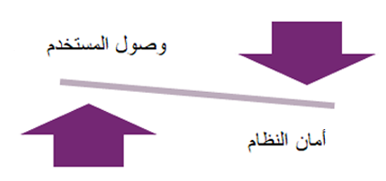
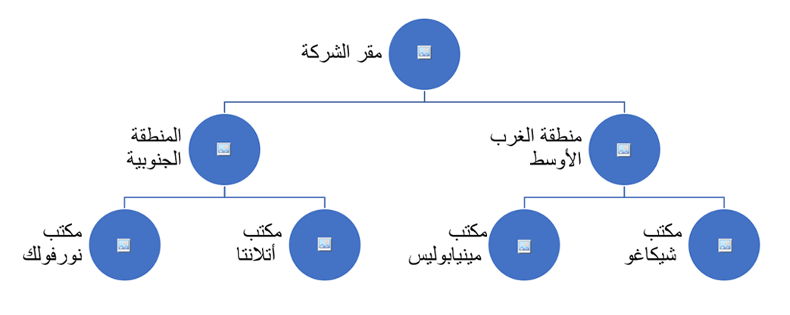

لضمان أن يكون نشر العميل لـ Microsoft Dynamics ‏365 أكثر أماناً، يجب على مهندس الحلول التخطيط لورشة عمل نموذج الأمان وتقديمها. تهدف ورشة العمل إلى تقييم نموذج الأمان المقترح وتقديم الملاحظات والتوصيات التي تسلط الضوء على المخاطر والمشكلات الفنية ومن ثم تحديد أفضل الممارسات.

يجب جدولة ورشة عمل النموذج الأمني واستكمالها خلال مرحلة تنفيذ المشروع. يجب أن يوفر ملخصاً لجميع المجالات المتعلقة بالأمان التي تمت مناقشتها مسبقاً خلال ورش العمل السابقة.

يمكنك [تنزيل أمثلة للقوالب](https://github.com/MicrosoftDocs/mslearn-developer-tools-power-platform/tree/master/fasttrack/?azure-portal=true) لكل ورشة عمل وحدة واستخدامها عند إجراء ورش العمل هذه للتوصل إلى حلول.

## لماذا يهم الأمان

إن Dynamics 365 يقود أعمال عملائك. يجب أن تكون بيانات الأعمال الحساسة المتعلقة بالعملاء والمعلومات المالية وعمليات الأعمال المهمة في النظام آمنة للعملاء الذين يتبنون النظام.

تعمل استراتيجية الأمان الصحيحة على موازنة متطلبات الأمان المشروعة مع الحاجة إلى الوصول إلى النظام والتعاون عبر الأعمال. عند تنفيذ Dynamics 365، تحتاج إلى موازنة اثنين من المخاوف: وصول المستخدم وأمان النظام.

> [!div class="mx-imgBorder"]
> 

من وجهة نظر واحدة، الاهتمام بالبيانات وأمان النظام مهم.
البيانات الخاصة بك هي الدافع لأعمالك. عملاؤك وطلباتك ومعلومات الاتصال الخاصة بجهات الاتصال التجارية الرئيسية هي عناصر لا تريد أن تقع في أيدي منافس. مع اللوائح المتعلقة بالبيانات الشخصية، قد تكون شركتك مسؤولة إذا كان خرق البيانات يؤثر على البيانات الشخصية.

وبدلاً من ذلك، لديك مخاوف بشأن قابلية استخدام النظام واعتماد المستخدم.
يتمثل أحد الأسباب الرئيسية لتطبيق Dynamics 365 في زيادة الرؤية ومشاركة بيانات العمل بين المجموعات، بما في ذلك التخلص من مستودعات البيانات في مؤسستك. من خلال إعطاء رؤية لجهات الاتصال والحسابات عبر مؤسستك، يمكن للفرق التعاون بفعالية بدلاً من التنافس، مما يساعد على ضمان أن لديك نسخة واحدة من الحقيقة عندما يتعلق الأمر بإتقان معلومات الاتصال والحساب. إذا ذهبت بعيداً في أي من الاتجاهين، فإنك تخاطر بفشل تنفيذك.

إذا كنت متساهلاً للغاية مع الأمان، فيمكن للمستخدمين تغيير البيانات التي لا ينبغي أن يكونوا قادرين على تغييرها، وبالتالي تلويث النسخة الوحيدة للحقيقة وإنشاء تصور بأن البيانات الموجودة في النظام ليست موثوقة.

إذا كنت شديد الصرامة في أمنك، وإذا قمت بإغلاق كل شيء حتى يتمكن المستخدمون من رؤية مجموعة فرعية صغيرة فقط من السجلات في النظام، فسوف تقلل من قيمة Dynamics 365 كأداة تعاون. بعد ذلك، حسب التصميم، ستعود إلى مستودعات البيانات القديمة، في موقع مختلف فقط.

## اعتبارات نموذج الأمان

قبل استكشاف تفاصيل ورشة العمل، ستراجع الأقسام التالية عناصر الأمان الرئيسية الشائعة في معظم تطبيقات Dynamics 365.

### إنشاء استراتيجية أمان

بينما ستكون استراتيجية الأمان لكل شخص مختلفة قليلاً، قد تكون الإرشادات التالية مفيدة لتنفيذك.

#### كن أكثر تقييداً في الكتابة من القراءة

للحفاظ على جودة البيانات الجيدة، يُعد تحديد من يمكنه تحرير السجلات أو حذفها فكرة جيدة، مثل تقييد حقوق التحرير أو الحذف على مالكي السجلات فقط. في كثير من الأحيان، يكون من المنطقي أن تكون أقل تقييداً بشأن السجلات التي يمكن للمستخدمين الآخرين قراءتها. يحافظ هذا الأسلوب على قابلية استخدام Dynamics 365 ويسمح للمستخدمين بالحفاظ على سياق حول كيفية ارتباط سجلاتهم بالسجلات الأخرى، مثل الحسابات الرئيسية.
ومع ذلك، فإن هذا الأسلوب يزيل المخاطر التي قد يقوم بها المستخدمون، عن طريق الخطأ أو الخطأ، بتحرير أو حذف السجلات التي لا يمتلكونها.

#### التبسيط

يتم تضمين العديد من الأدوات في مربع أدوات أمان Dynamics 365؛ ومع ذلك، قبل أن تقرر استخدام كل منهم، ضع في اعتبارك مدى سهولة إدارة نموذج الأمان على المدى الطويل. إذا احتاج المسؤول إلى تذكر تعيين أربعة أدوار مختلفة لمستخدم جديد، ثم إضافتها إلى فرق متعددة حتى يعمل نموذج الأمان، فمن غير المرجح أن يتمكن العميل من الحفاظ على الاستراتيجية على المدى الطويل. يجب أن يأخذ مهندس الحلول في الاعتبار تأثير تصميم الأمان على تجربة المستخدم. بالإضافة إلى ذلك، يحتاجون إلى تحديد مدى تعقيد إدارة استراتيجية الأمان لمسؤولي النظام. أفضل استراتيجيات الأمان بسيطة وموثقة جيداً وقابلة للتكرار. لهذا السبب، يعد استخدام ميزات مثل مجموعات أمان Active Directory فكرة رائعة لعمليات النشر الأكبر والأكثر تعقيداً لأنه يمكن أتمتة الدور والفريق ووحدة العمل، وتقليل فرصة حدوث خطأ بشري.

#### تأكد من أن تصميم الأمان يعتمد على متطلبات الأعمال المشروعة

تأكد من تحديد ما إذا كانت قراراتك بشأن التصميم الأمني تنبع من موقف خوف أو من مخاوف أعمال مشروعة. إذا كان من الخوف، فربما يكون القرار مدفوعاً بخطأ ارتكبه شخص ما في الماضي.
لا يعد الخوف أبداً دافعاً جيداً للتصميم، خاصة الخوف من موظفيك. أنت تثق في موظفيك للقيام بوظائفهم، وتمثيل شركتك، وبيع منتجاتك. من حين لآخر، يشير تصميم الأمان الصارم للغاية إلى مشكلات الثقة الأساسية بين الإدارة والموظفين.

#### توثيق وإعادة تقييم تصميم الأمان الخاص بك

تصميم الأمان هو مفهوم يتم النظر فيه في بداية تطبيق Dynamics 365، ولكن سيتم التغاضي عنه في بعض الأحيان بعد ذلك. بشكل دوري، مع تغير أنماط استخدام العميل، أو تغير قاعدة المستخدمين الخاصة بهم، فإن قرارات تصميم الأمان الأولية ليست هي الأنسب وتحتاج إلى تعديل. 

على سبيل المثال، عندما يكون لديك قاعدة مستخدمين أصغر، يمكن أن يعمل تصميم وحدة أعمال واحدة بشكل جيد. ومع ذلك، إذا نمت قاعدة المستخدمين الخاصة بك وتضمنت أقساماً متعددة ذات متطلبات متنوعة، فقد تحتاج إلى إضافة المزيد من الوحدات لتوسيع نطاق النشر الخاص بك إلى قاعدة مستخدمين أكبر.
لم يتم وضع قاعدة مطلقة. تتمثل أفضل الممارسات في المراجعة الدورية لاستراتيجية الأمان وتصميمها، وتقييم نقاط القوة والضعف فيها، ثم تحديد مجالات التحسين. لهذا السبب، يعد توثيق نموذج الأمان كجزء من إطار عمل Success by Design أمراً مهماً لأنه ينشئ وثائق يمكن للعميل والمستشار مراجعتها بشكل متقطع ثم تحديثها مع تغير متطلبات الأمان .

#### تقود استراتيجية الأمان خيارات التكوين

نظراً لأن العميل أو الشريك يصمم هيكل الجدول الخاص به، فإنه يحتاج إلى وضع إستراتيجية الأمان الخاصة به في الاعتبار. يدعم تكوين الجدول استراتيجية الأمان الخاصة بك. على سبيل المثال، إذا تم إنشاء الجداول بملكية على مستوى المؤسسة، فلن يتمكن العميل من تقييد الوصول إلى سجل الجدول من خلال الملكية أو وحدة الأعمال. حتى إذا لم تكن لديك خطط لتقييد الوصول إلى الجدول، فمن الأفضل دائماً تحديد ملكية المستخدم أو الفريق، ما لم يتم استخدام الجدول فقط للبيانات المرجعية عبر الشركات، مثل تغذية قائمة بحث.
أيضاً، ضع في اعتبارك كيف يجب أن يؤثر أمان جدول واحد على أمان الجدول ذي الصلة. إذا كان يجب أن يتتالى الوصول إلى السجل الأصل إلى السجلات الفرعية، فستحتاج إلى استخدام أنواع علاقة متتالية أبوية أو قابلة للتكوين.

#### الأمان في طبقة النظام الأساسي، وليس طبقة التطبيق

تتوفر طرق عديدة للتحكم في قراءة البيانات وتحريرها.
يمكنك تعيين الحقول للقراءة فقط في النموذج المستند إلى نموذج، واستخدام JavaScript لإخفاء الحقول من تجربة المستخدم، وإخفاء الحقول من النماذج وطرق العرض. لا تعتبر أي من هذه الأساليب أماناً لأنها، في حين أن هذه الأساليب توجه سلوك المستخدم، فإنها لا تؤمن البيانات. يمكن للمستخدمين الوصول إلى البيانات بطرق أخرى. لتحقيق الأمان الحقيقي، تحتاج إلى استخدام ميزات الأمان مثل الأدوار والفرق ووحدات الأعمال.

### مكونات نموذج الأمان

يوفر Dynamics 365 العديد من الأدوات التي يمكنك استخدامها بشكل جماعي لتلبية أي متطلبات أمان تقريباً. يغطي هذا القسم بإيجاز الأدوات الأساسية المتاحة لمهندس الحلول لتقديم نموذج أمان شامل.

#### وحدات الأعمال

توفر وحدات الأعمال إطار عمل لتحديد البنية التنظيمية للمستخدمين والسجلات في Dynamics 365. ستجمع وحدات الأعمال المستخدمين والفرق حسب التسلسل الهرمي التنظيمي ويمكنها العمل مع أدوار الأمان لمنح أو تقييد الوصول إلى البيانات.

تأتي قدرة وحدات الأعمال من الطبيعة الهرمية لوحدات الأعمال. يمكن منح المستخدمين حق الوصول إلى السجلات فقط في وحدة الأعمال الخاصة بهم، أو يمكنهم الوصول إلى وحدة الأعمال الخاصة بهم ووحدات الأعمال الموجودة أسفل وحدتهم. على سبيل المثال، يمكن أن تسمح لك الطبيعة الهرمية لوحدات الأعمال بتقييد الوصول إلى السجلات على مستوى الموقع والمقاطعة والمنطقة والشركة.

العوامل التي يجب أن تعرفها عن وحدات الأعمال:

-   يتم إنشاء وحدة الأعمال الأساسية عند توفير قاعدة بيانات Microsoft Dataverse.

-   يمكن للمستخدم أو الفريق أن يكون عضواً في وحدة أعمال واحدة فقط.

-   ترتبط السجلات بوحدة أعمال واحدة فقط من خلال المستخدم أو الفريق المالكين لها.

-   يمكن نقل مستخدم أو فريق إلى وحدة أعمال مختلفة.
    عندما تقوم بنقل مستخدم أو فريق بين وحدات الأعمال، قد تحتاج جميع السجلات التي يمتلكها المستخدم أو الفريق إلى إعادة اقترانها بوحدة الأعمال الجديدة، وسيفقد الأشخاص الذين لديهم أمان قراءة على مستوى وحدة الأعمال في وحدة الأعمال القديمة إمكانية الوصول لتلك السجلات.

-   عند نقل مستخدم أو فريق إلى وحدة أعمال جديدة، يجب إعادة تطبيق جميع أدوار الأمان على المستخدم أو الفريق.

-   يمكن حذف وحدات الأعمال غير الجذرية بعد تعطيلها.

-   يمكن نقل وحدات الأعمال في التدرج الهرمي، ولكن لا يمكن إصلاح وحدة الأعمال الجذرية.

تشبه بنية وحدة الأعمال عادةً المخطط التنظيمي للشركة، ولكن يجب ألا يكون دقيقاً مثل المخطط التنظيمي الخاص بك، إلا إذا كان لديك سبب تجاري محدد للقيام بذلك. يجب أن ترى وحدات الأعمال على أنها لبنات بناء لنموذج الأمان الخاص بك. في معظم الحالات، لا يتعين عليك إنشاء وحدة أعمال لكل قسم في شركتك. على سبيل المثال، في موقع واحد، قد تتمكن أقسام المبيعات والتسويق من مشاركة نفس وحدة الأعمال إذا لم تكن هناك حاجة إلى تقييد السجلات بين المجموعات.
ضع في اعتبارك أن أدوار الأمان تعمل مع وحدات الأعمال، لذلك على الرغم من وجود المبيعات والتسويق في نفس وحدة الأعمال، فلن يتمكن جميع المستخدمين بالضرورة من رؤية جميع السجلات إذا كانت أدوار الأمان الخاصة بهم تقصرها على مستوى المستخدم.

> [!div class="mx-imgBorder"]
> 

#### ‏‏أدوار الأمان

تحدد أدوار الأمان مستوى الأذونات الذي يمتلكه المستخدمون داخل الكيانات في المؤسسة. يمكن تعيين أدوار الأمان للمستخدمين أو الفرق. تحدد أدوار الأمان الكيانات التي يمكن للمستخدم الوصول إليها، والسجلات الموجودة في الجدول التي يمكنهم العمل عليها، والأذونات التي لديهم مع هذه السجلات.

عند تعيينه إلى مستخدم أو فريق، يتم تطبيق دور الأمان دائماً ضمن نطاق وحدة العمل الخاصة بالمستخدم أو الفريق. لذلك، إذا ورث أحد المستخدمين دور أمان من فريق، فإن الامتيازات الممنوحة بواسطة دور الأمان هذا ستنطبق في نطاق وحدة أعمال الفريق، وليس نطاق المستخدم. يمكن أن يكون هذا الأسلوب مفيداً لتوسيع نطاق حقوق الوصول للمستخدم ليشمل وحدات الأعمال الأخرى. على سبيل المثال، باستخدام الرسم التخطيطي السابق لوحدة الأعمال، يمكن إضافة مستخدم من وحدة أعمال Chicago Office إلى فريق مرتبط بوحدة أعمال Atlanta Office، ويمكن منحهم حقوق قراءة لسجلات وحدة الأعمال.

#### Teams

يعد Teams طريقة أخرى لتجميع المستخدمين ويمكن أن تلعب دوراً في إستراتيجية الأمان الخاصة بك. تتوفر أنواع متعددة من الفرق في Dynamics 365:

- يمكن تعيين أدوار أمان لفرق المالكين ويمكن استخدامها كمالكين للسجلات في Dynamics 365. عندما تتم إضافة مستخدم كعضو في فريق مالك، فإنه يرث من دور أمان الفريق، لكن الدور ينطبق في سياق وحدة أعمال الفريق. يمكن أن تكون فرق المالكين مفيدة عند ربط سجل بوحدة أعمال معينة.

- تتشابه فرق مجموعة أمان Microsoft Azure Active Directory (Azure AD) مع فرق المالكين، ولكنها مرتبطة بمجموعة أمان Azure AD. يتم تمكين المستخدمين الذين تمت إضافتهم إلى مجموعة أمان Azure AD بترخيص Dynamics 365 تلقائياً في النظام، وتتم إضافتهم إلى فريق Dynamics 365 المرتبط عند اتصالهم بالبيئة. هذه الميزة مفيدة عندما تقوم بإدارة حقوق وصول المستخدم خارج Dynamics 365 لأن المستخدمين يمكنهم أن يرثوا أدوار الأمان التي تم تعيينها لفرق Dynamics 365.

- فرق مجموعات Azure AD ‏Office تشبه فرق مجموعات أمان Azure AD، باستثناء أنها تستخدم مجموعة Office 365 بدلاً من مجموعة أمان Azure AD. يتمثل الاختلاف الأساسي في أنه يمكن إنشاء مجموعات Office 365، ويمكن تنفيذ إدارة المجموعة بواسطة أشخاص ليسوا مسؤولي Active Directory.

- فرق الوصول هي أنواع خاصة من الفرق التي لا يمكنها امتلاك سجلات ولا يمكن أن يكون لها اقتران دور أمان. ومع ذلك، مثل فرق المالكين، يمكن لفرق الوصول مشاركة السجلات معهم. عند التمكين على مستوى الجدول، يمكن لفرق الوصول منح أذونات محددة على مستوى السجل لعضو فريق الوصول الخاص بالسجل. يعد هذا الخيار بديلاً لمشاركة السجل يدوياً مع مستخدم أو فريق.
بالنسبة للكيانات التي تم تكوينها لفرق الوصول، يتم إنشاء هذه الفرق تلقائياً باستخدام قوالب فريق الوصول.

عند تعيين دور أمان لفريق مالك (بما في ذلك فرق مجموعة أمان Azure AD أو فرق مجموعة Azure AD ‏Office)، وراثة امتياز الأعضاء يجب فحص الإعداد للتأكد من أنه تم ضبطه بشكل صحيح. يمكن أن يسمح هذا الإعداد للمستخدمين الأعضاء في الفريق بوراثة الامتيازات على مستوى المستخدم، كما لو تم تعيين دور الأمان لهم مباشرةً. هذه الميزة مفيدة عندما تسمح للمستخدمين بامتلاك سجلات بأسمائهم، حتى لو لم يكن لديهم دور أمان معين لهم بشكل مباشر. على سبيل المثال، مع هذا الإعداد، يمكن للمستخدمين امتلاك طرق العرض الشخصية. مع فرق المالكين، لا يلزم منح أدوار الأمان مباشرةً للمستخدمين الفرديين، مما يساعد على تقليل جهد الإدارة.

#### أمان التدرج الهرمي

يمكن استخدام أمان التدرج الهرمي لمنح رؤية للسجلات المملوكة للمستخدم لإدارة ذلك المستخدم والمستويات الأعلى من التدرج الهرمي.
على سبيل المثال، إذا احتاج مدير مبيعات مع فريق مكون من خمسة أشخاص إلى رؤية السجلات التي يمتلكها شخص ما في فريقه، فيمكن أن يوفر أمان التدرج الهرمي هذا الوصول. يدعم أمان التدرج الهرمي نموذجين مختلفين من التدرج الهرمي:

- **التدرج الهرمي للمديرين** - منح حق الوصول بناءً على علاقة المدير.
باستخدام نموذج أمان التدرج الهرمي للمدير، يتمتع المدير بإمكانية الوصول إلى السجلات التي يمتلكها المستخدم، أو الفريق الذي يكون المستخدم عضواً فيه، وإلى السجلات التي تتم مشاركتها مباشرةً مع المستخدم أو الفريق الذي يستخدمه المستخدم عضو في.

- **التدرج الهرمي للمناصب** - منح حق الوصول بناءً على مستويات الموقف القابلة للتحديد.
يعتبر هذا النموذج مفيداً عندما يلزم توفير وصول الأمان استناداً إلى هياكل التقارير غير المباشرة. باستخدام نموذج أمان التدرج الهرمي للمناصب، يتمتع المستخدم في منصب أعلى بإمكانية الوصول إلى السجلات التي يملكها مستخدم ذو منصب أقل، أو من قبل الفريق الذي يكون المستخدم عضواً فيه، وإلى السجلات التي تتم مشاركتها مباشرة مع المستخدم أو الفريق الذي يكون المستخدم عضواً فيه.

#### أمان المجال

يسمح لك أمان الحقل بتأمين البيانات على المستوى الميداني، على سبيل المثال عندما يحتاج بعض المستخدمين إلى عرض سجل أو تحريره ولكن لا ينبغي لهم رؤية تفاصيل محددة. هذه الميزة مهمة في المواقف التي تحتاج فيها البيانات إلى أن تكون آمنة حقاً لأنها مؤمنة في طبقة النظام الأساسي. بشكل أساسي، سواء قام المستخدم بتسجيل الدخول إلى تطبيق يستند إلى نموذج أو تطبيق اللوحة أو تصدير البيانات إلى Microsoft Excel أو تشغيل تقرير، فإن ملفات تعريف الأمان الميدانية ستؤمن البيانات.

بعد منح المستخدم حق الوصول (على سبيل المثال، القراءة) إلى مجموعة من الحقول المؤمنة من خلال ملف تعريف أمان الحقل، يتم منحه حق الوصول إلى تلك الحقول الموجودة في جميع السجلات التي يمكنه الوصول إليها من خلال تكوين الأمان الخاص به أو من خلال المشاركة.

#### المشاركة

تسمح المشاركة بمنح وصول محدد على مستوى السجل لمستخدمين وفرق محددة. يجب أن يقتصر استخدام المشاركة على التعامل مع الاستثناءات، إن أمكن. في السابق، كان من الشائع استخدام وأتمتة مشاركة السجلات لسيناريوهات الوصول إلى السجلات المعقدة. يمكن أن تكون المشاركة أسلوباً مفيداً لأنها تمنح المسؤولين والمستخدمين، الذين لديهم الأذونات المناسبة، القدرة على منح أذونات محددة لسجلات معينة، كما أنها مفيدة للتعامل مع استثناءات القاعدة. على سبيل المثال، إذا كنت بحاجة إلى أن يكون لديك مندوب مبيعات يتعامل مع حسابات مندوب مبيعات ب أثناء تواجده في الخارج لمدة شهر، يمكن أن تساعدك المشاركة في إنجاز هذه المهمة. يمكن أيضاً أن تكون المشاركة تلقائية، مما يعني أنه إذا كنت بحاجة إلى شرط معين لمشاركة السجلات تلقائياً مع مستخدم أو فريق، فيمكن استخدام المكونات الإضافية البسيطة أو تجميعات سير العمل أو أدوات ETL للقيام بذلك. كانت هذه الميزة هي الإجابة للعديد من متطلبات الأمان الصعبة لعملاء Dynamics 365 في الماضي.

بينما تعد المشاركة ميزة مفيدة، إلا أنها تؤدي أيضاً إلى العديد من المشكلات المحتملة، بما في ذلك: 

- **الأداء** - يتم تسهيل المشاركة بواسطة جدول الوصول إلى الكائن الرئيسي (POA). عند مشاركة سجل مع مستخدم أو فريق، يتم إنشاء سجل في جدول POA يحتوي على معرف المستخدم ومعرف السجل والإذن الذي يجب أن يكون لديهم.
تعني الطبيعة المتتالية للمشاركة أنه في حالة وجود علاقة متتالية أبوية أو قابلة للتكوين تم تمكينها للمشاركة، فستتم أيضاً مشاركة السجلات الفرعية في هذه العلاقات مع المستخدم أو الفريق (وستتم إضافة المزيد من السجلات إلى جدول POA).
يمكن أيضاً لسيناريوهات المشاركة المعقدة أو الموروثة إنشاء سجلات، والتي يمكن أن تتسبب في نمو جدول POA بسرعة.
يصبح هذا السيناريو مشكلة في الأداء عندما يتوسع الجدول (في مكان ما بين 20 مليون و2 مليار سجل). عندما تقوم بالاستعلام عن Dynamics 365، على سبيل المثال عند فتح طريقة عرض أو بحث متقدم، أو عند عرض مخطط، تتم تصفية النتائج حسب جدول POA. إذا كان الجدول كبيراً أو لم يتم تحسين الفهارس، فقد يؤدي ذلك إلى بطء أداء النظام.

- **تحديات الإدارة** - لا يمكنك بسهولة تحديد السجلات التي تتم مشاركتها مع المستخدم. بينما يمكنك تحديد سجل وإظهار من تتم مشاركته معه مباشرةً، لا توجد طريقة لمساعدتك على إنجاز هذه المهمة لجميع السجلات. أيضاً، لا تظهر المشاركات المتتالية أو الموروثة في مربع حوار المشاركة في السجل. بدون فتح كل سجل في سياق هذا المستخدم، يكاد يكون من المستحيل معرفة ما إذا كانت إستراتيجية المشاركة الخاصة بك تعمل بشكل صحيح.

- **المشاركات المنسية** - في السابق، تم شرح سيناريو حيث قمت بمشاركة سجلات مندوب المبيعات ب مع مندوب المبيعات أ، الذي تعامل مع حسابات زملائه في العمل أثناء غيابهم لمدة شهر. الاحتمالات هي أن المسؤول سوف ينسى التوقف عن مشاركة هذه السجلات، مما قد يؤدي إلى حدوث مشكلات إذا احتاج مندوب المبيعات ب إلى إعادة الاتصال بالأشخاص في سير العمل الخاص بهم.

- **لا يمكن تصحيح ذلك** - بعد أن يستخدم العميل النظام لمدة عام أو عامين، قد يكتشف أنه أصبح غير دقيق أو قديم. قد يقررون أيضاً إجراء تغيير شامل لاستراتيجية المشاركة الخاصة بهم ؛ وفقاً لذلك، يريدون تشغيل وظيفة مجمعة لتعيين وتحديث كافة السجلات بإذن المشاركة المناسب. لا توجد طريقة بسيطة لإكمال هذه المهمة بالمشاركة.

#### بدائل للمشاركة

تتضمن الخطوات التي يمكنك اتخاذها لتجنب مشكلات المشاركة ما يلي:

- **استخدام ملكية الفريق** - باستخدام ملكية الفريق، يمكنك تعيين سجلات لفرق من المستخدمين في وحدات عمل متعددة.

- **المشاركة مع الفرق وليس مع المستخدمين** - إذا قمت بمشاركة سجل مع 10 مستخدمين، فسيتم إنشاء 10 سجلات POA، بمعدل 10 سجلات POA لكل سجل مشترك متتالي تابع. إذا قمت بمشاركة السجل مع فريق لديه 10 مستخدمين، فسيتم إنشاء سجل POA واحد فقط (مع سجل POA واحد لكل مشاركة متتالية). سيساعد هذا الأسلوب في تقليل حجم جدول POA الخاص بك بشكل كبير. إذا كنت تريد إزالة أذونات المستخدم، فيمكنك إزالتها من الفريق.

- **استخدم فرق الوصول للمشاركة الخاضعة للرقابة** - استخدام هذا الأسلوب إذا لم تتمكن من إنشاء فرق المالكين ولكنك لا تزال تريد أن تكون قادراً على منح وصول خاص إلى سجلات محددة لمستخدمين محددين. في هذا السيناريو، تريد منح بعض المستخدمين حق الوصول لقراءة السجل فقط، بينما تريد تمكين المستخدمين الآخرين من قراءة السجل أو الكتابة فيه. يمكن لفرق الوصول التعامل مع هذا الموقف، ويمكن أن يكون لديك العديد من قوالب فريق الوصول، واحدة للقراءة وواحدة للقراءة/الكتابة. تم تصميم فرق الوصول مع وضع الأداء في الاعتبار، لذلك لا يقومون بالفعل بإنشاء الفريق ومشاركة السجل حتى تقوم بإضافة أول عضو في الفريق. عند مشاركة سجل مع فريق وصول، يتم أيضاً إنشاء سجل في جدول POA.

### نموذج سيناريو الأمان

يوضح السيناريو التالي كيف يمكن دمج هذه الأدوات لتوفير نموذج أمان شامل. في هذا المثال، تعد شركة Contoso ‏LTD شركة منتجات استهلاكية تريد ضمان وصول المستخدمين إلى المعلومات الضرورية لهم للقيام بعملهم مع حماية البيانات الحساسة. من خلال الجمع بين أدوات الأمان في Dynamics 365، يمكن للشركة معالجة كل من السيناريوهات التالية.

#### كائن البيانات الثنائي كبير الحجم

يمنع الأمان على مستوى الحقل كائن البيانات الثنائي كبير الحجم من رؤية معلومات حساسة في السجل، ويحد أمان الفريق أو وحدة العمل من رؤيته لقضايا الشركة فقط.

- مهندس التصنيع

- يجب أن يكون قادراً على رؤية مشكلات الجودة التي يبلغ عنها العملاء

- يجب ألا يكون قادراً على رؤية البريد الإلكتروني والهاتف المحمول للعميل

- يجب ألا يكون قادراً على رؤية المشكلات للشركات الأخرى

#### ايمي

يعني أمان وحدة الأعمال أن ايمي يمكنها رؤية السجلات التي يملكها شخص آخر في قسمها، لكنها لا تستطيع رؤية أو تحرير السجلات في الأقسام الأخرى.

- ممثل خدمة العملاء

- إنشاء حالات خدمة العملاء من شكاوى الاستخدام

- يجب أن تكون قادرة على رؤية معلومات العملاء وسجل الحالة للعملاء الذين يستخدمون منتجات قسمها

- يجب ألا تكون قادرة على رؤية بيانات العملاء للأقسام الأخرى

#### روي

يمكّن أمان التدرج الهرمي روي من رؤية السجلات المملوكة لتقاريره المباشرة أو غير المباشرة، ولكن ليس للمستخدمين الآخرين.

- مدير المبيعات

- يحتاج إلى رؤية سجلات تقاريره المباشرة

- يجب ألا يرى البيانات لمديري المبيعات الآخرين

#### ليندا

يمنح دور الأمان الذي تلعبه ليندا رؤية على مستوى المؤسسة للبيانات في Dynamics 365.

- المدير العام

- يحتاج إلى رؤية لجميع بيانات العملاء والمشكلات ذات الصلة

## ورشة عمل نموذج الأمان

يجب أن تقتصر ورشة عمل نموذج الأمان على ساعة واحدة تقريباً ويتم إجراؤها غالباً كجزء من اجتماع Microsoft Teams عندما لا يكون الجميع معاً في الموقع. يجب أن يشمل الحضور أصحاب المصلحة الرئيسيين من العملاء وفرق الشركاء. يعتبر مهندسو الحلول والخبراء الوظيفيون والمراجعون الفنيون إلزاميون.

يجب الإشارة إلى تفاصيل الأمان من نموذج ورشة عمل مخطط الحل في التحضير لورشة عمل نموذج الأمان.
