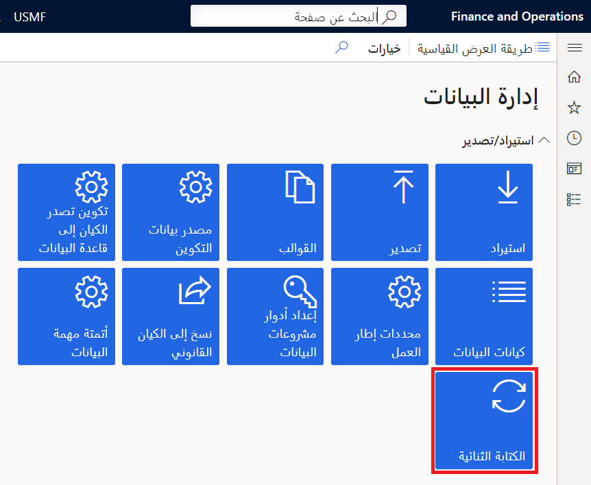
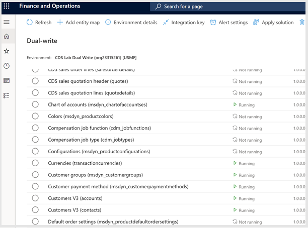

تستعرض هذه الوحدة الخطوات عالية المستوى لاستخدام وظيفة الكتابة المزدوجة وإعدادها. مساحة عمل **إدارة البيانات** داخل تطبيق التمويل والعمليات هي المنطقة الرئيسية، حيث يلزم الإعداد بعد تلبية متطلبات تثبيت تطبيق **الكتابة المزدوجة** (تم شرح التثبيت في وحدة أخرى).

للوصول إلى أحدث معلومات الإعداد، راجع وثائق [تمكين تكامل Microsoft Power Platform](/dynamics365/fin-ops-core/dev-itpro/power-platform/enable-power-platform-integration/?azure-portal=true).

> [!div class="mx-imgBorder"]
> 

عند اكتمال تثبيت تطبيق **الكتابة المزدوجة**، حدد الكيانات القانونية التي تحتاجها لتحقيق التكامل بين تطبيقات التمويل والعمليات وDataverse. 

خطوتك التالية هي إكمال فحص السلامة، الذي سيحدد ما إذا كان قد تم اتباع جميع المتطلبات الأساسية وإرشادات التثبيت. بعد إعداد فحص السلامة وإكماله، يمكنك الوصول إلى تعيينات كيانات البيانات الجاهزة.

> [!div class="mx-imgBorder"]
> 

يمكنك أن تعين كل تعيين كيان إلى **تشغيل**، الذي سيبدأ مزامنة البيانات الأولية أو إيقافها مؤقتاً أو عدم تشغيلها. تعني كل حالة شيئاً مختلفاً. يوضح الرسم التالي الحالة والوصف والإجراءات المتاحة التي يمكنك إكمالها من كل حالة.

|     الحالة          |     الوصف‏‎                                                                                                                                       |     الإجراءات المتاحة    |
|---------------------|-------------------------------------------------------------------------------------------------------------------------------------------------------|--------------------------|
|     **‏‏ليس قيد التشغيل**     |     يبدأ كل كيان من الحالة **ليس قيد التشغيل**. قبل تمكين الكيان للكتابة المزدوجة، سيكون الكيان في الحالة **ليس قيد التشغيل**.    |     تشغيل                  |
|     **تتم الآن تهيئة**    |     الكتابة الأولية/نسخ البيانات الموجودة مسبقاً                                                                                                            |     ‏‫غير متوفر                  |
|     **قيد التشغيل**         |     تم تمكين الكيان للكتابة المزدوجة                                                                                                                |     إيقاف، إيقاف مؤقت        |
|     **متوقف مؤقتاً**         |     الكيان في حالة الإيقاف المؤقت وجميع الطلبات الجديدة في قائمة الانتظار                                                                                     |     تشغيل                  |
|     **جارٍ الاستئناف**        |     الالتقاط بالسجلات الموضوعة في قائمة الانتظار من وقت إيقاف الكيان مؤقتاً                                                                                      |     ‏‫غير متوفر                  |

يمكنك إعداد البيانات والكيانات وتعيينات الكيانات للتكامل حسب تفضيلاتك. عنصر محدد من العملية هو المزامنة الأولية. بعد تبديل خريطة الكيان من **ليس قيد التشغيل** إلى **تشغيل**، سيتم تمكين الكيان للكتابة المزدوجة. قبل أن تبدأ الكتابة المزدوجة على الجدول، يمكنك تحديد خانة الاختيار **المزامنة الأولية** لتشغيل مزامنة أولية لإدارة البيانات الموجودة على كلا الجانبين.

يمكنك تخطي المزامنة الأولية، إذا لم تكن بحاجة إلى مزامنة البيانات بين البيئتين. تتيح لك المزامنة الأولية نسخ البيانات الموجودة من تطبيق إلى آخر بشكل ثنائي الاتجاه، وستحتاج إلى مراعاة عدة عوامل عند تشغيله. على سبيل المثال، قد تحتاج إلى ترحيل البيانات قبل بدء التشغيل. في هذه الحالة، يمكنك تحميل البيانات في جانب واحد من خلال ترحيل البيانات ثم المزامنة مع الجانب الآخر من خلال عملية المزامنة الأولية. 

للمزامنة الأولية الناتجة عن هذا الإجراء بعض الاعتبارات. يتم وضع قيود على حجم البيانات عند إجراء المزامنة الأولية، والغرض الرئيسي من هذه العملية ليس ترحيل البيانات. إذا كانت كمية البيانات التي تحتاج إلى تكرارها من نظام إلى آخر كبيرة، لكي يعمل تكامل الكتابة المزدوجة بشكل جيد، فستحتاج إلى مراعاة عوامل أخرى لاستراتيجيات ترحيل البيانات الفعلية. 

لمزيد من المعلومات، راجع [اعتبارات المزامنة الأولية](/dynamics365/fin-ops-core/dev-itpro/data-entities/dual-write/initial-sync-guidance/?azure-portal=true).

في تطبيقات التمويل والعمليات، إذا كنت تقوم بترحيل كميات كبيرة من البيانات، فيمكنك استخدام **معلمات إطار عمل استيراد/تصدير البيانات** في مساحة عمل **إدارة البيانات**. يوفر Dataverse استراتيجيات مختلفة لمساعدتك على إكمال ترحيل البيانات، مثل Microsoft Azure ‏Data Factory.
