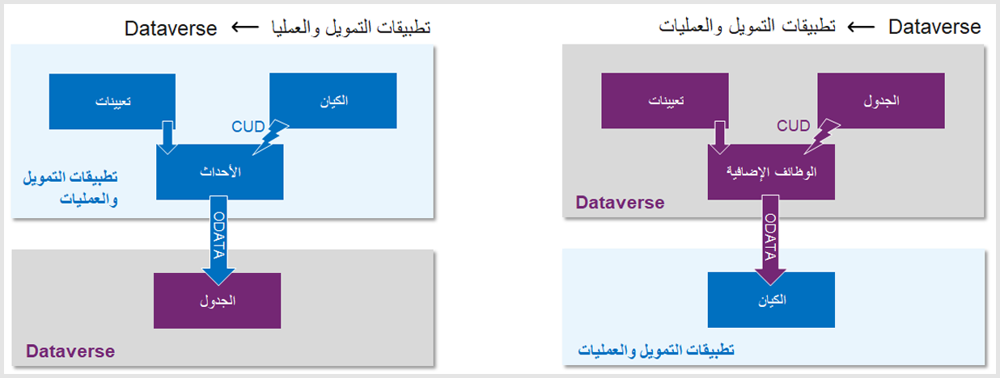

تم إنشاء Microsoft Dynamics ‏365 Sales وخدمة العملاء وField Service على النظام الأساسي Dataverse، على عكس تطبيقات التمويل والعمليات. باستخدام الكتابة المزدوجة والكيانات الظاهرية، يمكنك إنشاء اتصال بين تطبيقات Dynamics 365 للحصول على تجربة موحدة.

توفر الكتابة المزدوجة تكاملاً سلساً بين Dataverse وتطبيقات التمويل والعمليات. يحقق هذا التكامل عن طريق النسخ المتماثل لعمليات التحديث والحذف والإنشاء من نظام إلى آخر، بشكل ثنائي الاتجاه، عبر مكالمة خدمة إلى خدمة في الوقت الحقيقي تقريباً بحيث يمكن تدفق البيانات بين البيئات. تحدث هذه العملية عبر اتصالات مقترنة بإحكام من نقطة إلى نقطة، مع عدم وجود تبعيات خارجية من شأنها نقل البيانات الرئيسية (مثل العملاء والحسابات والمنتجات) وبيانات مستندات الأعمال (مثل أوامر المبيعات والفواتير) من نظام إلى آخر، والعكس صحيح.

## بنية الكتابة المزدوجة وترخيصها

يتم تخزين البيانات ضمن كيانات Dataverse في Dataverse. عند اكتشاف عملية إنشاء أو قراءة أو تحديث أو حذف (CRUD) على الكيانات الممكنة للكتابة المزدوجة، سيقوم المكون الإضافي بالتحقق من صحة تعيينات البيانات المتدفقة من Dataverse وسينقل البيانات عبر مكالمة خدمة إلى خدمة باستخدام **بروتوكول OData**. يقوم بروتوكول OData بتحويل البيانات إلى التنسيق المطلوب، ثم سيقوم بإنشاء نفس البيانات أو تحديثها أو حذفها في البيئة المتصلة بتطبيقات التمويل والعمليات.

> [!div class="mx-imgBorder"]
> 

تذكر أن هذا الاتصال ثنائي الاتجاه. ولذلك، في حالة تحديث بيانات تطبيقات التمويل والعمليات التي يتم الاحتفاظ بها أو عرضها باستخدام الكيانات أو حذفها أو إنشائها، سيتم تسجيل الأحداث وتحويلها ونقلها عبر اتصال OData إلى Dataverse. وفي أغلب النماذج الأساسية، يكون هذا التكامل متزامناً وقريباً من الوقت الحقيقي.

يتم إجراء LiveSynch في المعاملة نفسها. لن يتم إكمال البيانات لقاعدة البيانات المستهدفة حتى تكتمل العملية بأكملها. إذا حدث خطأ أثناء الانتقال أو الترجمة أو بسبب التحقق من صحة النشاط التجاري، فستفشل المعاملة بأكملها، مما يعني أنها لن تلتزم بأي من التطبيقات.

الترخيص غير مطلوب لتمكين الكتابة المزدوجة، ولا يلزم الحصول على ترخيص إضافي إذا كنت تريد إعداد جداول غير مقيدة للكتابة ضدها. ومع ذلك، عند إعداد الكتابة المزدوجة مقابل جدول مقيد، يجب أن يكون المستخدم الذي يقوم بإجراء التحديثات في تطبيقات التمويل والعمليات التي تؤدي إلى تحديثات في Dataverse مرخصاً بشكل مناسب. على سبيل المثال، إذا كان مستخدمو Dynamics 365 Finance يستفيدون من وظيفة الكتابة المزدوجة لدمج عملية الفاتورة (وهو جدول مقيد في Dataverse)، فيجب عليهم إعداد الترخيص وفقاً لـ [دليل التراخيص والأسعار لـ Dynamics 365](https://dynamics.microsoft.com/pricing/?azure-portal=true).
