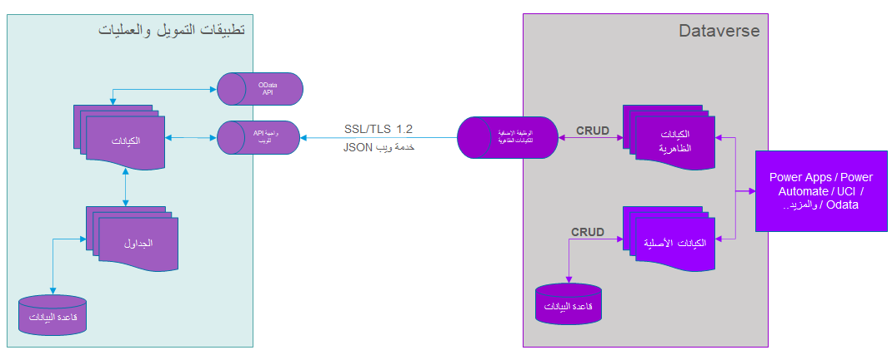

تسمح الكيانات الافتراضية بتكامل البيانات بين Dataverse وتطبيقات التمويل والعمليات ظاهرياً، دون تكرار تطبيقات التمويل والعمليات في Dataverse. تتيح الكيانات الافتراضية إمكانية العمل مع Microsoft Power Platform واستخدام جميع إمكانات Microsoft Power Platform لتطبيقات التمويل والعمليات.

الكيانات الافتراضية هي مصادر بيانات افتراضية تسمح بإنشاء معاملات الإنشاء والقراءة والتحديث والحذف (CRUD) بالتدفق من Dataverse وMicrosoft Power Platform. لا توجد معاملات CRUD هذه في Dataverse؛ بدلاً من ذلك، تظل موجودة في التطبيق حيث تنتمي. ستحتاج إلى إتاحة الكيانات من تطبيقات التمويل والعمليات المتوفرة ككيانات افتراضية في Dataverse بحيث يمكن تنفيذ عمليات CRUD من Dataverse على البيانات الموجودة في تطبيقات التمويل والعمليات.

## بنية الكيان الافتراضي

يبين الرسم التوضيحي التالي كيفية تنفيذ موفر تطبيقات التمويل والعمليات للكيانات الافتراضية.

> 

يتضمن التطبيق ستة أساليب أساسية، حيث تكون الطرق الخمس الأولى هي عمليات CRUD القياسية، بما في ذلك **إنشاء** و **تحديث** و **حذف** و **استرداد** أو **استرداد متكرر**. يتم استخدام النهج الأخير، **تنفيذ الإجراء**، بالإضافة إلى استدعاء إجراءات OData. 

ستؤدي الاستدعاءات إلى تطبيقات التمويل والعمليات وموفر الكيان الافتراضي في استدعاء ويب آمن لطبقة مآخذ التوصيل الآمنة (SSL)/طبقة أمان النقل (TLS) ‏1.2 إلى نقطة نهاية API لويب CDSVirtualEntityService في تطبيقات التمويل والعمليات. ستقوم خدمة الويب هذه بتحويل الاستعلامات إلى استدعاءات للكيانات الفعلية المرتبطة في تطبيقات التمويل والعمليات، ثم ستقوم باستدعاء عمليات CRUD أو OData على تلك الكيانات المعنية. نظرا لأنه يتم استدعاء الكيان في تطبيقات التمويل والعمليات في كافة العمليات، يتم أيضاً استدعاء منطق العمل في الكيان أو جداول النسخ الاحتياطي. تتوفر بيانات تعريف الكيان الافتراضي من خلال حلول الكيان الافتراضي في Dataverse.

ستحدث ترجمتان بين Dataverse وتطبيقات التمويل والعمليات أثناء هذه الاستدعاءات. تحدث الترجمة الأولى في المكون الإضافي للكيان الافتراضي، الذي يترجم المفاهيم، مثل ترجمة أسماء الكيانات من التمويل والعمليات إلى أسماء الكيانات الفعلية. سيقوم المكون الإضافي أيضاً بترجمة المفاهيم المرجعية للشركة.

سيستخدم الاستدعاء من خدمة الويب كائنات EntityCollection وEntity وQueryExpression للتعبير عن العمليات المنفذة باستخدام الاسم المترجم والمفاهيم من المكون الإضافي.

ستقوم API للويب في تطبيقات التمويل والعمليات بإكمال الترجمة من QueryExpression إلى QueryBuildDataSource وتركيبات اللغات الداخلية الأخرى.

بشكل عام، تهدف هذه العملية إلى أن تكون نهجاً منخفض التعليمات البرمجية/بدون تعليمات برمجية لاستخدام الإمكانات الكاملة لـ Microsoft Power Platform من خلال الجمع بين مصادر بيانات تطبيقات التمويل والعمليات.

## المصادقة والتخويل للكيانات الافتراضية

الآن بعد أن تعرفت على الكيانات الافتراضية، ستحتاج إلى فهم المصادقة الضرورية لإجراء الاستدعاءات بين النظامين. لمزيد من المعلومات، راجع [المصادقة والتخويل](/dynamics365/fin-ops-core/dev-itpro/power-platform/authentication-and-authorization?azure-portal=true#security-model).

يتم تنفيذ كافة الاستدعاءات بين Dataverse وتطبيقات التمويل والعمليات **كاستدعاءات خدمة إلى خدمة** باستخدام Microsoft Azure Active Directory (Azure AD). يجب أن يكون لدى مستخدم التطبيق حق الوصول إلى دور أمان تطبيق الكيان الافتراضي Dataverse. يحتوي هذا الدور على العديد من الامتيازات لخدمات ترجمة API للويب. يمكنك تشغيل الكيانات الافتراضية واستدعاءات الخدمة التي تم إنشاؤها لهم باستخدام سياق المستخدم في تطبيقات التمويل والعمليات والبحث عن معلومات المستخدم من مستخدم Dataverse. تعتمد الاستدعاءات بشكل كبير على أدوار الأمان التي تم إعدادها في تطبيقات التمويل والعمليات للاتصالات والترجمات والكيانات الافتراضية.

### سيناريوهات لتخويل Azure AD والكيانات الافتراضية.

أحد السيناريوهات هو المكان الذي قمت فيه بمصادقة الوصول، ويتضمن السيناريو الآخر الوصول المجهول. يتوفر كلا السيناريوهين مع الكيانات الافتراضية. 

- للوصول المصادق عليه، تحتاج جهة الاتصال في تطبيقات التمويل والعمليات إلى دور الأمان المعين لها. 

- للوصول المجهول، لا يلزم القيام بأي شيء من وجهة نظر التكوين في Dataverse. ومع ذلك، في تطبيقات التمويل والعمليات، ستحتاج إلى إنشاء معرّف مستخدم وصول مجهول إلى المدخل (كما يمكنك إنشاء أي حساب خدمة مجهول في Azure AD، ثم استيراد المستخدم إلى تطبيقات التمويل والعمليات). بعد ذلك، ستحتاج إلى تعيين دور الأمان لهذا المستخدم. لا تحتاج إلى مسؤول النظام أو إدارة الأمان حتى يعمل الاتصال.
