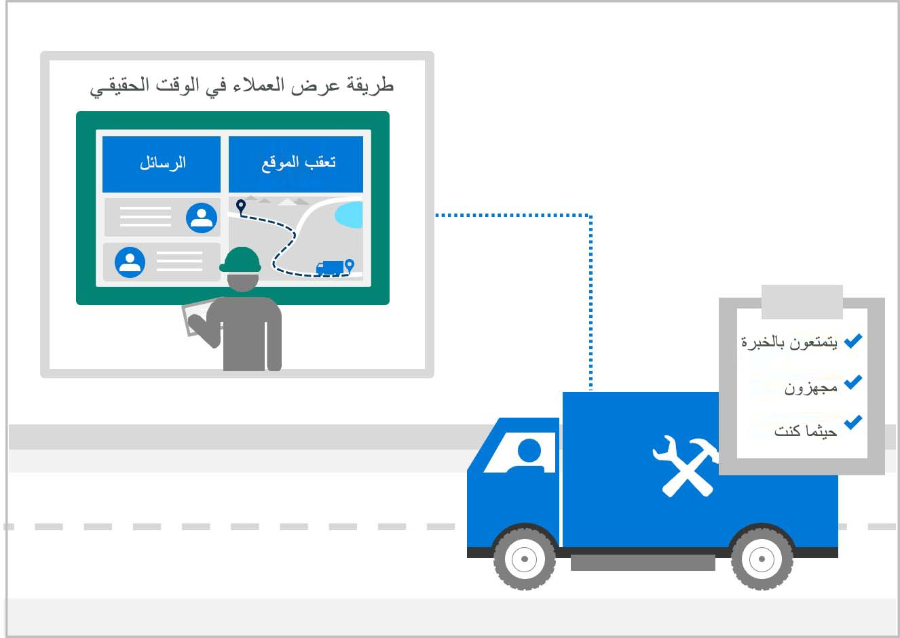
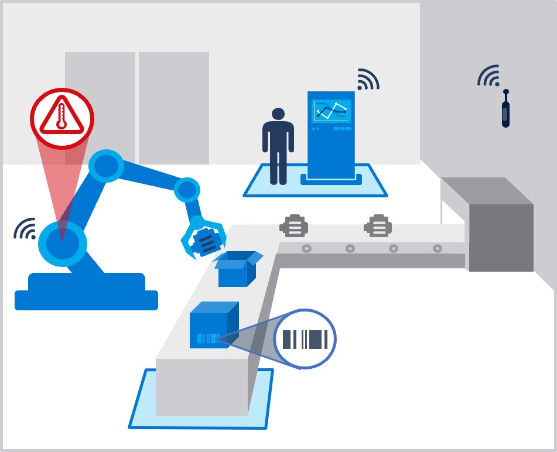

يحتوي تكامل Dynamics 365 Field Service على سيناريوهين أساسيين لجمع إمكانات الأصول عبر التطبيقات وإدارة التدبير لعمليات أوامر الشراء المتنوعة.
 
الأصول عبارة عن عناصر، مثل الخاصية. وهي أجهزة فعلية تتطلب الخدمة. تكون هذه الأجهزة في الميدان وتخضع للإهلاك، مما يساعد في تقديم القيمة المفقودة عند استخدام الأصول وتقادمها. الكائنات المعنوية تكون مستهلكة أو مُسددة الثمن بالكامل.
 
تشير إدارة الخدمة الميدانية إلى إدارة موارد إحدى الشركات الذين تم توظيفهم في الشركة. بالإضافة إلى ذلك، إنها إدارة الموارد التي تكون في اتجاه خاصية العملاء، بدلاً من خاصية الشركة. وفي الغالب تشير إدارة الخدمة الميدانية إلى الشركات التي تحتاج إلى إدارة تثبيت الأنظمة أو المعدات، أو خدمتها، أو إصلاحها.

> [!div class="mx-imgBorder"]
> 

 
يوجد خلف إدارة الأصول والخدمة الميدانية نظام بيئي كبير من وظائف الدعم الثرية التي تساعد الشركات على إدارة الخدمة الميدانية الخاصة بها فيما يتعلق بأصولها.
 
وعلى وجه التحديد، تتضمن إدارة الأصول إدارة صيانة الأصول المادية لإحدى المؤسسات من خلال دورة حياة كل أصل. يمكنك استخدام هذه الوظيفة لتخطيط أنشطة الصيانة المطلوبة، وتحسينها، وتنفيذها، وتعقبها باستخدام الأولويات، والمهارات، والمواد، والأدوات، والمعلومات المرتبطة لضمان وجود الأصول في أمر التشغيل.
 
على سبيل المثال، يمكن أن يكون الأصل الثابت مبنى، أو مصنع تصنيع، أو آلات. ويمكن أن تكون الأصول المتحركة مركبات، أو سفنًا، أو معدات قابلة للتحريك. تعمل هذه الميزة والتكامل على إدارة نوعين من أنواع الصيانة؛ الصيانة الوقائية والصيانة التنبؤية‬.
 
> [!div class="mx-imgBorder"]
> 

 
في بعض السيناريوهات، يتم تجميع إدارة الأصول وإدارة الخدمة الميدانية. من الأمثلة على سيناريو الأصول المجمعة إذا كان لديك أصل مملوك لمؤسستك، ولكن تم إقراضه، أو تأجيره، أو التوقيع عليه بشكل مشترك إلى موقع خارج موقع المؤسسة، وأنت تتكبد التكاليف على دورة حياة الأصل لصيانته وخدمته. وبدلاً من ذلك، قد يكون سيناريو الأصل المجمع عندما تقوم بتوفير الخدمات ذات القيمة المضافة إلى أحد الأصول التي قمت ببيعها بالفعل، ولكنه يقوم بإنشاء إيرادات لمؤسستك. 
 
ومن أمثلة التدبير أن يكون لديك فني خدمة في الميدان، ويبدأ تدبيرًا. في هذا السيناريو، ستحتاج إلى عرض دورة حياة أمر الشراء عبر Field Service وSupply Chain Management حتى يكتمل التدبير برؤية كاملة في كلا النظامين. ستحتاج إلى السماح ببدء أمر الشراء من الميدان، ومشاركة الرؤية مع الأطراف الأساسية، ثم التأكد من إمكانية اكتمال دورة الحياة. مع تثبيت عدد قليل فقط من الحلول الإضافية في مدخل Power Platform، وتعيين المنطق لعمليات التكامل لتوسيع المنتج، والتأكد من أنه تم تعيين الأعمدة بشكل صحيح في جدول **المنتجات**، يكون هذا السيناريو ممكنًا وأساسيًا لتكامل Field Service.
 
لمزيد من المعلومات، راجع [تكامل Dynamics 365 Field Service وSupply Chain Management](/dynamics365/field-service/supply-chain-field-service-integration/?azure-portal=true). 
