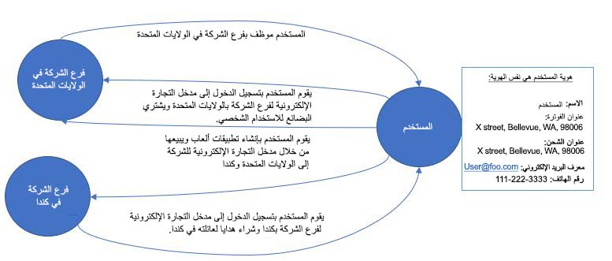
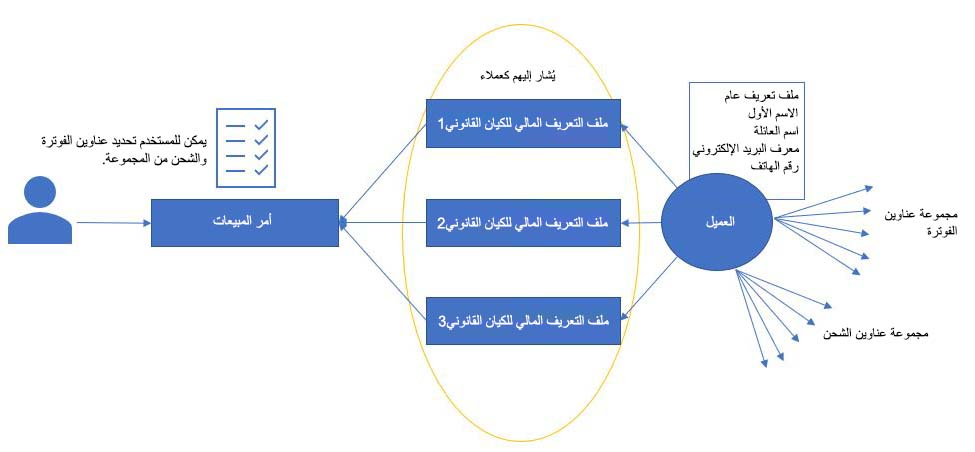
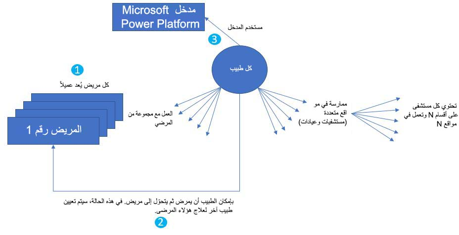

إن حل *نموذج الطرف ودفتر العناوين العمومي‬* عبارة عن ميزة للكتابة المزدوجة تغطي بشكل أساسي ثلاثة سيناريوهات مختلفة.

## السيناريو 1 
هذا السيناريو هو المكان الذي يمكن فيه لشخص أو مؤسسة تأدية أكثر من دور واحد في العمل وسيحتاج إلى تبديل الأدوار بالاستناد إلى السياق.
 
على سبيل المثال، لدى أحد موظفي شركة Contoso US معلومات معرّفه الشخصي الخاص، ولأنه موظف في الولايات المتحدة، فيمكنه تسجيل الدخول إلى مدخل التجارة الإلكترونية وشراء المنتجات. وبما أنه قادر على أن يكون مستهلك هذه المنتجات، فهو بالتالي عميل. ومع ذلك، يمكنه أيضًا تسجيل الدخول إلى مدخل التجارة الإلكترونية وإنشاء تطبيقات ثم بيعها عبر المدخل إلى أسواق الولايات المتحدة وكندا. في هذا السيناريو، هذا المستخدم هو عميل، ولكنه مورد أيضًا. 

تتضمن التعقيدات الرئيسية لهذا السيناريو القدرة على القيام بما يلي: 

- تمثيل شخص كجهة اتصال أو كعميل أو كمورد أو جميع هذه الخيارات.
- تمثيل مؤسسة كعميل أو كمورد أو كليهما.
- السماح لكل شخص أو مؤسسة بالتعامل في أكثر من سوق واحد، ثم تعقب الحركات مقابل كل سوق، من النهاية إلى النهاية.

    

## السيناريو 2 
يتعلق هذا السيناريو بالحركات التي يمكن إكمالها بواسطة المستخدم. قد يحتاج مستخدم أو شركة إلى الحصول على عدة ملفات تعريف مختلفة للعناوين والضرائب والقواعد واللوائح الخاصة بكل بلد للتعامل في كل منها. من الضروري وجود ملف تعريف عام وملفات تعريف مالية كثيرة لكل بلد مختلف أو مجموعة من احتياجات الحركات المختلفة. ويتم اعتبار كل ملف تعريف مالي كالعميل على حركة وليس ملف التعريف العام. ومع ذلك، إذا حدث تغيير في ملف التعريف العام، مثل تغيير في الاسم أو العنوان، فسيصبح متاحاً لجميع ملفات التعريف المالية لهذا العميل.
 
على سبيل المثال، بإمكان العميل التعامل في بلدان كثيرة، ولكن لا يطرأ أي تغيير على حالة المواطنة والتعريف الشخصي. ومع ذلك، بالاستناد إلى البلد/المنطقة التي يتعامل بها المستخدم، قد يتم وضع قواعد ولوائح مختلفة للضرائب الخاصة بكل بلد/منطقة. توجد في الولايات المتحدة قواعد ولوائح مختلفة عن بلدان/مناطق أخرى، ويحتاج هذا العميل إلى تنفيذ حركات في عدة بلدان/مناطق.
 
تتضمن التعقيدات الرئيسية لهذا السيناريو القدرة على القيام بما يلي:

- فصل ملف تعريف عام عن معلومات ملف تعريف محدد.
- تخزين واسترداد أكبر عدد ممكن من العناوين من كل نوع.
- جعل التغييرات في الخصائص العامة متاحة لكل عميل من دون تكرار البيانات.
  
    
 
## السيناريو 3 
يتعامل هذا السيناريو مع تحول العميل إلى مؤسسة، سواء أكان للمؤسسة مواقع متعددة، عند وجود عملاء معينين للمؤسسة في مواقع مختلفة، والقدرة على معالجة كل خيار. على سبيل المثال، ضع في اعتبارك سيناريو مستشفى مع طبيب ومرضى. يعالج الطبيب مريضاً أو أكثر في نفس الوقت. ويُشار أيضًا إلى كل مريض بالاستناد إلى الطبيب الذي تم تعيينه له. بإمكان الطبيب تسجيل الدخول إلى موقع المستشفى على الويب، وتعقب سجلات المرضى، وتقديم توجيهات لهم للوصفات الطبية والعلاجات لاحتياجاتهم الفردية. بإمكان الطبيب أن يتدرب في مواقع متعددة، ويتكون كل مستشفى من أقسام متعددة تعمل في كل موقع من المواقع المتعددة. بإمكان الطبيب أن يمرض ثم يتحوّل أيضًا إلى مريض.

تتضمن هذه الحالة تعقيدات رئيسية متعددة، بما في ذلك القدرة على:

- إقران جهة الاتصال بعميل واحد أو أكثر بدون بيانات مكررة، ثم تعقب سجلات العملاء بالاستناد إلى جهة الاتصال.
- تحويل جهة اتصال إلى عميل.
- السماح لجهة الاتصال بتسجيل الدخول إلى عدة مداخل والوصول إلى جميع سجلات العملاء عبر جميع المواقع.
  
    

## الملخص

جميع السيناريوهات المذكورة في حل الطرف ودفتر العناوين العمومي موجودة في Power Platform وفي بيانات Dataverse. بشكل عام، يمكن تمثيل العميل كشخص أو مؤسسة. يمكن أن يكون لجهة الاتصال عدة عناوين وملفات تعريف مالية وملف تعريف عام. يمكن إقران العميل بجهة اتصال واحدة أو أكثر، ويمكن إقرانها بعدة أجزاء من المعلومات، مثل مجموعة العملاء وشروط الدفع وطريقة الدفع وجدول الدفع وما إلى ذلك. لا يؤثر هذا العامل على العملاء فقط؛ الموردون لديهم أيضًا هذه القدرات. كل شركة هي شركة، وقد تم إنشاء التعقيدات الرئيسية لتصنيف العملاء وتحسين صورتهم ومنحهم المزيد من التفاصيل، مثل شروط الدفع وطرق الدفع، من بين تفاصيل أخرى كثيرة.

يتوفر مسار ترقية من حل نموذج ما قبل الطرف الأصلي إلى نموذج الطرف ونموذج حل دفتر العناوين العمومي. تتوفر قوالب منفصلة لترحيل بيانات الطرف وبيانات العقد، كما تتوفر قوالب منفصلة للعناوين البريدية والإلكترونية أيضًا. تستند جميع القوالب ومسار الترقية إلى قوالب Microsoft Azure Data Factory، ويمكنك استخدامها لسيناريو التحديث.

لمزيد من المعلومات، راجع [دفتر عناوين الطرف ودفتر العناوين العمومي](/dynamics365/fin-ops-core/dev-itpro/data-entities/dual-write/party-gab/?azure-portal=true).
