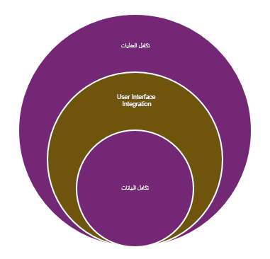

تركز هذه الوحدة على استراتيجية التكامل الخاصة بك وكيف ستساعد ورشة عمل التكامل في التحقق من أن خطط تكامل المشروع شاملة وستدعم التنفيذ الأولي والاحتياجات طويلة الأجل. الهدف من ورشة العمل هو تقييم خطة التكامل المقترحة وتقديم التغذية الراجعة والتوصيات التي تسلط الضوء على المخاطر الفنية والقضايا وتحديد أفضل الممارسات.

يجب جدولة ورشة عمل التكامل واستكمالها خلال مرحلة تنفيذ المشروع. يمكنك أيضاً [تنزيل أمثلة القوالب](https://github.com/MicrosoftDocs/mslearn-developer-tools-power-platform/tree/master/fasttrack/?azure-portal=true) لورشة العمل هذه وورش العمل الأخرى.

## ماذا يعني التكامل

التكامل هو ربط جزء أو أكثر من أجزاء أو مكونات الأنظمة لخلق تجربة أكثر توحيداً أو لضمان نتيجة أكثر اتساقاً للعملية. يسمح التكامل باستخدام الخدمات الحالية، الداخلية والخارجية، دون الحاجة إلى إعادة بناء الوظائف الحالية أو ترحيلها.

تشمل الأنواع المختلفة من عمليات الدمج التي ستستخدمها في المشاريع ما يلي:

- **تكامل العملية** - أنظمة متباينة متعددة، وكل نظام هو جزء من وظيفة عمل شاملة.

- **تكامل واجهة المستخدم** - رؤية البيانات من نظام واحد أو أكثر دون إدخال سجلات البيانات في النظام.

- **تكامل البيانات** - الجمع بين البيانات من مصادر مختلفة وتقديم عرض موحد للمستخدم.  

> [!div class="mx-imgBorder"]
> 

يمكن أن يستخدم التنفيذ الفعلي لعمليات التكامل العديد من الأساليب الفنية المختلفة، بما في ذلك واجهة المستخدم (UI) والملف وواجهات API وMicrosoft Power Platform والموصلات وأدوات ETL الخارجية الأخرى. ستكون بعض عمليات الدمج أيضاً تكوينات لعمليات تكامل مُنشأة مسبقاً ومدعومة بواسطة النظام الأساسي وتطبيقات Microsoft Dynamics ‏365. يحتوي كل نهج على عوامل يجب أن تكون على دراية بها كجزء من مراجعة ورشة عمل التكامل. سيتم تغطية عمليات الدمج هذه بالتفصيل لاحقاً.

يمكن أن يساعدك فهم أسباب التكامل والمشكلة التي تحاول حلها في تحديد أهمية التكامل ومستوى المخاطر المرتبطة به. بالنسبة لكل تكامل، تأكد من أنك واضح بشأن ما تتوقع حدوثه إذا لم يكن التكامل متاحاً وكيف تتوقع التعامل مع الإخفاقات.

يمكن تصنيف عمليات التكامل على أنها ضرورية أو ملائمة. عمليات التكامل الأساسية هي مفتاح نجاح مشروعك والتشغيل المستمر.
غالباً ما تتضمن ضمان تكامل البيانات أو المشاركة في عمليات الأعمال التنظيمية الأكبر. يمكنها أيضاً دمج الخدمات التي تزيد من وظائف نظامك الأساسي والتعامل مع المنطق المهم. على سبيل المثال، قد يتم استخدام خدمة خارجية لإجراء التقييم الائتماني لتحديد ما إذا كان سيتم إصدار ائتمان لأمر ما.

تساعد عمليات تكامل الملائمة في تسهيل العملية على المستخدمين أو تساعد في تحسين إنتاجيتها. على سبيل المثال، قد يمنع التكامل الملائم المستخدم من الدخول في تطبيق منفصل، مما يسمح له بتشغيل التكامل من داخل تطبيق Dynamics 365. بينما تساعد عمليات الدمج الملائمة في توفير الوقت، فإنها توفر أيضاً مساراً بديلاً يمكن للمستخدمين اتخاذه لإكمال المهمة إذا كان النظام معطلاً. في الغالب، يجب أن تركز جهودك في ورشة عمل التكامل على عمليات التكامل الأساسية التي تعتبر بالغة الأهمية لنجاح مشروعك.

على غرار جميع ورش العمل في Success by Design، لن يتم تطبيق كل جانب من جوانب ورشة عمل التكامل على كل مشروع. ومع ذلك، من الضروري أن يكون لديك خطة وعملية لإدارة فكرتك في عملية النشر.

## توقيت مراجعة تصميم التكامل
يجب أن تسبق مراجعة مخطط الحل دائماً مراجعة تصميم التكامل. قبل الخوض في الموضوعات المتعلقة بالتكامل، تحتاج إلى فهم الحل الذي سيساعدك على تحديد كيف ستلعب عمليات الدمج دوراً في الحل.

لا تقدم مراجعة تصميم التكامل نظرة عامة حول كيفية التكامل مع Dynamics 365. لهذا الغرض، تم تطوير العديد من المحادثات التقنية التي تناقش وتجسد استخدام أدوات وأنماط التكامل. 

يجب إجراء ورشة عمل مراجعة تصميم التكامل عندما يقترب التصميم من الاكتمال، أو قد اكتمل بالفعل، وعندما يتم الوصول إلى فهم قوي لكيفية دمج التطبيقات المختلفة أثناء تشكيل الحل الكامل.

