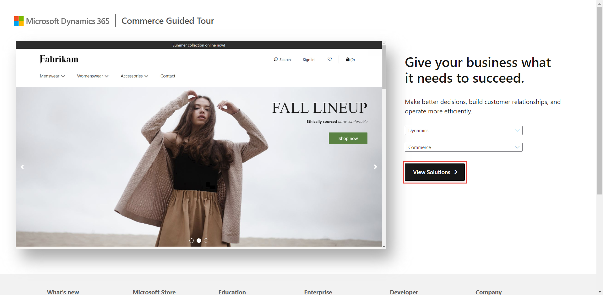

لست بحاجة إلى تحديد تطبيق Dynamics 365 المناسب لك على الفور. بدلاً من ذلك، يمكنك استكشاف الجولات الإرشادية والتعرف على حالات الاستخدام لكل عرض. فكر في كيفية توفير هذه العروض حلولاً للشركات.

لاستكشاف الجولات الإرشادية، انتقل إلى [جولات Microsoft الإرشادية](https://guidedtour.microsoft.com/?azure-portal=true) ثم اتبع الخطوات التالية:

1.  حدد **Dynamics** في الحقل **حدد مجموعة سيناريوهات**. 
2.  حدد سيناريو لجولتك الأولى.
1.  حدد **عرض الحلول** للانتقال إلى النقر.

    > [!div class="mx-imgBorder"]
    > 

1.  اقرأ عن السيناريو المحدد ثم حدد النقاط للتقدم عبر التطبيق.

1.  قم بمراجعة بعض الجولات الإرشادية المتوفرة المختلفة لفهم تطبيقات Dynamics 365 بشكل أفضل.
