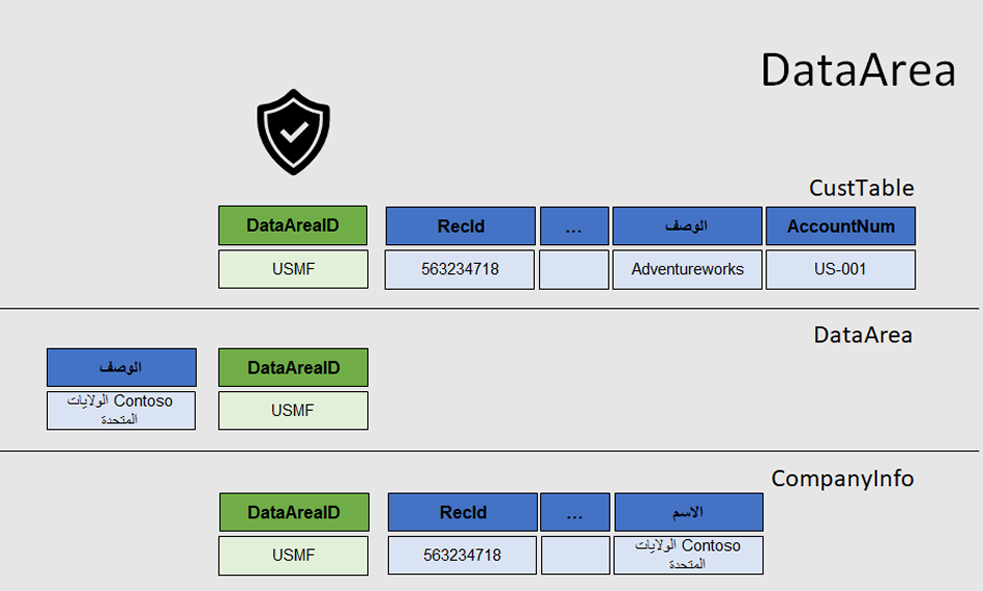
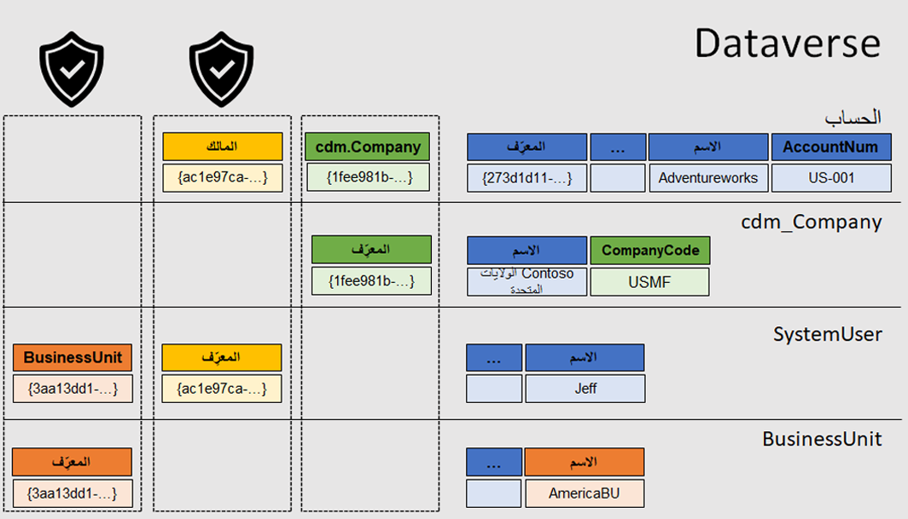
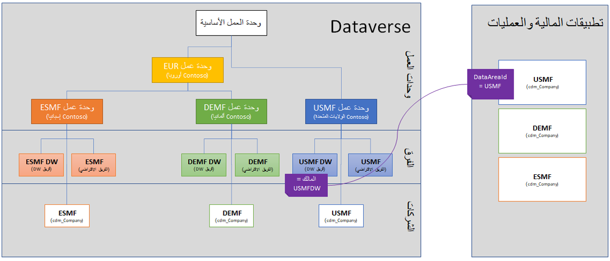

يختلف مفهوم الشركة (ما تقوم به الشركة أو تشير إليه) اعتماداً على التطبيق الذي تهتم به. في سيناريو الوحدة النمطية هذا، ستركز على تطبيقات التمويل والعمليات وDataverse. 

في تطبيقات التمويل والعمليات، يشتمل مفهوم الشركة على مفهومين مرتبطين معاً. **الشركة** هي منطقة أمان مرتبطة بالأذونات والامتيازات والأدوار، وهي أيضاً مفهوم قانوني وإعداد التقارير. على سبيل المثال، إذا كان لدى المستخدم داخل تطبيقات التمويل والعمليات حق الوصول إلى شركة **USMF** في بيانات العرض التوضيحي لشركة Contoso، حيث يمكنك القيام بأعمال تجارية، وإنشاء اتفاقيات تجارية، وتحديد المستودعات والبلدان في كيان قانوني واحد، والعمل بعملات محددة فقط، فلا يمكنك إكمال هذه الأنشطة في شركة **USRI** بسبب أدوارك الأمنية. في تطبيقات التمويل والعمليات، تتم الإشارة إلى الكيان القانوني ومعرّف منطقة البيانات ومعلومات الشركة بنفس المفهوم. 

على عكس تطبيقات التمويل والعمليات، التي تمزج بين الأمان وبنيات الأعمال في المفهوم نفسه، يميز Dataverse بين تلك البنيات. ترتبط سجلات وحدة العمل أو المالك بحدود الأمان الخاصة بالمستخدم، وتحدد هذه السجلات ما يمكن للمستخدم عرضه أو تعديله. سجلات الشركة هذه لها علاقة محددة بالكيان **cdm_Company**. يمكنك التحكم بشكل مختلف في الشركة، بشكل منفصل عن وحدة الأعمال وأمن المستخدم. 

بشكل أساسي، تحتوي تطبيقات التمويل والعمليات على مفاهيم يتم تمثيلها معاً، بينما ينفرد Dataverse بمفاهيم منفصلة. 

في تطبيقات التمويل والعمليات، سيتضمن أي جدول يحتوي على مفهوم الشركة أو يتعامل مع شركة الحقل **DataAreaID**. يُعد هذا المفهوم صحيحاً بالنسبة لكافة الجداول، مثل **CustTable** و **SalesTable‬** و **CustGroupTables** و **CompanyInfo**. تعتبر منطقة البيانات سلسلة مكونة من ثلاثة أو أربعة أحرف تتعلق بجدول **DataArea**، والذي لا يتعقب الشركات الموجودة. يحتوي جدول **CompanyInfo** على علاقة فردية مع جدول **DataArea** ويرتبط صف واحد في جدول **DataArea** بنفس منطقة البيانات في جدول **CompanyInfo** حيث ترتبط المعلومات المتعلقة بمنطقة البيانات هذه. 

في Dataverse، يخزن جدول **الحساب** معلومات الشركة. يخبر المفتاح الخارجي **cdm_Company** المستخدم بالسجل القانوني الذي يوجد فيه سجل كل صف. عمود **المالك** هو أمان ضمني. تحتوي معظم الكيانات، مثل **الحساب** على مالك إما مستخدم أو فريق. سجل الحساب مملوك لمستخدم عضو في وحدة أعمال، مما يعني أن كيان الحساب يُعد جزءاً من وحدة الأعمال هذه. 

ويصبح هذا المفهوم مهماً عند إضافة الأمان نظراً لأنه يمكنك السماح للمستخدم بعرض السجل إذا كان يمتلك السجل أو كان جزءاً من وحدة العمل نفسها التي تمتلك السجل. المفهوم الرئيسي هو أن دلالات الشركة حول عضوية الشركة القانونية تتم بشكل صريح من خلال المفتاح الخارجي **cdm_Company**، والبنى الأمنية لوحدة الأعمال التي ترتبط بها من خلال مكون الملكية. 

لا تحتوي بعض السجلات أو الكيانات في Dataverse على حقل **المالك**، مثل كيان **المنتج**. يُشار إلى هذه الكيانات باسم الكيانات العالمية، ولا يزال بإمكانها الحصول على وحدة أعمال ولكن يمكن قراءتها عالمياً من قِبل المؤسسة بأكملها. 

يحتوي التنفيذ القياسي لتطبيقات التمويل والعمليات ونشر Dataverse على عملية متوقعة وآلية تحدد أنه لكل شركة في تطبيقات التمويل والعمليات، يوجد كيان شركة مصاحب ووحدة أعمال في Dataverse. عند إجراء الاتصال بـ Dataverse، ستقوم العملية التلقائية بإنشاء كيان الشركة المطابق بين تطبيقات التمويل والعمليات وDataverse. بالإضافة إلى ذلك، سيتم إنشاء فريقين: الفريق الافتراضي وفريق محدد مزدوج الكتابة. يبسط هذا النهج مهمة نشر كيان جديد في تطبيقات التمويل والعمليات لأن كل شيء سيعمل وسيتم نشره افتراضياً. ومع ذلك، لا يتم إجبارك على الدخول في نموذج التنظيم والنشر هذا؛ تتوفر خيارات وتخصيصات أخرى لهيكل الأعمال في Dataverse دون التأثير على الشركة أو ملكية السجلات. 

يوضح المثال التالي تفصيلاً عاماً للكيانات القانونية في تطبيقات التمويل والعمليات، وكيفية ظهورها في Dataverse من منظور تلقائي، وملكية السجلات استناداً إلى استراتيجية النشر التلقائي. 

توجد ثلاثة كيانات قانونية في تطبيقات التمويل والعمليات. وبالتالي، توجد ثلاث وحدات أعمال (BUs) على الأقل في Dataverse، مع فريقين تحت كل وحدة أعمال: فريق افتراضي وفريق كتابة مزدوج. يتم استخدام فريق الكتابة المزدوجة لملكية البيانات الافتراضية المكتوبة من تطبيقات التمويل والعمليات والعكس صحيح. لذلك، تحتوي تطبيقات التمويل والعمليات على معرّف منطقة البيانات، ويحتوي Dataverse على مالك. كما ذكرنا سابقاً، يمكنك تخصيص هذا الإعداد. يمكنك تغيير ملكية سجل داخل Dataverse بعد التعيين الأولي، ويمكنك تعديل وحدات الأعمال والفرق لتناسب احتياجات عملك بشكل أكثر كفاءة. 

