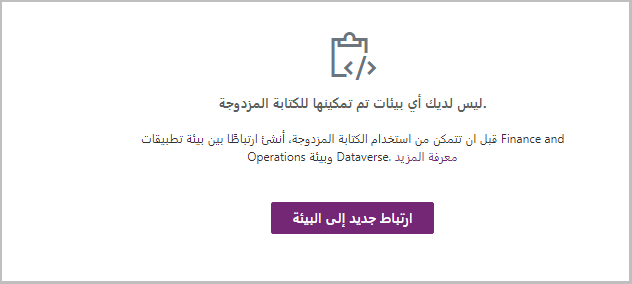

يمكن أن تختلف عملية تثبيت الكتابة المزدوجة وإعدادها، اعتماداً على السيناريو ونقطة البداية للتنفيذ الفردي. من أجل الاتساق، افترض أنك تستوفي كافة المتطلبات الأساسية لبيئة تطبيقات التمويل والعمليات وأن بيئات Dataverse قد اكتملت. افترض أيضاً أن كل بيئة متاحة وتعمل وجاهزة للربط. 

لمزيد من المعلومات، راجع [إرشادات إعداد الكتابة المزدوجة](/dynamics365/fin-ops-core/dev-itpro/data-entities/dual-write/connection-setup/?azure-portal=true).

إذا كنت تقوم بنشر بيئة تطبيقات التمويل والعمليات مالية وبيئة Dataverse جديدة، فيمكنك استخدام نشر بيئة متكاملة. سيسمح لك هذا النشر بإعداد الكتابة المزدوجة مباشرةً من Lifecycle Services في Microsoft Dynamics ‏365، والتي ستكون تجربة سلسة لعملائك. 

لمزيد من المعلومات، راجع [تمكين تكامل Microsoft Power Platform](/dynamics365/fin-ops-core/dev-itpro/power-platform/enable-power-platform-integration/?azure-portal=true).

إذا كانت لديك بيئة تطبيقات التمويل والعمليات حالية وبيئة Dataverse حالية مع قاعدة بيانات، فستقوم أولاً بإعداد الارتباط من خلال بيئة تطبيقات التمويل والعمليات. انتقل إلى مساحة العمل **إدارة البيانات** وحدد لوحة **الكتابة المزدوجة** لبدء عملية الربط. 

> [!div class="mx-imgBorder"]
> 

عند تحديد الزر لإنشاء ارتباط جديد إلى بيئة، سيبدأ تشغيل معالج الاتصال ويأخذك خلال الإعداد اللازم. اختر بيئة Dataverse القائمة التي تريد الربط بها. حدد الكيانات القانونية التي تريد توصيلها ببيئة Dataverse، ثم قم بتمكين الكتابة المزدوجة للبيانات الموجودة فيها. 

الخطوة التالية هي التحقق من اكتمال جميع متطلبات فحص السلامة. إذا لم تكتمل، فقد تحتاج إلى تنفيذ خطوات إعداد إضافية وتحديد المتطلبات الأساسية المفقودة. لتحديد تلك المتطلبات والخطوات، راجع [إرشادات إعداد الكتابة المزدوجة](/dynamics365/fin-ops-core/dev-itpro/data-entities/dual-write/connection-setup/?azure-portal=true).
 

بعد اجتياز كافة عمليات التحقق من السلامة، يمكنك المتابعة من خلال المعالج وإنشاء الارتباط بين بيئة تطبيقات التمويل والعمليات وبيئة Dataverse. بعد إنشاء الارتباط، يمكنك استيراد الحلول أو تطبيقها لإنشاء تعيينات الجداول واستيرادها وتحديدها للكيانات التي ستقوم بتمرير البيانات بين البيئات. قد تتطلب بعض تعيينات الجداول تشغيل تعيينات إضافية في وقت واحد. سيتم عرض هذه التعيينات الإضافية المطلوبة عند محاولة بدء التعيينات. 

> [!div class="mx-imgBorder"]
> 

سيحتوي كل تعيين تقوم بتمكينه أيضاً على خيار للمزامنة الأولية. لإجراء مزامنة أولية، تأكد من مراعاة الجداول ذات مؤشرات الترابط المفردة أو الجداول متعددة مؤشرات الترابط وقيود عمليات ترحيل البيانات وحدود الصفوف. بالنسبة للجداول ذات مؤشرات الترابط المفردة، مثل الحسابات والموردين وأكواد الضريبة، نوصي بشكل عام بترحيل البيانات إلى تطبيقات التمويل والعمليات. بعد ذلك، سيتم تشغيل المزامنة الأولية لنقل البيانات إلى Dataverse. بالنسبة إلى الجداول متعددة مؤشرات الترابط، ستحتاج أولاً إلى ترحيل البيانات إلى Dataverse ثم تشغيل المزامنة الأولية لنقل البيانات إلى تطبيقات التمويل والعمليات. 

لمزيد من المعلومات، راجع [اعتبارات المزامنة الأولية](/dynamics365/fin-ops-core/dev-itpro/data-entities/dual-write/initial-sync-guidance/?azure-portal=true).

تحتوي تعيينات الجداول على عدة حالات مختلفة لأنها ممكنة بعد الربط. عند تمكين تعيين جدول للكتابة المزدوجة، فإنه يبدأ من حالة **‏‫‏‏ليس قيد التشغيل**. بعد ذلك، يمر تعيين الجدول بمرحلة تهيئة، حيث تقوم بكتابة أولية عن طريق نسخ البيانات الموجودة مسبقاً على الجداول على جانبي الرابط. وأخيراً، عند تمكين تعيين الجدول بشكل كامل، يقوم تعيين الجدول بتعيين الحالة إلى **قيد التشغيل**. من حالة التشغيل، يمكنك إيقاف التعيين أو إيقافه مؤقتاً. عند إيقاف التعيين بشكل مؤقت، يتم وضع جميع التغييرات في قائمة الانتظار حتى يتم استئنافها. عند استئناف التعيين، سينتقل الجدول إلى وضع الالتقاط، حيث يتم تشغيل جميع التغييرات في قائمة الانتظار للمساعدة في ضمان أن الجدول حديث الصلاحية. 

لمزيد من المعلومات، راجع قسم **المثال: تمكين ‏‫العملاء V3‬—تعيين جدول جهات الاتصال** [لتمكين تعيينات الجداول لعمليات الكتابة المزدوجة](/dynamics365/fin-ops-core/dev-itpro/data-entities/dual-write/enable-entity-map/?azure-portal=true).
