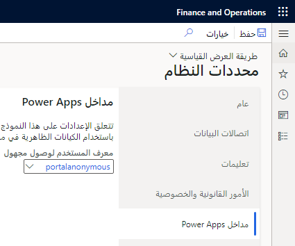

يُعد السبب في وصف مفهوم الشركة والأمن في وقت واحد أنه يتم دمجهما في تطبيقات التمويل والعمليات. على الرغم من أن Dataverse لديه فصل أكبر، عند الاتصال بهذه المكونات من خلال الكتابة المزدوجة، يجب مراعاة كل منهما. تعرض الصورة التالية تفصيلاً لأدوار تطبيقات التمويل والعمليات والامتيازات والأذونات، كما تعرض فرع ملكية Dataverse للكيانات والإجراءات. 

تحتوي تطبيقات Dataverse وتطبيقات التمويل والعمليات على نموذج الأمان ذاته. وبشكل أساسي، يكون للمستخدم أدوار أمان، ويمنح كل دور أمان هذا المستخدم العديد من الامتيازات. 

يختلف نموذج الأمان في كليهما في عدد قليل من المجالات. في Dataverse، تعطي الامتيازات للمستخدم القدرة على عرض Dataverse للكيانات والإجراءات، ستقوم الملكية بحماية البيانات. وعلى العكس، في تطبيقات التمويل والعمليات، تتيح الامتيازات الوصول إلى نقاط النهاية؛ إذا كان لدى المستخدم حق الوصول إلى نموذج، فسيكون لديه حق الوصول إلى مصدر البيانات والجدول الأساسيين. في Dataverse، تكون الكيانات بسيطة وغير طبيعية، في حين تحتوي تطبيقات التمويل والعمليات على عشرات الجداول، وهي بيئة طبيعية بشكل كبير. هذه العوامل تجعل من الصعب تحديد الوصول إلى الجدول الأساسي بدلاً من الوصول إلى نقطة النهاية أو النموذج المحدد. 

ومع ذلك، فإن كلاهما لهما أمن مماثل فيما يتعلق بالكيانات. يمكن أن تتيح تطبيقات التمويل والعمليات الوصول إلى كيان، مما يتيح الوصول إلى الجداول الأساسية لهذا الكيان. لذلك، فإن الكيانات التي يتم عرضها من خلال الكتابة المزدوجة مفيدة لأنه يمكنك استخدام مفاهيم الأمان نفسها للبيانات الأساسية. 

## أمان الكتابة المزدوجة

يعمل أمان الكتابة المزدوجة عبر مكالمة خدمة إلى خدمة، ولا يحتاج المستخدم إلى التواجد في كلا النظامين للوصول إلى البيانات وإجراء المكالمات. إذا تدفقت البيانات من تطبيقات التمويل والعمليات وتمت كتبتها إلى Dataverse، فسيكون السجل مملوكاً لفريق الكتابة المزدوجة الافتراضي لوحدة الأعمال. إذا تدفقت البيانات من Dataverse وتمت كتابتها إلى تطبيقات التمويل والعمليات، فسيتم تحديد نطاق السجل حسب مفهوم منطقة البيانات، وسيستند الأمان إلى الكيان القانوني.

## أمان الكيان الافتراضي

يختلف الأمان داخل الكيانات الافتراضية عن الكتابة المزدوجة وذلك لأن الكيانات الافتراضية تحاول حل مشكلة مختلفة. تسمح الكيانات الافتراضية لتقنيات Microsoft Power Platform، وتلك التي تستخدم Dataverse في الأساس، بالوصول إلى مجموعة متنوعة من البيانات من تطبيقات التمويل والعمليات دون تسجيل الدخول إلى النظام المنفصل. وبالنسبة إلى هذه البنية، ستحتاج إلى مستخدم فردي لقراءة السجلات وعرضها خارج تطبيقات التمويل والعمليات في سياق امتيازاته. نظراً لأن هذه العملية لا تتضمن نسخ البيانات بين نظامين، مثل الكتابة المزدوجة، فستحتاج إلى الاحتفاظ بالمستخدم وأمانه في السياق لعرض السجلات والبيانات. 

بالنسبة لهذا الترتيب، بالنسبة للكيانات الافتراضية، ستنتحل شخصية مستخدم Dataverse في تطبيقات التمويل والعمليات عند إجراء مكالمة كيان افتراضي. يتم إجراء مكالمة خدمة إلى خدمة في الخلفية لانتحال صفة المستخدم والحصول على سياق المستخدم الأصلي لمن قام بإنشاء المكالمة. في تطبيقات التمويل والعمليات، ستقوم بإكمال عملية "تشغيل كـ" لانتحال صفة المستخدم. يرتبط كل ما يفعله المستخدم بامتيازاته، لذلك يجب أن يمتلك حق الوصول الصحيح إلى تطبيقات التمويل والعمليات. بشكلٍ أساسي، يجب أن يكون المستخدم في Dataverse الذي يجري المكالمة موجوداً كمستخدم في تطبيقات التمويل والعمليات مرخصاً ولديه الأمان الصحيح للبيانات التي يحاول الوصول إليها. 

تحتوي الكيانات الافتراضية على ثلاثة أنواع من الأنماط للمصادقة والوصول:

- **يقوم المستخدم بالوصول إلى بيانات تطبيقات التمويل والعمليات** – بالنسبة لهذا النمط، ستقوم بتمرير معرف المستخدم والكائن إلى تطبيقات التمويل والعمليات، حيث يجب أن يكون المستخدم موجوداً ولديه امتيازات للوصول إلى البيانات التي يحتاجها.

- **الوصول إلى المدخل‬ (مجهول الهوية ومصادق عليه)** 

    - **الوصول إلى البوابة الإلكترونية المجهولة** - بالنسبة لهذا النمط، ستقوم بتعيين الوصول إلى البوابة الإلكترونية المجهول في منطقة **معلمات النظام** في تطبيقات التمويل والعمليات. يتحكم المستخدم الذي تم إنشاؤه وتعيينه في المدخل المجهول الهوية في الوصول إلى المدخل من خلال معلمات النظام. ستكون البيانات المتاحة لهذا المستخدم، والوصول الذي يتمتع به المستخدم، هي ما سيحصل المستخدمون المجهولون على إذن للوصول إليه من خلال المدخل.

        > [!div class="mx-imgBorder"]
        > 

    - **الوصول إلى البوابة الإلكترونية المصادق عليها** – بالنسبة لهذا النمط، ستستخدم ميزة **مداخل Power Apps** في معلمات النظام لإنشاء وصول إلى جانب سجل جهات اتصال في Dataverse. سوف يتحكم هذا السجل في Dataverse في ما يمكن لجهة الاتصال الوصول إليه. لن يتم توفير أي وصول إلى سجل جهات الاتصال هذا من Dataverse، لذلك سيقوم كيان تعيينات مستخدم البوابة الإلكترونية الخارجية بحفظ الإعدادات الخاصة بجهة الاتصال هذه وسيتم تعيينه لمستخدم في تطبيقات التمويل والعمليات. يمكن أن يكون كل مستخدم منفصلاً، أو يمكنك إنشاء مستخدم واحد لإدارة جميع الاتصالات من Dataverse. 

        > [!div class="mx-imgBorder"]
        > 

- **الوصول من خدمة إلى خدمة كمستخدم تطبيق** - بالنسبة لهذا النمط، يتم إنشاء معرف (Azure AD) Azure Active Directory Microsoft وتعيينه إلى مستخدم داخل تطبيقات التمويل والعمليات. إذا قام مستخدم تطبيق في Dataverse بتشغيل مكالمة من خلال الكيانات الافتراضية، فستعثر الخدمة على معرف Azure AD الأصلي وتحدد معرف المستخدم الذي يجب أن يتم تشغيل المكالمة به داخل تطبيقات التمويل والعمليات. إذا لم يتم إعداد معرف خدمة إلى خدمة صريح في تطبيقات التمويل والعمليات، فسيحدث خطأ في رفض الوصول.

 
