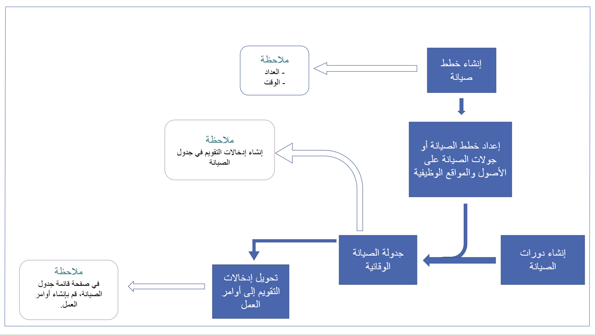

تقدم النظرة العامة الوظيفية معلومات حول كافة المكونات الوظيفية للحل الخاص بك. يمكن أن تكون هذه النظرة العامة عبارة عن معلومات حول المستخدمين المهمين والعمليات وكيفية عملها وكيفية ملاءمة النظام للبيئة الموجودة وكيفية عمل النظام. يمكنك إنشاء رسومات تخطيطية لرسم العمليات ثم قم بسحب حالات الاستخدام وقصص المستخدمين في مستند واحد يلخص ما يقوم به النظام.

يمكن أن تكون النظرة العامة الوظيفية عبارة عن مستند أو عرض تقديمي، ويجب أن تصف كل شيء حول الوظيفة. يجب أن يكون الأشخاص الفنيين وغير الفنيين قادرين على فهم النظرة العامة. وبالتالي، فإنه لا يجب أن تتضمن وصفاً تقنياً عالياً لكيفية عمل النظام، ولكن يجب أن تكون حول الوظيفة. وبالإضافة إلى ذلك، يجب أن يتم وصف النظرة العامة الوظيفية بحيث يمكن لأي شخص، سواء كان مشتركاً في المشروع أم لا، فهمها.

يجب على النظرة العامة الوظيفية أن تقوم بربط حالات الاستخدام وقصص المستخدمين مع ما قمت بإنشائه. إذا تعذر عليك ربط قصة مستخدم بأحد مكونات النظام الخاص بك، فإنك قد قمت بإنشاء شيء غير موجود في المتطلبات. وعليك مراجعة كل منهما لتحديد ما إذا لم يكن قد تم توثيق شيء ما بشكل صحيح أو إذا كان شيئاً ما لم يتم إنشاؤه.

الرسم التخطيطي للنظرة العامة الوظيفية يمكن أن يساعد في توضيح النظرة العامة للوظيفة. يجب أن يوضح الرسم التخطيطي كيفية عمل العملية والخطوات والعمليات المضمنة. ولكنه لا يحتاج إلى وجود معلومات فنية، ولكن يجب أن يقوم بتوضيح كافة الخطوات في العملية الكاملة. وبالنسبة لبعض الرسومات التخطيطية، سيكون من المنطقي ربط المعلومات الفنية بالخطوات.

يوضح الرسم التخطيطي للنظرة العامة الوظيفية التالي جدولة أوامر عمل الصيانة الوقائية.

على سبيل المثال، ستريد استخدام Microsoft Dynamics 365 Field Service. لتصميم نظام جيد وإنشاءه، يمكن أن تكون النظرة العامة الوظيفية مساعدة للغاية. يمكنك رسم عملية العناصر التالية:

- جدولة العمل للفنيين الميدانيين
- مسار السفر للفني الميداني
- العمل الذي يقوم الفني الميداني بعمله للعميل. 
- تحديثات المخزون 

عندما تقوم برسم هذه العملية، يمكنك ربطها بمكون Dynamics 365 Field Service ثم الانتقال خلالها مع عميلك. سيساعد الانتقال من خلال النظرة العامة الوظيفية مع العميل على فهم ما تقوم بإنشائه لهم بشكل أفضل. بالإضافة إلى ذلك، فإنه يساعد على تجنب سوء الفهم والتأكد من أن العميل يتذكر كافة الخطوات في إحدى العمليات. 

وفي الحالات التي لا يقوم فيها عميلك بإعلامك بالعملية بالكامل، فقد يكون ذلك بسبب نسيان بعض الخطوات. هذا الخطأ غير مقصوداً، ومن المحتمل أن يحدث لأنه يميل للتشغيل على autopilot عند تنفيذ مهام معينة. وعند كتابة العمليات، يمكن للعملاء تذكر ما نسوه سابقاً بشكل أفضل. ومن خلال إنشاء النظرة العامة الوظيفية حيث يمكنك التنقل خلال كافة العمليات الخاصة بهم، ستتمكن غالباً من كشف الأخطاء أو التفاصيل المنسية في كافة العمليات.

فعلى سبيل المثال، أنت في عملية تنفيذ Microsoft Dynamics 365 Human Resources لعميل. أخبرك المستخدمون بما يحتاجون إليه لإكمال عملية إلحاق عامل جديد؛ ومع ذلك، فقد نسوا إخبارك بأنهم بحاجة إلى تسجيل معلومات كشف الرواتب. فأنت لا تعرف هذه العملية الخاصة بهم، لذا لا تعرف ما قد نسوا أن يخبروك به. لا يتذكر المستخدمون الخطوات التي يتخذونها عادةً في العملية. عند الانتقال خلال النظرة العامة الوظيفية معهم، يقوم العميل بإخطارك بالخطوات التي فاتته في العملية، ويمكنك إضافتها لتوفير نظرة عامة كاملة. 
