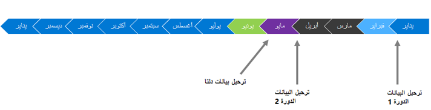

تأتي فترة إيقاف التشغيل في نهاية السنة المالية للمؤسسة في مارس وأبريل. ونتيجة لذلك، سيكون مستخدمو الأعمال مشغولين بمهام الإغلاق وإعداد التقارير في نهاية العام. قررت الشركة أن اختبار قبول المستخدم (UAT) سيتم إجراؤه في فبراير، قبل نهاية السنة المالية، لضمان توفر المستخدم لاختبار السيناريوهات بصورة شاملة. ووفقاً لخطة المشروع، من المقرر إجراء الاختبار التجريبي النهائي لدليل غرفة المؤتمرات (CRP) في شهر مايو، بحيث يمكن للشركة، قبل بدء التشغيل (المُنتظر في شهر يونيو)، إكمال ضبط الأداء المعمول به وتحسينه. 
 
> [!div class="mx-imgBorder"]
> 

## النمط: تنفيذ دورات ترحيل البيانات التكرارية 
يجب أن تضع الشركة في الاعتبار أن إغلاق نهاية السنة المالية في النظام القديم سيغير المكونات التالية: 

- التكوينات التي تحتاج إلى دمجها في بيئة التكوين الذهبي
- تغييرات البيانات الرئيسية والمعاملات التي يجب مراعاتها في بيئات وضع الحماية

## الأنماط المضادة: تنفيذ دورات ترحيل البيانات التكرارية
يجب على الشركة تجنب الممارسات السيئة التالية (الأنماط المضادة) عند تنفيذ دورات ترحيل البيانات المتكررة:

- إجراء ‏‫اختبار قبول المستخدم (UAT)‬ على البيانات التجريبية أو بيانات الاختبار
- الافتقار إلى التخطيط الفعال القائم على معالم العمليات التجارية
