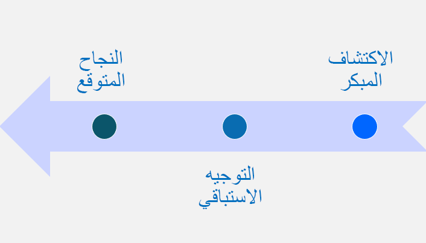

FastTrack لـ Microsoft Dynamics ‏365 (مثل تطبيقات Dynamics 365 Sales أو Dynamics 365 Customer Service أو Unified Operations) هي خدمة نجاح عملاء Microsoft. إنه مصمم لمساعدة العملاء والشركاء على تحقيق نشر ناجح لـ Microsoft Power Platform وDynamics 365. لتقديم هذه الخدمة، يقوم مهندسو حلول FastTrack باستخدام Success by Design. مشاركة فريق FastTrack متاحة لمشاريع العملاء التي تلبي [متطلبات الأهلية لـ FastTrack](/dynamics365/get-started/fasttrack/customer-engagement/microsoft-fasttrack-dynamics-365?azure-portal=true). نظراً لأن ليس كل المشاريع مؤهلة، تقوم Microsoft بعمل نسخة مخصصة من Success by Design متاحة للشركاء والعملاء لاستخدامها بمفردها. يفحص مسار التعليم [استخدام حلول تطبيقات Success by Design for Dynamics 365](/training/paths/use-success-design/?azure-portal=true) هذا الإصدار وكيف يكن للشركاء والعملاء استخدام Success by Design لتحقيق نشر ناجح لـ Microsoft Power Platform أو Dynamics 365.

Success by Design هو الإرشادات الوصفية (أساليب وأفضل الممارسات) لتصميم حل Dynamics 365 وإنشائه ونشره. يعتمد Success by Design على خبرة Microsoft في توفير الإشراف الهندسي عبر آلاف عمليات النشر مع مئات الشركاء من خلال برنامج FastTrack على مر السنين. أساسياته هي بنية وتصميم جيد للحلول، وقدرات تقنية لخط إنتاج Dynamics 365، وأساليب مثبتة لتحديات التصميم والتنفيذ التي تنشأ أثناء تحول عملية الأعمال وتنفيذها.

يلعب مهندسو الحلول في المشاريع دوراً فريداً في تنفيذ العميل وهم مسؤولون عن نجاح عملية النشر والتهيئة في الوقت المناسب للمستخدمين. تم تصميم الدليل لمساعدة مهندس الحلول على تحقيق هذا الهدف. يعمل هذا التوجيه بشكل أفضل عندما يتم تشغيله بواسطة مهندس حلول مؤهل ليس جزءاً من فريق التنفيذ.
إذا لم يكن ذلك ممكناً للتنفيذ، فيمكن لمهندس حلول المشروع أداء الدور.

> [!div class="mx-imgBorder"]
> 

يتضمن Success by Design العديد من ورش عمل المشروع. ورش العمل هذه عبارة عن مزيج من الاجتماعات التفاعلية، والمحادثات التقنية، ومتابعة الاتصالات والمهام. تشمل موضوعات ورشة العمل هذه:

- مخطط الحل
- استراتيجية الاختبار
- نموذج البيانات
- ذكاء الأعمال وتصميم التحليلات
- تصميم حل الثغرات
- ترحيل البيانات
- الأمان
- تصميم التكامل
- تنفيذ الكتابة المزدوجة
- أداء الحل
- استراتيجية التكوين المرحلي
- استراتيجية ما بعد العرض المباشر

يوضح مسار التعليم هذا كيف يمكنك استخدام هذه الأساليب في مشروعك الخاص، حتى إذا لم يكن فريق Microsoft FastTrack مشتركاً في مشروعك. هذه الوحدة الأولى هي Success by Design، التي تقدم نظرة عامة على الإرشادات. ستوفر الوحدات الأخرى في السلسلة تفاصيل متعمقة حول الموضوعات الفردية.

## قيمة للشركاء والعملاء

يُنشئ دليل Success by Design سلسلة من نقاط التحقق لا تعتمد على المنهجية للمساعدة في نقل مشروعات Dynamics 365 نحو النجاح. تم تصميم الدليل لتعزيز المناقشات الصريحة بين فرق المشروع لمراجعة التقدم المحرز في المشروع مقابل العديد من أفضل الممارسات المحددة. يتيح هذا النهج للشركاء والعملاء الاستفادة من المجتمع الأوسع لمشاريع Dynamics 365 التي يتم تنفيذها والدروس المستفادة منها. لم يتم تصميم التوجيه لقياس الشريك أو العملاء بشكل فردي ؛ تهدف إلى جمعهم معاً كفريق واحد لتوجيه مشروعهم نحو عملية تأهيل ناجحة للمستخدمين.

الغرض من هذه الوحدة ومسار التعلم هو تقديم مقدمة حول كيفية استخدام إرشادات Success by Design. هذا المسار مخصص للشخص أو القسم المسؤول عن نشر Dynamics 365، بما في ذلك الموارد الوظيفية والتقنية وموارد الأعمال المسؤولة عن نشر النظام واعتماده.
