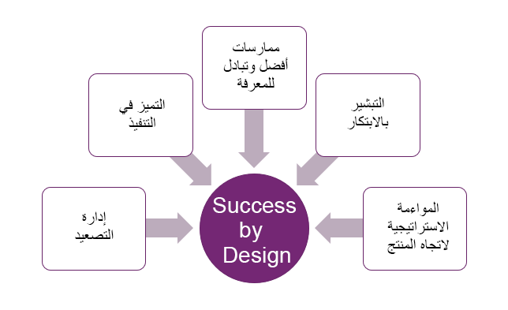

عندما يقرر فريقك اتباع Success by Design، فأنت على طريق جيد للتنفيذ الناجح. يعتمد التوجيه على مشاركة جميع المشاركين بنشاط ومشاركة المعلومات بنشاط. تعمل الإرشادات بشكل أفضل عندما تتم مشاركة معلومات كافية للمساعدة في ضمان اتخاذ قرارات مستنيرة.

تم إنشاء Success by Design لتحقيق خمسة أهداف رئيسية في مشروعات Dynamics 365، كما هو موضح في الرسم التخطيطي التالي.

> [!div class="mx-imgBorder"]
> 

## المواءمة الاستراتيجية لاتجاه المنتج

يتطور كل من Dynamics 365 وMicrosoft Power Platform بسرعة، والطريقة التي تخصص بها الحلول على النظام الأساسي أو تصممها اليوم تختلف عن الطريقة التي تم إجراؤها قبل بضع سنوات. يتمثل جزء كبير من دور مهندس الحلول في التأكد من أن فرق العملاء والشركاء على دراية باتجاهات المنتج ومتماشية معهم. سواء كان الأمر يتعلق باستخدام تدفق Microsoft Power Automate بدلاً من مهام سير العمل التقليدية، أو تضمين تطبيقات Canvas بدلاً من استخدام مربعات الحوار، فإن هذه المدخلات مهمة لبرنامج العميل وستساعدك على توفير الوقت والجهد من خلال تجنب إعادة العمل لاحقاً.
تمنح ورش عمل Success by Design فريق المشروع رؤى ثاقبة حول برنامج العميل وفرصة لتقديم توصيات في الوقت المناسب لضمان التوافق مع إستراتيجية منتجات Microsoft وخريطة الطريق.

## التبشير بالابتكار

يعمل كل من Dynamics 365 وMicrosoft Power Platform على تمكين التحول الرقمي داخل مؤسسات العملاء. يجب أن يسمح الوعد بمنصة التحول الرقمي القائمة على السحابة للمؤسسات بالابتكار بوتيرة أسرع والحصول على ميزة تجارية تنافسية. تتمثل إحدى طرق تطوير هذه الميزة التنافسية في اعتماد أحدث ابتكارات الإنتاج. من المهم بالنسبة لك تحديد ما إذا كان نظام Dynamics Service Management الخاص بعميلك يستخدم إمكانات القناة متعددة الاتجاهات وما إذا كانوا يستخدمون رؤى العملاء للذكاء الاصطناعي. يوفر لك Success by Design فرصة للتأثير على أصحاب المصلحة الرئيسيين في المشروع من خلال توصيات الميزات المستهدفة أثناء ورش العمل ومساعدة العملاء على تحديد خارطة طريق الحلول الداخلية الخاصة بهم.

## أفضل الممارسات وتبادل المعرفة

تعتمد توصيات Success by Design بشكل كبير على التعلم والمعرفة من العمل مع عملاء مختلفين ومشاركة هذه الأفكار بنشاط مع مجتمع مهندس الحلول. بمرور الوقت، تمت تجزئة توصيات Success by Design الذري الفردي في أفضل الممارسات لتأخذ شكل ضمانات يمكن مشاركتها مع أولئك الذين يستخدمون الإرشادات.

## التميز في التنفيذ

كمساهمين فرديين، يتحمل مهندسو الحلول مسؤولية نجاح عملائهم. يجلب Success by Design البنية الضرورية لتحقيق قدر أكبر من الاتساق في الطريقة التي يمكنهم بها التفاعل مع عملائهم والطريقة التي يقيسون بها نجاحهم ويبلغون عنه.
يساعد Success by Design أيضاً على زيادة الإنتاجية والفعالية من خلال الميزات التالية:

-   سطح قالب ورشة عمل جاهز

-   استخدام TechTalk عند الطلب للحصول على إرشادات موحدة

-   قائمة أسئلة نقاط التفتيش لدفع المحادثة

-   إعادة استخدام التوصيات عبر العملاء

## إدارة التصعيد

مهندسو الحلول وفرق المشروع على دراية بالمواقف التفاعلية التي يمكن أن تعرقل المشروع وتتسبب في حالات تأخير العرض المباشر. قد تأتي مشكلات التنفيذ أو الأداء من تصميم سيء، أو من عدم اتباع أفضل الممارسات، أو بسبب انحدار المنتج أو الأخطاء التي لم يتم إصلاحها في الوقت المناسب. بينما يجب أن يساعد Success by Design في تقليل التصعيد المتعلق بالتنفيذ من خلال ورش العمل الاستباقية ومراجعة نقاط التفتيش، فقد لا تزال تجد نفسك في مواقف تصعيد تتضمن القيادة والمديرين التنفيذيين. يتمثل جزء كبير من إدارة التصعيد في توضيح تأثير الأعمال والوضع في سياق العميل. يمكن أن يساعد Success by Design في توفير السياق الضروري والمنظور التاريخي في شكل نتائج ورشة العمل والتوصيات، ومقاييس النجاح، وإجراءات المتابعة، وما إلى ذلك.
