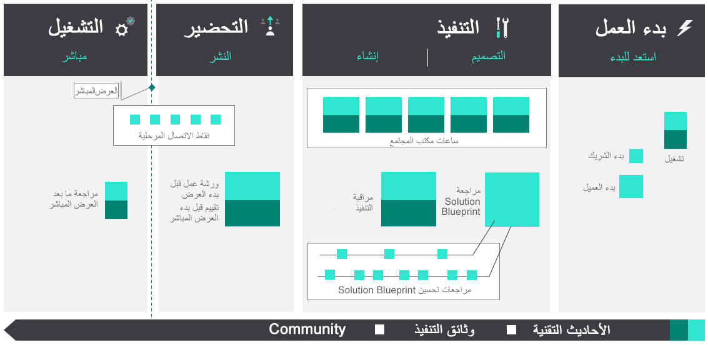

تم إنشاء Success by Design بحيث يمكن لمهندس الحلول القيام بالفعل بالعملاء بغض النظر عن أسلوب التسليم الخاص بهم. مع المشاريع السريعة، من المرجح أن تتكرر المراحل وورش العمل في بعض القدرات طوال عمر المشروع. سيرسم هذا الدليل دورة حياة تنفيذ Dynamic 365 إلى أربع مراحل غير محددة للمنهجية:

-   الشروع في العمل

-   التنفيذ

-   التحضير

-   التشغيل

> [!div class="mx-imgBorder"]
> 

## الشروع في العمل

في مرحلة البدء، يكون فريق المشروع في وضع الاكتشاف، حيث يقومون بجمع والتحقق من متطلبات العمل، ووضع اللمسات الأخيرة على نهج الحل عالي المستوى، وإحداث تقدم في تحديد جميع مسارات العمل داخل النطاق، ومراجعة خطة المشروع لتعكس هذه التحديثات. عندما ينتج فريق المشروع تصميم الحل عالي المستوى، وعندما يتم تحديد مسارات عمل المشروع ذات الصلة في الغالب، يبدأ Success by Design بمراجعة مخطط الحل. 

تعد مرحلة البدء واحدة من أهم أجزاء المشروع لأن العديد من القرارات التي يتم اتخاذها في هذه المرحلة ستؤثر على نجاح النشر. من حين لآخر، قد يكون من المغري الاندفاع خلال هذه المرحلة حتى تتمكن من البدء في بناء النظام، ولكن من المهم أن يكون لديك خطة وتصميم قبل البدء في البناء.

-   في مرحلة البدء، يكون المشروع عادةً في وضع الاكتشاف، حيث تقوم بجمع متطلبات العمل، ووضع اللمسات الأخيرة على نهج الحل عالي المستوى، والتخطيط لنطاق العمل.

-   من الناحية المثالية، سينخرط مهندس الحلول في هذه المرحلة ويقدم Success by Design، وورش العمل المعنية، ومقاييس النجاح الرئيسية، وما إلى ذلك. سيقترح مهندس الحلول أيضاً وجدولة ورشة عمل مخطط الحل.

-   أثناء وجودك في عقلية الاكتشاف، قد تستجيب فرق المشروع بأسئلة محددة تتعلق بالخدمة وإدارة المستأجرين وملاءمة المنتج وما إلى ذلك. يمكن لمهندس الحلول معالجة هذه الأسئلة.

-   عندما ينتج الفريق نهج حل عالي المستوى، يتم تحديد عمليات التكامل الرئيسية، وتكون خطة مشروع عالية المستوى جاهزة، يجب تخطيط وتنفيذ ورشة عمل مخطط الحل.

-   يجب أن تساعد مراجعة ورشة عمل مخطط الحلول أيضاً في إبراز المناطق ذات التعقيد الأعلى (مثل نماذج البيانات المعقدة، وترحيل البيانات الكبيرة، والتكامل) بحيث يمكن أيضاً تخطيط ورش العمل التنفيذية المعنية.

-   بغض النظر عن مرحلة المشروع والتقدم المحرز، تعتبر ورشة عمل مخطط الحل تمريناً مهماً ويجب إجراؤه لجميع المشاركات.

## التنفيذ

في مرحلة التنفيذ، يركز فريق المشروع على بناء الحل وفقاً لتصميم ونطاق الحل المتفق عليه. يتم تقديم مراجعات التنفيذ في هذه المرحلة، بعد أن تم الاسترشاد بنتائج وتوصيات مراجعة مخطط الحل. تُستخدم مراجعات التنفيذ لمعالجة الأسئلة المتعلقة بالجوانب المحددة لتصميم الحل (نموذج البيانات والأمان والتكامل) وممارسات التنفيذ (دورة حياة التطبيق (ALM) واستراتيجية الاختبار) بدقة. تتناول مراجعات التنفيذ بشكل كامل المخاطر التي تم تحديدها أثناء أو بعد مراجعة مخطط الحل ولكن قبل أن يكون بناء الحل بعيداً جداً في العملية.

-   بغض النظر عن منهجية التسليم، سواء كانت شلالاً أو تكرارياً، يجب على مهندس الحلول جدولة ورش عمل التنفيذ المخطط لها أثناء ورشة عمل مخطط الحل. ومع ذلك، في حين أن المنهجية الدقيقة متروكة لكل مالك مشروع، فإن تطبيقات Dynamics 365 هي الأنسب لطرق التسليم التكرارية و/أو السريعة.

-   يجب التخطيط لورش عمل التنفيذ قبل الانتهاء من التصميم التفصيلي للمكون.

-   لن تكون بعض ورش العمل التنفيذية ذات صلة أو تستهدف المكونات التي تعتبر منخفضة المخاطر، وفي هذه الحالة، يمكن تخطي ورشة التنفيذ المقابلة.

-   أثناء مرحلة التنفيذ، يمكنك توقع أسئلة تتعلق بتصميم مكونات محددة، وخيارات التكنولوجيا، والتغييرات القادمة، وخريطة الطريق، والإهمالات، وإدارة دورة حياة التطبيق (ALM)، والبناء.

-   تأكد من أنك تعمل بشكل استباقي مع العملاء للتأكد من أن الحل المطور يتوافق مع أفضل الممارسات ويتوافق استراتيجياً مع خارطة طريق المنتج.

## التحضير

بحلول مرحلة التحضير، تم بناء الحل واختباره، ويستعد فريق المشروع للجولة النهائية من اختبار قبول المستخدم (UAT) والتدريب. بالإضافة إلى ذلك، تم منح جميع موافقات العملاء الضرورية، واستكمال مراجعات أمان المعلومات، وتحديد خطة الانتقال (بما في ذلك معايير الانتقال/عدم التنفيذ)، وجدولة أحداث العرض المباشر الوهمية، ونموذج الدعم جاهز، وسجل تشغيل النشر مكتمل بالمهام، والمالكين، والمدد، والتبعيات المحددة. في هذه المرحلة، سيستخدم فريق المشروع مراجعة جاهزية العرض المباشر لـ Success by Design لتحديد الثغرات أو المشكلات المتبقية.

-   تقوم أيضاً بالتحقق من صحة المتطلبات غير الوظيفية للنظام (مثل أوقات تحميل النموذج وأداء البحث وأداء التكامل في ظل حمل الإنتاج الواقعي).

-   اجتاز العميل أو الشريك جميع الموافقات الداخلية، ومراجعات أمن المعلومات، واختبار الاختراق، وما إلى ذلك، لضمان جاهزية الإنتاج للنظام.

-   تم تحديد نموذج الدعم بعد بدء التشغيل والاتفاق عليه مع الشركة.

-   يتم الاتفاق على خطة التكوين المرحلي وتاريخ بدء التشغيل ومعايير الانتقال/عدم التنفيذ مع الشركة، وتم إنشاء خطة نشر الإنتاج مع جميع المهام والمالكين ووقت البدء والمدة وخطة التراجع.

-   يقوم مهندس الحلول بإجراء ورشة عمل جاهزية العرض المباشر لمراجعة الخطة وتسليط الضوء على الثغرات والمشكلات.

-   يضمن مهندس الحلول أيضاً تنفيذ فحوصات الأداء الاستباقية وفاحص الحل.

## التشغيل

لقد قمت الآن بتخطيط التطبيق وتطويره ونشره، لكنك لم تنته بعد. الهدف من هذه المرحلة هو التحقق من نجاح النشر، ومراجعة الدروس المستفادة من المشروع، والتخطيط للانتقال إلى المرحلة التالية أو تقديم دعم انتقالي لفريق الصيانة.

-   بعد أن يصبح العميل مباشراً، يجب على مهندس الحل إجراء مراجعة ما بعد العرض المباشر.

-   ناقش خطة النقل وشاركها مع فريق الصيانة.
