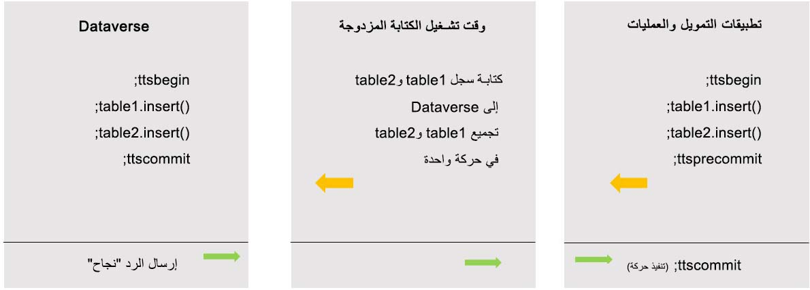

تأخذك الأقسام التالية في خطوة سريعة لشرح العملية الإجمالية لواحدة من الحركات وتدفق الكتابة المزدوجة، وذلك لمساعدتك على فهم أفضل الممارسات والتوصيات الخاصة بالكتابة المزدوجة والمزامنة المباشرة والمزامنة الأولية. 

يوضح المخطط التالي مثالاً لحركة مزامنة مباشرة وتدفق النجاح. 
 

تبدأ حركة في التدفق بتحديث أو إدراج، وتتم كتابة الجدول في السجل في Dataverse بتضمينه في حركة واحدة. يتم بعد ذلك بدء الحركة والالتزام بها في بيئة Dataverse، والتي ستقوم بإرسال استجابة ناجحة. عندما تصل استجابة النجاح إلى بيئة تطبيقات التمويل والعمليات، سيتم تنفيذ الحركة، وستكتمل العملية. قد تتضمن إحدى الحركات المفردة سجلات جداول مفردة أو متعددة أسفل منها. يتم تضمين جميع سجلات الجدول لحركة واحدة معاً لإنشاء دفعة واحدة، ويجب أن تكون هذه الدفعة ناجحة في الالتزام بهذه الحركة في جميع الأنظمة. 
 

في حال الفشل، كما هو موضح في المخطط السابق، إذا فشلت الحركة في بيئة Dataverse، أو في أي مكان على طول الحركة، فسيتم إجهاض الحركة إذا تم إرسال استجابة فشل من النظام أثناء التدفق. سيقوم هذا الفشل بتشغيل السجلات للعودة إلى بيئة تطبيقات التمويل والعمليات. عند إدراج سجلات متعددة في جدول واحد أو أكثر من جدول كجزء من كتلة حركة واحدة أثناء تنفيذ إحدى العمليات، تتم الإشارة إليها ككتلة حركة واحدة. يمكن أيضاً أن تحدث كتل حركات متعددة، حيث يتم إدراج سجلات متعددة في جدول واحد أو أكثر من جدول كجزء من كتل الحركات المتعددة الأصغر أثناء تنفيذ عملية كتابة مزدوجة (مثل روتين ترحيل.) مرة أخرى، إذا فشل أي جزء من كتل الحركات أو كتلة الحركات المتعددة، فستفشل الحركة أيضاً. تشير الحركات بين الأنظمة إلى وحدات العمل التي تحدث على أحد جانبي عملية الكتابة المزدوجة. 

يمكن أن يؤثر عدد الحركات، وعدد السجلات لكل حركة، وحدود المهلة الخاصة بالحركة، وقيود النظام الأساسي، وحدود أو قيود API على أداء وموثوقية المزامنة المباشرة في الكتابة المزدوجة. 

بالنسبة لحركات المزامنة المباشرة من تطبيقات التمويل والعمليات إلى Dataverse، يجب عليك تحديد عدد الحركات لنفس المبلغ كأي حدود لحركات API. هذه الحدود عالية والكتابة المزدوجة لن تنفّذ العديد من حركات API؛ ومع ذلك، من المفيد مراعاة هذه الحدود. يجب عليك تقييد حركة واحدة بـ 1000 سجل أو أقل. ستؤدي الكتابة المزدوجة والعملية إلى رفض حركة عبر 1000 سجل أيضاً. تكون مهلة الحركة 60 ثانية، أو دقيقتين؛ هذا الوقت هو الحد الأقصى للوقت المخصص. تتضمن مهلة الحركة العمليات التجارية ومشكلات الشبكة لكل نظام، ولا ترتبط مباشرة بعدد السجلات. يمكن أن تضيف كل مهلة ما يصل إلى وقت تنفيذ حركة. 

تتغير هذه المفاهيم قليلاً، وذلك بالنسبة لحركة المزامنة المباشرة من Dataverse إلى تطبيقات التمويل والعمليات. يتم تحديد عدد الحركات بواسطة التحكم المستند إلى الأولوية المرتبط بالبيئة. في الغالب، لا تلبي الكتابة المزدوجة هذه الحدود، ولكن معرفتها تكون نقطة مرجعية جيدة إذا ظهرت هذه المشكلات. لا يتم فرض حد حالي على عدد السجلات في حركة من الحركات، ولكن يجب إكمال الحركة في غضون المهلة التي مدتها دقيقتان. يتسم نوع عمليات الأعمال خلف الكيانات في تطبيقات التمويل والعمليات بالتعقيد وغالباً ما يحتوي على منطق أعمال سيعمل كجزء من هذه الحركة، والذي سيساهم أيضاً في إطار المهلة لمدة دقيقتين. 

لمزيد من المعلومات، راجع [حدود API لحماية الخدمة](/power-apps/developer/data-platform/api-limits/?azure-portal=true) و[‏‫ترتيب أولويات التقييد‬](/dynamics365/fin-ops-core/dev-itpro/data-entities/priority-based-throttling/?azure-portal=true). 
