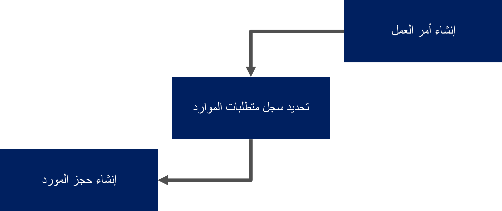
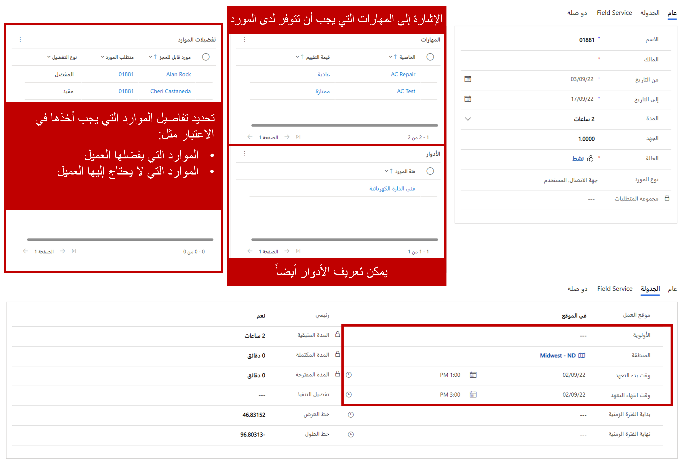
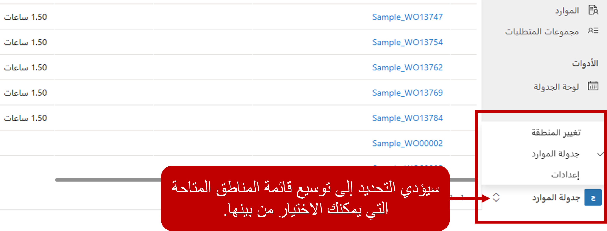

يوفر Universal Resource Scheduling (‏URS) في Dynamics 365 للمؤسسات القدرة على جدولة الموارد في Dynamics 365 لعناصر، مثل أوامر العمل أو المشاريع أو أي سيناريو تلزم فيه جدولة أحد الموارد لإكمال عمل أو تسجيل العناصر في جدوله.   على سبيل المثال، لنفترض أن موظفيك يطلبون إجازة في Dynamics 365 باستخدام جدول مخصص.  بمجرد الموافقة على الطلب، يجب عرض زمن توقف الموارد على لوحة الجدولة التي يستخدمها المرسلون، بحيث يمكن أخذها في الاعتبار عندما يحاول المرسلون جدولة الموارد لعناصر أخرى.  
إن Universal Resource Scheduling هو حل الجدولة الأساسي الذي يسمح للمؤسسات بجدولة العناصر وإرسالها.  تم تضمينه للمؤسسات التي تستخدم حلول Field Service أو Project Operations في Dynamics 365.  إنه يوفر وظيفة الجدولة الأساسية؛ تستفيد حلول Field Service وProject Operations من هذه الوظيفة لجدولة الموارد لعناصر محددة، مثل أوامر العمل. 
### كيف يعمل URS

هناك ثلاثة أنواع من السجلات الأساسية يتم استخدامها لجدولة عنصر. تلك السجلات هي:

-   الصنف المراد جدولته *(على سبيل المثال، أمر العمل)*
-   متطلبات الموارد
-   حجز المورد القابل للحجز

عندما يتم إنشاء عنصر يلزم جدولته مثل أمر عمل في Dynamics 365، فإنه يتضمن عادةً معلومات ستؤثر على كيفية جدولته.

على سبيل المثال، يتضمن أمر العمل عادةً عناصر مثل:

-   نوع أمر العمل والأولوية والموقع.
-   المهام التي يتعين القيام بها والمنتجات والخدمات المدرجة، والمهارة التي يحتاجها الأشخاص الذين يكملون الوظيفة.
-   تفضيلات تقديم الخدمة مثل النوافذ الزمنية والفني المفضل وما إلى ذلك.

بعد إنشاء السجل، يتم إنشاء سجل يسمى سجل متطلبات المورد. يتم استخدام سجل متطلبات المورد لجدولة العنصر في النظام. وهي تحدد المواصفات المطلوبة لجدولة السجل. سجل المتطلبات هو ما يتم استخدامه لتحديد موقع الموارد المؤهلة لتلبية المتطلبات.

قد تتضمن متطلبات المورد لأمر العمل ما يلي:
-   تم سحب معلومات العميل والمدة من أمر العمل.
-   أي نوافذ التاريخ والوقت، أو تفضيلات الموارد.
-   المزيد من معلومات الجدولة ذات الصلة، مثل المهارات والأقاليم.

بعد جدولة أحد متطلبات المورد، ويتم إنشاء سجل يسمى حجز مورد قابل للحجز يوفر تفاصيل محددة حول المورد المسؤول عن إكمال العنصر. يوفر مزيدًا من التفاصيل مثل أوقات الوصول المقدرة والفعلية وحالة الحجز.

**يتضمن حجز الموارد لمتطلبات المورد ما يلي:**
-   المورد (الشخص) المسؤول عن إكمال أمر العمل.
-   الوقت المقدر والفعلي والمعلومات المتعلقة بالحالة.
-   يمكن أيضاً ملء معلومات السفر، مثل الأميال والمدة.

عند تحديث المعلومات ذات الصلة، مثل حالة الحجز، سيتم أيضاً تحديث المعلومات ذات الصلة في أمر العمل، مثل حالة أمر العمل.

### نظرة عامة على مكون URS

يتم تقسيم مكونات URS إلى ثلاثة أنواع من العناصر:

-   **الجدولة**: تُستخدم لإعداد العناصر وتكوينها مثل الموارد والمهارات ونماذج الكفاءة وتفضيلات التنفيذ.
-   **الأدوات**: تمثل لوحة الجدولة المستخدمة في الجدولة اليدوية للموارد.
-   **الإعدادات**: تُستخدم لتكوين مكونات الجدولة الداعمة، مثل حالات الحجز، والأولويات، وتفضيلات التعيين.

### مكونات الجدولة

-   **متطلبات الموارد**: تحدد متطلبات الموارد المحددة المطلوبة لعنصر معين تلزم جدولته.  على سبيل المثال، قد يحدد أحد متطلبات الموارد أن هناك حاجة إلى مورد يتقن NET.، وينتمي إلى منطقة الساحل الغربي، ومتاح يوم الثلاثاء من 9:00 صباحاً إلى 11:00 صباحاً.
-   **حجوزات الموارد**: تحديد المورد الذي تمت جدولته لأي عنصر وأي وقت.  وتشمل أيضًا الحالات التي تحدد مكان المورد في العملية.  على سبيل المثال، سيتم إنشاء حجز مورد إذا تمت جدولة جون للعمل على مشكلة طابعة معطلة غدًا من 8:00 صباحًا إلى 11:00 صباحًا.  عندما يصل John إلى الموقع، يمكن تغيير حالته من قيد التقدم إلى مكتمل عندما يُنهي عمله.   
-   **الموارد**: تحدد الأشخاص أو المرافق أو المعدات المحددة، التي يمكن جدولتها للعمل على العناصر.  يمكن أن تمثل الموارد موظفين داخليين، أو مقاولين تابعين لجهات خارجية، أو مرافق، أو معدات، أو أطقم، أو مجمعات موارد.
-   **مجموعات الموارد**: تُستخدم لتجميع عدة موارد معاً يمكن استخدامها للعمل على العناصر.
### الأدوات

-   **لوحة الجدولة**: التقويم التفاعلي، الذي يمكن استخدامه لجدولة موارد محددة لعناصر مختلفة. يمكن تصفية لوحة الجدولة حسب الحاجة، ويمكن عرضها كخريطة لتسهيل جدولة العناصر.

### الإعدادات

منطقة الإعدادات في تطبيق **Resource Scheduling** هي المنطقة التي يمكنك فيها تكوين السلوكيات والميزات المختلفة، التي سيتم استخدامها كجزء من Universal Resource Scheduling.  على سبيل المثال، من منطقة **الإعدادات**، يمكنك تحديد الموارد التي ستكون متاحة للجدولة، وتكوين المهارات والأدوار المختلفة التي يمكن تعيينها إلى الموارد، فضلاً عن تكوين إعدادات الجدولة الإضافية.  يمكنك الوصول إلى منطقة **الإعدادات** عن طريق تحديدها من أسفل جزء التنقل على يسار الشاشة.  

**بمجرد دخولك إلى منطقة الإعدادات، يتم تقسيم إعدادات التكوين إلى خيارين:**
-   **الموارد**: تُستخدم لإنشاء الموارد في التطبيق.  بالإضافة إلى ذلك، توجد إعدادات متعددة يمكن تكوينها للمساعدة في تحديد الموارد.    
-   **الجدولة**: تُستخدم لتكوين الميزات المختلفة، التي يمكن الاستفادة منها عند جدولة العناصر من خلال مجموعة متنوعة من الطرق المختلفة.  

**تتوفر العناصر التالية ضمن مجموعة الموارد:**
-   **الموارد**: تحدد الأشخاص أو المرافق أو المعدات المحددة، التي يمكن جدولتها للعمل على العناصر.  يمكن أن تمثل الموارد موظفين داخليين، أو مقاولين تابعين لجهات خارجية، أو مرافق، أو معدات، أو أطقم، أو مجمعات موارد.
-   **الأدوار**: تحدد الأدوار التي قد تتوفر للموارد في إحدى المؤسسات.  على سبيل المثال، قد تنشئ مؤسسة أدواراً لمناصب، مثل المطور أو المستشار أو مدير المشروع.  
-   **المهارات**: تحدد مهارات أو شهادات معينة يمكن أن تمتلكها الموارد.  يمكنها تعيين برامج، وبيانات اعتماد، فضلاً عن شهادات محددة.  على سبيل المثال، يمكنك تحديد مهارة مورد لنظام أساسي معين، مثل Azure، أو يمكنك تحديد مهارة مورد تحدد مستوى التصريح الأمني. 
-   **نماذج الكفاءة‬**: تحدد مدى كفاءة المورد.  تُستخدم نماذج الكفاءة مع المهارات لتحديد موقع المورد الأكثر تأهيلاً.  على سبيل المثال، قد يتطلب المشروع مورداً ماهراً جداً في أحد المنتجات، بينما قد يحتاج مشروع آخر فقط إلى مورد مألوف.  
-   **الوحدات التنظيمية**: تمثل الحاويات، التي يمكن استخدامها لتجميع الموارد معاً.  قد تمثل الوحدات التنظيمية موقعًا يمكن إرسال الموارد منه، أو يمكن استخدامها لتجميع الموارد معًا استنادًا إلى منطقة أو مركز خدمة. 
-   **قوالب ساعات العمل**: تُستخدم لإنشاء قوالب يمكن تعيينها إلى موارد معينة لتحديد الساعات، التي تكون متاحة للعمل على العناصر.  على سبيل المثال، لنفترض أن لديك فنيين متعددين في منطقة زمنية محددة يعملون من 8:00 صباحاً إلى 5:00 مساءً.   يمكن إنشاء قالب ساعة العمل وربطه بكل مورد من تلك الموارد.  

**تتوفر العناصر التالية ضمن مجموعة الجدولة:**
-   **الإدارة**: تُستخدم لتكوين إعدادات محددة لـ URS، مثل تعيين موفري التعيين، والحالات الافتراضية، وتمكين كيانات معينة للاستخدام مع URS.  
-   **أولويات المتطلبات**: تُستخدم للإشارة إلى أولوية المتطلب.  يمكن أخذ الأولويات في الاعتبار لضمان جدولة العناصر ذات الأولوية الأعلى مع العناصر التي تعتبر ذات أولوية أقل.  
-   **حالات المتطلبات**: تُستخدم لتحديد حالة المتطلب الذي ينتظر الحجز.  على سبيل المثال، قد يكون لديك حالة متطلب غير مجدول تحدد أنه متطلب محدد لم تتم جدولتها بعد.
-   **حالات الحجوزات**: تُستخدم لتحديد حالة الحجوزات.  يمكن تغيير حالات الحجوزات بواسطة المرسلين أو الفنيين أثناء عملهم على عنصر محدد.  على سبيل المثال، قد تحدد المؤسسة حالات الحجوزات المجدولة، والسفر، وقيد التقدم، والمكتملة.  
-   **تفضيلات التنفيذ**: تساعد في تحديد كيفية جدولة العناصر.  على سبيل المثال، قد يحدد التفضيل القابل للتنفيذ أنه عند محاولة جدولة عنصر ما، يجب أن يستخدم فترات من 60 دقيقة، ويجب جدولة هذه الفترات على رأس كل ساعة.  
-   **حالات إغلاق الأعمال**: تحدد متى لا تكون المؤسسة مفتوحة، مثل الإجازات.
-   **قوالب مجموعات الموارد**: تُستخدم لتحديد مجموعات الموارد بسرعة.  

الآن بعد أن قدمنا لك مفاهيم URS وكيفية التنقل في تطبيق Resource Scheduling، دعنا نفحص كيفية إعداد بعض هذه الميزات بمزيد من التفصيل.  

