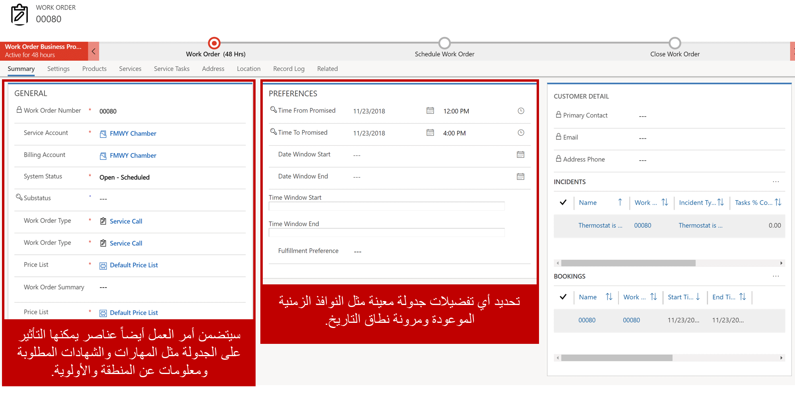
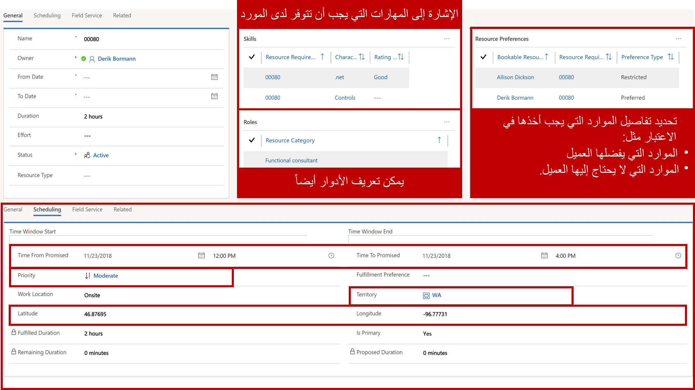

تم تضمين الجدولة في Microsoft Dynamics ‏365 على Universal Resource Scheduling ‏(URS)، مما يوفر للمؤسسات القدرة على جدولة الموارد لعناصر مثل أوامر العمل أو المشاريع أو أي سيناريو يحتاج فيه أحد الموارد إلى جدولتها لإكمال عمل أو تسجيل عناصر في جدولها. على سبيل المثال، لنفترض أن موظفيك يطلبون إجازة في Dynamics 365 باستخدام كيان مخصص. بمجرد الموافقة على الطلب، يجب عرض وقت إجازة الموارد على لوحة الجدولة التي يستخدمها المرسلون، بحيث يمكن أخذها في الاعتبار عندما يحاول المرسلون جدولة الموارد لعناصر أخرى.

Universal Resource Scheduling هو حل الجدولة الأساسي الذي يسمح للمؤسسات بجدولة العناصر وإرسالها. تم تضمينه للمؤسسات التي تستخدم حلول Field Service أو Project Service Automation في Dynamics 365. يوفر وظيفة الجدولة الأساسية؛ تستفيد حلول Field Service وProject Service Automation من هذه الوظيفة لجدولة الموارد لعناصر محددة مثل أوامر العمل.

### كيف يعمل URS

هناك ثلاثة أنواع من السجلات الأساسية يتم استخدامها لجدولة عنصر. تلك السجلات هي:

-   الصنف المراد جدولته *(على سبيل المثال، أمر العمل)*
-   متطلبات الموارد
-   حجز المورد القابل للحجز

عندما يتم إنشاء عنصر يلزم جدولته مثل أمر عمل في Dynamics 365، فإنه يتضمن عادةً معلومات ستؤثر على كيفية جدولته.

على سبيل المثال، يتضمن أمر العمل عادةً عناصر مثل:

-   نوع أمر العمل والأولوية والموقع.
-   المهام التي يتعين القيام بها والمنتجات والخدمات المدرجة، والمهارة التي يحتاجها الأشخاص الذين يكملون الوظيفة.
-   تفضيلات تقديم الخدمة مثل النوافذ الزمنية والفني المفضل وما إلى ذلك.

بعد إنشاء السجل، يتم إنشاء سجل يسمى سجل متطلبات المورد. يتم استخدام سجل متطلبات المورد لجدولة العنصر في النظام. وهي تحدد المواصفات المطلوبة لجدولة السجل. سجل المتطلبات هو ما يتم استخدامه لتحديد موقع الموارد المؤهلة لتلبية المتطلبات.

قد تتضمن متطلبات المورد لأمر العمل ما يلي:
-   تم سحب معلومات العميل والمدة من أمر العمل.
-   أي نوافذ التاريخ والوقت، أو تفضيلات الموارد.
-   المزيد من معلومات الجدولة ذات الصلة، مثل المهارات والأقاليم.

بعد جدولة أحد متطلبات المورد، ويتم إنشاء سجل يسمى حجز مورد قابل للحجز يوفر تفاصيل محددة حول المورد المسؤول عن إكمال العنصر. يوفر مزيدًا من التفاصيل مثل أوقات الوصول المقدرة والفعلية وحالة الحجز.

يتضمن حجز الموارد لمتطلبات المورد ما يلي:
-   المورد (الشخص) المسؤول عن إكمال أمر العمل.
-   الوقت المقدر والفعلي والمعلومات المتعلقة بالحالة.
-   يمكن أيضًا ملء معلومات السفر مثل الأميال والمدة.

عند تحديث المعلومات ذات الصلة مثل حالة الحجز، سيتم أيضًا تحديث المعلومات ذات الصلة في أمر العمل مثل حالة أمر العمل.

### نظرة عامة على مكون URS

يتم تقسيم مكونات URS إلى ثلاثة أنواع من العناصر:

-   **الجدولة**: تُستخدم لإعداد العناصر وتكوينها مثل الموارد والمهارات ونماذج الكفاءة وتفضيلات التنفيذ.
-   **الأدوات**: تمثل لوحة الجدولة المستخدمة في الجدولة اليدوية للموارد.
-   **الإعدادات**: تُستخدم لتكوين مكونات الجدولة الداعمة مثل حالات الحجز والأولويات وتفضيلات التعيين.

### جدولة المكونات

-   **الموارد**: تحديد الأشخاص أو المرافق أو المعدات المحددة التي يمكن جدولتها للعمل على العناصر. يمكن أن تمثل الموارد موظفين داخليين، أو مقاولين طرف ثالث، أو مرافق، أو معدات، أو أطقم، أو مجمعات موارد.
-   **أدوار الموارد**: تحديد الأدوار التي قد تكون للموارد في المؤسسة. على سبيل المثال، قد تنشئ مؤسسة أدوارًا لوظائف مثل المطور أو المستشار أو مدير المشروع.
-   **مهارات المواردين**: تحديد المهارات أو الشهادات المحددة التي يمكن أن تمتلكها الموارد. يمكنهم تعيين برامج وبيانات اعتماد وشهادات محددة. على سبيل المثال، قد تحدد مهارة الموارد لمنصة معينة مثل Azure، أو يمكنك تحديد مهارة الموارد التي تحدد مستوى التصريح الأمني.
-   **نماذج الكفاءة‬**: تحديد مدى كفاءة المورد. تُستخدم نماذج الكفاءة مع المهارات لتحديد المورد الأكثر تأهيلًا. على سبيل المثال، قد يتطلب المشروع موردًا ماهرًا في أحد المنتجات، بينما قد يحتاج مشروع آخر فقط إلى مورد مألوف.
-   **متطلبات الموارد**: تحديد متطلبات الموارد المحددة المطلوبة لعنصر معين يحتاج إلى جدولته. على سبيل المثال، قد يحدد أحد متطلبات الموارد أن هناك حاجة إلى مورد يتقن NET.، وينتمي إلى منطقة الساحل الغربي، ومتاح يوم الثلاثاء من 9:00 صباحًا إلى 11:00 صباحًا.
-   **حجوزات الموارد**: تحديد المورد الذي تمت جدولته لأي عنصر وأي وقت. وتشمل أيضًا الحالات التي تحدد مكان المورد في العملية. على سبيل المثال، سيتم إنشاء حجز مورد إذا تمت جدولة جون للعمل على مشكلة طابعة معطلة غدًا من 8:00 صباحًا إلى 11:00 صباحًا. عندما يصل جون إلى الموقع، يمكن تغيير حالته من قيد التقدم لإكماله عندما يكمل عمله.
-   **مجموعات الموارد**: تُستخدم لتجميع عدة موارد معًا يمكن استخدامها للعمل على العناصر.
-   **قوالب مجموعات الموارد**: تُستخدم لتحديد مجموعات الموارد بسرعة.
-   **تفضيلات التنفيذ**: المساعدة في تحديد كيفية جدولة العناصر. على سبيل المثال، قد يُحدِّد أحد التفضيلات المُستوفاة أنه عند محاولة جدولة عنصر ما، يجب أن يستخدم فترات من 60 دقيقة، ويجب جدولتها في الجزء العلوي من كل ساعة.

### الأدوات

-   **لوحة الجدولة**: التقويم التفاعلي الذي يمكن استخدامه لجدولة موارد محددة لعناصر مختلفة. يمكن تصفية لوحة الجدولة حسب الحاجة ويمكن عرضها كخريطة لتسهيل جدولة العناصر.

### الإعدادات

-   **الوحدات التنظيمية**: تمثل الحاويات التي يمكن استخدامها لتجميع الموارد معًا. قد تمثل الوحدات التنظيمية موقعًا يمكن إرسال الموارد منه، أو يمكن استخدامها لتجميع الموارد معًا استنادًا إلى منطقة أو مركز خدمة.
-   **قوالب ساعات العمل**: تُستخدم لإنشاء قوالب يمكن تخصيصها لموارد معينة لتحديد الساعات التي تكون متاحة للعمل على العناصر. على سبيل المثال، لنفترض أن لديك فنيين متعددين في منطقة زمنية محددة يعملون من 8:00 صباحًا إلى 5:00 مساءً. يمكن إنشاء قالب ساعة العمل وربطه بكل من هذه الموارد.
-   **حالات الحجز**: تُستخدم لتحديد حالة الحجوزات. يمكن تغيير حالات الحجز بواسطة المرسلين أو الفنيين أثناء عملهم على عنصر معين. على سبيل المثال، قد تحدد المؤسسة حالات الحجز المجدولة والسفر والجاري والمكتمل.
-   **حالات الطلب**: تُستخدم لتحديد حالة أحد المتطلبات التي تنتظر الحجز. على سبيل المثال، قد يكون لديك حالة متطلب "غير مجدول" تحدد أنها متطلبات معينة لم تتم جدولتها بعد.
-   **الأولويات**: تُستخدم للإشارة إلى أولوية المتطلب. يمكن أخذ الأولويات في الاعتبار لضمان جدولة العناصر ذات الأولوية الأعلى مع العناصر التي تعتبر ذات أولوية أقل.
-   **حالات إغلاق الأعمال**: تحديد متى لا تكون المؤسسة مفتوحة مثل أيام العطل.
-   **الإدارة**: تُستخدم لتكوين إعدادات محددة لـ URS مثل تعيين موفري الخرائط والحالات الافتراضية وتمكين كيانات معينة للاستخدام مع URS.
