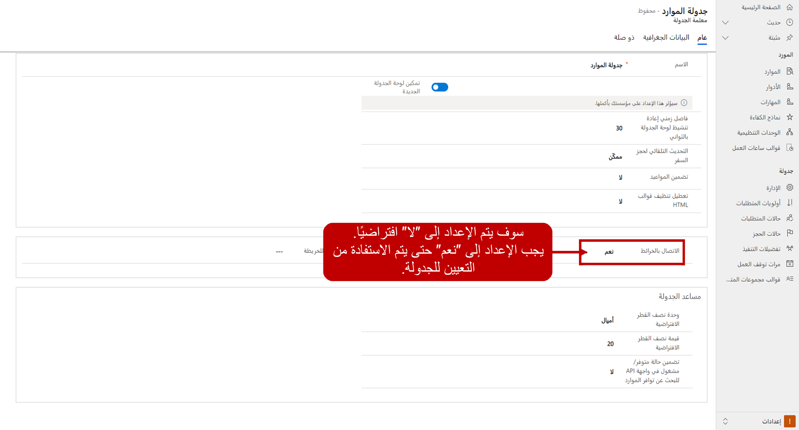

قبل أن تبدأ المؤسسة في بدء جدولة العناصر باستخدام Universal Resource Scheduling (‏URS)، فهناك العديد من المكونات التي ستحتاج أولاً إلى تكوينها لضمان إمكانية جدولة الأصناف بشكل فعال وفقاً لاحتياجات المؤسسة.

**يجب أن تراعي المؤسسات عدة عناصر مثل:**

-   ما نوع العناصر التي نقوم بجدولتها؟
    -   هل يمكن جدولة الموارد لعناصر متعددة في يوم واحد (إصلاح التوقف، والمواعيد، وما إلى ذلك)، أو هل تميل إلى العمل على صنف واحد فقط لعدة أيام في كل مرة (المشاريع).

-   ما الذي يبدو عليه الصنف غير المجدول؟
    -   هل يمكن أن يكون هناك العديد من الحالات لصنف غير مجدول؟
-   ما الذي يبدو عليه الصنف المجدول؟
    -   هل يوجد فرق بين ما تتم جدولته الآن وما يتم العمل عليه؟
    -   ماذا عن الأصناف مثل أوقات الراحة ووقت السفر؟ كيف يؤثر ذلك في حالات الحجز؟
-   هل ستستخدم معلومات GPS؟
    -   من أين يتم إرسال الموارد؟ (مكتب مركزي، منزلهم، على حسب)
-   ما هي العوامل التي يمكن أن تؤثر في جدولة مورد؟
    -   الموقع؟ المهارات أو الشهادات؟

في حين أن القائمة أعلاه لا تُعد قائمة كاملة، إلا أنها تساعد في تحديد أنواع الأصناف التي تحتاج إلى النظر فيها لضمان أنه عند تكوين إعدادات URS، فإنك تفكر في كل شيء يمكن أن يؤثر في كيفية جدولة الأصناف.

### مكان البدء

أول شيء تريد تكوينه قبل القيام بأي شيء آخر في URS هو وظيفة التعيين الخاصة به. بشكل افتراضي، لا يتصل URS بأي موفر تعيين معين. يمكن تعديل ذلك بالانتقال إلى **الإعدادات** \> **الإدارة** \> **معلمات الجدولة**. من معلمات الجدولة، يمكنك التحكم في عناصر مثل عدد المرات التي سيتم فيها تحديث لوحة الجدولة (30 ثانية افتراضية)، والوحدة ونصف القطر التي سيتم استخدامها من قبل مساعد الجدولة عند تقديم التوصيات. على سبيل المثال، تعيين وحدة نصف القطر الافتراضية إلى أميال وقيمة نصف القطر الافتراضي إلى 20 يعني أنه عند اقتراح الموارد، سيتم اقتراح موارد مؤهلة فقط ضمن مساحة نصف قطرها 20 ميل. وتريد أخذ بعض الوقت وفحص ما يلزم هنا لضمان النجاح الأمثل عند تكوين المكونات الأخرى.

بشكل افتراضي، سيتم تعيين حقل الاتصال بالخرائط إلى **لا**. ستحتاج إلى تعيين هذا إلى **نعم** للتأكد من أن لوحة الجدولة ومساعد الجدولة سيستخدمان الخرائط لجدولة الأصناف. بشكل افتراضي، فإنه سيتم استخدام خرائط Bing ولكن يمكنك تكوينه للعمل مع أي موفر تعيين بتوفير قيمة مفتاح API للمخطط المحددة لموفر التعيين الذي تريد استخدامه في الحقل مفتاح API للمخطط. بالإضافة إلى ذلك، يمكن للمؤسسات أيضاً تكوين كيان تعيين مخصص لتعبئة عناصر مثل خط الطول والعرض، إذا لزم الأمر.

### الوحدات التنظيمية

تستخدم الوحدات التنظيمية لتجميع الموارد معاً. يمكن استخدام الوحدات التنظيمية إذا كانت لديك موارد جميعها موجودة في موقع محدد. على سبيل المثال، قد يكون للشركة البرمجية موارد موجودة في فرنسا والولايات المتحدة وألمانيا. ويمكن إنشاء وحدة تنظيمية لكل من هذه المواقع حيث يتم تخزين الموارد. ويستخدم هذا النموذج عادةً عندما يتم تطبيق URS على المزيد من الجدولة المستندة إلى المشروع.

وثمة خيار آخر كثيراً ما تستخدم فيه الوحدات التنظيمية، وهو المواقع التي قد ترسل منها الموارد. على سبيل المثال، قد يكون للمنظمة مكاتب في سياتل وتاكوما وبورتلاند.
يمكن إنشاء الوحدات التنظيمية لكل من هذه المواقع. عندما يتم استخدام وحدة تنظيمية لتعريف موقع إرسال، يجب أن يكون لديك إعدادات خطوط الطول والعرض صالحة المعرفة. يمكن تحديد هذه في علامة التبويب جدولة وحدة المؤسسة.

 للعثور على عنوان الموقع الفعلي ونسخ معلومات خطوط الطول والعرض إلى الوحدة التنظيمية.

### مهارات الموارد والأدوار ونماذج الكفاءة

قد تتطلب بعض العناصر التي سيتم جدولتها أن يكون للمورد دور معين أو أن لديهم مهارة أو شهادة معينة للعمل عليها. فمثلاً، إذا كنت تقوم بجدولة شخص ما لإجراء تثبيت نظام أمان على علامة تجارية معينة لكاميرا الأمان، فيجب أن يكون الشخص الذي تتم جدولته مُثبتاً معتمداً ولديه خبرة في تثبيت تلك العلامة التجارية المحددة لكاميرا الأمان. للمساعدة في هذه السيناريوهات يسمح URS للمؤسسات بتعريف ما يلي في التطبيق:

-   **الأدوار**: تحدد الدور (الأدوار) في المؤسسة التي يمكن ربطها بموارد مختلفة. يمكن إضافة الأدوار إلى سبل انتصاف محددة وعناصر قابلة للجدولة مثل أمر عمل لضمان اقتراح الموارد التي لها هذا الدور فقط كأشخاص للعمل على عنصر ما.
    -   تتضمن أمثلة أدوار الموارد الشائعة: المطور ومهندس الحلول والفني والمستشار الوظيفي.
    -   ويمكن تعيين أدوار متعددة إلى مورد واحد. على سبيل المثال، قد يكون للمورد دور مطور وفني معين لهما.

-   **المهارات**: تحدد مهارة أو شهادة معينة يمكن أن ترتبط بموارد مختلفة. ويشار إليها أيضاً بالخصائص الموجودة في Field Service. سوف تحتاج كل سمة إلى نوع مميز محدد. يتوفر الخياران التاليان:
    -   المهارة:
    -   الشهادة: 

    يمكن أيضاً استخدام مهارات الموارد لدعم سيناريوهات محددة حيث قد تحتاج الموارد لامتلاك وصول محدد إلى شيء ما، مثل مبنى أو تحتاج إلى مستوى معين من التصريح الأمني.

تتضمن أمثلة مهارات الموارد ما يلي:

-   شهادة مثل A+ وMSCE وغيرها.
-   مجموعه المهارات مثل C \# وAzure وExchange وغيرها.
-   الوصول أو التصريح الأمني مثل الوصول إلى المبنى 12 أو التصريح الأمني من المستوى الأول.

من المحتمل جداً أن يكون لمورد واحد مهارات متعددة مخصصة له.

-   **نماذج الكفاءة**: تُستخدم مع مهارات الموارد لتحديد مدى كفاءة شخص ما في صنف ما. يمكن الاستفادة من نماذج الكفاءة لتحديد أنواع مختلفة من السيناريوهات.

  |كفاءة المنتج  | التصريح الأمني  |
  --------------------- |-------------------- |
  |عادي             | التصريح من المستوى 1   |
  |جيد                 | التصريح من المستوى 2   |
  |متقدم              | التصريح من المستوى 3   |
  |متقدم للغاية       | التصريح من المستوى 4   |
  |رئيسي               | التصريح من المستوى 4   |

### حالات الحجز

يتم استخدام حالات الحجز في الإعلام عن حالة الحجز. ويمكن للمؤسسات إنشاء حالات معينة لإظهار الاحتياجات الخاصة بها. على سبيل المثال، بعد جدولة أحد العناصر يمكن أن يقع في أحد النطاقات التالية:

-   تمت الجدولة
-   السفر
-   ‏‏قيد التقدم
-   مكتمل

يمكننا تحديد كل حالة من هذه الحالات في التطبيق، ويمكن أن تربط المؤسسات كل حالة بلون معين وصورة. وعندئذ سيتم عرض اللون والصورة على لوحة الجدولة لأي صنف موجود حالياً بهذه الحالة.

يجب مراعاة أنواع العناصر التي تريد استخدام لوحة الجدولة لها والحالات التي يمكن أن تكون فيها هذه العناصر. يمكنك إنشاء العديد من حالات الحجز المختلفة لتعكس تلك العناصر. على سبيل المثال، إذا أردت عرض وقت الإيقاف على التقويم، فأنت تريد إنشاء حالات حجز للوقت الشائع لعناصر مثل العطلة وأحداث العمل والوقت الشخصي. سيضمن ذلك أن كل ما يجب عرضه قد تم إكماله بالشكل المطلوب.

### حالات المتطلبات

حالات المتطلبات مثل حالات الحجز، ولكنها مقترنة بمتطلبات الجدولة. عادةً، لن تحتاج إلى العديد من حالات المتطلبات، لأنها لا تملك نفس دورة الحياة. وقد يتضمن المثال الشائع على حالات الطلب:

-   **نشط**: متطلب لم تتم جدولته بعد في النظام
-   **مكتمل**: أحد المتطلبات التي تمت جدولتها بنجاح والتي تم إنشاء حجز مرتبط بها.
-   **ملغٍ**: أحد المتطلبات التي لم تعد بحاجة إلى جدولتها لسبب ما.

### الاعتبارات الأخرى

نظرا لأن كل مؤسسة فريدة من نوعها، وقد تكون لها احتياجات جدولة محددة، فهناك عناصر أخرى يمكن تكوينها حسب الحاجة. وتتضمن هذه العناصر ما يلي:

-   **مجموعات الموارد**: تُستخدم لتجميع عدة موارد معاً يمكن استخدامها للعمل على العناصر.
-   **قوالب مجموعة الموارد**: تستخدم لإنشاء قوالب يمكن استخدامها لإنشاء مجموعات موارد ونشرها والتي سيتم استخدامها بشكل سريع.
-   **تفضيلات التنفيذ**: تساعد في تحديد كيفية جدولة العناصر. على سبيل المثال، قد يُحدِّد أحد التفضيلات المُستوفاة أنه عند محاولة جدولة عنصر ما، يجب أن يستخدم فترات من 60 دقيقة، ويجب جدولتها في الجزء العلوي من كل ساعة.
-   **قوالب ساعات العمل**: تُستخدم لإنشاء قوالب يمكن تخصيصها لموارد معينة لتحديد الساعات التي تكون متاحة للعمل على العناصر. على سبيل المثال، لنفترض أن لديك فنيين متعددين في منطقة زمنية محددة يعملون من 8:00 صباحاً إلى 5:00 مساءً. يمكن إنشاء قالب ساعة العمل وربطه بكل مورد من تلك الموارد.
-   **الأولويات**: تُستخدم للإشارة إلى أولوية المتطلب. يمكن أخذ الأولويات في الاعتبار لضمان جدولة العناصر ذات الأولوية الأعلى مع العناصر التي تعتبر ذات أولوية أقل.
-   **حالات إغلاق الأعمال**: تحدد متى لا تكون المؤسسة مفتوحة، مثل الإجازات.
