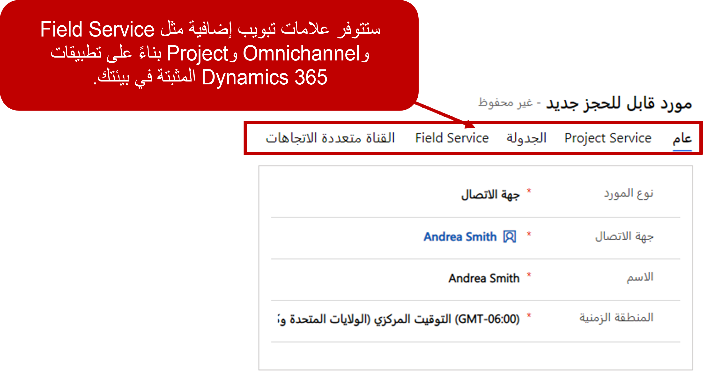

لا تستخدم جميع المؤسسات نفس نماذج الإرسال عند جدولة الموارد لإجراء العمل.  على سبيل المثال، قد تقوم شركة خدمات احترافية متخصصة في سيناريوهات الإصلاح العاجل في المقام الأول بجدولة الأشخاص الداخليين لإجراء أعمال الخدمة.  بينما قد يستخدم بائع تجزئة كبير الحجم مقاولين مستقلين فقط للقيام بأشياء مثل تركيب السجاد أو خزائن المطبخ أو الأجهزة. قد تستفيد شركة HVAC من نموذج مختلط يستخدم كلاً من المقاولين المستقلين بالإضافة إلى الموارد الداخلية.  في العديد من السيناريوهات، قد تحتاج المؤسسات إلى جدولة أكثر من مجرد أفراد.  على سبيل المثال، قد تحدد شركة طبية أولاً موعداً لاستشارات الإجراءات مع عملائها.  في هذه السيناريوهات، لا يحتاجون فقط إلى جدولة فرد، ولكن أيضاً غرفة و/أو آلة للمساعدة في الاستشارة.

*توفر Universal Resource Scheduling للمؤسسات المرونة لتكون قادرة على استيعاب أي من سيناريوهات الجدولة هذه والمزيد عن طريق إنشاء الموارد. ويمكن أن يمثل المورد أي شيء يلزم جدولته، مثل الأفراد أو المعدات أو المرافق.*   

عند إنشاء الموارد في URS، يمكنك تعريف مورد على أنه أي مما يلي:

- **عام**: يُستخدم كحامل نائب لتحديد نوع المورد المطلوب حتى يمكن استخدام مورد مسمى معين في مكانه.
- **جهة الاتصال**: يحدد هذا المورد مقترناً بسجل جهة اتصال Dynamics 365.
- **المستخدم**: يحدد المورد كمستخدم داخلي تم تعيينه لسجل مستخدم Dynamics 365.
- **المعدات**: تُعرّف الموارد على أنها قطعة معينة من المعدات.
- **الحساب**: يحدد أن هذا المورد مرتبط بسجل حساب Dynamics 365.
- **الطاقم‬**: يمثل موارد متعددة يمكن جدولتها معاً لصنف معين.
- **المرفق:** يمثل منشأة يمكن جدولتها مثل مبنى أو غرفة
- **الوعاء‬‏‫**: يمثل مجموعة من الموارد.

بناءً على نوع المورد الذي تختاره، ستظهر حقول مختلفة في سجل المورد للسماح لك بإقران المورد بسجلات مثل حساب أو مستخدم أو سجل جهة اتصال. وسيكون لكل مورد تحدده علامتا تبويب يمكن استخدامهما للتكوين. علامات التبويب هذه هي علامتا التبويب عام وجدولة. استناداً إلى التطبيقات الديناميكية المختلفة للطرف الأول التي قمت بتثبيتها، قد تكون هناك علامات تبويب إضافية مثل المشروع أو Field Service أو القناة متعددة الاتجاهات.  ستحتوي كل علامة من علامات التبويب هذه على إعدادات فريدة لتلك التطبيقات.  

بعد حفظ المورد لأول مرة، ستتوفر أصناف أخرى يمكنك ربطها بالمورد مثل الخصائص (المهارات) والفئات (الأدوار). قد توجد المزيد من علامات التبويب للمؤسسات التي تستخدم field service أو project service automation.

### علامة تبويب الجدولة

تحدد علامة تبويب الجدولة الأصناف الضرورية التي تحدد كيفية عرض الموارد في لوحة الجدولة وخيارات الجدولة المتاحة.

من أهم الأصناف التي يجب تحديدها معلومات الموقع التي ستستخدمها لوحة الجدولة للمورد. الأصناف التي تحتاج إلى تعريف هي:

- **موقع البدء**: تحديد أين يبدأ المورد يومه. يستخدم هذا للمساعدة على رسم خرائط الطريق للمورد.
- **موقع الإنهاء**: تحديد أين ينهي المورد يومه. يستخدم هذا للمساعدة على رسم خرائط الطريق للمورد.
- **الوحدة التنظيمية**: تحدد الوحدة التنظيمية المعينة التي ينتمي إليها المورد والتي ستتم جدولته منها.

عندما تحدد موقعي البدء والانتهاء، يتوفر لديك ثلاثة خيارات يمكنك تحديدها:

- **عنوان الوحدة التنظيمية**: يستخدم خط الطول وخط العرض المرتبطين بالوحدات التنظيمية التي ينتمي إليها المورد.
- **عنوان المورد**: يستخدم خط الطول وخط العرض المرتبطين بالسجل المقابل بناءً على نوع المورد:
  - **نوع المورد - المستخدم**: يستخدم خط الطول وخط العرض المرتبطين بالعنوان المحدد في سجل مستخدم Microsoft 365.
  - **نوع المورد - جهة الاتصال**: يستخدم خط الطول وخط العرض المرتبطين بالعنوان المحدد في سجل جهة اتصال Dynamics 365 الخاص بها.
  - **نوع المورد = الحساب**: يستخدم خط الطول وخط العرض المرتبطين بالعنوان المحدد في سجل حساب Dynamics 365 الخاص به.

- **غير محدد الموقع**: ليس له موقع معين محدد. يمكن أن يكون مفيداً عندما لا يكون لدى الموارد موقع بداية ونهاية محدد بوضوح.

بالإضافة إلى ذلك، يمكنك تحديد ما إذا كان المورد معروضاً على لوحة الجدولة، أو إذا كان متاحاً للبحث كمورد.

### علامة التبويب Field Service

إذا كانت مؤسستك تستخدم Dynamics 365 for Field Service، فستتوفر خيارات إضافية للتعريف في علامة التبويب Field Service. تتضمن هذه الخيارات ما يلي:
-   **المعدل بالساعة**: يسمح لك بتحديد السعر بالساعة الذي سيتم تحصيله من المورد عند إضافته إلى أوامر العمل.  
-   **الموافقة على طلب الإجازة مطلوبة‬**: يحدد ما إذا كانت الموافقة ستكون مطلوبة عندما يضع المورد طلب إجازة.  
-   **المستودع**: يحدد المستودع الذي يجب إقرانه بالمورد.  عادة ما يكون المستودع في أي مكان يمكن أن يوجد فيه المخزون.  في حالة المورد، قد يكون المستودع هو الشاحنة التي يقودها كل يوم.  
-   **تمكين تسلسل الجدولة‬**: سيعرض تسلسل الجدولة فقط للمورد عدداً محدداً من العناصر المجدولة في كل مرة.  على سبيل المثال، قد ترغب فقط في إظهار الحجزين التاليين للمورد.  وبهذه الطريقة، إذا تغير الجدول على مدار اليوم، فلن يرى الفني الحجوزات إلا عند اقترابها من الأوقات المحددة.

عند جدولة الموارد للعمل على الأصناف، غالباً ما تكون هناك اعتبارات إضافية يجب أخذها في الاعتبار للعثور على أفضل مورد.  يمكن أن يشمل ذلك أصناف مثل المهارات أو الشهادات المطلوبة، أو المنطقة التي تتم جدولة الصنف فيها.  يوفر Dynamics 365 أصناف أخرى يمكن تحديدها في المورد لتسهيل تحديد المورد المثالي لوظيفة ما.  

عند جدولة الموارد للعمل على الأصناف، غالباً ما تكون هناك اعتبارات أخرى يجب أخذها في الاعتبار للعثور على أفضل مورد. يمكن أن يشمل ذلك أصناف مثل المهارات أو الشهادات المطلوبة، أو المنطقة التي تتم جدولة الصنف فيها. يوفر Dynamics 365 المزيد من الأصناف التي يمكن تحديدها في المورد لتسهيل تحديد المورد المثالي لوظيفة ما.

- **الخصائص**: الخصائص هي طريقة أخرى لقول مهارات الموارد. يمكنك تحديد مهارات الموارد على الشبكة الفرعية المميزة في سجل المورد. عند إضافة خاصية جديدة لمورد ما، فإنك تحتاج إلى تحديد ما يلي:
  - **الخاصية**: تحدد المهارة أو الشهادة التي يمتلكها المورد.
        -   تعتمد الخصائص المتاحة على مهارات الموارد التي تم تحديدها للمؤسسة.
    -   **قيمة التصنيف**: تحدد مستوى الكفاءة التي يتمتع بها المورد بهذه المهارة أو الخاصية.
        -   سيتم ملء القائمة المنسدلة بجميع التصنيفات المحددة لجميع نماذج الكفاءة.
        -   يمكنك تحديد مفتاح السهم للأسفل لرؤية نموذج الكفاءة المحدد الذي يرتبط به التصنيف.
-   **اقترانات الفئات**: يتيح لك تحديد أدوار الموارد المرتبطة بمورد معين.
    -   يمكن تحديد أدوار/اقترانات فئات متعددة لمورد واحد.

    

-   **مناطق الموارد**: يتيح لك تحديد الأقاليم المحددة التي ينتمي إليها المورد. يمكن ربط مورد واحد بمناطق متعددة.

    

-   **قوالب العمل**: تُستخدم لتحديد ساعات العمل التي يتوفر بها المورد ليتم جدولتها خلال.

> [!VIDEO https://www.microsoft.com/videoplayer/embed/RE2KoUJ]

### تحديد ساعات عمل المورد

عندما تقوم بجدولة الموارد على لوحة الجدولة، يتم استخدام ساعات عمل الموارد للمساعدة في تحديد الإتاحة. يحتاج كل مورد تقوم بإنشائه إلى تحديد ساعات العمل ومعلومات المنطقة الزمنية الخاصة به للتأكد من أنه يتم عرضها بشكل صحيح ومن المحتمل ألا تتم جدولتها خارج أوقات توفرها. يمكن تحديد ساعات عمل المورد بإحدى طريقتين:

-   **زر تعيين ساعات العمل**: يتيح لك تحديد جدول ساعات العمل يدوياً لأحد الموارد. يمكن تحديد الجداول الزمنية يومياً أو أسبوعياً وتطبيقها من الآن فصاعداً.
    **يمكن تعيين ساعات العمل إلى**:
    -   كن نفس الشيء في كل يوم
    -   تنويع حسب اليوم
    -   لا شيء

تأكد من تعيين المنطقة الزمنية على المنطقة الزمنية الصحيحة للمورد.

-   تطبيق قالب ساعات العمل: يتيح لك إقران المورد بقالب ساعات عمل موجود. تستند القوالب إلى ساعات عمل المورد الموجودة.
    -   يتم تطبيق قوالب ساعات العمل عن طريق تحديد الموارد التي ترغب في تطبيق القالب عليها والنقر على الزر **تعيين التقويم**.
    -   يمكن إنشاء قوالب ساعات العمل ضمن **إعدادات** \> **‎قوالب ساعات العمل**.

اعتماداً على أنواع الموارد المحددة التي تقوم بإنشائها، قد تكون هناك أصناف أخرى تحتاج إلى تعريف لضمان إمكانية جدولتها بشكل مناسب.
