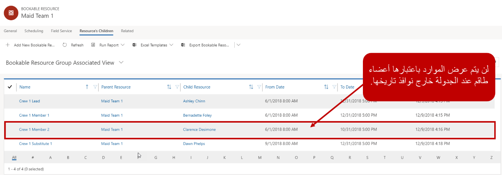

من المهم أن تتمكن المؤسسات من جدولة الموارد لدعم كافة سيناريوهات الجدولة المحتملة التي تقدمها. للمساعدة في ذلك، توفر Universal Resource Scheduling أنواعاً متعددة من الموارد التي يمكن استخدامها لمعالجة كل شيء بدءاً من حجز غرفة ببساطة وحتى السيناريوهات الأكثر تقدماً حيث نحتاج إلى أنواع متعددة من الموارد لنفس الوظيفة. بالإضافة إلى ذلك، فإنه يحدد الموارد للمستخدمين أو الحسابات أو جهات الاتصال أو قطع المعدات المحددة. ويمكن أيضاً تحديد الموارد التي تمثل المرافق أو الطواقم أو مجمعات الموارد.

### تحديد موارد التسهيلات

عند إنشاء الموارد، يمكننا تعريفها كمورد تسهيل.
تكون موارد التسهيلات مفيدة عند الحاجة إلى حجز مساحة فعلية، مثل غرفة لحدث أو حفلة، أو جزء الإصلاح في متجر ميكانيكي. كما تكون المرافق مفيدة عندما تحتاج إلى جدولة موعد مع شخص في منشأة، مثل موعد لشخص ما لإصلاح جهاز كمبيوتر محمول في متجر Microsoft للبيع بالتجزئة، أو استشارة إدارة الثروات في أحد البنوك.

نظراً لأن المرافق تمثل موقعاً فعلياً مثل غرفة اجتماعات أو مساحة اجتماع، يجب أن تكون مقترنة بوحدة تنظيمية تحتوي على عنوان خط الطول والعرض الصالحين. يجب تعيين مواقع البدء والانتهاء لإحدى التسهيلات إلى عنوان الوحدة التنظيمية.

### الأطقم

الأطقم هي نوع من الموارد التي يتم استخدامها عندما تحتاج إلى تمثيل مجموعة محددة مسبقاً من الأشخاص التي يمكن جدولتها للعناصر. على سبيل المثال، قد يتم استخدام طاقم من قبل شركة توفر خدمات الخادمة لتمثيل وتعريف طواقم التنظيف الفردية التي يتم إرسالها في مهام. تظهر الطواقم على لوحة الجدولة مثل أي مورد آخر. يمكن عرض أعضاء الطاقم على لوحة الجدول الزمني، حتى تتمكن من رؤية التوافر العام لجميع أفراد الطاقم. عندما يتم جدولة الطاقم، يتم جدولة جميع أفراد الطاقم أيضاً.

عندما يتم تحديد الطاقم كنوع المورد، سوف تحتاج إلى تحديد أعضاء محددة من الطاقم. حدد أعضاء الطاقم عن طريق تحديد علامة التبويب ذات الصلة في سجل موارد الطاقم وتحديد العناصر التابعة الخاصة بالمورد. على عكس السجلات الأخرى في Dynamics 365، عندما تقوم بتعريف أحد أفراد الطاقم، كل حقل في النموذج مطلوب.

لكل فرد من أفراد الطاقم الذي تحدده، ستحتاج إلى توفير ما يلي:

-   **الاسم**: اسم المورد كما سيظهر كجزء من الطاقم. على سبيل المثال، قم بتثبيت الفريق 1-ديف.
-   **المورد الأصلي**: يحدد اسم الطاقم الذي سيرتبط به المورد. (سيتم ملء هذه المرحلة مسبقاً بشكل افتراضي.)
-   **المورد التابع**: يحدد المورد القابل للحجز الذي ترغب في إقرانه بالطاقم.
-   **تاريخ البدء**: التاريخ الأول الذي سيتاح فيه المورد كعضو في الطاقم.
-   **تاريخ الانتهاء**: التاريخ الأخير الذي سيتاح فيه المورد كعضو في الطاقم.

>[!IMPORTANT]
>يمكن إقران المورد بطاقم واحد أو تجمع موارد واحد لفترة زمنية محددة. على سبيل المثال، إذا تم تعيين آشلي لطاقم الخدمة الأول 1/1/2019 - 1/31/2019، فلا يمكنها أن تكون في طاقم آخر أو مجموعة موارد أخرى خلال تلك الفترة الزمنية.

عند محاولة جدولة طاقم لتاريخ محدد، سيتم عرض الموارد التي تنتمي إلى ذلك الطاقم فقط في التواريخ والأوقات المحددة وتكون قادرة على جدولتها.

على سبيل المثال: قامت منظمة بتعريف طاقم جديد يسمى Maid Crew 1. وقاموا بإضافة الموارد التابعة التالية للطاقم.

-   **قيادة الطاقم 1**: آشلي تشين - من 1 يونيو إلى 31 ديسمبر.
-   **الطاقم 1 العضو 1**: برناديت فولي - من 1 يونيو إلى 31 ديسمبر.
-   **الطاقم 1 العضو 2**: كلارنس ديسيموني - من 1 يونيو إلى 31 أكتوبر.
-   **الطاقم 1 البديل 1**: داون فيلبس - من 1 سبتمبر إلى 31 ديسمبر.

إذا حاول المرسل جدولة الطاقم لوظيفة ما في 4 سبتمبر، فسيتم عرض الطاقم بالكامل وجدولته نظراً لأنهم جميعاً تم تعريفهم كأعضاء طاقم في ذلك التاريخ. ومع ذلك، إذا حاول المرسل جدولة الطاقم لوظيفة في 12 ديسمبر، فسيتم عرض وجدولة آشلي وبرناديت وداون فقط لأن كلارنس لم يتم تعريفه كأحد أفراد الطاقم بعد 31 أكتوبر.

### مجموعات الموارد

تمكن تجمعات الموارد المجدولين من حجز المتطلبات إلى تجمع عام دون الحاجة إلى تحديد المورد الذي سيقوم بالفعل بتنفيذ العمل.
يمكننا بعد ذلك إعادة جدولة هذه الحجوزات إلى أعضاء المسبح في وقت لاحق.

هناك العديد من الأسباب التي تجعل تحديد تجمعات الموارد مفيداً: 

-   **منع المبالغة في الالتزام**: عند جدولة الوظائف، يمكن أن تعمل مجموعات الموارد كعناصر نائبة. واستخدمها لحظر الوقت وتحديده كالتزام حتى يمكن توفير الموارد الفعلية.
-   **المساعدة في الإرسال الإقليمي**: قم بتمكين المرسلين المركزيين الذين يشرفون على مناطق متعددة لاستخدامها كعناصر نائبة، حتى يتم توفير التفاصيل المحددة بواسطة مدير محلي.
-   **تخطيط القدرة الإنتاجية**: قد لا نعرف المورد المحدد حتى الآن، ولكن يمكن إنشاء القدرة الإنتاجية للمجموعة، وتسمية الموارد لاحقاً. لا يزال بإمكان المبرمجين الجدولة نظراً لأنه يمكن تعيين القدرة الإنتاجية للمجموعة كما لو كان مورداً مسمياً.
-   **تمكين الحجز الزائد عمداً لعمليات الإلغاء المتوقعة**: باستخدام مجموعات الموارد، يمكننا حجز الموارد الزائدة مع العلم أن العملاء سيقومون بإلغاء الأمر على الأرجح.

يتم إنشاء تجمعات الموارد بنفس الطريقة التي يتم بها إنشاء موارد أخرى. عند تحديد تجمع كنوع المورد، ستحتاج إلى تعريف نوع تجمع الموارد الذي سيكون عليه. تجمعات الموارد مخصصة لتكون موارد متجانسة، بمعنى أنها يجب أن تكون كلها من نفس النوع. على سبيل المثال، قد يكون لديك مجموعة من الموارد التي هي كهربائيين، أو مجموعة من الغرف التي لديها نفس سعة الجدولة.
كما تتوفر لتجمعات الموارد القدرة على حساب سعة التجمع تلقائياً، مما يعني عدد الموارد الموجودة في المجموعة.

يمكن أن يكون نوع تجمع الموارد واحداً مما يلي:
-   **المنشأة**: تمثل المباني أو المواقع.
    -   يجب أن يكون لأدوات الإنشاء وحدة تنظيمية محددة منها.
    -   يجب تعيين موقع البدء والانتهاء إلى الوحدة التنظيمية المحددة.
-   **الحسابات/جهات الاتصال/المستخدمون**: تمثل الأفراد والأصناف التي يمكن جدولتها.
-   **المعدات**: قطع من المعدات

> [!IMPORTANT]
> يمكن إقران المورد بطاقم واحد أو تجمع موارد واحد لفترة زمنية محددة. على سبيل المثال، إذا تم تعيين آشلي لطاقم الخدمة الأول 1/1/2019 - 1/31/2019، فلا يمكنها أن تكون في طاقم آخر أو مجموعة موارد أخرى خلال تلك الفترة الزمنية.
