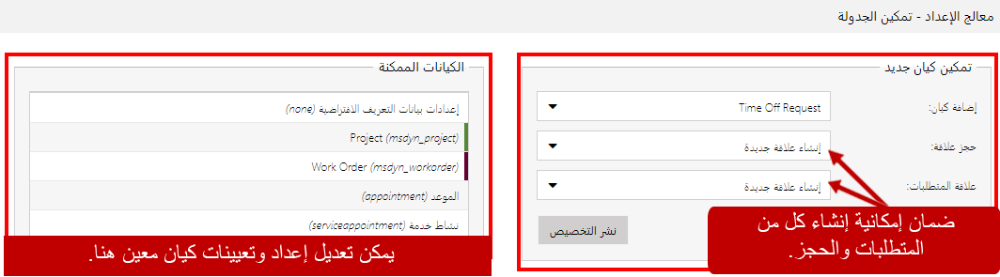
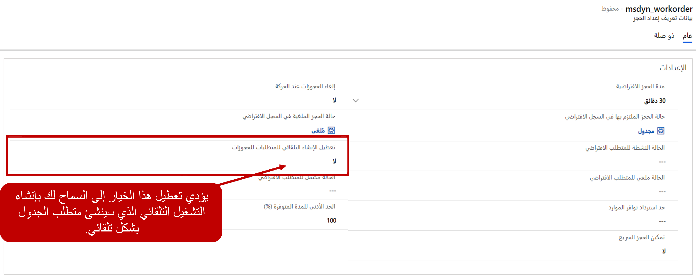
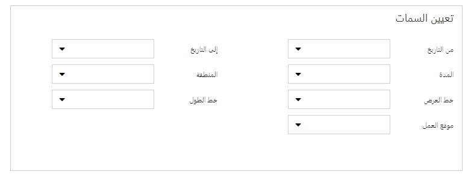
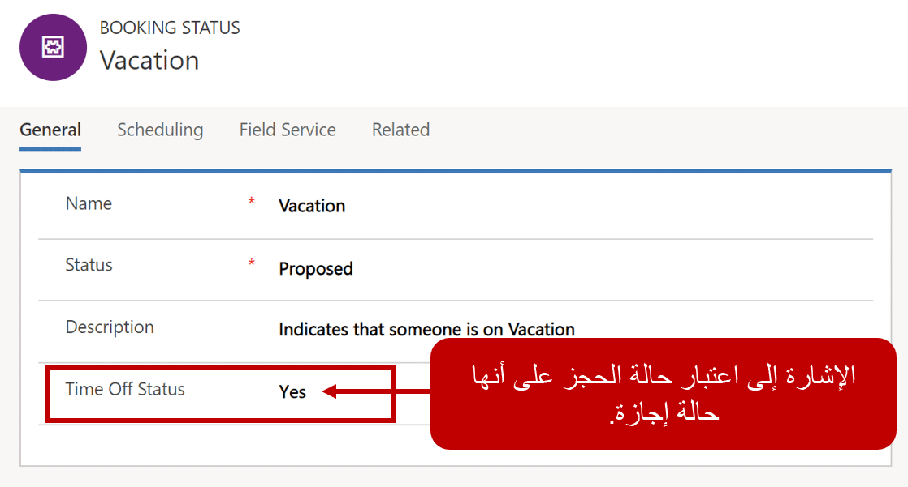
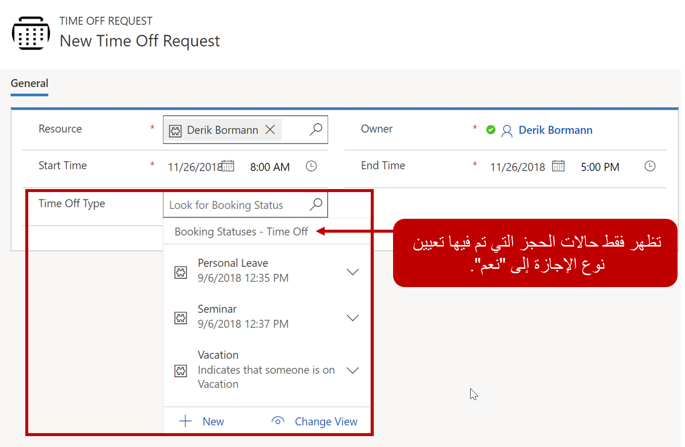
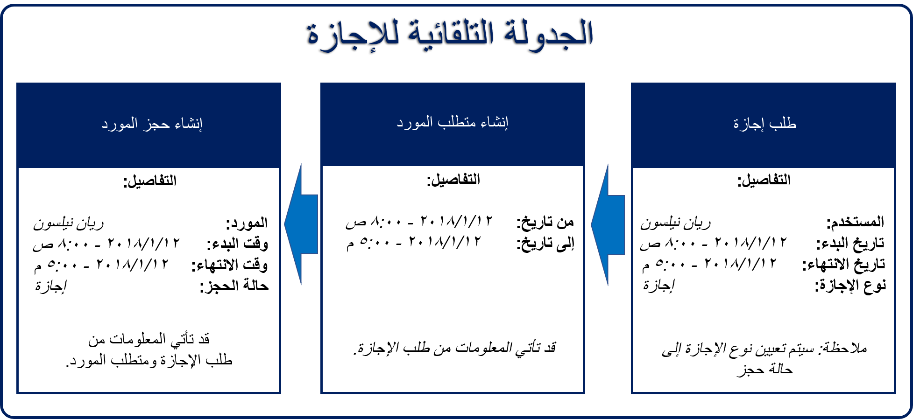

تتمثل إحدى المزايا الرئيسية لـ Universal Resource Scheduling (URS) القدرة على "جدولة أي شيء". وهذا يعني أنه يمكن تكوين معظم الجداول لـ Universal Resource Scheduling. على سبيل المثال، يمكن للموظفين إرسال طلبات الإجازة لأصناف مثل الإجازة والمواعيد الشخصية والإجازات المرضية وما إلى ذلك. وبعد الموافقة على الطلبات، إذا لم يتم تقديمها على استخدام مرسلي لوحة الجدولة، فلن يكون لدى المجدولين أي طريقة لمعرفة ما إذا كانوا يقومون بجدولة شخص ما لفترة لا تكون متاحة.

هذا مثال واحد فقط على حيث يمكن أن يكون تمكين العناصر للاستخدام مع Universal Resource Scheduling مفيداً.

تتضمن بعض الأمثلة الأخرى حيث يمكن استخدام هذه الوظيفة ما يلي:

-   **مراكز التدريب**: تحديد عروض الدورات التدريبية واستخدام URS لجدولة الدرجة وحجز غرفة والعثور على مدرب لتدريس الدورة.
-   **سيناريوهات المبيعات**: في كثير من الأحيان، يعمل الفنيون أيضاً كمستشاري مبيعات فنيين. عند الحاجة إلى المساعدة في فرصة المبيعات، يمكن جدولتها باستخدام URS.
-   **الاستشارات الطبية**: غالباً ما تحتاج المراكز الطبية إلى حجز الأطباء والغرف والمعدات لنوع معين من الاستشارات.

### تمكين الجداول لـ URS

توفر Universal Resource Scheduling وظيفة الأساس المستخدمة لجدولة الأصناف. ستحتاج المؤسسات إلى تحديد الجداول المحددة التي يرغبون جدولتها باستخدام وظائف URS. اعتماداً على الحلول التي قامت إحدى المؤسسات بنشرها حيث قد يتم تمكين بعض الجداول بالفعل لـ URS:

-   **أوامر العمل**: الإعداد والتمكين عند تثبيت Dynamics 365 for Field Service.
-   **المشاريع**: الإعداد والتمكين عند تثبيت Dynamics 365 Project Service Automation.

> [!NOTE]
> يتم تكوين أوامر العمل والمشاريع **فقط** إذا تم تكوين Field Service و/أو Project Service Automation.

يمكن تكوين مزيداً من الجداول لـ URS من خلال الانتقال إلى **الإعدادات** > **الإدارة** > **تمكين Resource Scheduling للجداول** باستخدام خريطة الموقع Universal Resource Scheduling. لكي تتم جدولة جدول باستخدام Universal Resource Scheduling، يجب إنشاء المتطلبات والحجوزات لذلك. يجب أن يكون للجدول علاقات مع الجداول التالية:

-   **جدول المتطلبات**: يحدد المواصفات المطلوبة للصنف الذي ستتم جدولته.
-   **جدول الحجز**: يقوم بتحديد التفاصيل الخاصة بالصنف المجدول.

عندما تحدد الجدول الذي تريد استخدامه، يمكنك اختيار أن يقوم > Dynamics 365 تلقائياً بإنشاء العلاقات مع حجز المورد القابل للحجز ومتطلبات المورد. بعد تحديد > نشر إضفاء الطابع الشخصي سيظهر الجدول في قسم الجداول الممكّنة.

### تكوين جدول لـ URS

هناك العديد من إعدادات URS التي يمكن تحديدها لأحد الجداول. يمكن أن يتراوح هذا النطاق من حالات الحجز المحددة التي يمكن أن يتضمنها الجدول إلى كيفية إنشاء المتطلبات والحجز المحددين. بشكل افتراضي، سيقوم URS سوف باستخدام حقل msdyn\_fieldservicestatus لملء حالات الحجز المتاحة للجدول. يمكنك تركه فارغاً لاستخدام حقل حالة الحجز الافتراضي، أو يمكنك تغييره إلى حقل مختلف. سيحدد الحقل الذي تحدده حالات الحجز المتوفرة للجدول.

> [!NOTE]
> إذا كنت تنوي السماح لـ Dynamics 365 بإنشاء الحجز لك تلقائياً، فسيحتاج حقل حالة الحجز إلى قيمة محددة.

بالإضافة إلى ذلك، يمكن أيضاً تعديل الإعدادات الأخرى المستخدمة لتعبئة العناصر مثل الحالات الافتراضية والمدد. تتوفر هذه الخيارات ضمن منطقة الإعدادات عندما تقوم بتحديد بيانات التعريف الخاصة بالجدول.

الإعدادات التي يمكن تعديلها هي:

-   **‏‫مدة الحجز الافتراضية‬**: تحدد مدة الحجز الافتراضية لاستخدامها عندما لا يتم إدخال المدة.
-   **‏‫حالة الحجز الملتزم بها في السجل الافتراضي**: الالتزام بحالة الحجز الافتراضية لاستخدامها عندما يتعذر على المستخدم تحديد الحالة
-   **‏‫الحالة النشطة للمتطلب الافتراضي**: الحالة النشطة للمتطلبات الافتراضية لاستخدامها عندما لا يستطيع المستخدم تحديد حالة
-   **الحالة ملغي للمتطلب الافتراضي**: يتم استخدام الشرط الافتراضي "تم الإلغاء" عندما لا يتمكن المستخدم من تحديد حالة
-   **‏‫حد استرداد توافر الموارد**: الحد الأقصى لعدد الموارد التي سيتم استرداد عرض لها في مساعد الجدولة
-   **‏‫إلغاء الحجوزات عند الحركة‬**: في حالة نقل الأجزاء المفتوحة لليوم التالي، حدد ما إذا كان سيتم ترك الأجزاء القديمة وتغيير حالتها إلى "إلغاء"
-   **‏‫حالة إلغاء الحجز الافتراضية**: حالة إلغاء الحجز الافتراضية لاستخدامها عندما يتعذر على المستخدم تحديد الحالة
-   **‏‫تعطيل الإنشاء التلقائي للمتطلبات**: يحدد ما إذا كنت تريد أن يقوم النظام بإنشاء المطلب تلقائياً.
    -   يوفر تعطيل الإنشاء التلقائي القدرة على تكوين كيفية إنشاء المتطلبات باستخدام سير العمل *(الموصى به)*
-   **‏‫الحالة مكتمل للمتطلب الافتراضي**: حالة اكتمال المتطلبات الافتراضية لاستخدامها عندما يتعذر على المستخدم تحديد الحالة
-   **الحد الأدنى للمدة المتوفرة %**: يحدد الحد الأدنى للمدة المتاحة‬ 
### تعيين السمة

يتيح لك تعيين السمات تحديد الحقول الموجودة في الجدول والتي سيتم تعيينها إلى الحقول المحددة في سجل المتطلبات. 

على سبيل المثال، في جدول الإجازة، لدينا وقت البدء ووقت الانتهاء. يمكن تعيين هذه الحقول إلى تاريخ ومن تاريخ في سجل المتطلبات على التوالي.

> [!NOTE]
> لن تكون كافة الحقول متاحه للتعيين. يجب أن يكون الحقل موجوداً في الجدول قبل تعيينه إلى سجل المتطلبات. 

على سبيل المثال، إذا تمت إضافة حقل بحث عن منطقة إلى جدول طلب الإجازة، فسيصبح حقل المنطقة متاحاً ليتم تحديده في تعيين السمة.

### مزيد من الاعتبارات عند تكوين جدول لـ URS:

عندما تقوم بإعداد جدول لاستخدامه مع URS. إنه يقوم بأكثر من مجرد تمكين الوظيفة وإنشاء بعض العلاقات. كما يمكن أن يكون هناك العديد من إضفاء الطابع الشخصيات المختلفة التي قد تكون مطلوبة للجدول والجداول الداعمة التي سيتم استخدامها للمساعدة في جدولتها.

على سبيل المثال، للجدولة التلقائية لطلب إجازة:

-   يجب إنشاء متطلبات مورد للطلب. ويجب أن يتضمن ما يلي:

    -   تاريخ بداية الوقت وانتهائه.

    -   حالة الحجز للوقت.

-   يجب إنشاء سجل الحجز باستخدام البيانات من متطلبات المورد.

### تخصيص حالة الحجز

تُستخدم حالة الحجز لتحديد حالة الحجز الذي تم إنشاؤها. لضمان حصولنا على حالات الإجازة الضرورية المطلوبة، سنحتاج إلى القيام بما يلي في جدول حالة الحجز:

-   إضافة حقل زمن التوقف إلى جدول حالة الحجز: سيعمل ذلك على تحديد ما إذا كانت حالة الحجز تعتبر زمن توقف.

-   تخصيص نموذج جدول حالة الحجز: يجب إضافة حقل زمن التوقف إلى نموذج حالة الحجز، لذلك عند إنشاء حالة حجز جديدة، يمكننا تحديد ما إذا كانت حالة الحجز هي زمن التوقف أم لا.

-   تخصيص عرض جدول حالة الحجز: قم بإنشاء عرض حالة الحجز الذي يقوم بإظهار حالات الإجازة فقط. سيتم استخدام ذلك من خلال عمليات البحث حسب وقت الطلب.

تظهر الصورة أدناه الشكل الذي سيبدو عليه نموذج حالة الحجز بعد إضفاء الطابع الشخصي:

بالإضافة إلى ذلك، فإننا بحاجة إلى التأكد من أن حالات الحجز المحددة على أنها زمن التوقف يمكن ربطها بطلبات زمن التوقف عند إنشائها.

لتحقيق ذلك، يجب القيام بما يلي:

-   قم بإضافة حقل بحث إلى جدول حالة الحجز: يتيح للشخص الذي يطالب بإجازة تحديد حالة إجازة الحجز الخاصة بالطلب.

    -   خيارات التقييد المعروضة: نرغب في إضافة عامل تصفية إلى البحث الذي يرتبط فقط بعرض حالة الحجز التي قمنا بإنشائها بحيث لا تتوفر إلا حالات الحجز التي تعتبر إجازة متاحة لتحديدها.

تظهر الصورة أدناه الشكل الذي سيبدو عليه نموذج طلب الإجازة بعد إضفاء الطابع الشخصي:

قم بإنشاء سير عمل يقوم بجدولة الحجز تلقائياً:

وأخيراً، نحن نرغب في ضمان إنشاء متطلبات المورد والحجز تلقائياً عند إنشاء طلب إجازة. يمكن إجراء ذلك إما عن طريق سير عمل أو باستخدام Power Automate لإنشاء السجلات وتحديدها.

تُظهر الصورة أدناه مثالاً رفيع المستوى لما قد يبدو عليه هذا:

ستحتاج العملية المؤتمتة التي تقوم بإنشائها إلى:

-   إنشاء متطلبات المورد استناداً إلى البيانات التي تم التقاطها في طلب الإجازة مثل تواريخ من وإلى المطلوبة.

-   قم بإنشاء الحجز استناداً إلى البيانات الموجودة في كل من طلب الإجازة وسجل متطلبات المورد.

سيكون الحجز الذي تم إنشاؤه هو السجل الذي سيتم عرضه في لوحة الجدولة.

تمثل جدولة طلب إجازة مثالاً واحداً فقط لشيء يمكن جدولته. وتساعد في توضيح كل ما يجب مراعاته للجداول التي ستتم جدولتها باستخدام URS. قد يختلف إضفاء الطابع الشخصي الفعلي والتشغيل التلقائي المطلوب بناءً على السيناريوهات والشروط التي يجب أن تكون موجودة في السجل الذي ستتم جدولته.
