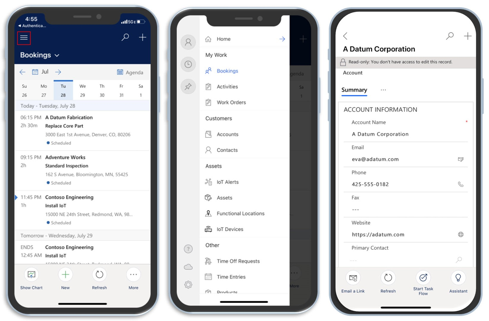

تم إنشاء تطبيق Microsoft Dynamics 365 Field Service ‏Mobile على Microsoft Power Platform ويزود المندوبين الميدانيين بالأدوات التي يحتاجون إليها لخدمة العملاء في الميدان. يسمح التطبيق للمندوبين بالوصول إلى المعلومات المهمة، مثل أوامر العمل التي تم تعيينها لهم، وإدارة جدولهم الزمني، وأصول خدمة العملاء، والمزيد.

> [!div class="mx-imgBorder"]
> 

إلى جانب الوظائف المضمنة، تمتلك المؤسسات خيار تخصيص التطبيق وتكوينه لاستخدام الميزات التي تعمل بشكل أفضل لمؤسستهم. على سبيل المثال، يمكنك تكوين التطبيق لدعم مسح الرمز الشريطي. تتيح هذه الميزة للعاملين في الخطوط الأمامية في الميدان مسح المعلومات وتخزينها، مثل الأرقام التسلسلية للعناصر التي يقومون بتثبيتها.

بناءً على احتياجاتهم، يمكن للمؤسسات تمكين وتهيئة ميزات متعددة، بما في ذلك القدرة على:

- قم بإنشاء ملفات تعريف غير متصلة بالشبكة تحدد البيانات التي يمكن أخذها دون اتصال.

- تدقيق الموقع لمساعدة المبرمجين على معرفة مكان تواجد العمال.

- قم بتمكين دفع الإخطارات لإعلام العمال وتذكيرهم بالمعلومات المهمة.

- تكوين مسح الرمز الشريطي.

بالإضافة إلى العناصر السابقة، يمكن للمؤسسة تعديل المعلومات التي يتم عرضها في النماذج وطرق العرض في التطبيق أو تعديل كيفية تنقل الأشخاص في التطبيق. تم إنشاء تطبيق Dynamics 365 Field Service ‏Mobile على Microsoft Power Platform، مما يعني أنه يمكن للمسؤولين والمطورين استخدام نفس الأدوات المتوفرة لتكوين Dynamics 365 وMicrosoft Power Apps.

بينما ستختبر هذه الوحدة أعمالية تعديل نماذج تطبيق الهاتف المحمول وطرق عرضه وخريطة الموقع، يمكنك استخدام Microsoft Power Platform بعدة طرق أخرى لتصميم التطبيق.

يقدم الجدول التالي بعض الأمثلة حول كيفية استخدام Microsoft Power Platform.

| المنطقة | المستندات المرجعية لـ Microsoft Power Platform |
|------|----------------------------------------|
| طرق العرض | [إنشاء وتحرير طرق عرض التطبيقات المستندة إلى نماذج النظام والعامة](/powerapps/maker/model-driven-apps/create-edit-views-app-designer/?azure-portal=true) و[تخصيص طرق عرض الكيانات](/powerapps/developer/model-driven-apps/customize-entity-views/?azure-portal=true) |
| تكامل IFrame المخصص | [استخدام IFrame وعناصر تحكم مورد الويب في نموذج](/powerapps/developer/model-driven-apps/use-iframe-and-web-resource-controls-on-a-form/?azure-portal=true) |
| صفحات HTML المخصصة | [موارد الويب لصفحة الويب (HTML)](/powerapps/developer/model-driven-apps/webpage-html-web-resources/?azure-portal=true) |
| أوامر على النماذج ووجهات النظر | [شريط الأوامر أو التمثيل بالأشرطة](/powerapps/developer/model-driven-apps/command-bar-ribbon-presentation/?azure-portal=true)، و[تحديد إجراءات الأشرطة](/powerapps/developer/model-driven-apps/define-ribbon-actions/?azure-portal=true)، و[تحديد قواعد عرض الأشرطة](/powerapps/developer/model-driven-apps/define-ribbon-display-rules/?azure-portal=true)
| معالجة الأحداث (عند الحفظ، عند التحميل، وما إلى ذلك) | [الأحداث في النماذج والشبكات في التطبيقات المستندة إلى النموذج](/powerapps/developer/model-driven-apps/clientapi/events-forms-grids/?azure-portal=true) |
| منطق الأعمال/JavaScript | [قم بتطبيق منطق الأعمال باستخدام البرمجة النصية للعميل في تطبيقات تعتمد على نموذج باستخدام JavaScript](/powerapps/developer/model-driven-apps/client-scripting/?azure-portal=true) |
| برمجة العميل النصية | [قم بتطبيق منطق الأعمال باستخدام البرمجة النصية للعميل في تطبيقات تعتمد على نموذج باستخدام JavaScript](/powerapps/developer/model-driven-apps/client-scripting/?azure-portal=true) |
| القدرات والقيود المدعومة | [دعم القدرات والقيود على النظام الأساسي في وضع عدم الاتصال](/dynamics365/mobile-app/mobile-offline-capabilities/?azure-portal=true) |
| عناصر التحكم المخصصة | [ضوابط مخصصة إضافية للتطبيقات المستندة إلى النموذج](/powerapps/maker/model-driven-apps/additional-controls-for-dynamics-365-for-phones-and-tablets/?azure-portal=true) |
| تطبيقات اللوحة | [تضمين تطبيق اللوحة في نموذج يستند إلى نموذج](/powerapps/maker/model-driven-apps/embed-canvas-app-in-form/?azure-portal=true) |

ستدرس بقية هذه الوحدة العديد من العناصر المذكورة سابقاً بمزيد من التفصيل وتوفر إرشادات حول كيفية تخصيص وتهيئة تطبيق الهاتف المحمول.
