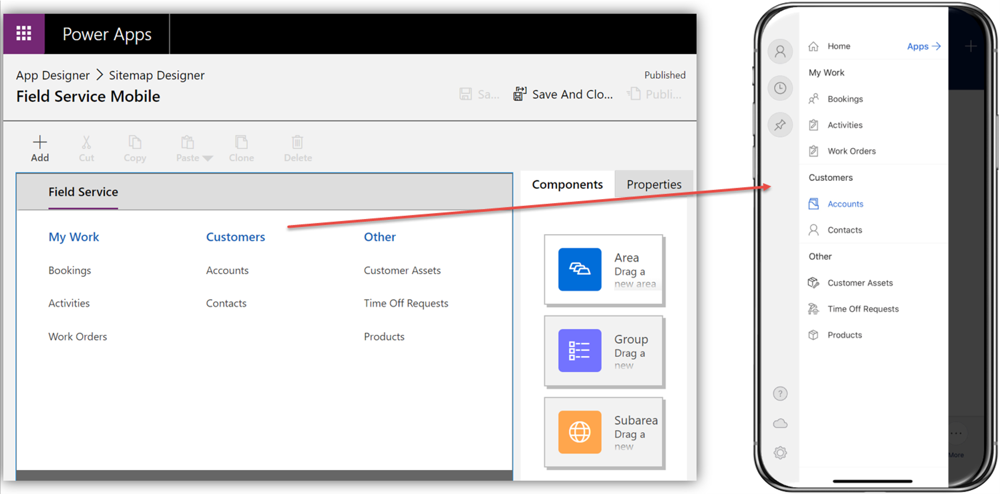

يوفر تطبيق Field Service Mobile للوكلاء الميدانيين المعلومات الهامة التي يحتاجونها عند خدمة العملاء. قد تجد العديد من المؤسسات أن المعلومات المعروضة في تطبيق الهاتف المحمول قد لا تتضمن كل ما تحتاجه، أو أنها غير متمركزة بطريقة تناسب عمال الخطوط الأمامية على نحو أفضل. ونظراً لأنه تم إنشاء تطبيق الأجهزة المحمولة Microsoft Power Platform، فإن المؤسسات يمكن أن تقوم بتخصيصها لتناسب الاحتياجات الخاصة بها.

المكونات الأساسية الثلاثة التي يمكن تعديلها هي:

- **خريطة الموقع** - يحدد كيفية قيام المستخدمين بالتنقل خلال التطبيق.
  يمكن تجميع الجداول المتشابهة معاً للمساعدة على تسهيل تعريف المعلومات التي تريد العمل عليها والتنقل إليها.

- **النماذج** - تقديم تفاصيل سجل واحد، مثل الحجز أو أمر العمل.

- **طرق العرض** - تقديم قائمة بالسجلات في طريقة عرض فريدة، مثل عرض قائمة بكافة الحسابات النشطة.

> [!div class="mx-imgBorder"]
> 

## تحرير كيانات خريطة الموقع على الشاشة الرئيسية

تحدد خريطة الموقع العناصر التي تظهر في قائمة الشاشة الرئيسية عند تحديدها. بشكل افتراضي، سيتضمن عناصر مثل العملاء والأصول وتفاصيل وقت الإقلاع والحجوزات وأوامر العمل. عندما تبدأ في استرجاع تطبيق الهاتف المحمول، يجب عليك أولاً تعديل العناصر التي يتم عرضها على الشاشة الرئيسية لضمان أنها تعمل بشكل أفضل لعمال الخط الأمامي. على سبيل المثال، إذا كانت مؤسستك تعمل بشكل متكرر مع أجهزه IoT، فقد يكون من الأسهل إزالة بعض عناصر IoT المتعلقة من الشاشة الرئيسية. إذا كان العاملون في الخطوط الأمامية يرغبون في الوصول إلى الحالات في النظام، فقد تقرر إضافة حالات إلى التنقل في التطبيق.

كمسؤول نظام، يمكنك عرض قائمة التطبيقات الخاصة بك عن طريق الانتقال إلى:

`https://[YOUR-ENVIRONMENT-NAME].crm.dynamics.com/main.aspx?forceUCI=1&pagetype=apps`

عندما تكون في قائمة التطبيقات، حدد علامة الحذف (**...**) على تطبيق Field Service Mobile، ومن القائمة التي تظهر، حدد **فتح في مصمم التطبيق**.

> [!div class="mx-imgBorder"]
> 

يساعدك مصمم التطبيق على إنشاء تطبيقات تستند إلى النماذج. بالإضافة إلى توفير حق الوصول لتعديل خريطة الموقع، يتضمن ذلك أيضاً العناصر التالية التي يمكن تجميعها معاً كجزء من التطبيق:

- **لوحات المعلومات** - تجمع مكونات متعددة، مثل طرق العرض والمخططات وغيرها من المرئيات، التي يتم دمجها في مكان واحد.

- **سير إجراءات العمل** - تقدم دليل للمستخدمين عن كيفية إكمال عملية تجارية.

- **الجداول** - تمثل العناصر (الجداول) التي يتم عرضها في التطبيق. ويمكن أن يتضمن كل جدول الميزات التالية:

  - **النماذج**

  - **طرق العرض**

  - **المخططات**

  - **لوحات المعلومات**

لمزيد من المعلومات، راجع [إنشاء وتحرير طرق عرض التطبيقات العامة أو تطبيقات النظام المستندة إلى نموذج](/power-apps/maker/model-driven-apps/create-edit-views-app-designer/?azure-portal=true).

لتعديل ما يتم عرضه على الشاشة الرئيسية لتطبيق الأجهزة المحمولة، حدد الرمز **تحرير** الموجود بجانب خريطة الموقع. توجد في خريطة الموقع مجموعات تسمى **العمل** و **العملاء** و **أخرى**. تتوافق هذه المجموعات مع العناصر التي يتم عرضها على الشاشة الرئيسية لتطبيق Field Service Mobile. بناءً على احتياجاتك، يمكنك إنشاء المزيد من المجموعات ثم إضافة عناصر أو تعديلها أو إعادة ترتيبها أو حذفها. يمكنك إضافة عناصر إلى مجموعة عن طريق إضافة منطقة فرعية ثم تعيين المنطقة الفرعية إلى الجدول الذي تريد العمل معه.

> [!div class="mx-imgBorder"]
> 

> [!NOTE]
> بالنسبة لكل جدول تعرضه في خريطة الموقع، يجب عليك تحديد النماذج وطرق العرض التي يجب أن تكون متاحة على تطبيق الأجهزة المحمولة باستخدام "مصمم التطبيق".

لمزيد من المعلومات، راجع [تخصيص تطبيق الجوال](/dynamics365/field-service/mobile-power-app-configure#edit-sitemap-entities-on-home-screen/?azure-portal=true).

## تحرير نماذج الحجز وأمر العمل

في كثير من الأحيان، قد تجد أنك بحاجة إلى إجراء تغييرات على ماهية عرض المعلومات على النماذج للعمال وكيفية عرضها. ونظراً لأنه تم إنشاء تطبيق الأجهزة المحمولة باستخدام Power Apps، فإنه يمكن إضافة الحقول المعروضة وحذفها.
يمكنك أيضاً تغيير كيفية تفاعل التطبيق مع استخدام Power Apps control frameworkلعرض عناصر تحكم حقل مختلفة مثل أزرار التبديل وشرائط التمرير.

عندما العمل باستخدام تطبيق الهاتف المحمول، يتم تجميع أوامر العمل والحجز المقترن بها في نموذج واحد. ونتيجة لذلك، عندما يعرض العامل نموذج حجز، يقوم أيضاً بعرض نموذج أمر العمل ذي الصلة. يجب على المسؤولين الذين يحتاجون إلى تخصيص نماذج الحجز وطلب العمل أن يتذكروا أنها مدمجة في تطبيق الأجهزة المحمولة وأن نماذج أوامر العمل يتم عرضها في نموذج الحجز. في اللقطة التالية، يعرض القسم  **عام** حقول  **حجز موارد قابل للحجز** (حجز) وأقسام ترتيب العمل  **بالعميل** و **الخدمة** و **الملاحظات** .

> [!div class="mx-imgBorder"]
> 

يجب إجراء تعديلات على النماذج المستخدمة في تطبيق الجوال باستخدام مدخل صانع Power Apps. يمكنك الوصول إلى المدخل من خلال الانتقال إلى [https://make.powerapps.com](https://make.powerapps.com/?azure-portal=true). في مدخل صانع الموقع، يمكنك الوصول إلى نماذج أمر العمل بواسطة توسيع **البيانات**، وتحديد **الجداول**، ثم تحديد **جدول أمر العمل**.

> [!div class="mx-imgBorder"]
> 

بالإضافة إلى نماذج أوامر العمل القياسية التي ستكون متاحة، تتوفر ثلاثة نماذج أخرى تتوافق مع الأقسام الثلاثة في نموذج **أمر عمل الحجز** المجمع:

- **أمر العمل - العميل**: يتضمن معلومات العميل ذات الصلة المرتبطة بالحجز وأمر العمل، مثل الخدمة وحساب الفوترة، وتفاصيل الموقع، والأميال المقطوعة، وغير ذلك.

- **أمر العمل - الخدمة**: يتضمن معلومات المفتاح المرتبطة بأمر العمل الذي يتم تنفيذه، مثل المهام والمنتجات والخدمات وتفاصيل أمر العمل والأولوية وما إلى ذلك.

- **أمر العمل - الملاحظات**: يتضمن المرفقات ذات الصلة المرتبطة بأمر العمل، بما في ذلك العناصر مثل الصور والملاحظات والتواقيع.

> [!div class="mx-imgBorder"]
> 

سيلزم إجراء تغييرات على جزء الحجز في النموذج من جدول **حجز المورد القابل للحجز** . ضمن **النماذج**، قم بتعديل النموذج **الحجز وأمر العمل**.

يمكنك تخصيص كل نموذج حسب الحاجة. بعد تحرير النماذج، ستحتاج إلى نشر كل منها للتغييرات التي سيتم عرضها في تطبيق Field Service Mobile.

> [!div class="mx-imgBorder"]
> 

لمزيد من المعلومات، راجع [تخصيص تطبيق الجوال](/dynamics365/field-service/mobile-power-app-configure#edit-the-booking-and-work-order-form/?azure-portal=true).

لمزيد من المعلومات، راجع  [تخصيص النماذج](/power-apps/developer/model-driven-apps/customize-entity-forms/?azure-portal=true).
