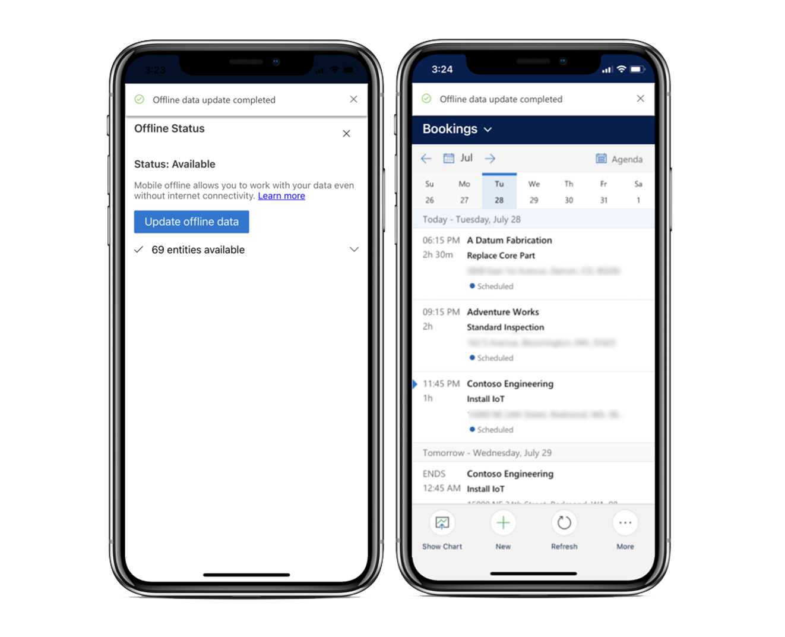
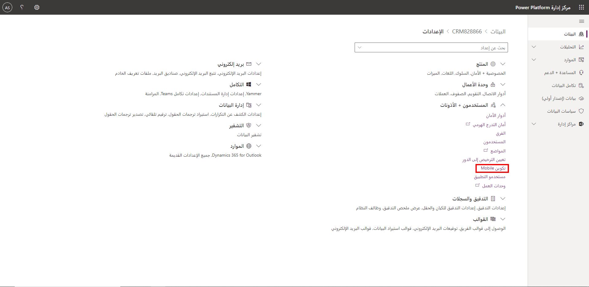
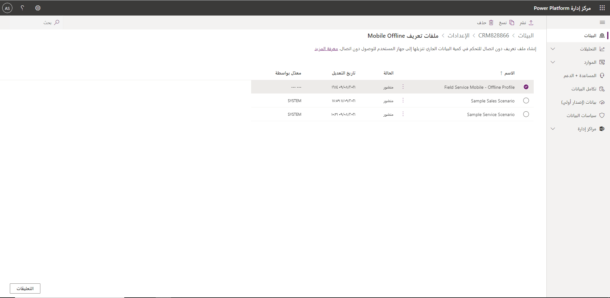
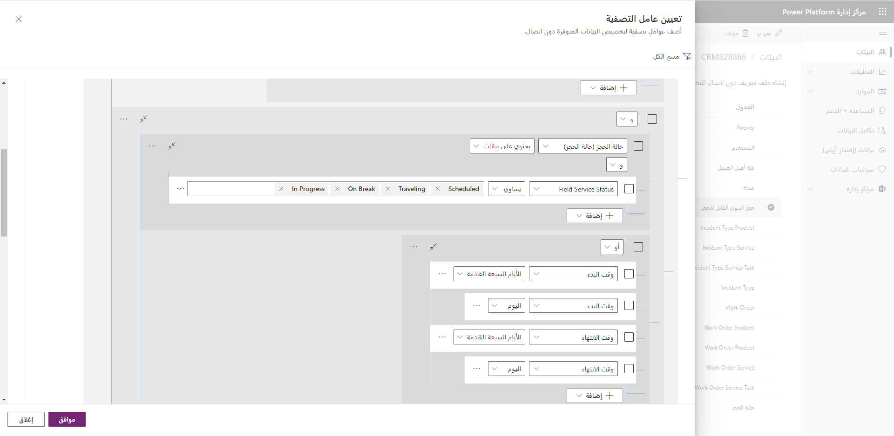
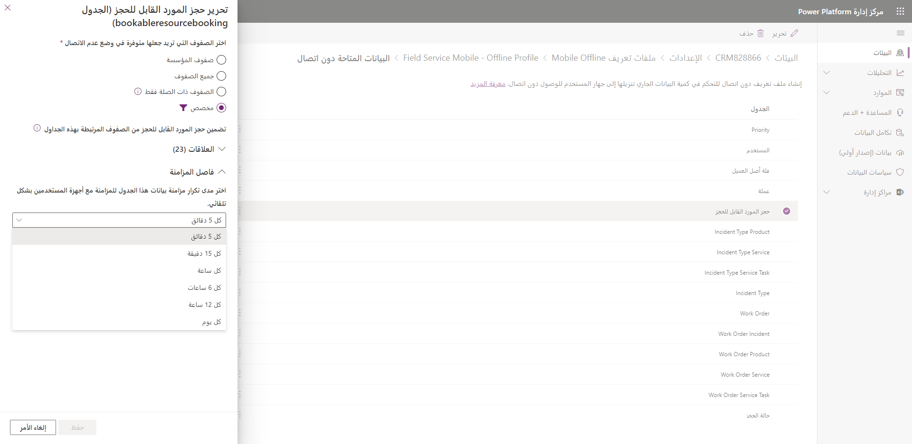
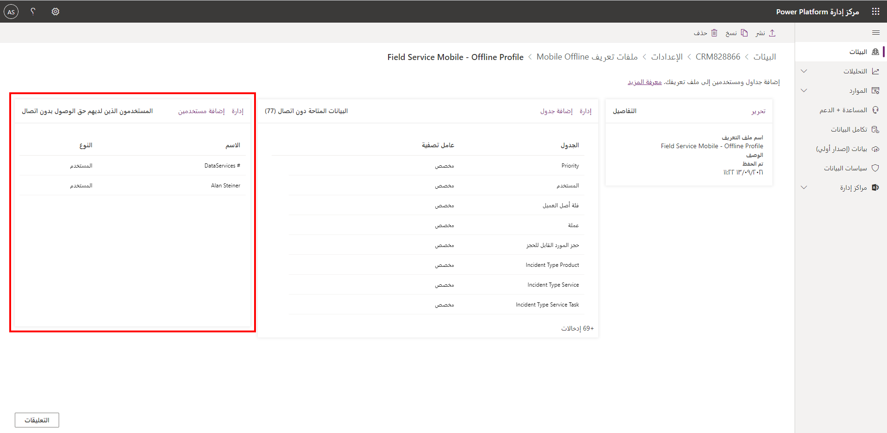
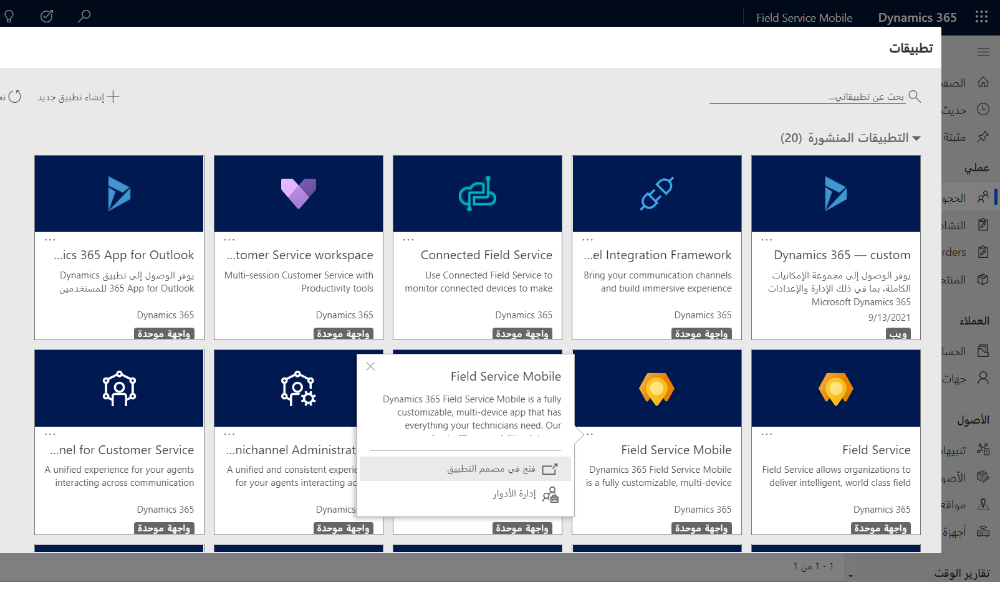
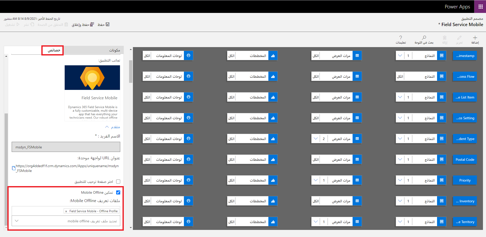

على الرغم من أن الأشخاص أصبحوا أكثر ارتباطاً اليوم من أي وقت مضى، لا يزال بإمكان الوكلاء الميدانيين أن يجدوا أنفسهم بدون اتصال بالإنترنت أو مع وصول محدود، كما هو الحال في المناطق البعيدة أو عند العمل في مواقع مثل الطوابق السفلية.
على الرغم من أن هؤلاء الوكلاء لا يتمتعون بإمكانية الوصول إلى الإنترنت، إلا أنهم سيظلون بحاجة إلى الوصول إلى تفاصيل أمر العمل والحجز ذات الصلة. تمكّن الإمكانات غير المتصلة لتطبيق Dynamics 365 Field Service ‏Mobile الوكلاء من الاستمرار في الوصول إلى المعلومات الضرورية أثناء عدم الاتصال. عندما يعمل الوكلاء دون اتصال، تتوفر لهم أصناف مثل أوامر العمل والملاحظات ومهام الخدمة والصور. بعد استعادة الاتصال، تتم مزامنة البيانات تلقائياً مرة أخرى مع الخادم.

عندما تصبح مؤسستك جاهزة لنشر تطبيق الهاتف المحمول، يجب أن تفكر في المعلومات التي ستكون متاحة للعاملين أثناء تواجدهم في وضع عدم الاتصال. على سبيل المثال، قد يحتاج العامل المبتدئ فقط إلى أوامر العمل والحجوزات الخاصة به، بينما قد يطلب مدير field service الوصول إلى نطاق أوسع لأوامر العمل التي قد لا يتم تعيينها إلى العامل الحالي لتطبيق الأجهزة المحمولة.

استناداً إلى ملف التعريف غير المتصل الذي تم تحديده لعامل الخط الأمامي، سيقوم التطبيق بتنزيل البيانات إلى قاعدة بيانات محلية من الجهاز على فترات زمنية محددة مسبقاً أو عند الطلب. عندما ينتقل أحد التطبيقات إلى وضع غير متصل بالشبكة، تتم قراءة جميع البيانات مباشرة من قاعدة البيانات الموجودة على الجهاز المحلي. لا تتم قراءة أي بيانات من الخادم. يضمن هذا الأسلوب أن التطبيق يمكن أن يعمل باستمرار مع أو بدون اتصال بالإنترنت.

لاستخدام تطبيق Field Service Mobile دون اتصال، قم بتكوين إمكانات وضع عدم الاتصال باتباع الخطوات التالية:

1. قم بإعداد ملف تعريف غير متصل بالإنترنت (يوجد ملف تعريف افتراضياً).

1. أضف المستخدمين إلى ملف التعريف غير المتصل.

1. انشر ملف التعريف غير المتصل.

1. أضف ملف التعريف دون اتصال إلى تطبيق يستند إلى النموذج Field Service Mobile.

> [!div class="mx-imgBorder"]
> 

لمزيد من المعلومات، راجع مقالة [تكوين إمكانات وضع عدم الاتصال في تطبيق الأجهزة المحمولة Field Service (Dynamics 365)](/dynamics365/field-service/mobile-power-app-system-offline/?azure-portal=true) التي تتضمن مقطع فيديو.

## إعداد ملف تعريف غير متصل بالشبكة

يتوفر ملف تعريف غير متصل بالإنترنت، يسمى **Field Service Mobile - ملف تعريف غير متصل**، بشكل افتراضي ويمكن تعيينه للمستخدمين لمساعدتهم على العمل بسرعة. يتضمن الإعدادات الافتراضية الموصى بها لجداول Field Service. يمكنك إنشاء المزيد من الملفات الشخصية دون اتصال حسب الحاجة. سيلزم إنشاء ملفات التعريف غير المتصلة وتحريرها من [Microsoft Power Platform مركز إدارة](https://admin.powerplatform.microsoft.com/environments?azure-portal=true).

من مركز الإدارة، ستحتاج إلى تحديد واختيار البيئة التي تريد تحديد ملف التعريف لها. ستكون هذه البيئة هي البيئة التي قمت توزيع Dynamics 365 Field Service عليها. حدد **الإعدادات** في الجزء العلوي الأيمن من الشاشة. تتوفر الملفات الشخصية غير المتصلة بالإنترنت ضمن **المستخدمون + الأذونات> تكوين الهاتف المحمول**.

> [!div class="mx-imgBorder"]
> 

هناك ثلاثة أصناف تحدد البيانات التي سيتم التقاطها في وضع عدم الاتصال في ملف التعريف هي:

- **الجداول** - تعيين الجداول التي ستكون متاحة في وضع عدم الاتصال وعدد مرات مزامنة البيانات.

- **عوامل التصفية** - تعيين البيانات التي سيتم أخذها في وضع عدم الاتصال لكل جدول. على سبيل المثال، بشكل افتراضي، ستقوم بتعيين عامل تصفية للحصول على كيان الحجوزات فقط في نطاق سبعة أيام قبل أو بعد التاريخ الحالي.

- **العلاقات** - تعيين وجود علاقة بين جدولين.

يوفر اقتران الصنف الوقت لأنك لن تحتاج إلى تعيين عوامل تصفية لكل كيان. يمكنك إقران الكيانات ذات الصلة التي تتبع عوامل التصفية التي تم تعيينها في الكيان ذي الصلة.

لمزيد من المعلومات، راجع [تكوين إمكانات وضع عدم الاتصال في تطبيق الأجهزة المحمولة Field Service (Dynamics 365) ](/dynamics365/field-service/mobile-power-app-system-offline/?azure-portal=true#set-up-an-offline-profile).

## الشروع في تعديل ملف تعريف غير متصل بالإنترنت

نوصي باستخدام **Field Service Mobile الافتراضي - ملف تعريف غير متصل بالإنترنت**  كنقطه البداية. سيساعدك هذا الأسلوب على تسهيل بدء التشغيل، ويمكنك تحديثه حسب الحاجة بناءً على احتياجات عملك. عادةً ما تشير عبارة "التحديث حسب الحاجة" إلى تعديل عامل التصفية والعلاقات وفاصل المزامنة المرتبط بالجدول. نوصي بشدة أن تحتفظ بالجداول الافتراضية في مكانها، والتي يتم تحديدها عن قصد لتمثيل الأصناف الأساسية المستخدمة في Field Service.

> [!div class="mx-imgBorder"]
> 

يمكنك تحديد البيانات التي يجب أخذها في وضع عدم الاتصال عن طريق تحديد **إدارة** في قسم **البيانات المتوفرة دون اتصال** ثم تحرير الجدول الذي تريد العمل معه. من المحتمل أن يكون لكل جدول عوامل تصفية محددة مسبقاً مرتبطة بها. لبدء تخصيص المعلومات التي سيتم أخذها في وضع عدم الاتصال، يمكنك اختيار عامل تصفية تنزيل البيانات.

أربعة خيارات للاختيار من بينها (لأخذ المعلومات في وضع عدم الاتصال) هي:

- **صف المؤسسة** - يتيح لك تحديد البيانات المرتبطة بالمستخدم التي يجب تنزيلها. تتوفر ثلاثة خيارات (يمكنك تحديد أكثر من خيار):

  - **صفوف المستخدم** - تنزيل سجلات الجدول المملوكة أو المخصصة للمستخدم.

  - **صفوف الفريق** - تنزيل سجلات الجدول المملوكة أو المعينة إلى فريق يكون المستخدم عضواً فيه.

  - **صفوف وحدة الأعمال** - تنزيل سجلات الجدول المملوكة أو المعينة للمستخدمين الذين ينتمون إلى نفس وحدة الأعمال التي ينتمي إليها المستخدم.

- **جميع الصفو** - تنزيل جميع الصفوف في هذا الجدول.

- **الصفوف المرتبطة فقط** - تنزيل البيانات المخزنة في الجداول المرتبطة، استناداً إلى العلاقات المحددة. إذا لم يتم تحديد علاقات لهذا الجدول، فلن يتم تنزيل أي بيانات.

- **مخصص** - يتيح لك تحديد عامل تصفية مخصص للتحكم في البيانات التي سيتم تنزيلها.

على سبيل المثال، يحتوي جدول **حجز الموارد القابلة للحجز** (بمعنى آخر، الحجز) على عامل تصفية لتنزيل البيانات تم تعيينه على **مخصص**. تم تعيين عامل التصفية المخصص لتنزيل حجوزات الموارد التي تبدأ أو تنتهي في الأيام السبعة المقبلة أو اليوم. سيضمن هذا الإعداد أن تكون الحجوزات حديثة والأكثر صلة بالعامل اعتباراً من الآن.

> [!div class="mx-imgBorder"]
> 

> [!IMPORTANT]
> بينما يعد تعيين جميع الصفوف على أنها عامل تصفية خياراً، يجب أن تحاول تجنب استخدامه ما لم يكن ذلك ضرورياً. نظراً لأنه يسحب جميع البيانات للجدول، فقد يؤدي إلى تنزيل كميات كبيرة من البيانات، مما قد يكون له تأثير كبير على أوقات المزامنة.

> [!NOTE]
> يتم تحديث ملف التعريف الافتراضي دون اتصال بشكل دوري كجزء من تحديثات Field Service. إذا قمت بتحرير عامل تصفية المزامنة دون اتصال لأحد الكيانات، فلن يتلقى عامل تصفية مزامنة الكيان التحديثات. ستتلقى عوامل تصفية مزامنة الكيانات الأخرى التي لم يتم تحريرها تحديثات في حالة عدم النشر. يمكن للمسؤولين مراجعة التحديثات وتحديد ما إذا كانوا يريدون إجراء التحديث أو متابعة عوامل تصفية المزامنة السابقة. ينطبق هذا العامل فقط على عوامل التصفية والعلاقات المتزامنة التي ستتلقى تحديثات مع الاحتفاظ بالتغييرات المحددة التي أجريتها.

لمزيد من المعلومات، راجع [تكوين إمكانات وضع عدم الاتصال في تطبيق الأجهزة المحمولة Field Service (Dynamics 365) ](/dynamics365/field-service/mobile-power-app-system-offline/?azure-portal=true#edit-the-offline-profile).

## فواصل المزامنة

بعد تحديد البيانات التي تريد نقلها إلى وضع عدم الاتصال، تحتاج إلى تحديد عدد المرات التي يجب فيها مزامنة بيانات السجل تلقائياً مع أجهزة المستخدمين.
يمكنك تعيين فواصل المزامنة على أقل من خمس دقائق أو طويلة مثل يوم واحد.
عند تحديد فواصل المزامنة، يجب مراعاة البيانات التي تعمل بها.
على سبيل المثال، قد ترغب في أن يكون للسجلات التي تتغير بشكل متكرر، مثل الحجوزات، فترة مزامنة قصيرة المدة. سيضمن هذا الأسلوب أنه في حالة فقد الاتصال، سيكون لديك أحدث بيانات الحجز الممكنة. السجلات التي تتغير بشكل غير متكرر، مثل المنتجات أو الحسابات، لن تحتاج إلى المزامنة كثيراً.

يحتوي **Field Service Mobile الافتراضي - الملف الشخصي غير المتصل** على فواصل مزامنة محددة مسبقاً لكل نوع سجل، والتي يتم تحديدها بناءً على أنماط الاستخدام النموذجية لأنواع السجلات هذه. نوصي بفحص الأصناف المحددة مسبقاً قبل إجراء التعديلات. اعتماداً على البيانات التي تتم مزامنتها وحجم البيانات، يمكن أن يتأثر أداء تطبيق الأجهزة المحمولة أثناء مزامنة الأصناف.

> [!div class="mx-imgBorder"]
> 

لمزيد من المعلومات، راجع [فاصل المزامنة](/dynamics365/field-service/mobile-power-app-system-offline/?azure-portal=true#sync-intervals).

## أضف المستخدمين والفرق إلى ملف التعريف غير المتصل

لكل ملف تعريف غير متصل بالإنترنت تقوم بإنشائه، ستحتاج إلى تحديد المستخدمين أو الفرق التي يجب تطبيق ملف التعريف عليها. يمكنك إضافة مستخدمين أو  [فرق](/power-platform/admin/manage-group-teams/?azure-portal=true) إلى ملف التعريف غير المتصل باستخدام لوحة **الأشخاص الذين لديهم إمكانية الوصول دون اتصال** ، الموجودة على يمين شاشة ملف التعريف. يمكن إضافة المستخدمين بشكل فردي أو كجزء من فريق. إذا كان لدى مؤسستك العديد من المستخدمين الذين يحتاجون إلى الوصول دون اتصال، فيجب أن تفكر في استخدام فرق للمساعدة في تسهيل صيانة وصول المستخدم. بعد إضافة فريق إلى ملف تعريف، ستتم إضافة جميع أعضاء الفريق إلى ملف التعريف. يتم عرض المستخدمين داخل هذا الفريق ضمن الفريق. عند إضافة المستخدمين وإزالتهم من الفريق، ستنعكس هذه التغييرات في ملف التعريف غير المتصل أيضاً.
عند إضافة مستخدمين فرديين، سيتم عرضهم مباشرة في ملف التعريف غير المتصل.

لا يمكن إضافة مستخدم أو فريق إلا إلى ملف تعريف واحد غير متصل بالإنترنت في كل مرة. إذا تمت إضافة مستخدم أو فريق إلى ملف تعريف آخر غير متصل بالإنترنت، فسيظهر تحذير يفيد بأن المستخدم جزء بالفعل من ملف تعريف آخر غير متصل بالإنترنت. إذا تابعت التغيير، فسيتم نقل المستخدم أو الفريق إلى ملف التعريف الجديد.

> [!div class="mx-imgBorder"]
> 

لمزيد من المعلومات، راجع [تكوين البيانات دون اتصال](/dynamics365/field-service/mobile-power-app-system-offline#add-users-and-teams-to-the-offline-profile/?azure-portal=true).

## أضف ملف التعريف غير المتصل إلى التطبيق

بعد أن تحدد ملفات التعريف غير المتصلة بالإنترنت، وعندما تعرف المستخدمين أو الفرق التي سيتقدمون إليها، ستحتاج إلى إقران ملف التعريف غير المتصل بتطبيق Field Service Mobile. للوصول إلى التطبيق، انتقل إلى `https://yourenvironment.crm.dynamics.com/apps` ثم انتقل إلى ميزة مصمم التطبيق لـ Field Service Mobile.

> [!div class="mx-imgBorder"]
> 

يحتوي مصمم التطبيق على علامة تبويب **خصائص**، حيث يمكنك تحديد **تمكين Mobile Offline** ثم تعيين ملف تعريف Mobile Offline الذي تريد استخدامه.

> [!div class="mx-imgBorder"]
> 

لمزيد من المعلومات، راجع [تكوين إمكانات وضع عدم الاتصال في تطبيق الأجهزة المحمولة Field Service (Dynamics 365) ](/dynamics365/field-service/mobile-power-app-system-offline/?azure-portal=true#add-the-offline-profile-to-the-app).

## تفاصيل أخرى

يمكن أن تحدث تعارضات المزامنة في حالة حدوث عدم تطابق بين البيانات الموجودة على الجهاز والبيانات الموجودة على الخادم. على سبيل المثال، عندما يقوم عامل في الخطوط الأمامية بتحرير أمر عمل على تطبيق الأجهزة المحمولة الخاص به ويقوم مرسل المكتب الخلفي بتحرير نفس أمر العمل على أجهزة الكمبيوتر الخاصة به، لم تتم مزامنة أي من هذه التعديلات بينهما.

يمكن حل أخطاء التعارض بناءً على الإعدادات التي تم تعيينها بواسطة المسؤول.
يظهر التعارض على مستوى الكيان وليس لكل حقل.

لمزيد من المعلومات، راجع [تعارضات المزامنة](/dynamics365/field-service/mobile-power-app-system-offline/?azure-portal=true#sync-conflicts).

لمزيد من المعلومات، راجع [مقالة اعتبارات التكوين](/dynamics365/field-service/mobile-power-app-system-offline/?azure-portal=true#configuration-considerations).
