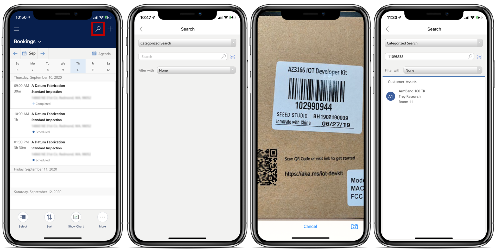
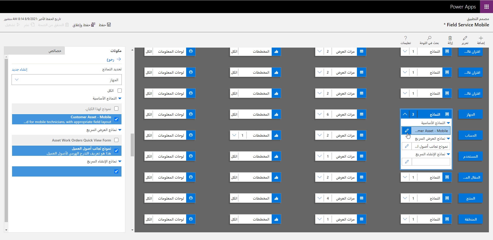
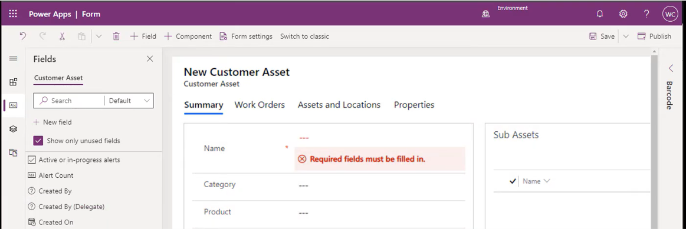
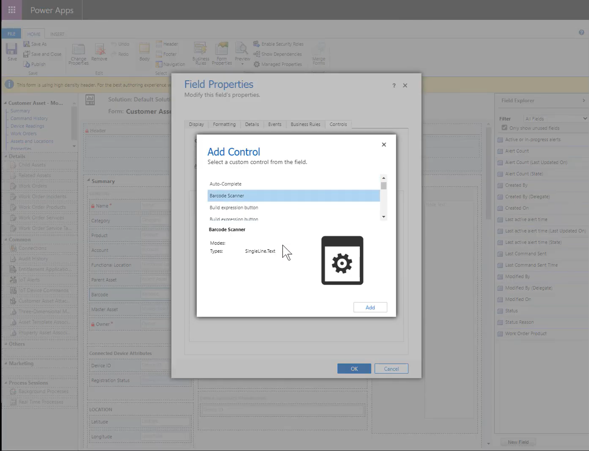
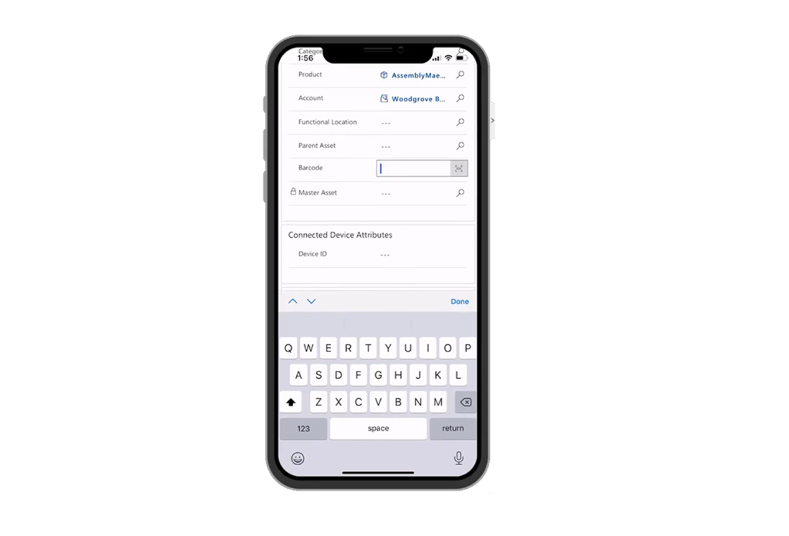

تعتبر الرموز الشريطية مكونات مهمة عندما يعمل المندوبون في الميدان. يمكن أن تساعد الرموز الشريطية على تزويد العاملين في الخطوط الأمامية بتفاصيل مهمة، مثل رقم المنتج أو الرقم التسلسلي.

عن طريق مسح الرموز الشريطية، يمكن للعاملين في الخطوط الأمامية:

- أدخل حقلاً مع قيمة الرمز الشريطي لتسهيل إدخال البيانات.

- ابحث في قاعدة البيانات عن السجلات التي تطابق الرمز الشريطي للبحث السهل.

> [!div class="mx-imgBorder"]
> 

يمكن أن يوفر تطبيق Dynamics 365 Field Service ‏Mobile وظيفة مسح الرمز الشريطي، لكنه لم يتم إعداده وتكوينه افتراضياً.

تمكين وظيفة مسح الرمز الشريطي عملية من خطوتين:

1. **تمكين بحث الصلة** - يقدم نتائج سريعة وشاملة عبر جداول متعددة في قائمة واحدة، مرتبة حسب الصلة.

1. **إضافة حقل الرمز الشريطي للنموذج** - يضمن إتاحة إمكانية مسح الرمز الشريطي في النموذج.

## تمكين وتهيئة بحث الصلة

قبل أن تتمكن من استخدام ماسح الرموز الشريطية لمسح الأصناف للمساعدة في إدخال البيانات وتحديد الصنف، سيحتاج التطبيق إلى معرفة مكان محاولة البحث للعثور على القيمة الممسوحة ضوئياً. تتيح لك ميزة **بحث الصلة** البحث عبر عدة جداول للعثور على القيمة التي تبحث عنها. بعد تمكين الميزة، يتم تكوينها افتراضياً للبحث عن القيمة الممسوحة ضوئياً مقابل الحساب وجهة الاتصال والمستخدم والنشاط. قد تجد أنه من الضروري تخصيص الجداول التي يتم البحث عنها لتضمين جداول أخرى أكثر تحديداً لسيناريوهات field service. على سبيل المثال، قد ترغب في البحث عن رقم منتج معين لكتالوج منتجات مؤسستك، أو قد ترغب في تحديد أصل عميل معين. يساعد تخصيص الجداول التي يتم البحث عنها في تسهيل البحث على العمال والعثور عليها باستخدام الكلمات الرئيسية والمسح الضوئي للبحث عن طريق الرمز الشريطي أو UPC أو رمز الاستجابة السريعة.

للتأكد من أنه يمكنك استخدام ميزة **بحث الصلة** مع ماسح الرمز الشريطي، يجب عليك أولاً معالجة العوامل التالية:

1. [تمكين بحث الصلة في البيئة الخاصة بك](/power-platform/admin/configure-relevance-search-organization/?azure-portal=true#enable-relevance-search).

1. [تمكين تجربة بحث الصلة الجديدة](/power-platform/admin/configure-relevance-search-organization/?azure-portal=true#enable-the-new-relevance-search-experience).

1. [تحديد جداول بحث الصلة](/power-platform/admin/configure-relevance-search-organization/?azure-portal=true#select-entities-for-relevance-search).

1. [تكوين الحقول القابلة للبحث لبحث الصلة](/power-platform/admin/configure-relevance-search-organization/?azure-portal=true#configure-searchable-fields-for-relevance-search).

> [!IMPORTANT]
> يعتبر بحث الصلة إحدى ميزات Microsoft Dataverse وMicrosoft Power Platform. إنها ليست خاصة بـ Dynamics 365 Field Serviceوتعتبر خارج نطاق هذه الوحدة النمطية. لمزيد من المعلومات، راجع [تكوين بحث الصلة لتحسين نتائج البحث والأداء](/power-platform/admin/configure-relevance-search-organization/?azure-portal=true).

## إضافة الماسح الضوئي الشريطي إلى النماذج

بعد تمكين البحث الشامل، تأكد من توفر عمود في الجدول الذي تعمل عليه حيث يمكنك استخدام الماسح الضوئي للرمز الشريطي.
على سبيل المثال، قد ترغب في إضافة عمود الرقم التسلسلي إلى جدول أصول العميل بحيث يمكنك مسح وتخزين الرقم التسلسلي لأصل العميل.

لمزيد من المعلومات، راجع [إنشاء وتحرير أعمدة لـ Microsoft Dataverse](/power-apps/maker/data-platform/create-edit-field-portal/?azure-portal=true).

بعد أن يكون لديك الحقل الذي تريد استخدامه مع ماسح الرموز الشريطية، فإن الخطوة التالية هي إضافته إلى نماذج تطبيقات الهاتف المحمول وتهيئته لاستخدام عنصر التحكم في إدخال ماسح الرموز الشريطية. الغرض من أصناف التحكم هو تحسين قدرات أحد الأصناف في نموذج. على سبيل المثال، يمكنك استخدام عنصر تحكم شريط التمرير للسماح للأشخاص الذين يستخدمون تطبيق الأجهزة المحمولة بتغيير قيمة رقمية باستخدام عنصر تحكم شريط التمرير بدلاً من الاضطرار إلى إدخال القيمة بأنفسهم.

لإضافة عمود إلى نموذج وتكوينه لإمكانات مسح الرمز الشريطي، ستحتاج إلى فتح النموذج الذي تريد إضافة عنصر التحكم إليه. يمكنك إنجاز هذه المهمة بالانتقال إلى قائمة التطبيقات الخاصة بك، والعثور على تطبيق Field Service Mobile في قائمة تطبيقات Dynamics 365 الخاصة بك، ثم تحديد **فتح في مصمم التطبيق**.

عندما تكون في مصمم التطبيق، لاحظ أن كل جدول في التطبيق قد يحتوي على نماذج متعددة مرتبطة به. تأكد من تحديد النموذج الصحيح بالانتقال إلى **تحرير** النموذج وتحديد النموذج الذي تريد استخدام مسح الرمز الشريطي له.

> [!div class="mx-imgBorder"]
> 

حالياً، لا يتوفر عنصر التحكم في الماسح الضوئي للرمز الشريطي في مصمم نماذج Power Apps. لإضافة ماسح الرموز الشريطية إلى النموذج، ستحتاج إلى استخدام محرر النماذج *الكلاسيكي*. يوفر محرر النماذج *الكلاسيكي* نفس القدرات مثل المصمم الحالي، فيما عدا أنه يحتوي علي بعض الخيارات الإضافية المتوفرة. يمكنك الوصول إلى محرر النماذج *الكلاسيكي* عن طريق تحديد **تبديل إلى كلاسيكي** في شريط الأوامر.

> [!div class="mx-imgBorder"]
> 

عندما تكون المحرر *الكلاسيكي*، ستحتاج إلى إضافة الحقل إلى النموذج ثم النقر فوقه نقراً مزدوجاً لفتح خصائص الحقل. تشتمل شاشة **خصائص الحقل** على علامة التبويب **عناصر التحكم** حيث يمكنك إقران عنصر تحكم محدد بالحقل. ستحتاج إلى تحديد **إضافة عنصر تحكم** وتحديد ماسح الرموز الشريطية من القائمة.

> [!div class="mx-imgBorder"]
> 

تتمثل إحدى ميزات عناصر التحكم هذه في أنه يمكنك اختيار تجربة المستخدم التي تريد أن تكون متاحة فيها. للتأكد من أن الأشخاص يمكنهم استخدام الماسح الضوئي أثناء العمل في تطبيق الأجهزة المحمولة، ستحتاج إلى تمكين التحكم للهواتف والأجهزة اللوحية ثم حفظ التغييرات ونشرها.

## الاستخدام في تطبيق الأجهزة المحمولة

بعد إضافة عنصر التحكم ونشره، سيكون متاحاً في النموذج المحدد عندما يعمل الشخص في التطبيق. عند تحديد الرمز الشريطي، سيتم فتح الكاميرا وقراءة أي رمز شريطي أو رمز الاستجابة السريعة.

> [!div class="mx-imgBorder"]
> 
