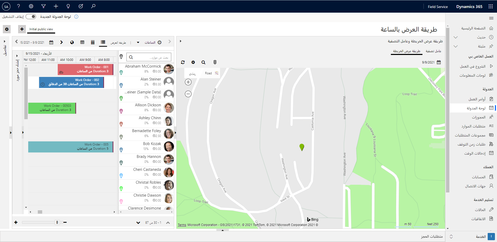
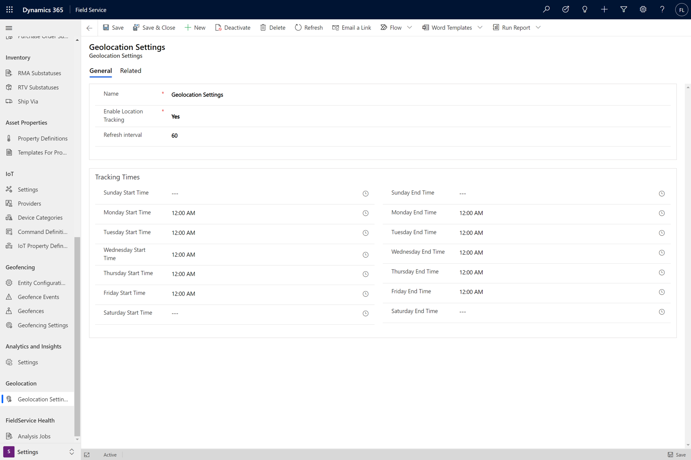
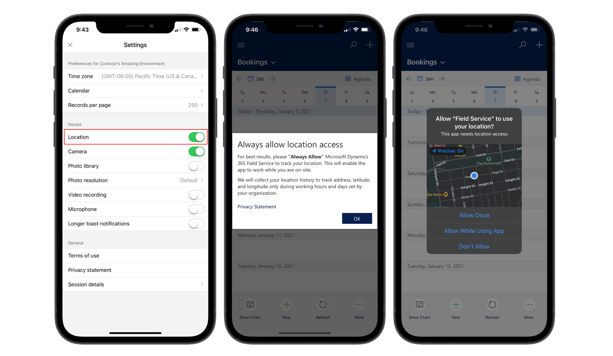
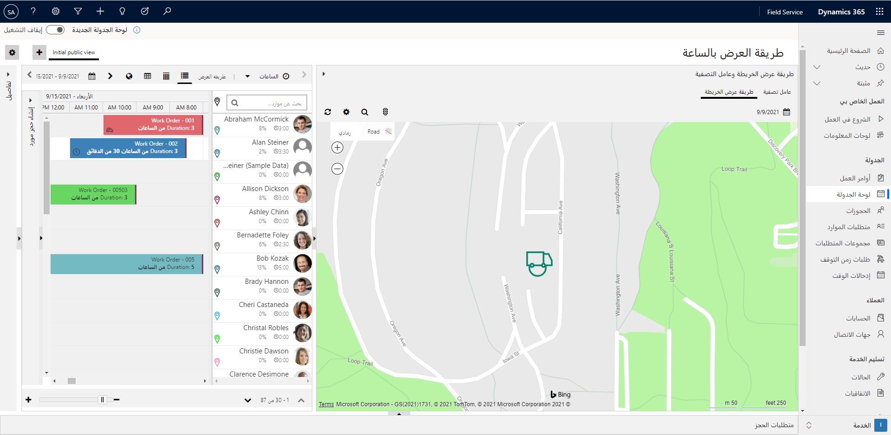
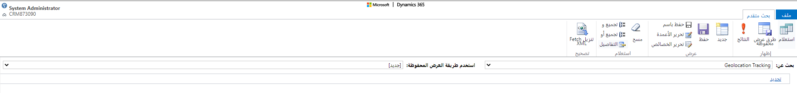
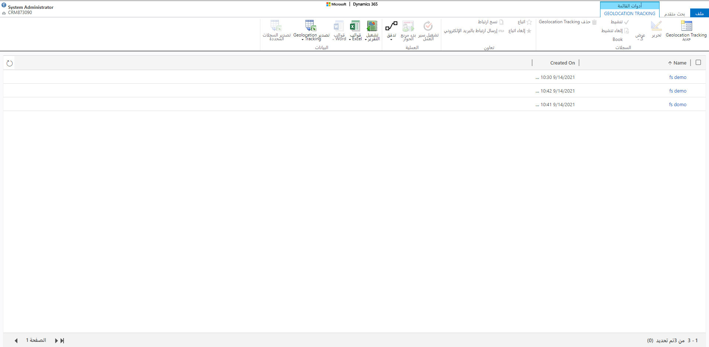

لا يقضي معظم العاملين في الخطوط الأمامية يومهم في موقع واحد؛ وبشكل عام، فإنهم يسافرون إلى مواقع مختلفة طوال اليوم.
يجب أن يعرف المجدولون والمرسلون أماكن تواجد العمال في الوقت المحدد وذلك لأنه من المفيد في إدارة عمليات الجدولة اليومية. على سبيل المثال، في حالة حدوث حالة طوارئ، يمكن للمرسل عرض من هو الأقرب ثم جدولة العامل لهذا الصنف.

يمكن للعاملين في الخطوط الأمامية الذين يستخدمون تطبيق Dynamics 365 Field Service ‏Mobile تمكين مشاركة الموقع من التطبيق. تسمح هذه الميزة للمجدولين بتصور موقعهم على لوحة الجدولة وتوفر قائمة تدقيق تعرض سجل موقع عاملي الخط الأمامي.

> [!div class="mx-imgBorder"]
> 

لتكوين تعقب الموقع لأحد الأفراد، اتبع الخطوات التالية:

1. تمكين تعقب الموقع.

1. اسمح لـ Field Service Mobile بالوصول إلى موقع العامل.

1. تحقق من عرض تعقب الموقع.

## تمكين تعقب الموقع

تتمثل المهمة الأولى في تكوين تعقب الموقع في تمكينه في بيئة Field Service. يحتاج الشخص الذي لديه حق الوصول الإداري إلى التطبيق إلى إكمال هذه المهمة. يسمح تمكين هذا الإعداد بإرسال بيانات موقع العامل إلى Dynamics 365 Field Service وسيقوم بعرض موقعه على لوحة الجدولة. يتم تخزين جميع بيانات الموقع في جدول Dataverse يسمى تعقب الموقع الجغرافي.

يكون تعقب الموقع في منطقة **إعدادات** تطبيق Field Service ضمن **إعدادات الموقع الجغرافي**. في إعدادات الموقع الجغرافي، يمكنك تعيين **تمكين تعقب الموقع** على **نعم**، مما يضمن إنشاء سجلات تعقب المواقع.

ستحتاج أيضاً إلى إدخال **‏‫الفاصل الزمني للتحديث**، والذي يشير إلى عدد المرات التي سيتحقق فيها النظام من موقع المستخدم. ويساعد هذا الإعداد على التأكد من أن المجدولين لديهم أحدث المعلومات الممكنة أثناء تنقل العامل. وبناءً على احتياجات المؤسسة، نوصي بتعيين الفاصل الزمني للتحديث إلى ما بين 60 و300 ثانية. يحدد الفاصل الزمني للتحديث فقط عدد المرات التي سيتحقق فيها النظام من موقع المستخدم. ولا يشير إلى أنه سيتم إنشاء سجلات التعقب الخاصة بالموقع الجغرافي. يعمل الفاصل الزمني للتحديث مع أحداث تعقب الموقع لإنشاء سجلات التعقب.

الأحداث الثلاثة لتعقب المواقع هي:

- **عند تسجيل الدخول** - عندما يقوم أحد المستخدمين بتسجيل الدخول إلى تطبيق الأجهزة المحمولة Field Service، يتم إنشاء سجلات تعقب الموقع الجغرافي حيث يقوم النظام بتقييم موقع المستخدم. سيتم متابعة إنشاء السجلات عندما يتوقف المستخدم عن الانتقال.

- **عند الانتقال** - عندما يتقوم المستخدم بالانتقال بعيداً عن موقعه بأكثر من 800 متراً، سيتم إنشاء سجلات التعقب بناءً على الفاصل الزمني المحدد للتحديث (60 ثانية افتراضياً) حتى يتوقف عن الحركة.

- **عند التوقف بعد الانتقال** - عندما يصل المستخدم إلى موقع ثابت بعد الانتقال، سيتم إنشاء عدد قليل من سجلات التعقب عند الاستقرار ثم التوقف.

هناك صنف آخر يجب مراعاته وهو متى يجب تمكين تعقب الموقع لمؤسستك. ونظراً لأن العديد من العاملين في الخطوط الأمامية لن يكون لديهم جهاز توفره الشركة، فقد يستخدمون تطبيق Field Service Mobile على أجهزتهم الشخصية. في هذه الحالات، لن تقوم بتعقب مواقعهم خارج ساعات العمل. ولهذا السبب، يمكنك تحديد وقت تمكين تعقب الموقع لكل يوم من أيام الأسبوع. في لقطة الشاشة التالية، تم تكوينه بحيث يكون التعقب على مدار 24 ساعة، من الإثنين إلى الجمعة، ولكن يمكن إعداده من الإثنين إلى الجمعة من 8:00 صباحاً إلى 5:00 مساءً.

> [!div class="mx-imgBorder"]
> 

لمزيد من المعلومات، راجع [تدقيق الموقع لتطبيق Dynamics 365 Field Service ‏Mobile](/dynamics365/field-service/mobile-powerapp-location-auditing/?azure-portal=true).

## السماح لتطبيق الأجهزة المحمولة بالوصول إلى معلومات الموقع

بعد تمكين تعقب المواقع على جانب المجدول، ستحتاج أيضاً إلى تمكينه على أجهزتهم المحمولة. أكمل هذه المهمة بتحديد **إعدادات** من الشاشة الرئيسية ثم التأكد من تعيين تبديل **الموقع** على **نعم**.

بعد تمكين تعقب الموقع، عندما يقوم العامل بتشغيل تطبيق الأجهزة المحمولة وتسجيل الدخول، فمن المحتمل أن تتم مطالبتهم بالسماح بالوصول إلى موقعهم. يمكنهم تحديد **عدم السماح** أو **السماح مرة واحدة** أو **السماح أثناء استخدام التطبيق**. إذا قام العامل بتحديد **السماح مرة واحدة**، فستتم مطالبتهم مرة أخرى في المرة التالية التي يقومون فيها بتسجيل الدخول.

> [!div class="mx-imgBorder"]
> 

> [!IMPORTANT]
> لضمان مطالبتهم بعد تمكين التعقب، يجب على عامل الخط الأمامي الخروج من التطبيق وتشغيله وتسجيل الدخول مرة أخرى لتتم المطالبة بتحديد الموقع.

## تحقق من تعقب الموقع

بعد تمكين تعقب الموقع على الجهاز المحمول، يظهر الموقع الحالي للمورد القابل للحجز (عامل الخط الأمامي) على لوحة الجدولة. يمكنك تحديد رمز تثبيت الخريطة بجوار اسم المورد القابل للحجز، وستقوم الخريطة بعرض الموقع برمز **شاحنة** بدلاً من رمز **تثبيت**.

> [!div class="mx-imgBorder"]
> 

## سجلات تدقيق الموقع

ومن بين المزايا الأخرى لاستخدام تعقب المواقع هي أنه يمكنك الوصول إلى معلومات  **تعقب الموقع الجغرافي** لتدقيق المواقع باستخدام **بحث متقدم**. يمكنك الوصول إلى **بحث متقدم** عن طريق تحديد رمز **عامل التصفية** في الزاوية العلوية اليمنى من التطبيق.
بعد تحميل الميزة، قم بتعيين حقل **البحث عن** على **تعقب الموقع الجغرافي**.

> [!div class="mx-imgBorder"]
> 

من داخل شاشة **بحث متقدم** يمكنك تعديل عامل التصفية للحد من النتائج التي يتم إرجاعها. على سبيل المثال، قد تحتاج فقط إلى رؤية سجلات التعقب لمستخدم فردي أو لفترة زمنية محددة. تعرض الصورة التالية قائمة بالمواقع على مدار اليوم، ويتم إدراجها من قبل المستخدم.

> [!div class="mx-imgBorder"]
> 

لمزيد من المعلومات، راجع [إنشاء ميزة بحث متقدم أو تحريرها أو حفظها](/power-apps/user/advanced-find/?azure-portal=true).

لمزيد من المعلومات وعرض فيديو توضيحي، راجع [تدقيق الموقع لتطبيق Dynamics 365 Field Service ‏Mobile](/dynamics365/field-service/mobile-powerapp-location-auditing?azure-portal=true).
